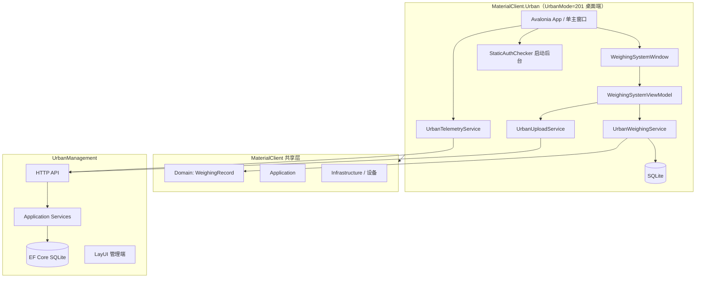

# 架构：MaterialClient.Urban × UrbanManagement

**Epic**: `materialclient-urban-epic`  
**关联 PRD**: `prd.md` · **UI 参考**: `ui-layout-reference.md`

---

## 1. 系统上下文



## 2. 边界与职责

| 组件 | 仓库 | 职责 |
|------|------|------|
| `MaterialClient.Urban` | MaterialClient | Avalonia 桌面 exe、**唯一主界面**、Urban 配置、启动授权日志、上传与遥测 |
| UI 草稿 | MaterialClient.Demo → Urban | `WeighingSystemWindow.axaml` 迁移为正式 View |
| 共享层 | MaterialClient | WeighingRecord、设备、枚举 UrbanMode=201 |
| UrbanManagement | UrbanManagement | API + 持久化 + 运维查询 |

## 3. 关键决策（ADR）

### ADR-1：独立桌面端（非 Host / 非 headless）

**决策**：`MaterialClient.Urban` 为 **Avalonia 桌面应用**，启动即显示主窗口。  
**理由**：UrbanMode 专用现场操作端；布局已有 Demo 草稿。  
**非**：Generic Host、Worker-only、控制台宿主。

### ADR-2：单界面、无登录/授权页

**决策**：仅 `WeighingSystemWindow`（或等价命名）；无 LoginWindow、LicenseWindow。  
**理由**：产品明确要求；授权为启动时静态文件 + 日志。  
**Demo 调整**：移除顶栏「退出登录」等登录相关入口（见 `ui-layout-reference.md`）。

### ADR-3：WeighingMode = 201，ProductCode = 5030

**决策**：共享枚举新增 `UrbanMode = 201`；Urban 项目固定 ProductCode 5030。

### ADR-4：静态授权仅启动后台日志

**决策**：`IStaticLicenseChecker` 在 `App` 初始化阶段调用；无 UI。  
**不阻断**启动（`FailFast=false` 默认）。

### ADR-5：无 Waybill 管线

**决策**：Urban 不注册 waybill 匹对；`IWeighingPipelineStrategy` Urban 实现仅写 WeighingRecord。

### ADR-6：UrbanManagement 新表

**决策**：`UrbanWeighingRecord`、`UrbanDevice`、`UrbanClientErrorLog`。

### ADR-7：UI 与 ViewModel

**决策**：`WeighingSystemViewModel` 绑定重量区、记录列表、Tab 筛选、右侧抓拍区、底栏 `DeviceStatusList`（与 slice 02/04 衔接）。

## 4. 数据流

### 4.1 启动

```
App.axaml.cs → StaticAuthChecker（日志）
            → UrbanAppModule
            → MainWindow = WeighingSystemWindow（无登录路由）
            → BackgroundService：上传队列 + 心跳
```

### 4.2 称重 → 界面 → 上传

```
重量稳定 → WeighingRecord (201/5030) → SQLite
        → ViewModel 刷新列表 / 状态文案
        → UploadService → POST weighing-records
```

### 4.3 底栏设备状态

```
设备事件 → DeviceStatus 集合 → UI 底栏
        → Telemetry → POST heartbeat / logs
```

## 5. API 契约（概要）

| 方法 | 路径 | 说明 |
|------|------|------|
| POST | `/api/urban/weighing-records` | WeighingRecord DTO |
| POST | `/api/urban/devices/heartbeat` | 心跳 |
| POST | `/api/urban/devices/logs` | 错误日志 |
| GET | `/api/urban/devices` | 设备列表 |
| GET | `/api/urban/devices/{id}/logs` | 日志查询 |

## 6. 配置示例

```json
{
  "Urban": {
    "ProductCode": 5030,
    "WeighingMode": 201,
    "ServerBaseUrl": "https://urban.example/",
    "DeviceId": "",
    "LicenseFilePath": "./license.urban",
    "UploadRetrySeconds": 30,
    "HeartbeatIntervalSeconds": 60
  }
}
```

## 7. 风险与缓解

| 风险 | 缓解 |
|------|------|
| Demo 与正式 MVVM 脱节 | slice 01 明确迁移路径；复用 MaterialClient 样式资源 |
| 顶栏菜单含 Demo 占位项 | Urban 首期精简菜单项 |
| 共享流程依赖 waybill | UrbanMode 策略 + 守卫 |
