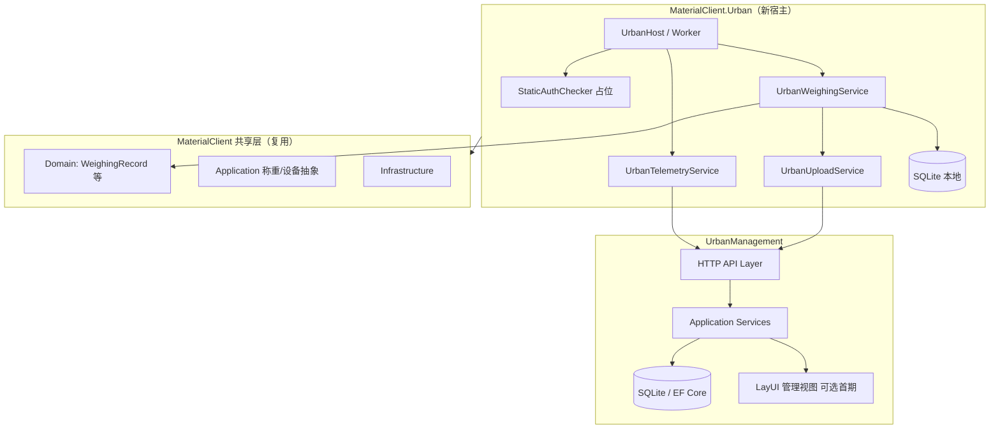

# 架构：MaterialClient.Urban × UrbanManagement

**Epic**: `materialclient-urban-epic`  
**关联 PRD**: `prd.md`

---

## 1. 系统上下文



## 2. 边界与职责

| 组件 | 仓库 | 职责 |
|------|------|------|
| `MaterialClient.Urban` | MaterialClient | 独立 exe、Urban 配置、无 UI 宿主、启动授权占位、调度上传与遥测 |
| 共享 Domain/Application | MaterialClient | `WeighingRecord`、称重设备接口、`ProductCode`/`WeighingMode` 枚举扩展 |
| Urban HTTP API | UrbanManagement | 接收称重记录、设备状态、错误日志 |
| 持久化 | UrbanManagement | `UrbanDevice`、`UrbanWeighingRecord`（建议新实体）、`UrbanClientLog` |

## 3. 关键决策（ADR 摘要）

### ADR-1：独立宿主而非 MaterialClient 功能开关

**决策**：新增 `MaterialClient.Urban` 项目。  
**理由**：无 UI、无登录、无 waybill，与主客户端生命周期和发布包不同，避免 `if (UrbanMode)` 污染主 UI 与授权管线。  
**代价**：需维护第二套 `appsettings` 与启动模块；共享代码通过项目引用解决。

### ADR-2：WeighingMode = 201（UrbanMode），ProductCode = 5030

**决策**：在共享枚举/常量中新增 `UrbanMode = 201`；Urban 宿主默认 `ProductCode = 5030`。  
**理由**：与现有按模式分支的称重/同步逻辑一致，便于过滤与报表。  
**约束**：文档化 201 为 Urban 专用，避免与现有模式值冲突（实施时核对 MaterialClient 枚举表）。

### ADR-3：首期静态授权仅启动时日志占位

**决策**：`IStaticLicenseChecker.CheckOnStartup()` → 存在则 Information，缺失则 Error；**不**阻断 Host（可配置 `FailFast=false` 默认 false 便于开发）。  
**理由**：需求明确「当前不需要实现，仅打印日志」。  
**后续**：同一接口注入真实签名校验，不改变调用点。

### ADR-4：不上传 Waybill，称重管线裁剪

**决策**：Urban 宿主注册 `IUrbanWeighingService`，内部只写 `WeighingRecord`，**不**注册/不调用 `WeighingMatchingService`、waybill 同步。  
**理由**：需求 2、4。  
**风险**：若称重流程硬编码依赖 waybill，需在共享层引入「无运单策略」接口（OpenSpec slice 02 处理）。

### ADR-5：UrbanManagement 新表而非复用 GovSyncData

**决策**：新增 `UrbanWeighingRecord`、`UrbanDeviceStatus`、`UrbanClientErrorLog` 实体。  
**理由**：GovSyncData 字段语义为政府同步快照，与工业称重记录模型不一致；避免迁移歧义。  
**备选**：若字段 80% 重合，可 DTO 映射到 GovSyncData — **不推荐**。

### ADR-6：通信与安全（首期）

**决策**：HTTP JSON，无 Bearer Token；设备 ID + 可选 `X-Device-Key` 配置项预留。  
**理由**：需求 5 无登录。  
**后续**：静态授权文件内嵌密钥，请求头携带。

## 4. 数据流

### 4.1 启动

```
Program → 加载 appsettings → StaticAuthChecker（日志）→ 注册 Urban 模块
       → 启动 BackgroundService（上传循环 + 心跳）
       → （可选）Headless 称重入口 / 外部触发
```

### 4.2 称重 → 上传

```
重量稳定 → Create WeighingRecord (Mode=201, ProductCode=5030)
        → 标记 SyncPending
        → UrbanUploadService.Enqueue(recordId)
        → POST /api/urban/weighing-records
        → 成功：SyncSuccess；失败：重试 + Error 日志上报
```

### 4.3 遥测

```
每 N 分钟 → POST /api/urban/devices/heartbeat
错误发生时 → POST /api/urban/devices/logs
```

## 5. API 契约（概要）

| 方法 | 路径（建议） | 说明 |
|------|----------------|------|
| POST | `/api/urban/weighing-records` | 单条或批量 WeighingRecord DTO |
| POST | `/api/urban/devices/heartbeat` | 设备 ID、版本、状态枚举 |
| POST | `/api/urban/devices/logs` | 错误/警告日志条目 |
| GET | `/api/urban/devices` | 管理端列表（分页） |
| GET | `/api/urban/devices/{id}/logs` | 设备错误日志 |

DTO 字段与 `WeighingRecord` 对齐，额外：`DeviceId`、`ClientVersion`、`UploadedAt`。

## 6. 配置结构（MaterialClient.Urban）

```json
{
  "Urban": {
    "ProductCode": 5030,
    "WeighingMode": 201,
    "ServerBaseUrl": "https://urban.example/",
    "DeviceId": "",
    "LicenseFilePath": "./license.urban",
    "UploadRetrySeconds": 30,
    "HeartbeatIntervalSeconds": 60
  }
}
```

## 7. 与 OpenSpec / Monospec 的关系

- 所有变更 **proposal / specs / tasks** 仅在主仓库 `openspec/changes/`。
- 代码在 `repos/MaterialClient`、`repos/UrbanManagement` 分别实现。
- **禁止**在子仓库创建 OpenSpec 目录。

## 8. 风险与缓解

| 风险 | 缓解 |
|------|------|
| 共享称重流程强依赖 waybill | 引入 `IWeighingPipelineStrategy`，Urban 注册 NoWaybill 实现 |
| 无 UI 无法人工称重 | 首期提供集成测试 Host 或最小控制台命令触发 |
| 双宿主配置漂移 | 共享 `Directory.Build.props` 与配置文档 |
| 设备状态风暴 | 心跳间隔可配置 + 服务端节流 |
