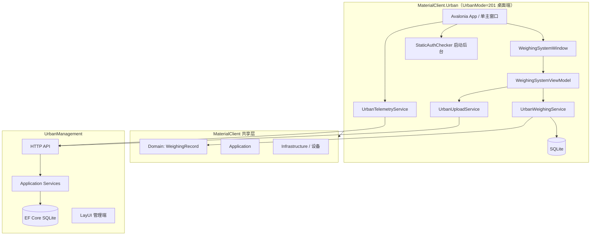

# 架构：MaterialClient.Urban × UrbanManagement

**Epic**: `materialclient-urban-epic`  
**关联 PRD**: `prd.md` · **UI 参考**: `ui-layout-reference.md`

---

## 1. 系统上下文



## 2. 边界与职责

| 组件 | 仓库 | 职责 |
|------|------|------|
| `MaterialClient.Urban` | MaterialClient | Avalonia 桌面 exe、**唯一主界面**、Urban 配置、启动授权日志、上传与遥测 |
| UI 草稿 | MaterialClient.Demo → Urban | `WeighingSystemWindow.axaml` 迁移为正式 View |
| 共享层 | MaterialClient | WeighingRecord、设备、枚举 UrbanMode=201 |
| UrbanManagement | UrbanManagement | API + 持久化 + 运维查询 |

## 3. 关键决策（ADR）

### ADR-1：独立桌面端（非 Host / 非 headless）

**决策**：`MaterialClient.Urban` 为 **Avalonia 桌面应用**，启动即显示主窗口。  
**理由**：UrbanMode 专用现场操作端；布局已有 Demo 草稿。  
**非**：Generic Host、Worker-only、控制台宿主。

### ADR-2：单界面、无登录/授权页

**决策**：仅 `WeighingSystemWindow`（或等价命名）；无 LoginWindow、LicenseWindow。  
**理由**：产品明确要求；授权为启动时静态文件 + 日志。  
**Demo 调整**：移除顶栏「退出登录」等登录相关入口（见 `ui-layout-reference.md`）。

### ADR-3：WeighingMode = 201，ProductCode = 5030

**决策**：共享枚举新增 `UrbanMode = 201`；Urban 项目固定 ProductCode 5030。

### ADR-4：静态授权仅启动后台日志

**决策**：`IStaticLicenseChecker` 在 `App` 初始化阶段调用；无 UI。  
**不阻断**启动（`FailFast=false` 默认）。

### ADR-5：称重管线 — 复用 AttendedWeighing，无 Waybill

**决策**：Urban **不**平行实现称重状态机；以 **`MaterialClient.Common` 的 AttendedWeighing 既有逻辑**为基线（服务注册、重量流、落库与事件）。在 **`WeighingMode == UrbanMode` 或 `IWeighingPipelineStrategy`** 处跳过 waybill 匹对及相关扩展；`WeighingRecord` 仍由该路径创建并标记 201/5030。确需行为差异时在 Common **最小扩展**或 Urban 模块内适配。

**理由**：OQ-2 产品决策；降低重复与漂移风险。

**风险**：Common 改动影响有人值守 — 以回归测试与守卫隔离缓解。

### ADR-6：UrbanManagement 新表

**决策**：`UrbanWeighingRecord`、`UrbanDevice`、`UrbanClientErrorLog`。

**`Urban_WeighingRecord` 结构原则（OQ-4）**：BMAD **不**罗列最终列清单。实现时 **以 `repos/MaterialClient` 中客户端 `WeighingRecord` 的 EF 映射与 SQLite 表为事实来源**，UrbanManagement 实体 **默认同构或子集 + 少量服务端元数据**（如 `ReceivedAt`、原始 JSON 备份）；DTO 与客户端上传 JSON **字段一一可映射**。Gov 域表（`Gov_*`）**不**复用为称重主存储。

**实现提示**：OpenSpec slice 03 的 `design.md` / delta spec 中附「MaterialClient 源文件路径 + 列对照表」后再生成迁移。

### ADR-7：UI 与 ViewModel

**决策**：`WeighingSystemViewModel` 绑定重量区、记录列表、Tab 筛选、右侧抓拍区、底栏 `DeviceStatusList`（与 slice 02/04 衔接）。

### ADR-8：Urban 上传调度 — 与 Material 后台一致

**决策**：称重记录上云采用与主程序 **`PollingBackgroundService`** 相同机制：**`AsyncPeriodicBackgroundWorkerBase`**，每次 `DoWorkAsync` 内通过 **`WithUow`（`IUnitOfWorkManager`）** 调用上传逻辑，扫描 **Pending** 的 `WeighingRecord` 并 `POST` UrbanManagement；**不**把 HTTP 上传作为主 UI 同步调用。

**理由**：OQ-1 产品决策；与现有 Material 后台运维与取消语义一致。

**实现提示**：可新增 `UrbanWeighingUploadBackgroundWorker`（或等价命名）类，形态对齐 `MaterialClient/Backgrounds/PollingBackgroundService.cs`；周期、开关写入 `Urban` 或 `BackgroundServices` 配置。

### ADR-9：设备 ID — 首期固定 Guid 提供者

**决策**：定义 **`IDeviceIdentityProvider`**（命名以 OpenSpec 为准），默认实现 **`FixedConfigurationDeviceIdentityProvider`**：从 `Urban:FixedDeviceGuid`（或等价键）读取 **合法 `Guid` 字符串** 并返回；**不**实现机器指纹、注册表、安装盘写入。**上传 / 心跳 / 日志** 共用同一返回值。

**理由**：OQ-3 首期降低设计面；先打通协议与 UrbanManagement。

**已知局限**：多现场安装若共用同一配置则 **DeviceId 冲突**，服务端聚合与运维会混淆。

**未来缓解**：持久化每台安装唯一 ID、硬件绑定、UrbanManagement 设备注册与冲突提示；替换 `IDeviceIdentityProvider` 实现（独立 `refactor-*` / `add-*` change，含数据迁移策略若需）。

## 4. 数据流

### 4.1 启动

```
App.axaml.cs → StaticAuthChecker（日志）
            → UrbanAppModule
            → MainWindow = WeighingSystemWindow（无登录路由）
            → ABP PeriodicBackgroundWorker：称重记录上传（同 PollingBackgroundService 模式）+ 遥测心跳
```

### 4.2 称重 → 界面 → 上传

```
重量稳定 → AttendedWeighing（Common）路径 → WeighingRecord (201/5030) → SQLite（Pending）
        → ViewModel（订阅既有事件）刷新列表 / 状态文案
        → 定周期 BackgroundWorker + UOW → IUrbanUploadService（注入 IDeviceIdentityProvider）→ POST /api/urban/weighing-records
```

### 4.3 底栏设备状态

```
设备事件 → DeviceStatus 集合 → UI 底栏
        → Telemetry → POST heartbeat / logs
```

## 5. API 契约（概要）

| 方法 | 路径 | 说明 |
|------|------|------|
| POST | `/api/urban/weighing-records` | WeighingRecord DTO |
| POST | `/api/urban/devices/heartbeat` | 心跳 |
| POST | `/api/urban/devices/logs` | 错误日志 |
| GET | `/api/urban/devices` | 设备列表 |
| GET | `/api/urban/devices/{id}/logs` | 日志查询 |

## 6. 配置示例

```json
{
  "Urban": {
    "ProductCode": 5030,
    "WeighingMode": 201,
    "ServerBaseUrl": "https://urban.example/",
    "FixedDeviceGuid": "00000000-0000-4000-8000-000000050301",
    "LicenseFilePath": "./license.urban",
    "UploadWorkerPeriodMinutes": 10,
    "UploadRetrySeconds": 30,
    "HeartbeatIntervalSeconds": 60
  }
}
```

## 7. 风险与缓解

| 风险 | 缓解 |
|------|------|
| Demo 与正式 MVVM 脱节 | slice 01 明确迁移路径；复用 MaterialClient 样式资源 |
| 顶栏菜单含 Demo 占位项 | Urban 首期精简菜单项 |
| 共享流程依赖 waybill | UrbanMode 策略 + 守卫 |
| 定周期上传导致最大延迟 ≈ Worker 周期 | 周期可配置；若监管要求更短延迟，在 OpenSpec 中单独评估（不改变「Worker+UOW」形态） |
| 固定 `Guid` 导致多客户端 ID 冲突 | **已知首期局限**；部署时按现场区分配置或接受聚合混淆。**未来缓解**：见 ADR-9 |
| 双端 `WeighingRecord` 列漂移 | 以 MaterialClient 为 schema 主源；变更走 OpenSpec 并双仓回归 |
