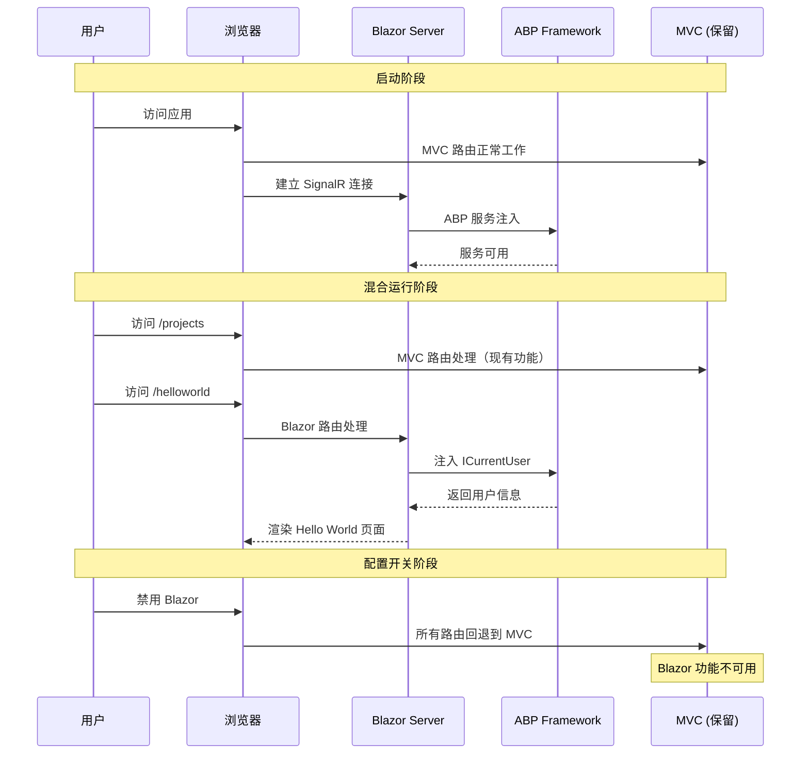

# add-abp-blazor-core - Proposal

**变更类型**: Infrastructure Migration (Core Tier)  
**Epic**: urban-blazor-epic  
**版本**: 1.0  
**日期**: 2026-06-04  
**状态**: Draft

---

## Why

UrbanManagement 当前采用 ASP.NET Core MVC + jQuery 前端架构，存在前后端语言分裂、ABP 资源利用不足、技术债务累积等问题。**Core Tier 变更的目标是建立最短可运行、可验证、可回环的 ABP Blazor 基础设施路径**，为后续迁移提供稳定的技术基础。

当前 UrbanManagement 已基于 ABP Framework 10.x 构建，但前端仍使用传统 MVC，无法利用 ABP 的 Blazor UI 能力、动态 C# 代理、模块化 UI 系统等现代化特性。

---

## What Changes

### 服务端（UrbanManagement.App）

#### NuGet 包依赖
- 新增 `Volo.Abp.AspNetCore.Components.Web` (10.x)
- 新增 `Volo.Abp.AspNetCore.Components.Server` (10.x)
- 新增 `Volo.Abp.AspNetCore.Components.Web.LeptonXLiteTheme` (10.x)
- 新增 `Blazorise.Bootstrap5` (1.x)
- 新增 `Blazorise.Icons.FontAwesome` (1.x)
- 新增 `Blazorise.DataGrid` (1.x)

#### Program.cs 配置
- 添加 Blazor Server 服务配置
- 配置 SignalR Hub 端点
- 配置 LeptonX Lite 主题
- 设置路由共存机制

#### 目录结构创建
- `Components/Layout/` - 布局组件
- `Components/Shared/` - 共享组件
- `Components/Pages/` - 页面组件

#### 基础组件实现
- `UrbanManagementComponentBase` - 组件基类
- `LoadingSpinner.razor` - 加载指示器
- `ErrorDisplay.razor` - 错误显示组件
- `HelloWorld.razor` - 验证页面

#### 配置文件
- `appsettings.json` - 添加 Blazor 和 SignalR 配置项

### 技术实现

#### Blazor Server 启动配置
```csharp
// Program.cs 新增配置
builder.Services.AddRazorComponents();
builder.Services.AddServerSideBlazor();
builder.Services.AddAbpBootstrapComponents();
builder.Services.AddBlazorise();
builder.Services.AddLeptonXLiteTheme();
```

#### 路由共存机制
```csharp
app.UseEndpoints(endpoints =>
{
    endpoints.MapRazorPages();
    endpoints.MapControllers();
    endpoints.MapBlazorHub();                      // SignalR 端点
    endpoints.MapFallbackToPage("/_Host");         // Blazor 路由
});
```

#### 配置开关支持
```json
// appsettings.json
{
  "Blazor": {
    "Enabled": true,
    "RequireConfirmation": false
  },
  "SignalR": {
    "EnableDetailedErrors": false
  }
}
```

---

## Capabilities

### New Capabilities

- `abp-blazor-infrastructure`: ABP Blazor 基础设施能力，包含 NuGet 包管理、LeptonX 主题配置、Blazor 组件结构、MVC/Blazor 路由共存、SignalR 连接

### Modified Capabilities

无现有能力的需求变更。本变更为新增基础设施，不修改现有 Spec 要求。

---

## Impact

### 代码变更映射

| 文件路径 | 变更类型 | 变更原因 | 影响范围 |
|---------|---------|---------|---------|
| `UrbanManagement.App/UrbanManagement.App.csproj` | **修改** | 添加 Blazor NuGet 包引用 | 依赖管理 |
| `UrbanManagement.App/Program.cs` | **修改** | 配置 Blazor Server 和 LeptonX | 启动配置 |
| `UrbanManagement.App/Pages/_Host.cshtml` | **新建** | Blazor 主机页面 | Blazor 路由 |
| `UrbanManagement.App/Components/UrbanManagementComponentBase.cs` | **新建** | Blazor 组件基类 | 组件架构 |
| `UrbanManagement.App/Components/Layout/MainLayout.razor` | **新建** | 主布局组件 | UI 布局 |
| `UrbanManagement.App/Components/Shared/LoadingSpinner.razor` | **新建** | 加载指示器 | UI 组件 |
| `UrbanManagement.App/Components/Shared/ErrorDisplay.razor` | **新建** | 错误显示 | UI 组件 |
| `UrbanManagement.App/Components/Pages/HelloWorld.razor` | **新建** | 验证页面 | 测试页面 |
| `UrbanManagement/appsettings.json` | **修改** | 添加 Blazor 配置 | 配置管理 |

### 依赖项变更

- **新增 NuGet 包**: 6 个 ABP Blazor 和 Blazorise 包
- **无移除依赖**: 本阶段不移除 jQuery 和 LayUI
- **版本兼容性**: 所有包基于 ABP Framework 10.x

### API 端点变更

- **新增**: `/hubs/` SignalR 端点
- **新增**: Blazor 路由回退到 `/_Host`
- **保留**: 所有现有 MVC 路由不变

### 配置变更

- `appsettings.json` 新增 `Blazor` 和 `SignalR` 配置节
- 支持通过配置开关禁用 Blazor（回退到纯 MVC）

### 数据库变更

无数据库变更。

---

## Interaction Flow



---

## Technical Constraints

遵循以下项目约束：

1. **ABP Framework 版本**: 使用 ABP Framework 10.x 稳定版本
2. **Blazor Server**: 使用 Blazor Server 模式，不使用 WebAssembly
3. **向后兼容**: 保持所有现有 MVC 功能不变
4. **可回退设计**: 通过配置开关可随时回退到纯 MVC
5. **渐进式迁移**: 本阶段不删除任何现有代码

---

## Delivery Tier

| Field | Value |
|-------|--------|
| Tier | Core |
| Role in path | 第一个变更，建立基础设施 |
| Out of scope (vs tier ladder) | 完整业务功能、性能优化、异常处理、jQuery/LayUI 移除 |

---

## Facts

- 使用 ABP Framework 10.x Blazor Server
- 使用 LeptonX Lite 免费主题
- MVC 和 Blazor 路由可共存
- 可通过配置开关回退到纯 MVC
- 现有 Application 层和 Core 层保持不变
- 本阶段不删除任何现有代码
- 本阶段不涉及数据库变更

---

## Assumptions

| ID | Assumption | L-level | Risk | Off-switch / degrade |
|----|------------|---------|------|----------------------|
| A-01 | ABP Blazor Server 性能满足内网管理系统需求 | L2 | 15 | 配置开关回退 MVC；Epic 2 负载测试验证 |
| A-02 | SignalR 连接在局域网环境下稳定 | L2 | 12 | 配置开关回退 MVC；Epic 2 稳定性测试验证 |

---

## Decisions Needed

无（Core tier 无 L3 项目）。所有技术决策已在架构文档中明确。

---

## Design Decisions

已批准的架构决策（来自 architecture.md）：

- [ADR-001] 采用 ABP Blazor Server - 已批准
- [ADR-002] 采用 LeptonX Lite 主题 - 已批准  
- [ADR-003] 动态 C# 客户端代理模式 - 已批准
- [ADR-004] 渐进式迁移策略 - 已批准
- [ADR-005] 构造函数依赖注入模式 - 已批准
- [ADR-006] 模块化组件架构 - 已批准

---

## Guess Governance Summary

| Guess Count | Guess Ratio | High-risk (≥40) | Validation plan | Rollback | Degrade |
|-------------|-------------|-----------------|-----------------|----------|---------|
| 2 | 40% | 0 | Epic 2 专项验证 | 禁用 Blazor 路由，恢复纯 MVC | 配置开关降级到 MVC |

**说明**: 
- Guess Count: 2 个假设（A-01, A-02）
- Guess Ratio: 40% (2/5 需求项为假设)
- Validation plan: Epic 2 将对性能和稳定性进行专项验证
- Rollback: 通过 appsettings.json 配置 `Blazor.Enabled = false` 即可回退
- Degrade: 降级路径明确，可立即切换回 MVC 模式

---

## Success Criteria

### 验收标准

- [ ] Blazor 页面能正常渲染
  - Hello World 页面可以在浏览器中访问
  - LeptonX 主题样式正确显示
  - 页面布局完整

- [ ] SignalR 连接稳定
  - SignalR Hub 正常运行
  - 客户端可以建立连接
  - 连接断开后自动重连
  - 连接状态可以监控

- [ ] 可以回退到纯 MVC
  - 配置 `Blazor.Enabled = false` 后系统正常运行
  - MVC 路由继续工作
  - 无 Blazor 相关错误

- [ ] ABP 服务可以正常注入
  - ICurrentUser 可以注入
  - ISettingProvider 可以注入
  - 动态代理正常工作

- [ ] 项目编译成功
  - 无编译错误
  - 无依赖冲突
  - 可以正常启动

### 技术指标

| 指标 | 目标值 | 测量方法 |
|------|--------|----------|
| 编译成功率 | 100% | 编译项目 |
| 启动成功率 | 100% | 启动应用 |
| SignalR 连接成功率 | >95% | 连接测试 |
| 页面渲染时间 | <3s (非优化) | Performance API |

---

## Out of Scope

本变更**不包含**以下内容：

- ❌ 完整业务功能实现（仅验证页面）
- ❌ 性能优化（留待后续 tier）
- ❌ 异常处理完善（留待后续 tier）
- ❌ jQuery 和 LayUI 移除（留待 Quality-Delivery tier）
- ❌ 数据库变更
- ❌ Application 层或 Core 层修改

---

## Dependencies

### 前置依赖
- UrbanManagement 项目已基于 ABP Framework 10.x
- .NET 8.0+ 开发环境
- PostgreSQL 数据库（现有）

### 后续依赖
- **Epic 2 (Assumption-Validation)**: 依赖本变更的基础设施
- **Epic 3 (Full)**: 依赖 Epic 2 的假设验证结果
- **Epic 4 (Quality-Delivery)**: 依赖 Epic 3 的完整迁移

---

## Risks & Mitigations

| 风险 | 影响 | 概率 | 缓解措施 |
|------|------|------|----------|
| NuGet 包版本冲突 | 中 | 低 | 使用 ABP 官方推荐的版本组合 |
| SignalR 连接问题 | 高 | 中 | ABP 自动重连 + 配置回退开关 |
| LeptonX 主题渲染问题 | 低 | 低 | ABP 官方支持，文档完善 |
| 与现有代码冲突 | 中 | 低 | 本阶段只添加代码，不修改现有代码 |

---

## Timeline

**估算工时**: 3-5 天

**详细计划**:
- Day 1-2: 安装 NuGet 包，配置 LeptonX 主题
- Day 3-4: 创建组件结构，配置路由共存
- Day 5: SignalR 连接测试，创建验证页面

---

## Related Documents

- **PRD**: `_bmad-output/planning-artifacts/urban-blazor-epic/prd.md`
- **Architecture**: `_bmad-output/planning-artifacts/urban-blazor-epic/architecture.md`
- **Epics**: `_bmad-output/planning-artifacts/urban-blazor-epic/epics.md`
- **原始 Epic**: `docs/urban-blazor-epic.md`

---

## Next Steps

**推荐执行顺序**:

1. **本变更（Core Tier）**: `openspec create add-abp-blazor-core`
2. **假设验证**: `openspec create validate-abp-blazor-assumptions`
3. **完整迁移**: `openspec create migrate-urban-to-abp-blazor`
4. **质量加固**: `openspec create abp-blazor-quality-hardening`

**注意**: 必须按顺序执行，每个 tier 依赖前一个 tier 的成功完成。

---

**审批状态**: Draft - 待审核  
**建议**: 审核通过后使用 `openspec create add-abp-blazor-core` 创建正式变更
