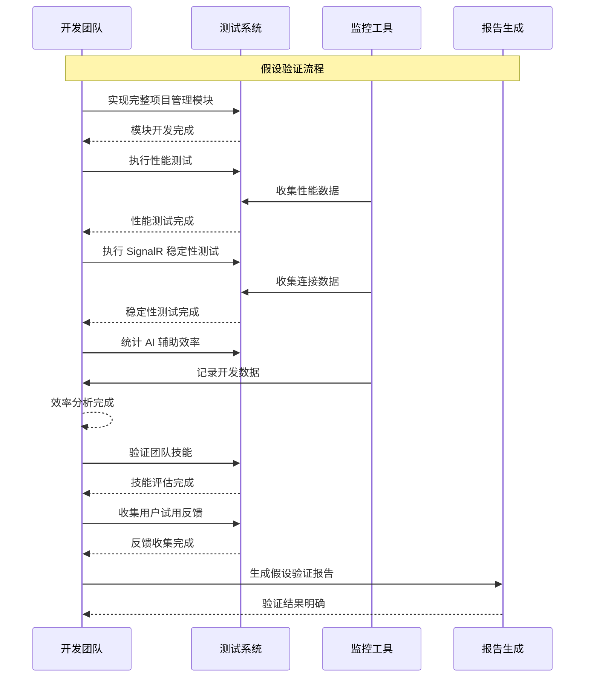

# validate-abp-blazor-assumptions - Proposal

**变更类型**: 假设验证 (Assumption-Validation Tier)  
**Epic**: urban-blazor-epic  
**版本**: 1.0  
**日期**: 2026-06-04  
**状态**: Draft  
**依赖**: 01-add-abp-blazor-core

---

## Why

Core Tier (01-add-abp-blazor-core) 建立了 ABP Blazor 基础设施，但包含 **2 个关键假设**需要验证：**ABP Blazor Server 性能** (A-01) 和 **SignalR 连接稳定性** (A-02)。在完整迁移所有模块之前，必须通过实际测试验证这些假设，确保技术方案可行，避免在大规模迁移后发现不可逆的问题。

**Assumption-Validation Tier 的目标是**：通过一个完整的业务模块实现和专项测试，验证所有关键假设，并为每个假设提供明确的验证结果和替代方案。

---

## What Changes

### 核心验证内容

#### 完整业务模块实现（项目管理）
- 实现完整的项目管理 CRUD 功能
- 使用 ABP 动态 C# 客户端代理
- 集成 LeptonX UI 组件
- 实现真实的数据库操作

#### 性能测试（验证 A-01）
- 页面首屏加载时间测试
- 并发用户负载测试
- 内存占用监控
- CPU 使用率监控

#### SignalR 稳定性测试（验证 A-02）
- 网络波动场景测试
- 连接断开重连测试
- 多客户端并发连接测试
- 消息传输可靠性测试

#### AI 辅助效率统计（验证 A-04）
- 开发时间记录和对比
- 代码生成准确率评估
- 返工率统计分析
- 与传统开发方式对比

#### 团队技能验证（验证 A-05）
- Blazor 概念理解评估
- 实际开发能力测试
- AI 辅助开发效果评估
- 学习曲线分析

#### 用户试用反馈（验证 A-03）
- 用户体验测试
- 功能易用性评估
- UI 满意度调查
- 问题收集和分析

### 测试方法论

#### 性能测试方法
```gherkin
Given ABP Blazor 基础设施已搭建
When 执行性能测试
Then 页面首屏加载时间 < 2s
And 50个并发用户时响应时间 < 3s
And 内存占用 < 500MB
And CPU 占用率 < 80%
```

#### SignalR 稳定性测试方法
```gherkin
Given SignalR 连接已配置
When 执行稳定性测试
Then 网络波动后重连时间 < 3s
And 连接断开后自动恢复
And 消息传输不丢失
And 多客户端同时连接稳定
```

---

## Capabilities

### New Capabilities

- `abp-blazor-performance-validation`: ABP Blazor 性能验证能力，包含页面加载测试、并发测试、资源监控
- `abp-blazor-signalr-validation`: SignalR 稳定性验证能力，包含网络波动测试、重连测试、多客户端测试
- `abp-blazor-ai-efficiency-validation`: AI 辅助效率验证能力，包含开发时间统计、准确率评估、返工分析
- `abp-blazor-team-skills-validation`: 团队技能验证能力，包含概念评估、能力测试、效果分析
- `abp-blazor-user-feedback-validation`: 用户反馈验证能力，包含体验测试、易用性评估、满意度调查

### Modified Capabilities

无现有能力的需求变更。本变更专注于验证 Core Tier 中的假设。

---

## Impact

### 代码变更映射

| 文件路径 | 变更类型 | 变更原因 | 影响范围 |
|---------|---------|---------|---------|
| `UrbanManagement.App/Components/Project/ProjectList.razor` | **新建** | 完整项目管理模块实现 | 业务功能 |
| `UrbanManagement.App/Components/Project/ProjectForm.razor` | **新建** | 项目创建/编辑表单 | 业务功能 |
| `UrbanManagement.App/Components/Project/ProjectDetail.razor` | **新建** | 项目详情查看 | 业务功能 |
| 测试脚本和报告 | **新建** | 性能和稳定性测试 | 测试验证 |

### 依赖项变更

- **新增测试工具**: 性能测试工具、SignalR 测试工具
- **新增监控工具**: 应用性能监控、日志分析工具

### API 端点变更

无新增 API 端点，使用现有 ProjectAppService。

### 配置变更

新增测试相关配置：
- 性能测试配置
- 监控配置
- 测试环境配置

### 数据库变更

无数据库结构变更，使用现有 Project 表。

---

## Interaction Flow



---

## Technical Constraints

遵循以下项目约束：

1. **基于 Core Tier**: 所有验证工作基于已完成的 Core Tier 基础设施
2. **真实业务场景**: 使用真实的业务模块（项目管理）进行验证
3. **可重复测试**: 所有测试必须可重复执行
4. **量化指标**: 所有假设必须通过量化指标验证
5. **替代方案准备**: 为每个假设准备验证失败时的替代方案

---

## Delivery Tier

| Field | Value |
|-------|--------|
| Tier | Assumption-Validation |
| Role in path | 第二个变更，验证 Core tier 假设 |
| Depends on | 01-add-abp-blazor-core |
| Out of scope (vs tier ladder) | 完整迁移所有模块、性能优化、旧依赖清理 |

---

## Facts

- 验证 A-01: ABP Blazor 性能（页面加载 < 2s，并发 ≥ 50 用户）
- 验证 A-02: SignalR 稳定性（重连 < 3s，连接成功率 > 95%）
- 验证 A-03: LeptonX 主题满足业务需求（用户满意度 > 80%）
- 验证 A-04: AI 辅助效率提升 ≥ 50%
- 验证 A-05: 团队 C# 技能充分（AI 辅助下可完成开发）
- 使用完整业务模块（项目管理）进行验证
- 所有测试必须可重复执行
- 为每个假设准备替代方案

---

## Assumptions

| ID | Assumption | L-level | Risk | Validation method | Disposition options |
|----|------------|---------|------|-------------------|---------------------|
| A-01 | ABP Blazor Server 性能满足需求 | L2 | 15 | 负载测试（目标：< 2s 首屏） | Keep / Replace / Remove |
| A-02 | SignalR 连接在局域网稳定 | L2 | 12 | 网络波动测试（重连 < 3s） | Keep / Replace / Remove |
| A-03 | LeptonX 主题适配业务需求 | L1 | 8 | 用户试用反馈（满意度 > 80%） | Keep / Replace / Remove |
| A-04 | AI 效率提升 ≥ 50% | L2 | 20 | 开发时间对比统计 | Keep / Replace / Remove |
| A-05 | 团队 C# 技能充分 | L2 | 10 | 实际开发完成度 | Keep / Replace / Remove |

**Guess Ratio**: 100% (本阶段专门验证假设)

---

## Decisions Needed

本变更的**所有决策都是基于验证结果**：

**如果 A-01 验证失败**（性能不达标）：
- 决策 1: 优化 Blazor 配置和组件
- 决策 2: 考虑 Blazor WebAssembly 替代方案
- 决策 3: 放弃 Blazor，继续使用 MVC

**如果 A-02 验证失败**（SignalR 不稳定）：
- 决策 1: 优化重连机制和配置
- 决策 2: 考虑轮询替代方案
- 决策 3: 减少 SignalR 使用范围

**如果其他假设验证失败**：根据具体情况制定替代方案

---

## Design Decisions

**验证方法决策**：

- **性能测试工具**: 使用浏览器 DevTools + 性能测试框架
- **负载测试**: 模拟 50 个并发用户
- **SignalR 测试**: 模拟网络波动和断线场景
- **AI 效率统计**: 对比传统开发方式的开发时间
- **用户试用**: 邀请 3-5 名真实用户试用

---

## Guess Governance Summary

| Guess Count | Guess Ratio | High-risk (≥40) | Validation plan | Rollback | Degrade |
|-------------|-------------|-----------------|-----------------|----------|---------|
| 5 | 100% | 1 (A-04) | 每个 assumption 都有专项验证 | Core Tier 基础设施可用 | 根据验证结果调整方案 |

**说明**: 
- Guess Count: 5 个假设需要验证
- Guess Ratio: 100% (本阶段专门用于验证)
- High-risk: A-04 风险评分 20（低于 40），不属高风险
- Validation plan: 每个假设都有详细的验证方法和成功标准
- Rollback: Core Tier 基础设施可用，验证失败不影响现有系统
- Degrade: 根据验证结果，可调整后续策略或停止迁移

---

## Success Criteria

### 验收标准

- [ ] 所有假设都有明确的验证结果
  - A-01 性能测试完成并记录结果
  - A-02 SignalR 测试完成并记录结果
  - A-03 用户试用完成并收集反馈
  - A-04 AI 效率统计完成并分析
  - A-05 团队技能评估完成并记录

- [ ] 每个假设都有明确的 Disposition
  - Keep: 假设验证通过，继续使用
  - Replace: 假设不成立，使用替代方案
  - Remove: 移除相关功能或停止迁移

- [ ] 不符合预期的假设有替代方案
  - 每个验证失败的假设都有替代方案
  - 替代方案的技术可行性已评估
  - 替代方案的成本和影响已分析

- [ ] 生成假设验证报告
  - 包含所有验证结果
  - 包含每个假设的 Disposition
  - 包含明确的下一步建议
  - 包含继续/停止的明确建议

### 验证成功标准

| 假设 | 成功标准 | 验证方法 |
|------|----------|----------|
| A-01 | 页面加载 < 2s，并发 ≥ 50 用户 | 性能测试 |
| A-02 | 重连 < 3s，连接成功率 > 95% | 网络波动测试 |
| A-03 | 用户满意度 > 80%，无严重问题 | 用户试用 |
| A-04 | 开发时间减少 ≥ 50%，准确率 > 90% | 时间统计 |
| A-05 | 团队可完成开发，AI 辅助有效 | 技能评估 |

---

## Out of Scope

本变更**不包含**以下内容：

- ❌ 完整迁移所有模块（留待 Full tier）
- ❌ 性能优化（本阶段只验证，不优化）
- ❌ jQuery 和 LayUI 移除
- ❌ 数据库结构变更
- ❌ Application 层或 Core 层修改

---

## Dependencies

### 前置依赖
- **01-add-abp-blazor-core**: Core Tier 基础设施必须完成并可用

### 后续依赖
- **Epic 3 (Full)**: 依赖本变更的验证结果
  - 如果关键假设失败，可能需要调整或停止迁移
- **Epic 4 (Quality-Delivery)**: 依赖 Epic 3 的完整迁移

---

## Risks & Mitigations

| 风险 | 影响 | 概率 | 缓解措施 |
|------|------|------|----------|
| 关键假设验证失败 | 高 | 中 | 准备详细的替代方案 |
| 测试环境不足 | 中 | 低 | 准备完善的测试工具和环境 |
| 测试时间不足 | 中 | 中 | 合理安排测试时间，优先级明确 |
| 用户试用反馈差 | 中 | 低 | 准备 UI 调整方案 |

---

## Validation Outputs

### 产出物

1. **性能测试报告** (`Performance-Test-Report.md`)
   - 页面加载时间数据
   - 并发用户测试结果
   - 资源占用分析
   - 性能瓶颈识别

2. **SignalR 稳定性报告** (`SignalR-Stability-Report.md`)
   - 连接稳定性测试结果
   - 重连机制验证
   - 网络波动场景测试
   - 多客户端连接测试

3. **AI 效率分析报告** (`AI-Efficiency-Report.md`)
   - 开发时间对比
   - 代码生成准确率
   - 返工率分析
   - 效率提升评估

4. **团队技能评估报告** (`Team-Skills-Assessment.md`)
   - Blazor 概念理解评估
   - 实际开发能力评估
   - AI 辅助效果评估
   - 技能缺口分析

5. **用户反馈报告** (`User-Feedback-Report.md`)
   - 用户体验测试结果
   - 功能易用性评估
   - UI 满意度调查
   - 问题清单和改进建议

6. **假设验证综合报告** (`Assumption-Validation-Report.md`)
   - 所有假设的验证结果汇总
   - 每个假设的 Disposition
   - 验证失败的替代方案
   - 下一步建议（继续/停止/调整）

---

## Timeline

**估算工时**: 5-7 天

**详细计划**:
- Day 1-3: 实现完整项目管理模块
- Day 4: 性能和 SignalR 测试
- Day 5: AI 效率统计和团队技能评估
- Day 6-7: 用户试用和报告生成

---

## Related Documents

- **Core Tier Proposal**: `slices/01-add-abp-blazor-core/proposal.md`
- **PRD**: `_bmad-output/planning-artifacts/urban-blazor-epic/prd.md`
- **Architecture**: `_bmad-output/planning-artifacts/urban-blazor-epic/architecture.md`
- **Epics**: `_bmad-output/planning-artifacts/urban-blazor-epic/epics.md`
- **原始 Epic**: `docs/urban-blazor-epic.md`

---

## Next Steps

**推荐执行顺序**:

1. **Core Tier**: 先完成 `01-add-abp-blazor-core`
2. **本变更（验证）**: 验证完成后再决定是否继续
3. **Full Tier**: 如果验证通过，执行 `03-migrate-urban-to-abp-blazor`
4. **Quality-Delivery**: 最后执行 `04-abp-blazor-quality-hardening`

**决策点**:
- 如果 **关键假设验证通过** → 继续执行 Full tier
- 如果 **关键假设验证失败** → 评估替代方案或停止迁移
- 如果 **部分假设失败** → 调整方案后继续

---

**审批状态**: Draft - 待审核  
**建议**: 必须在 Core Tier 完成后执行本变更  
**重要性**: 关键决策点，决定项目是否继续
