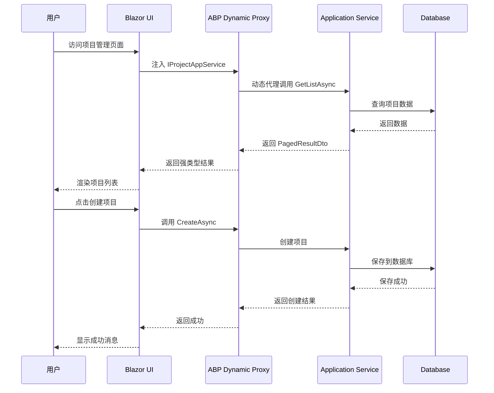

# migrate-urban-to-abp-blazor - Proposal

**变更类型**: 完整迁移 (Full Tier)  
**Epic**: urban-blazor-epic  
**版本**: 1.0  
**日期**: 2026-06-04  
**状态**: Draft  
**依赖**: 01-add-abp-blazor-core, 02-validate-abp-blazor-assumptions

---

## Why

在 Core Tier 建立基础设施、Assumption-Validation Tier 验证关键假设后，**Full Tier 的目标是完成所有核心模块的 Blazor 迁移**，提供完整的现代化管理系统，充分利用 ABP Blazor 的技术优势，实现前后端不分离的纯 C# 技术栈。

**假设 Assumption-Validation Tier 验证通过**（作为前置条件），则可以安全地大规模迁移所有核心模块；如果验证失败，则根据验证结果调整方案。

---

## What Changes

### 核心模块完整迁移

#### 项目管理模块完整迁移
- 项目列表页面（分页、搜索、排序）
- 项目创建/编辑表单
- 项目详情查看
- 数据验证和错误处理
- 内站无用户登录/权限 UI（ADR-007）

#### 客户管理模块完整迁移
- 客户列表页面
- 客户信息管理
- 搜索和筛选功能
- 数据导入导出功能

#### 城市称重记录模块完整迁移
- 称重记录列表
- 记录详情查看
- 数据上传功能
- 审批流程功能
- 实时状态更新

#### 主页仪表板完整迁移
- 统计卡片组件
- 数据图表组件
- 快捷操作功能
- 实时数据更新

### ABP 服务完整集成

#### 安全模型对齐（ADR-007）
- 管理端不集成 Identity、登录、JWT、`AuthorizedView`
- 保持客户端 API：`BuildLicenseNo`、`FdBuildLicenseNo`、`ClientRecordId` 契约与幂等
- 文档与 prd/architecture 一致

#### ABP 设置系统完整集成
- 集成 ISettingProvider
- 创建设置配置界面
- 单租户内站（不引入多租户登录）
- 实现设置验证
- 优化设置性能

#### ABP 事件总线完整集成
- 集成 IEventBus
- 实现事件发布
- 实现事件订阅
- 处理事件异常
- 优化事件性能

#### ABP 动态代理完整集成
- 确保所有应用服务使用动态代理
- 移除手动 HTTP 调用代码
- 统一错误处理
- 优化代理性能

### 异常处理和边界情况

- 实现全局异常处理
- 实现网络错误重试
- 处理边界情况
- 实现日志记录
- 优化错误恢复

---

## Capabilities

### New Capabilities

- `urban-project-management-blazor`: 城市项目管理 Blazor 模块，包含完整的 CRUD 功能（内站无页面级权限）
- `urban-client-management-blazor`: 客户管理 Blazor 模块，包含信息管理、搜索筛选、数据导入导出
- `urban-weighing-record-blazor`: 城市称重记录 Blazor 模块，包含记录列表、详情查看、数据上传、审批流程
- `urban-dashboard-blazor`: 主页仪表板 Blazor 模块，包含统计卡片、数据图表、实时更新
- `urban-security-model-alignment`: 内网无用户 Auth；客户端 API 字段身份与 OpenSpec 对齐
- `abp-setting-integration`: ABP 设置系统集成，包含设置读取、配置界面（单租户内站）
- `abp-eventbus-integration`: ABP 事件总线集成，包含事件发布、事件订阅、跨组件通信
- `abp-dynamic-proxy-integration`: ABP 动态代理集成，包含服务注入、自动HTTP处理、异常处理

### Modified Capabilities

无现有 Spec 的需求变更。本变更将现有 MVC 功能迁移到 Blazor，保持功能等价。

---

## Impact

### 代码变更映射

| 文件路径 | 变更类型 | 变更原因 | 影响范围 |
|---------|---------|---------|---------|
| `UrbanManagement.App/Components/Project/*.razor` | **新建** | 项目管理模块 Blazor 实现 | 业务功能 |
| `UrbanManagement.App/Components/Client/*.razor` | **新建** | 客户管理模块 Blazor 实现 | 业务功能 |
| `UrbanManagement.App/Components/WeighingRecord/*.razor` | **新建** | 称重记录模块 Blazor 实现 | 业务功能 |
| `UrbanManagement.App/Components/Dashboard/*.razor` | **新建** | 仪表板模块 Blazor 实现 | 业务功能 |
| `UrbanManagement.App/Components/Shared/*.razor` | **扩展** | 扩展共享组件库 | UI 组件 |
| `UrbanManagement.App/Startup/AbpBlazorStartup.cs` | **修改** | 更新 ABP Blazor 配置 | 启动配置 |
| 测试脚本 | **新建** | 集成测试和 E2E 测试 | 测试验证 |

### 依赖项变更

- **保留**: 所有现有 ABP 依赖
- **新增**: 测试框架依赖（如需要）
- **优化**: 某些包版本可能升级

### API 端点变更

无新增 API 端点，通过 ABP 动态代理调用现有 Application Services。

### 配置变更

- 扩展 Blazor 配置选项
- 添加模块化功能开关
- 优化性能相关配置

### 数据库变更

无数据库结构变更，使用现有表结构。

---

## Interaction Flow



---

## Technical Constraints

遵循以下项目约束：

1. **基于验证结果**: 假设 Assumption-Validation Tier 验证通过
2. **保持功能等价**: Blazor 功能必须等价于现有 MVC 功能
3. **渐进式迁移**: 逐模块迁移，每个模块可独立验证
4. **ABP 最佳实践**: 遵循 ABP Blazor 开发最佳实践
5. **可回退设计**: 保持配置开关可用

---

## Delivery Tier

| Field | Value |
|-------|--------|
| Tier | Full |
| Role in path | 第三个变更，完整迁移所有核心模块 |
| Depends on | 01-add-abp-blazor-core, 02-validate-abp-blazor-assumptions |
| Out of scope (vs tier ladder) | 新功能添加、性能优化、旧依赖清理 |

---

## Facts

基于已完成的 Core Tier 和 Assumption-Validation Tier：

- Core Tier 基础设施可用且稳定
- A-01 ABP Blazor 性能经验证符合预期（或已优化）
- A-02 SignalR 连接经验证稳定（或已优化）
- A-03 LeptonX 主题满足业务需求
- A-04 AI 辅助效率提升达到预期
- A-05 团队 C# 技能充分

**迁移范围**:
- 迁移项目管理模块（完整功能）
- 迁移客户管理模块（完整功能）
- 迁移城市称重记录模块（完整功能）
- 迁移主页仪表板（完整功能）
- 安全模型对齐（ADR-007，无用户 Auth）
- 集成 ABP 设置系统
- 集成 ABP 事件总线
- 集成 ABP 动态代理

---

## Assumptions

| ID | Assumption | 状态 | 说明 |
|----|------------|------|------|
| A-01 | ABP Blazor Server 性能满足需求 | ✅ 已验证 | 在 Assumption-Validation Tier 中验证通过 |
| A-02 | SignalR 连接在局域网稳定 | ✅ 已验证 | 在 Assumption-Validation Tier 中验证通过 |
| A-03 | LeptonX Lite 主题满足业务需求 | ✅ 已验证 | 在 Assumption-Validation Tier 中验证通过 |
| A-04 | AI 辅助效率提升 ≥ 50% | ✅ 已验证 | 在 Assumption-Validation Tier 中验证通过 |
| A-05 | 团队 C# 技能足以支持 Blazor 开发 | ✅ 已验证 | 在 Assumption-Validation Tier 中验证通过 |

**说明**: 所有 Core Tier 的假设已在 Assumption-Validation Tier 中验证。

---

## Decisions Needed

**前置条件确认**（来自 Assumption-Validation Tier）：

- [ ] 确认 A-01 性能验证通过，或已准备优化方案
- [ ] 确认 A-02 SignalR 验证通过，或已准备替代方案
- [ ] 确认 A-03 LeptonX 验证通过，或已准备扩展方案
- [ ] 确认 A-04 AI 效率验证通过
- [ ] 确认 A-05 团队技能验证通过，或已准备培训计划

**本变更决策**（如果前置条件满足）：
- 执行完整模块迁移
- 集成所有 ABP 服务
- 实现完整的异常处理
- 保持与现有系统的功能等价

---

## Design Decisions

**已批准的架构决策**（来自 architecture.md）：

- [ADR-001] 采用 ABP Blazor Server - ✅ 已验证可行
- [ADR-002] 采用 LeptonX Lite 主题 - ✅ 已验证满足需求
- [ADR-003] 动态 C# 客户端代理模式 - ✅ 已验证高效
- [ADR-004] 渐进式迁移策略 - ✅ 本阶段执行
- [ADR-005] 构造函数依赖注入模式 - ✅ 已验证可行
- [ADR-006] 模块化组件架构 - ✅ 已验证合理
- [ADR-007] 内网无用户 Auth，客户端 API 字段身份 - ✅ 本阶段遵循

**本阶段新增决策**：
- 按模块顺序迁移：项目管理 → 客户管理 → 称重记录 → 仪表板
- 每个模块迁移完成后进行验证
- 优先迁移高频使用模块

---

## Guess Governance Summary

| Guess Count | Guess Ratio | High-risk (≥40) | Validation plan | Rollback | Degrade |
|-------------|-------------|-----------------|-----------------|----------|---------|
| 0 | 0% | 0 | 所有关键假设已在 Epic 2 验证 | Core Tier 基础设施 | 配置开关 |

**说明**: 
- 本阶段无新增假设，所有假设已在 Assumption-Validation Tier 验证
- 如果验证失败的项目已准备替代方案或调整策略
- Rollback 路径明确，可随时回退到 Core Tier 或 MVC

---

## Success Criteria

### 验收标准

#### 模块迁移验收
- [ ] 项目管理模块完整迁移
  - 所有功能正常工作
  - 用户界面符合预期
  - 性能符合要求
  - 错误处理完善

- [ ] 客户管理模块完整迁移
  - 所有功能正常工作
  - 搜索和筛选正常
  - 数据导入导出正常
  - 内站管理无需登录（与 ADR-007 一致）

- [ ] 城市称重记录模块完整迁移
  - 称重记录列表正常显示
  - 记录详情查看正常
  - 数据上传功能正常
  - 审批流程功能正常

- [ ] 主页仪表板完整迁移
  - 统计卡片正确显示
  - 数据图表正常渲染
  - 快捷操作功能正常
  - 实时数据更新正常

#### ABP 服务集成验收
- [ ] 安全模型对齐（ADR-007）
  - 无登录页、无 Identity、无 AuthorizedView
  - 客户端 API 仍支持 BuildLicenseNo、FdBuildLicenseNo、ClientRecordId
  - ClientRecordId 幂等与迁移前一致

- [ ] ABP 设置系统完整集成
  - 设置读取功能正常
  - 设置配置界面正常
  - 单租户内站配置正常
  - 设置验证和保存正常

- [ ] ABP 事件总线完整集成
  - 事件发布功能正常
  - 事件订阅功能正常
  - 跨组件通信正常
  - 实时状态同步正常

- [ ] ABP 动态代理完整集成
  - 所有应用服务使用动态代理
  - 移除手动 HTTP 调用代码
  - 统一错误处理
  - 代理性能符合预期

#### 系统级验收
- [ ] 异常处理完善
  - 所有异常都有友好提示
  - 网络错误有重试机制
  - 边界情况有正确处理
  - 系统不会意外崩溃

- [ ] 功能完整性
  - 所有核心功能可用
  - 无功能缺失
  - 无严重缺陷
  - 用户体验良好

### 技术指标

| 指标 | 目标值 | 测量方法 |
|------|--------|----------|
| 模块迁移完成度 | 100% | 功能检查清单 |
| ABP 服务集成度 | ≥95% | 代码分析 |
| 页面响应时间 | <2s | 性能测试 |
| 功能完整性 | 100% | 功能对比测试 |

---

## Out of Scope

本变更**不包含**以下内容：

- ❌ 新功能添加（所有功能都是现有功能的迁移）
- ❌ 性能深度优化（留待 Quality-Delivery tier）
- ❌ jQuery 和 LayUI 移除（留待 Quality-Delivery tier）
- ❌ 旧代码清理（留待 Quality-Delivery tier）
- ❌ 数据库结构变更
- ❌ ABP Identity / 用户登录 / JWT / 页面级权限 UI

---

## Dependencies

### 前置依赖
- **01-add-abp-blazor-core**: Core Tier 基础设施
- **02-validate-abp-blazor-assumptions**: 假设验证结果（必须通过或已准备替代方案）

### 后续依赖
- **Epic 4 (Quality-Delivery)**: 依赖本变更的完整迁移
  - 清理旧依赖
  - 性能优化
  - 回归测试

---

## Risks & Mitigations

| 风险 | 影响 | 概率 | 缓解措施 |
|------|------|------|----------|
| 模块迁移周期长 | 中 | 中 | 分模块迁移，逐个验证 |
| 功能缺失 | 高 | 低 | 详细功能对比，完整测试 |
| 性能下降 | 中 | 中 | 持续性能监控，及时优化 |
| 团队技能不足 | 低 | 低 | 已在 Epic 2 验证和培训 |

---

## Migration Strategy

### 模块迁移顺序

```
1. 项目管理模块（优先）
   ├─ 项目列表（分页、搜索、排序）
   ├─ 项目创建/编辑
   ├─ 项目详情查看

2. 客户管理模块
   ├─ 客户列表
   ├─ 客户信息管理
   ├─ 搜索和筛选
   └─ 数据导入导出

3. 城市称重记录模块
   ├─ 称重记录列表
   ├─ 记录详情查看
   ├─ 数据上传功能
   └─ 审批流程

4. 主页仪表板
   ├─ 统计卡片
   ├─ 数据图表
   ├─ 快捷操作
   └─ 实时数据更新
```

### ABP 服务集成顺序

```
1. 动态代理集成（每个模块迁移时自然集成）
2. 安全模型对齐审查（无 Identity/权限 UI）
3. 设置系统集成（模块迁移完成后统一集成）
4. 事件总线集成（模块间通信需要时集成）
```

---

## Timeline

**估算工时**: 7-10 天

**详细计划**:
- Week 3 (Day 1-5): 项目管理模块迁移
- Week 4 (Day 1-5): 客户管理 + 称重记录模块迁移
- Week 4 (Day 6-10): 主页仪表板 + ABP 服务集成 + 测试

---

## Related Documents

- **Core Tier Proposal**: `slices/01-add-abp-blazor-core/proposal.md`
- **Assumption-Validation Proposal**: `slices/02-validate-abp-blazor-assumptions/proposal.md`
- **PRD**: `_bmad-output/planning-artifacts/urban-blazor-epic/prd.md`
- **Architecture**: `_bmad-output/planning-artifacts/urban-blazor-epic/architecture.md`
- **Epics**: `_bmad-output/planning-artifacts/urban-blazor-epic/epics.md`
- **原始 Epic**: `docs/urban-blazor-epic.md`

---

## Next Steps

**推荐执行顺序**:

1. **Core Tier**: `01-add-abp-blazor-core` ✅ 已完成
2. **假设验证**: `02-validate-abp-blazor-assumptions` ✅ 已完成
3. **本变更（完整迁移）**: 当前提案
4. **质量加固**: `04-abp-blazor-quality-hardening`

**决策点**:
- 如果 Full tier 完成 → 继续 Quality-Delivery tier
- 如果遇到问题 → 根据问题调整方案
- 如果重大障碍 → 考虑回退到 MVC 或部分回退

---

**审批状态**: Draft - 待审核  
**建议**: 必须在 Assumption-Validation Tier 验证通过后执行  
**重要性**: 核心迁移阶段，实现完整功能现代化
