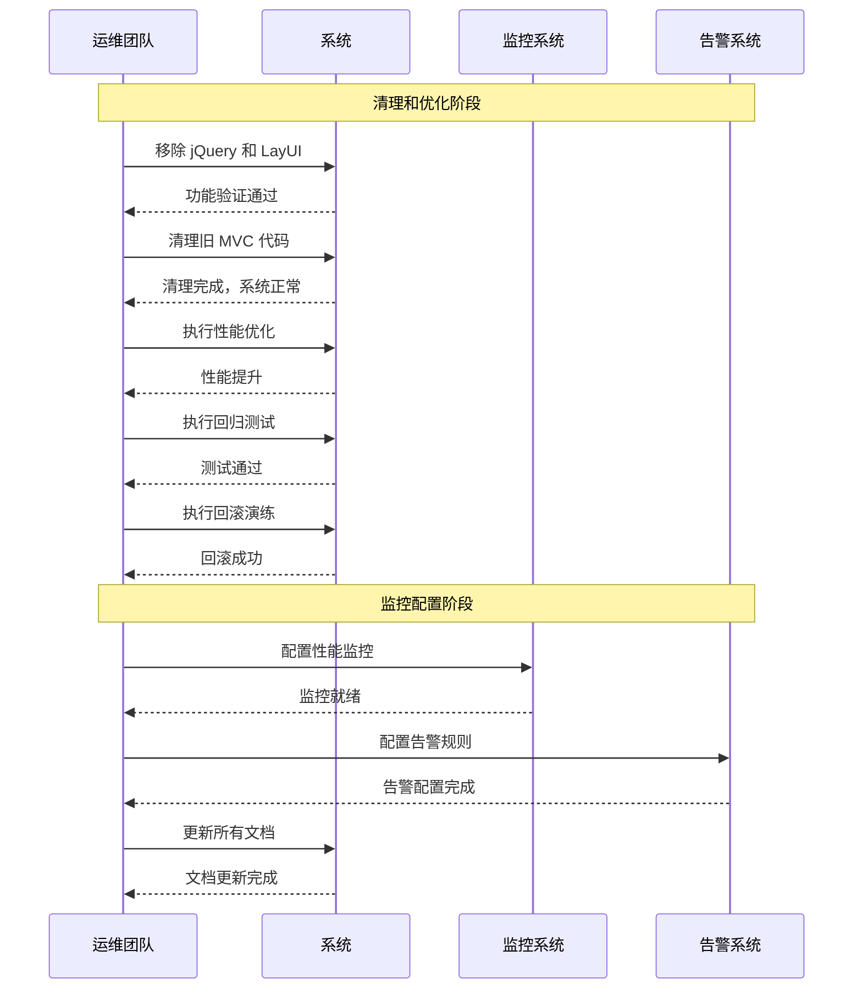

# abp-blazor-quality-hardening - Proposal

**变更类型**: 质量加固 (Quality-Delivery Tier)  
**Epic**: urban-blazor-epic  
**版本**: 1.0  
**日期**: 2026-06-04  
**状态**: Draft  
**依赖**: 01-add-abp-blazor-core, 02-validate-abp-blazor-assumptions, 03-migrate-urban-to-abp-blazor

---

## Why

在完成 Core Tier 基础设施、Assumption-Validation Tier 假设验证、Full Tier 完整迁移后，**Quality-Delivery Tier 的目标是完成生产环境准备和运维能力**，确保系统可以安全上线。本阶段将清理旧依赖、优化性能、建立回归测试套件、演练回滚流程、配置监控系统，并更新所有文档。

本阶段确保 ABP Blazor 迁移项目达到生产级别的质量标准，为长期维护奠定基础。

---

## What Changes

### 旧依赖清理

#### 移除 jQuery 依赖
- 移除 jQuery NuGet 包
- 删除 jQuery 相关文件
- 清理 jQuery 代码引用
- 验证功能完整性

#### 移除 LayUI 依赖
- 删除 LayUI 相关文件
- 清理 LayUI 代码引用
- 移除 LayUI 样式和脚本

#### 清理旧 MVC 代码
- 删除已迁移功能的 MVC Controller
- 删除已迁移功能的 MVC View 文件
- 更新路由配置
- 清理不再使用的中间件

### 性能优化

#### 组件渲染优化
- 使用 `OwningComponentBase` 管理服务生命周期
- 实现 `ShouldRender` 优化重渲染
- 使用 `Virtualize` 处理大列表

#### SignalR 连接优化
- 优化重连机制
- 实现消息压缩
- 优化连接池管理

#### 内存和 CPU 优化
- 优化内存使用
- 减少 CPU 占用
- 实现缓存策略

### 回归测试套件

#### 单元测试
- 创建 Blazor 组件单元测试
- 测试组件逻辑
- 测试数据绑定
- 测试事件处理

#### 集成测试
- 创建模块集成测试
- 测试组件交互
- 测试 ABP 服务集成
- 测试 SignalR 通信

#### E2E 测试
- 创建端到端用户场景测试
- 测试完整用户流程
- 测试跨模块交互
- 验证业务流程完整性

### 回滚和降级演练

#### 回滚机制验证
- 验证配置开关回滚
- 测试数据库回滚
- 验证代码回滚
- 测试回滚时间

#### 降级策略测试
- 测试 SignalR 降级到轮询
- 测试组件降级方案
- 验证降级用户体验

### 监控和告警配置

#### 性能监控
- 配置页面加载时间监控
- 配置内存占用监控
- 配置 CPU 使用监控
- 配置 SignalR 连接监控

#### 错误监控
- 配置异常日志记录
- 配置错误告警
- 配置性能异常告警
- 配置业务异常告警

#### 用户行为分析
- 配置用户访问统计
- 配置功能使用统计
- 配置用户行为追踪

### 文档更新

#### 运维文档
- 编写部署指南
- 编写配置说明
- 编写故障排查指南
- 编写回滚操作手册

#### 技术文档
- 更新架构文档
- 更新 API 文档
- 更新组件使用文档
- 编写最佳实践指南

#### 用户文档
- 更新用户手册
- 编写功能变更说明
- 编写培训材料

---

## Capabilities

### New Capabilities

- `legacy-dependency-cleanup`: 旧依赖清理能力，包含 jQuery/LayUI 移除、旧代码清理、引用更新
- `performance-optimization`: 性能优化能力，包含组件优化、SignalR 优化、内存优化、缓存策略
- `regression-testing`: 回归测试能力，包含单元测试、集成测试、E2E 测试、测试自动化
- `rollback-drill`: 回滚演练能力，包含回滚机制验证、降级策略测试、回滚时间验证
- `monitoring-alerting`: 监控告警能力，包含性能监控、错误监控、告警配置、用户行为分析

### Modified Capabilities

无新增能力，本阶段专注于质量提升和生产准备。

---

## Impact

### 代码变更映射

| 文件路径 | 变更类型 | 变更原因 | 影响范围 |
|---------|---------|---------|---------|
| `UrbanManagement.App/UrbanManagement.App.csproj` | **修改** | 移除 jQuery 和 LayUI 包引用 | 依赖管理 |
| `UrbanManagement.App/Controllers/*` | **删除** | 删除已迁移功能的 MVC Controller | 代码清理 |
| `UrbanManagement.App/Views/*` | **删除** | 删除已迁移功能的 MVC Views | 代码清理 |
| `UrbanManagement.App/Components/Shared/*.razor` | **优化** | 性能优化和代码重构 | 性能提升 |
| 测试项目 | **新建** | 单元测试、集成测试、E2E 测试 | 测试验证 |
| 监控配置 | **新建** | 性能监控、错误监控、告警配置 | 运维支持 |
| 文档 | **更新** | 更新所有相关文档 | 文档维护 |

### 依赖项变更

- **移除**: jQuery、LayUI 及相关包
- **新增**: 测试框架包、监控工具包
- **保留**: ABP Framework、Blazor 相关包

### API 端点变更

- **移除**: 所有旧 MVC API 端点（功能已迁移到 Blazor）
- **保留**: ABP 动态代理的内部调用
- **新增**: 监控和健康检查端点（可选）

### 配置变更

- 移除旧技术栈相关配置
- 优化 Blazor 性能配置
- 添加监控和告警配置
- 添加回滚开关配置

### 数据库变更

无数据库结构变更。可能添加性能监控相关表（可选）。

---

## Interaction Flow

---

## Technical Constraints

遵循以下项目约束：

1. **基于完整迁移**: 必须在 Full Tier 完成后执行
2. **保持功能完整**: 清理和优化不能影响现有功能
3. **可回退保证**: 所有操作必须可回退
4. **生产级质量**: 确保系统达到生产环境标准
5. **文档同步**: 代码和文档必须同步更新

---

## Delivery Tier

| Field | Value |
|-------|--------|
| Tier | Quality-Delivery |
| Role in path | 第四个变更，生产环境准备和运维能力 |
| Depends on | 01-add-abp-blazor-core, 02-validate-abp-blazor-assumptions, 03-migrate-urban-to-abp-blazor |
| Out of scope (vs tier ladder) | 新功能添加、架构重构 |

---

## Facts

基于已完成的前三个 Tier：

- Core Tier 基础设施稳定运行
- Assumption-Validation Tier 所有关键假设验证通过
- Full Tier 所有核心模块完成迁移
- 系统功能完整且正常工作
- ABP 服务集成完成

**本阶段目标**:
- 清理所有旧依赖（jQuery、LayUI、旧 MVC）
- 优化系统性能达到生产级标准
- 建立完整的回归测试套件
- 验证回滚和降级机制
- 配置监控和告警系统
- 更新所有文档

---

## Assumptions

| ID | Assumption | 状态 | 说明 |
|----|------------|------|------|
| A-01 | ABP Blazor 性能符合预期 | ✅ 已验证 | 在 Epic 2 和 Epic 3 中验证通过 |
| A-02 | SignalR 连接稳定 | ✅ 已验证 | 在 Epic 2 和 Epic 3 中验证通过 |
| A-03 | LeptonX 主题满足需求 | ✅ 已验证 | 在 Epic 2 和 Epic 3 中验证通过 |
| A-04 | AI 辅助效率符合预期 | ✅ 已验证 | 在 Epic 2 和 Epic 3 中验证通过 |
| A-05 | 团队 C# 技能充分 | ✅ 已验证 | 在 Epic 2 和 Epic 3 中验证通过 |

**说明**: 所有假设已在前期验证，本阶段专注于质量提升。

---

## Decisions Needed

**本阶段决策**：

- 决策 1: 确认可以安全移除 jQuery 和 LayUI
- 决策 2: 确认可以安全删除旧 MVC 代码
- 决策 3: 确认性能优化策略
- 决策 4: 确认测试覆盖范围
- 决策 5: 确认回滚策略

---

## Design Decisions

**清理策略决策**：

- **清理顺序**: 先移除 LayUI，再移除 jQuery，最后清理 MVC
- **清理验证**: 每次清理后进行完整的功能测试
- **回退保证**: 每次清理前创建回退点

**性能优化决策**：

- **优化重点**: 组件渲染、SignalR 连接、内存使用
- **优化策略**: 基于性能监控数据进行针对性优化
- **优化目标**: 页面加载 < 2s，SignalR 重连 < 3s

**测试策略决策**：

- **测试优先级**: 核心业务流程 > 边界情况 > 错误处理
- **测试自动化**: 尽可能自动化回归测试
- **E2E 测试**: 覆盖主要用户场景

---

## Guess Governance Summary

| Guess Count | Guess Ratio | High-risk (≥40) | Validation plan | Rollback | Degrade |
|-------------|-------------|-----------------|-----------------|----------|---------|
| 0 | 0% | 0 | 无新增假设，基于已验证的架构 | 每个操作都可回退 | 配置开关降级 |

**说明**: 
- 本阶段无新增假设，所有工作基于已验证的架构和功能
- 每个操作（清理、优化、测试）都可独立回退
- Rollback 路径清晰：可回退到 Full tier 的任何状态
- Degrade 路径明确：可通过配置开关降级到 Core tier 或 MVC

---

## Success Criteria

### 验收标准

#### 旧依赖清理验收
- [ ] jQuery 依赖完全移除
  - 项目不再引用 jQuery 包
  - 所有 jQuery 文件已删除
  - jQuery 代码引用已清理
  - 功能完整性验证通过

- [ ] LayUI 依赖完全移除
  - LayUI 文件已删除
  - LayUI 代码引用已清理
  - 功能完整性验证通过

- [ ] 旧 MVC 代码清理完成
  - 已迁移功能的 Controller 已删除
  - 已迁移功能的 View 已删除
  - 路由配置已更新
  - 系统功能验证通过

#### 性能优化验收
- [ ] 性能基准达标
  - 页面加载时间 < 2s
  - SignalR 重连时间 < 3s
  - 内存占用 < 500MB
  - CPU 占用率 < 80%

- [ ] 性能优化措施生效
  - 组件渲染优化完成
  - SignalR 优化完成
  - 内存管理优化完成
  - 缓存策略实施完成

#### 测试验收
- [ ] 回归测试通过率 100%
  - 单元测试覆盖 > 80%
  - 集成测试覆盖核心流程
  - E2E 测试覆盖主要场景
  - 所有测试通过

- [ ] 测试自动化完成
  - CI/CD 集成完成
  - 自动化测试脚本就绪
  - 测试报告自动生成

#### 回滚验收
- [ ] 回滚演练成功
  - 回滚机制工作正常
  - 回滚时间 < 5 分钟
  - 数据完整性保证
  - 回滚后系统正常

- [ ] 降级策略验证
  - SignalR 降级方案验证
  - 组件降级方案验证
  - 降级用户体验可接受

#### 监控验收
- [ ] 监控系统配置完成
  - 所有关键指标都有监控
  - 监控数据可视化
  - 监控仪表板完成

- [ ] 告警系统配置完成
  - 异常情况有告警
  - 告警通知及时送达
  - 告警规则合理

#### 文档验收
- [ ] 运维文档完整
  - 部署指南完整
  - 配置说明完整
  - 故障排查指南完整

- [ ] 技术文档更新
  - 架构文档更新
  - API 文档更新
  - 组件使用文档更新

- [ ] 用户文档更新
  - 用户手册更新
  - 功能变更说明更新
  - 培训材料完成

### 技术指标

| 指标 | 目标值 | 测量方法 |
|------|--------|----------|
| jQuery 依赖 | 0 | 依赖检查 |
| LayUI 依赖 | 0 | 依赖检查 |
| 页面加载时间 | <2s | 性能测试 |
| SignalR 重连时间 | <3s | 稳定性测试 |
| 回归测试通过率 | 100% | 测试执行 |
| 回滚时间 | <5分钟 | 演练测试 |
| 文档完整性 | 100% | 文档检查 |

---

## Out of Scope

本变更**不包含**以下内容：

- ❌ 新功能添加
- ❌ 架构重构
- ❌ 数据库结构变更
- ❌ Application 层或 Core 层修改

---

## Dependencies

### 前置依赖
- **01-add-abp-blazor-core**: Core Tier 基础设施
- **02-validate-abp-blazor-assumptions**: 假设验证结果
- **03-migrate-urban-to-abp-blazor**: 完整迁移结果

### 后续依赖
本变更是最后一个 tier，完成后项目即达到生产就绪状态。

---

## Risks & Mitigations

| 风险 | 影响 | 概率 | 缓解措施 |
|------|------|------|----------|
| 旧依赖清理影响功能 | 高 | 中 | 逐步清理，充分测试，准备回退方案 |
| 性能优化效果不明显 | 中 | 中 | 基于监控数据优化，持续验证 |
| 测试覆盖不足 | 中 | 低 | 建立完整测试策略，优先核心功能 |
| 文档更新不完整 | 低 | 低 | 文档模板和审核流程 |

---

## Quality Gates

### 进入标准
- [ ] Full Tier 验收通过
- [ ] 所有核心功能正常工作
- [ ] 无严重缺陷

### 退出标准
- [ ] 所有验收标准达成
- [ ] 技术指标达标
- [ ] 文档完整更新

### 决策点
- **如果关键指标未达标** → 继续优化直到达标
- **如果发现重大问题** → 回滚到 Full tier 并修复
- **如果所有指标达标** → 项目完成，准备上线

---

## Timeline

**估算工时**: 3-5 天

**详细计划**:
- Day 1-2: 移除 jQuery 和 LayUI 依赖，清理旧 MVC 代码
- Day 3-4: 性能优化和回归测试套件创建
- Day 5: 回滚演练、监控配置、文档更新

---

## Related Documents

- **Core Tier Proposal**: `slices/01-add-abp-blazor-core/proposal.md`
- **Assumption-Validation Proposal**: `slices/02-validate-abp-blazor-assumptions/proposal.md`
- **Full Tier Proposal**: `slices/03-migrate-urban-to-abp-blazor/proposal.md`
- **PRD**: `_bmad-output/planning-artifacts/urban-blazor-epic/prd.md`
- **Architecture**: `_bmad-output/planning-artifacts/urban-blazor-epic/architecture.md`
- **Epics**: `_bmad-output/planning-artifacts/urban-blazor-epic/epics.md`
- **原始 Epic**: `docs/urban-blazor-epic.md`

---

## Next Steps

**推荐执行顺序**:

1. **Core Tier**: `01-add-abp-blazor-core` ✅ 已完成
2. **假设验证**: `02-validate-abp-blazor-assumptions` ✅ 已完成
3. **完整迁移**: `03-migrate-urban-to-abp-blazor` ✅ 已完成
4. **本变更（质量加固）**: 最后执行

**完成标准**:
- 所有验收标准达成
- 系统达到生产就绪状态
- 文档完整更新
- 可以安全上线

---

## 交付物清单

### 代码交付物
- [ ] 清理后的代码库
- [ ] 优化的组件代码
- [ ] 完整的测试套件

### 运维交付物
- [ ] 部署指南
- [ ] 配置说明
- [ ] 监控配置
- [ ] 回滚手册

### 文档交付物
- [ ] 更新后的架构文档
- [ ] 更新后的 API 文档
- [ ] 更新后的用户手册
- [ ] 培训材料

---

**审批状态**: Draft - 待审核  
**建议**: 最后一个 tier，完成即可上线  
**重要性**: 生产准备阶段，确保系统质量和可维护性
