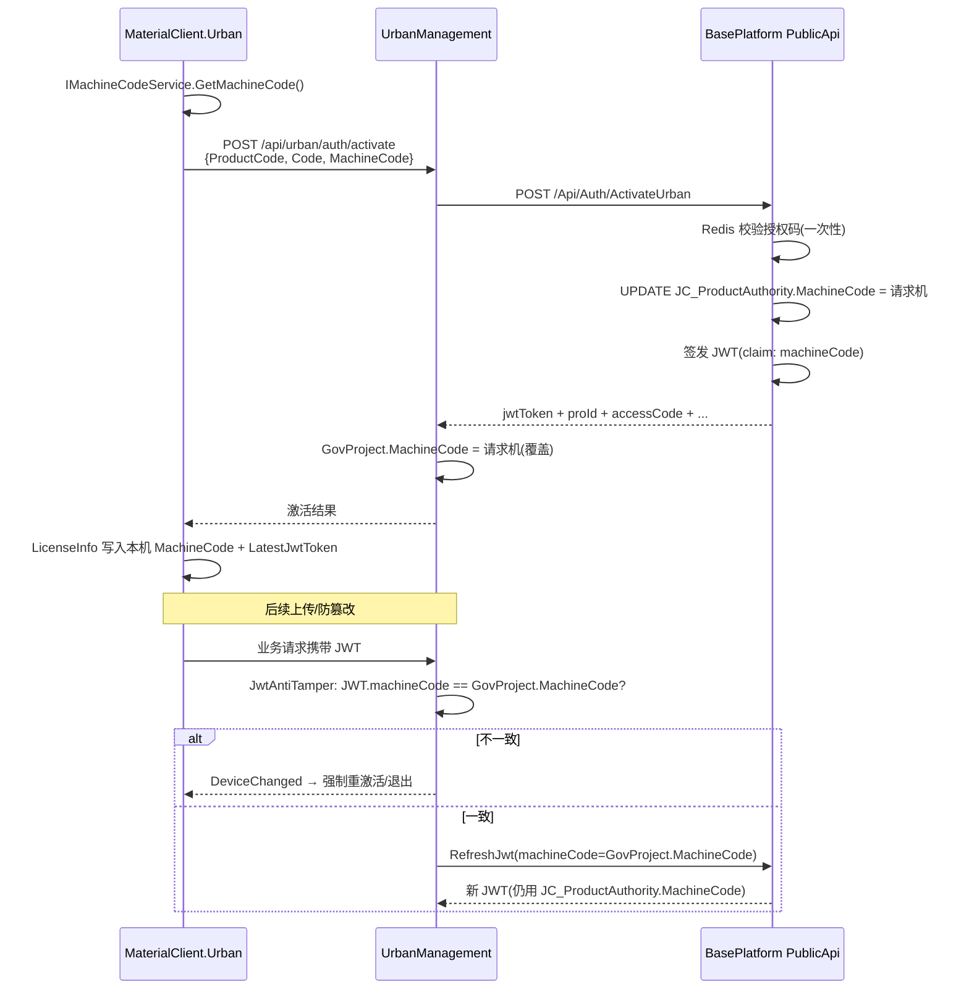

# 01 — 现状与链路分析

## 1. 业务语义（当前）

MaterialClient.Urban（城管称重客户端，ProductCode **5001**）的授权模型是：

- **一个项目（ProId）同一时刻只绑定一台机器**
- 第二台机器用同一授权码/项目再次激活时，会**覆盖**权威机器码，旧机在下次同步/上传时被判定为「设备已变更」并强制重新激活或退出

这不是疏漏，而是 F4 防窜用设计的一部分。

## 2. 端到端链路

## 3. 各层「单机」落点

### 3.1 BasePlatform（权威源）

| 位置 | 行为 |
|------|------|
| `JC_ProductAuthority.MachineCode` | **单个** `string` 字段 |
| `AuthController.ActivateUrban` | 激活成功后 `UPDATE ... SET MachineCode = activateRequest.MachineCode`（覆盖） |
| `LicenseFileAppService.BuildLicenseFileAsync` | JWT claim 取自 **库中** `productAuth.MachineCode`，不是独立多值列表 |
| 授权管理 UI `ProjectAuthAdd` / `CompanyAuthAdd` | 一个「机器码」输入框（`id="MachineCode2"` 仅为 HTML id，不是第二台） |
| `Material_MachineCode` 表 | 物料客户端历史多机表；**Urban 5001 激活路径未使用** |

相关路径（本机联接外仓库，调研用）：

- `D:\CodeUp\FdSoft.BasePlatform.PublicApi\Controllers\AuthController.cs` — `ActivateUrban`
- `D:\CodeUp\FdSoft.BasePlatform\FdSoft.BasePlatform.Model\Models\BasePlatform\JCProductAuthority.cs`

### 3.2 UrbanManagement

| 位置 | 行为 |
|------|------|
| `GovProject.MachineCode` | 单字段；激活代理成功后覆盖写 |
| `UrbanAuthActivateAppService.TrySyncGovProjectAsync` | `project.MachineCode = request.MachineCode.Trim()` |
| `JwtAntiTamperService` Step 2.5 (F4) | `jwtMachineCode` 与 `project.MachineCode` **OrdinalIgnoreCase 相等**，否则 `RevocationReason.DeviceChanged` |
| `RefreshJwt` / `GetLicenseFile` | 传入 `project.MachineCode`（仍是单一权威值） |
| 项目拉取 | `GovProjectPullManager` 从目录 API 同步单一 `MachineCode` |

关键注释（设计意图）：

> Device binding check (F4)... A mismatch means the project has been re-activated on a different device and the submitted (old-device) token MUST be revoked

路径：`repos/UrbanManagement/src/UrbanManagement.Core/Services/JwtAntiTamperService.cs`

### 3.3 MaterialClient.Urban / Common

| 位置 | 行为 |
|------|------|
| `IMachineCodeService` | 本机 CPU/主板/MAC → SHA256，**一台机一个码** |
| `LicenseService.ActivateUrbanAsync` | 带本机码激活；本地 `LicenseInfo.MachineCode` 写本机码 |
| `LicenseInfo.MachineCode` | SQLite 单字段 |
| `StaticLicenseChecker` | JWT `machineCode` claim **必须等于本机** |
| `LicenseDeviceRevokedEventHandler` | 收到 DeviceChanged → 强制在线激活窗，取消则退出 |
| `SubmitMachineCode`（F2） | 称重上传溯源字段，**仅记录不校验**，与授权绑定无关 |

路径示例：

- `repos/MaterialClient/src/MaterialClient.Common/Services/Authentication/LicenseService.cs`
- `repos/MaterialClient/src/MaterialClient.Common/Entities/LicenseInfo.cs`
- `repos/MaterialClient/src/MaterialClient.Urban/Events/LicenseDeviceRevokedEventHandler.cs`

### 3.4 OpenSpec 已有约束

- `openspec/specs/urban-project-info-display`：项目信息展示**一个**遮掩机器码
- `openspec/specs/baseplatform-project-catalog-api`：目录按 `JC_ProductAuthority`（含非空 MachineCode 语义）过滤；按 ProId 取**最新一条**权威记录

## 4. 当前换机实际行为（用户可感知）

1. 机 A 已激活且正常使用。  
2. 机 B 使用有效授权码激活同一项目 → BP/UM 权威 `MachineCode` 变成 B。  
3. 机 A 下次触发防篡改/同步 → 「授权设备已变更」→ 重激活或退出。  
4. 因此：**无法两台同时合法在线**；只能「谁后激活谁有效」。

## 5. 与「绑定两台」相关的易混点

| 概念 | 是否等于双机绑定 |
|------|------------------|
| `SubmitMachineCode` 写入上传记录 | 否，仅溯源 |
| SignalR `ClientId` 用机器码 | 否，连接标识，不负责授权允许多机 |
| `Material_MachineCode` 多行表 | 否，未接入 5001 JWT 激活 |
| 授权页 `MachineCode2` | 否，DOM id |

## 6. 瓶颈总结

真正卡死「双机并存」的是三处**单一权威值 + 严格相等**：

1. `JC_ProductAuthority.MachineCode`  
2. `GovProject.MachineCode` + F4 相等判断  
3. JWT 单一 `machineCode` claim（每张令牌仍可绑一台，但权威侧只能认一台）

客户端本地 `LicenseInfo` 本身只存「本机」是合理的；扩展重点在**服务端允许名单**与**验签语义**，而不只是 UI 多显示一个码。
