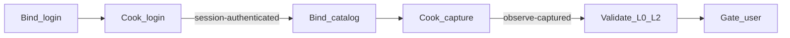
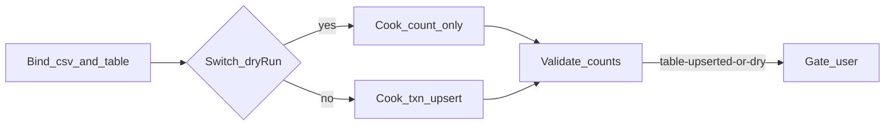

# 04 — 设计草图与 Sample

本章是可画在白板上的结构，外加**虚构** Acme Widget Console 的两条实例。Sample 只用于演示形状，禁止把其中 URL/表名拷进真实仓库当默认值。

---

## 1. 总图：场景 → 工件 → 证据 → 人

```text
                    ┌─────────────────────────┐
  用户场景 ────────▶│  Generate               │
  （自然语言）       │  intake → classify      │
                    │  → brief → scaffold     │
                    └───────────┬─────────────┘
                                │ 只写文件
                                ▼
                    pipelines/<slug>/
                      pipeline.md
                      config.yaml
                      secrets.example.yaml
                      secrets.local.yaml     ── gitignore
                                │
                    用户：执行 / 「生成并执行」
                                ▼
                    ┌─────────────────────────┐
                    │  Run（状态机）           │
                    │  load → secrets →       │
                    │  preflight → execute →  │
                    │  evidence → report      │
                    └───────────┬─────────────┘
                                │ 只写 runs/<ts>/
                                ▼
                    证据包 + report.md
                    状态：等待验收
                                │
                                ▼
                    ┌─────────────────────────┐
                    │  Human gate（L3）       │
                    │  pass / fail + 原因     │
                    └─────────────────────────┘
```

生成与执行之间的箭头是**用户意图**，不是自动跳转。

---

## 2. 生成路径（AI 内部）

```text
Scenario
   │
   ├─ 目的一句
   ├─ 副作用？（读 / 写本地 / 写系统）
   ├─ 要证明什么？（看见 / 写入计数 / 两侧一致 / 变换产物）
   │
   ▼
Family  { observe | ingest | probe | reconcile | transform }
   │
   ▼
Brief 卡（03 §3）
   │
   ▼
选择模板  →  填 config / runbook / secrets.example
   │
   ▼
摘要 + 是否立即执行？
```

决策压缩：

```text
要看表面？ ────────────── observe
要把外部数据写进去？ ──── ingest
只想问系统并记下回答？ ── probe
两路数据要对上？ ──────── reconcile
只做本地转换？ ────────── transform
又看又写？ ────────────── 拆成两条 slug
```

---

## 3. 执行路径（通用）

```text
init → load_config → resolve_secrets
     → Bind / preflight
     → Cook / execute[family]
     → Validate + evidence
     → write_report
     → Gate / await_user_acceptance
     → end
```

| 状态 | 成功 | 失败 |
|------|------|------|
| resolve_secrets | 键齐全 | 人闸；不猜 |
| Bind / preflight | Context 唯一命中；生产则已确认 | 歧义则停 |
| Cook / execute | 步骤完成或按 stopOnError 记录 | 重试 ≤2 后停或继续 |
| Validate + evidence | 每个 required 都有文件 | 写 missing，禁止装成未启用 |
| Gate | 用户 pass/fail | 保持 pending；不可静默通过 |

---

## 4. 工件分层草图

```text
              意图（慢）              机密（本机）           事实（快、不可变）
         ┌──────────────┐        ┌──────────────┐      ┌──────────────────┐
         │ config.yaml  │        │ secrets.local│      │ runs/<ts>/       │
         │ pipeline.md  │        │    .yaml     │      │  report.md       │
         │ brief.md     │        └──────────────┘      │  acceptance.md   │
         │ scripts/     │ 隔离、experimental           │  collectors…     │
         └──────────────┘                              └──────────────────┘
                │ 可提交                                      │ 默认不提交
                └──────── secretsRef ─────────────────────────┘
```

三条边：

- config **引用** secrets，不内嵌。  
- run **读取** config+secrets，不回写 config（验收结论只写本次 `acceptance.md`）。  
- 需要把证据挂到变更上：拷贝或链接，不 `git add -f` 整个 runs。

---

## 5. Sample 世界（虚构）

**Acme Widget Console**：本地库存小站。登录后可看「配件目录」页；另有一张 `Widgets` 表可用 CSV 更新。以下路径、账号、表名均为假。

---

### Sample A — observe：`acme-catalog-observe`

**场景**：联调后想确认目录页不是空壳。

**Brief（已填）**

```yaml
id: acme-catalog-observe
family: observe
goal: 配件目录如何证明非空壳
status: active
purpose: 登录后打开配件目录，采证页面可达且非失败壳。
sockets:
  start: session-anonymous
  end: observe-captured
cook: new-object              # 产物是 runs/<ts>/ 证据包，不改站点
nonGoals:
  - 不修改 Console 代码
  - 不做像素回归
  - 不宣布库存数量正确（L3 归用户）
environment: local
stopOnError: false
target:
  baseUrl: http://localhost:8080
  loginPath: /login
steps:
  - id: catalog
    name: 配件目录
    path: /inventory/catalog
secretsKeys: [username, password]
collectors:
  - id: screenshot
    required: true
    when: always
    sink: screenshots/
  - id: http
    required: true
    when: always
    sink: http/
  - id: logs
    required: true
    when: always
    sink: logs/
adapters:
  auth:
    mode: form
    sources: [network, log, ask]
humanGates: [missing-secrets, acceptance]
failurePolicy:
  retries: 2
  stopOnError: false
```

**Context：** 显式指针 = `baseUrl` + `pages[].path`；指纹 = 离开登录页且目录地标存在；显示名「配件目录」仅人读。歧义（多个站点）则停。

**Cook chain**



**execute 特化**

```text
browser_login → for each step: install collectors → navigate → wait_ready
  → screenshot → flush http/console → (end loop) → slice app logs
```

**config.yaml（形状）**

```yaml
id: acme-catalog-observe
family: observe
environment: local
baseUrl: http://localhost:8080
stopOnError: false
auth:
  mode: form
  loginPath: /login
  captchaSource: [network, log, ask]
  secretsRef: secrets.local.yaml
pages:
  - id: catalog
    name: 配件目录
    path: /inventory/catalog
    expect:
      - type: text-not-contains
        value: "加载失败"
capture:
  screenshot: true
  http:
    enabled: true
  logs:
    enabled: true
```

**一次 run 目录**

```text
pipelines/acme-catalog-observe/runs/2026-08-13T101500/
  screenshots/catalog.png
  http/catalog.md
  logs/app.log.md
  report.md
  acceptance.md
```

---

### Sample B — ingest：`acme-widget-ingest`

**场景**：把 `_tmp/widgets.csv` upsert 进 `Widgets` 表。

**Brief（已填）**

```yaml
id: acme-widget-ingest
family: ingest
goal: 如何把配件 CSV 写入 Widgets
status: active
purpose: 按 Sku 将 CSV upsert 到 Widgets；打印 inserted/updated/unchanged。
sockets:
  start: csv-raw
  end: table-upserted
cook: in-place                # 同一张表 identity
nonGoals:
  - 不解析任意 SQL 文件
  - 不删除库中 CSV 没有的行
  - 不在 dryRun=false 时跳过确认（若 environment≠local）
environment: local
stopOnError: true
target:
  table: Widgets
  matchKeys: [Sku]
  sourcePath: _tmp/widgets.csv
secretsKeys: [connectionString]
steps:
  - id: upsert
    name: csv-upsert
collectors:
  - id: summary
    required: true
    when: always
    sink: summary.json
  - id: report
    required: true
    when: always
    sink: report.md
adapters:
  dryRun: true          # 生成默认；用户明确要写入再改 false
humanGates: [missing-secrets, acceptance]
failurePolicy:
  retries: 0
  stopOnError: true
```

**Context：** 指针 = `target.table` + `sourcePath`；指纹 = CSV 表头包含全部 `matchKeys`；表名/列名仅 `[A-Za-z_][A-Za-z0-9_]*`。显示名「配件表」不当唯一键。

**Cook chain**



**execute 特化**

```text
validate csv headers ∩ matchKeys
  → (dryRun? count only : transactional upsert)
  → write summary.json + report.md
```

写库失败：整批回滚，不留下半批。Invoke 脚本若存在，只放 `pipelines/acme-widget-ingest/scripts/`，标 `experimental`。

---

### Sample C（短）— 拆分，而不是超级管道

错误：一条 `acme-full` 先导入 CSV 再打开目录页截图，状态机缠在一起，且无 Socket。

正确（两条 **active** Graph，Goal **不同**，可串行，非互斥冲突）：

1. `acme-widget-ingest`：`csv-raw` → Gate（计数）→ `table-upserted`  
2. `acme-catalog-observe`：`session-anonymous` → Gate（截图）→ `observe-captured`  

需要「导入后页面数字对得上 CSV」时，第三条 Graph：`acme-catalog-reconcile`（family=reconcile），对齐键 `Sku`，Socket 例如 `left-excerpt` + `right-excerpt` → `reconcile-diffed`。不要把 reconcile 偷偷塞进 observe 的 expect 里还不声明数据源。

若将来「目录如何验非空壳」换方案：将 `acme-catalog-observe` 标 `retired` 并指向继任，**不要**两条 observe 同时 active。

---

## 6. 草图如何被 AI「展开」成真实 pipeline

把用户场景套进 Sample 的槽位即可：

| Sample 槽 | 换成用户的 |
|-----------|------------|
| Acme Widget Console | 用户的系统称呼（仅文档用语） |
| `http://localhost:8080` | 用户给的 baseUrl |
| `/inventory/catalog` | 用户给的路径列表 |
| `Widgets` / `Sku` | 用户给的表与键 |
| `_tmp/widgets.csv` | 用户给的源路径 |
| form + captchaSource | 用户的 auth adapter |
| `session-anonymous` → `observe-captured` | 用户 Goal 的起止 Socket |
| `csv-raw` → `table-upserted` | 写入类 Goal 的起止 Socket |

**槽位空着就问；不要用 Sample 值顶上。**  
展开后走 `03` §4 脚手架与 §8 质量门。

---

## 7. 命令层草图（可选落地）

```text
/gen-pipeline <family-or-blurb>     → 本协议
/run-pipeline <slug>                → 读该 slug 的 pipeline.md

或按族拆分（实例多时更清晰）：
/gen-observe-pipeline
/run-observe-pipeline
/gen-ingest-pipeline
/run-ingest-pipeline
```

命令是入口；**模板 + brief 才是生成质量的来源**。不要把整本哲学贴进 command 文件。
