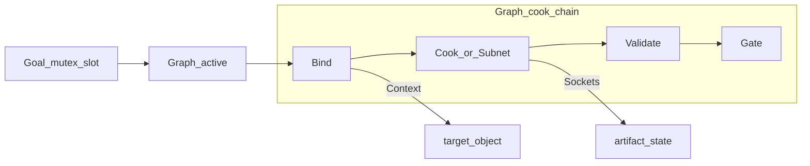

# 06 — 图模型与成文约定

吸收自管线 trait 的**结构哲学**（可 cook 的验收 Graph + Gate）。  
**刻意去掉**宿主三维工具链场景与术语；Socket / Context / Invoke 一律按通用软件系统理解（页面、表、文件、API、脚本）。

与 `01`–`05` 的关系：family / slug / runs 仍是**可执行实例**的形状；本章补上 **Goal 互斥、Node 种类、Socket 交接、成文粒度、代码隔离**。生成时两套词都要填，不要只写散文步骤。

---

## 1. 管线是什么、不是什么

管线是**可 cook 的验收 Graph**：已固化的操作实验网络，加上 **Gate**（用户确认）。

| 它是 | 它不是 |
|------|--------|
| 资产或工具变更后，如何重跑已知实验 | 死板的生产部署脚本 |
| 人与 Agent 都能沿 Wire 执行的协议 | 开放式调研笔记、会话时间线 |
| `pipelines/` 里的现行合同 | OpenSpec 的 SHALL / 某次 change 的 tasks |
| 默认可移植的 Subnet 装配 | 只能在本次对话里懂的「如上所述」 |

**不要**把仍在使用的「如何再验收 X」只写在 `docs/YYYY-MM-DD-*/`。调研可以**指向** `pipelines/`，不得当协议的**唯一**落点。缺少指向 docs / openspec 的外链**不得妨碍 cook**。

---

## 2. 词汇（通用，非某一类宿主）

| 概念 | 含义 | 落到本仓实例时 |
|------|------|----------------|
| **Goal** | 关于某一终态的同一问题；槽上协议互斥 | 「目录页如何证明非空壳」 |
| **Graph** | 一条现行验收网络（人读入口） | `pipelines/<slug>/`；人读投影是 `pipeline.md` |
| **Node** | 可 cook 或可 Gate 的单位 | runbook 中的一步 |
| **Subnet** | 复合 Node；**默认可移植 / 默认可成文粒度** | `_templates/<family>/` 或可被引用的独立 slug |
| **Socket** | 类型化交接口；`<family>-<state>` | 上一段产出态 = 下一段输入态 |
| **Wire** | Output Socket = 下一 Input Socket | 状态机箭头上标态名，不只写「然后」 |
| **Context** | 如何解析操作对象 | URL、表、文件、选择器、标记键 |
| **Cook** | 执行变换或校验（改数据、产数据、出报告） | execute + collectors |
| **Gate** | Review：人依赖；**不可静默通过** | 与 `01` P8 / L3 同一闸 |
| **Invoke** | 如何触发 cook | Cursor 命令 / 脚本 / API |
| **Bind** | 按 Context 解析对象；歧义则停 | preflight 的核心 |
| **Validate** | 报告 / 启发式；失败则停或标红 | L0–L2 |
| **Switch** | 已满足某 Socket 态则跳过分支 | 幂等 / 已登录则跳过登录 |

口述落点：

| 口述 | 落点 |
|------|------|
| 可重复、有输入输出、可失败 | Node（Cook / Validate / Bind / Switch） |
| 「你看一下对不对」 | **Gate** |
| 「别用旧方案，用这一套」 | 换 **Graph**（Goal 槽互斥），不是图内并行两套 |
| 失败史 / 为什么 | `docs/`（图外） |
| 正式进业务 | OpenSpec 落地（图外） |

**禁止**「一句话强制一个独立文档 Node」。默认成文单位是 **Subnet**（或一条 slug 的 Cook 链）。

---

## 3. 通用 cook 链



与 `02` 外骨架对齐：`preflight` ≈ Bind；`execute` ≈ Cook；`collect_evidence` + L0–L2 ≈ Validate；`await_user_acceptance` ≈ Gate。

---

## 4. Socket 与 Cook 语义

步骤只写「做什么」不够。必须声明对流上**哪一类产物、从何态变为何态**：

```text
Input socket:   <family>-<state-in>
Output socket:  <family>-<state-out>
Cook:           in-place | new-object
```

- **边界态**：只标可验收、可交接的态；不为每个中间点击发明新态。  
- **`in-place`**：同一对象 identity 上改内容（例如同一张表 upsert）。态变，对象可同名。  
- **`new-object`**：产出新产物（例如一次 `runs/<ts>/` 证据包）。须能指认（时间戳目录、报告路径）。  
- 下一段的 Input **应对齐**上一段 Output，而不仅是散文「做完上一步」。

Sample 态名（虚构，项目可自定词表）：

| Family | 例 Input | 例 Output | Cook |
|--------|----------|-----------|------|
| observe | `session-anonymous` | `observe-captured` | new-object（证据） |
| ingest | `csv-raw` | `table-upserted` | in-place（表） |
| probe | `endpoint-idle` | `probe-recorded` | new-object |
| reconcile | `left-excerpt` + `right-excerpt` | `reconcile-diffed` | new-object |
| transform | `file-raw` | `file-derived` | new-object |

---

## 5. Context（如何锁定对象）

每个涉及宿主对象的 Node / Subnet，**必须**给出至少一种可机读绑定，并写明多环境 / 多副本时的范围。

**优先级（高 → 低）：**

1. **标记** — 约定字段或元数据键（页面 `data-*`、配置 `id`、库内标记列）。成功后可写入当前 Socket 态名。  
2. **结构指纹** — 不依赖显示文案的可检测特征（必需列、必需 API 字段、必需地标选择器、数量合同）。  
3. **显式指针** — 稳定引用：URL path、表名、文件路径、config 键。  
4. **显示名** — 仅人读辅助；**禁止**作为唯一识别手段。

另须声明（适用时）：

- **Scope**：哪个 `environment` / 站点 / 库 / 目录；忽略哪些易混淆对象。  
- **歧义时**：禁止猜测；停止并请用户指定。

---

## 6. 互斥 Graph + 可组合 Wire

### 互斥（同一 Goal）

- 该 Goal 下的替代 Graph **互斥**。  
- 每个 Goal 最多一个 `active` Graph；其余 `retired`，并一行指向继任者。  
- **禁止**在同一对象上交叉混用互斥 Graph，却都当作现行。  
- 文档状态只用 `active` | `retired`。

生成时：若 `pipelines/` 已有同一 Goal 的 active slug，Ask：替换（旧标 retired）/ 另开 Goal / 取消。不要 silently 并存两套「如何验 X」。

### 可组合（不同关注点）

- 不同 Node / Subnet 可以都为 `active`，由 Graph 经 Wire 串接。  
- 组合是**串行交接**，不是把互斥 Graph 自由混跑。  
- 「导入 + 看页」是两条 Graph（或一条 Graph 装配两个 Subnet），不是把互斥方案叠在同一对象上。

### 默认可移植；允许不可解耦

| 倾向 | 规则 |
|------|------|
| **默认** | Subnet 写成可拷贝或移植（Socket、Cook 链、Gate、Context 清晰） |
| **允许** | 部分 Node 无法干净解耦（后段默认前段已满足某合同） |
| **耦合时必须** | 显式 `requires` / `assumes` / `blocks` / **coupled** |
| **禁止** | 伪造独立，或禁止本可迁移的 Subnet 复用 |

---

## 7. 成文粒度（何时拆文件 / 拆 slug）

独立成文看的是**边界是否够硬**，不是步骤有多累。篇幅目标约一页（80–100 行）只是观感，**不是**拆分门槛。

**满足下列 ≥2 条 → 宜拆成独立 Subnet（或独立 Graph / slug）：**

1. **可单独复用** — 别的 Graph 也要接同一段。  
2. **有稳定交接 Socket** — 能写出协议级 Input/Output 态。  
3. **有独立 Gate** — 人须在本段单独确认后，下游才可继续。  
4. **有独立 Invoke** — 单独命令 / 脚本 / 报告，失败面与上游不同。  
5. **互斥或可整体替换** — 同一 Goal 上「用本段还是替代段」。  
6. **母文逼近一页仍在涨** — 再塞会糊；细节下沉到 Subnet。

**不拆：** 共用同一 Context、同一 `in-place` identity、中间无独立 Gate / 无交接态的连续子步——再长也优先写在同一 Cook 链。

分层：端到端装配用 **Graph**（`pipeline.md` + config）；可移植检查段用 **Subnet**（模板或独立 slug）；Graph 文不堆满子步细节。

---

## 8. 同 Socket 微调（补丁 Cook）

主 Cook 已将对象推到 **Output socket** 后，仍可能发现细微问题。此时：

- **不要求**重跑整条 Graph / 破坏性全链。  
- **要求**出口合同再次成立（同一套 Validate + Gate）。  
- **允许**局部 Invoke、补丁子步、或受控手改。  
- **分流：** 合同 bug → 必须回写该 Node 的 canonical Invoke / `pipeline.md`；仅本次环境特例 → 可记在本次 run 或标 `coupled`，**勿**默写进主 Cook；实际上游错态 → **禁止**叠微调，回滚后重走对应 Subnet。  
- Switch「已达 Output → 只 Validate」与本条同向。

---

## 9. 代码与业务隔离

管线脚本**默认未进业务**。能跑 ≠ 正式功能。

1. **默认不进业务仓核心包。** 写在隔离区、由管线文档引用。  
2. **可为运行方便挂入口，但边界必须清晰。** 允许 `pipelines/<slug>/scripts/` 或命令 Invoke；不等于并入 `repos/` 业务模块、公共 API 或默认用户路径。  
3. **正式落地必须经 OpenSpec。** Gate 通过后，在 change 中**明确参考**对应 Graph，再迁入业务。未走该路径一律 `experimental` / `isolated`。  
4. **文档标明 Invoke 落点与状态。** 隔离脚本 vs 已落地入口，必须可区分。

```text
pipelines/<slug>/
  pipeline.md          # Graph 投影：怎么验
  config.yaml
  scripts/             # 隔离：怎么 cook；删除不影响产品合同
```

```text
pipelines Graph + 隔离脚本
        │  Gate（用户确认）
        ▼
openspec change（正文引用该 Graph）
        │  实现 + 归档
        ▼
业务代码 / 正式 UI
```

未完成最后一步前：**不得**声称「已是产品正式功能」。

---

## 10. 独立性规则

1. **自称可独立则须可读**：未标耦合时，Socket / Cook chain / Gate / Handoff 须在文内写全。  
2. **诚实耦合**：不可解耦就写明。  
3. **跑实验不依赖 OpenSpec**（正式落地进业务才依赖）。  
4. **知道下一步不依赖打开调研夹**（深链可选）。  
5. **单向指针**：`docs/` / `openspec/` **宜**链到 `pipelines/`；管线**可**外链深潜。  
6. **先改协议**：验收实验变了，先更新 Graph，再改调研。  
7. **代码与业务隔离**：未落地脚本不进业务包；Invoke 可挂载 ≠ 产品化。  
8. **产物可指认**：有 Socket 态变；Context 足以锁定目标，不靠唯一显示名。  
9. **同 Socket 微调**：已达 Output 后的补丁须再 Validate/Gate；合同问题回写 Invoke。

---

## 11. 编写流程（调研 → 管线）

1. **提升已定论的实验** — 只保留 Cook 链、Invoke、Gate、Sockets、Context、Switch、真实 `requires`。去掉会话时间线与互斥方案考古。  
2. **优先写成可移植 Subnet** — 上一段 Output = 下一段 Input。不够硬的边界不拆。  
3. **放入 `pipelines/<slug>/`** — 更新 `pipelines/README.md`。不要用新建日期调研夹当协议唯一归宿。  
4. **让调研指向管线** — 历史留在日期夹。  
5. **脚本先隔离，产品化另走 OpenSpec。**

---

## 12. Graph / Subnet 文骨架（投影到 `pipeline.md`）

生成 `pipeline.md` 时在 `02` §4.1 章节之外，尽量具备：

| 节 | Graph | Subnet（模板或可复用 slug） |
|----|-------|------------------------------|
| Status | `active` \| `retired` | 同左 |
| Goal | 一句话 + 互斥槽 | 若本段即互斥胜出协议则写 |
| Boundary sockets | Start / End | Input / Output + Cook 语义 |
| Context | 可汇总 | 标记 / 指纹 / 指针；Scope |
| Requires / Assumes | 含 coupled | 宜引用 Input socket |
| Cook chain | mermaid；边上标 Socket；Gate 位置标清 | Bind → Cook → Validate |
| Invoke | 可汇总 | 命令 / 脚本路径；隔离标签 |
| Gate | 各检查点 | 人要确认什么 |
| Handoff | End socket + 下游可能消费什么 | Output socket |

流程图：**宜** mermaid；节点 ID 用 camelCase/下划线，勿在 ID 中留空格。ASCII 仅作无渲染降级并声明理由。

---

## 13. Sample（无业务、非三维宿主）

复制后换成真实 Goal / Socket / Invoke；勿把占位名当现行协议。完整 Acme 可执行形状见 `04`。

### Subnet 形状

```text
Kind:     Subnet
Goal:     进入下游前，如何得到可验收的主记录形态
Input:    record-raw
Output:   record-normalized
Cook:     in-place
Context:  显式指针 = config.target；指纹 = 必需列齐全；歧义则停
Invoke:   pipelines/<slug>/scripts/…  （experimental）
Gate:     Validate 通过后由 Graph 挂出口 Gate
```

### Graph 形状


Start = `record-raw`；End = `delivery-candidate`。可选：仅做本地验收时停在 `Gate_local`。

---

## 14. 质量清单（图模型）

1. 协议落在 `pipelines/`，不在 `docs/` 或 `openspec/` 当唯一入口。  
2. 表述为可 cook 的 Graph + Gate，而非未声明的「上线脚本」。  
3. 同一 Goal 至多一个 `active` Graph。  
4. Sockets 含 Input / Output 与 Cook：`in-place` | `new-object`。  
5. Context 含可机读键与 Scope；未把显示名当唯一键。  
6. Cook chain 有 mermaid（或已声明 ASCII 降级）；Switch / 可选分支有标注。  
7. Invoke 使用真实名称；未落地代码在隔离区且标明 `experimental`。  
8. 耦合处声明 `requires` / `assumes` / `coupled`。  
9. 未把叙事或产品化元流程伪装成 Cook Node。  
10. 拆文遵守 ≥2 条边界判据；未因「步骤多」单独拆。  
11. 补丁未暗示可跳过 Validate / Gate。  
12. 未夹带本章 Sample 的虚构占位名当真实目标。

---

## 15. 反模式（补强 `01`）

- 现行协议只活在日期调研夹。  
- 同一 Goal 两个 `active` Graph，或交叉混用互斥方案。  
- 过死的点击剧本，无法改编或移植。  
- 耦合 Node 假装可独立。  
- 只有步骤、无 Socket。  
- 靠显示名认对象。  
- Cook 语义含糊（该 in-place 却暗示 new-object）。  
- 把 Gate 写成静默 Cook。  
- 一句话一个独立文档 Node。  
- 因「很大」而拆、却无边界；或该拆不拆。  
- 能跑就当正式功能：脚本进业务包、改默认 UI / 公共 API，却无 OpenSpec、无 Graph 引用。  
- 合同 bug 只手改现场、不回写 Invoke。  
- 为微调强制重跑破坏性全链。  
- 把某次环境特例写进主 Cook。
