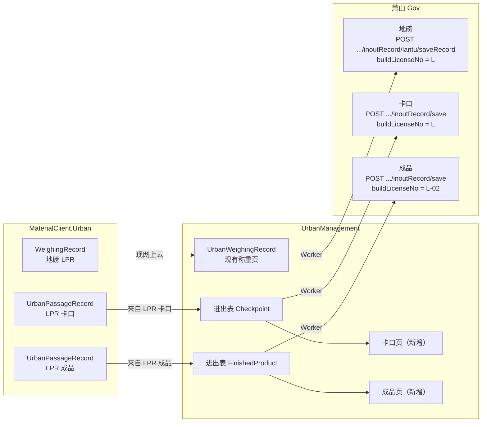
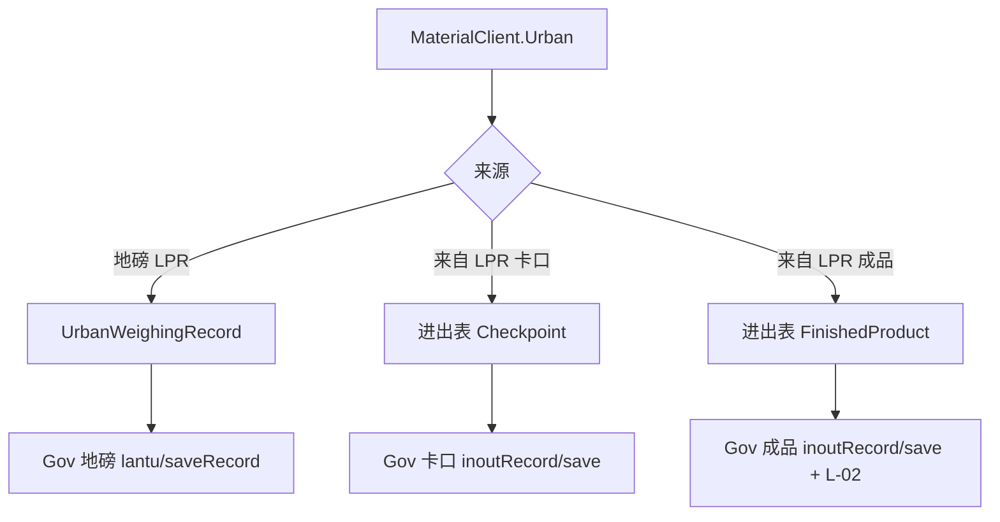

# 01 · 分流规则

客户端已按 `LprSiteType` 分成两类本地记录（见进出调研 01）。服务端 **不得** 再按「称重类型」把进出写进 `UrbanWeighingRecord`。分流键是 **记录种类 + `PassageSource`**，不是重量是否为空。

## 端到端链路

Urban 客户端只上云到 UrbanManagement；**萧山 Gov 只由 UrbanManagement 出队上报**。客户端不直连 Gov。

同图按种类展开（分流发生在 UM 落库之后、出队之前）：

## UrbanManagement 页面（本期要做）

与客户端「卡口 tab / 成品 tab」对齐，**UM 新增两个独立页面**（不要塞进现有称重列表混成一种审核流）：

| 页面 | 数据过滤 | 用途 |
|------|----------|------|
| 卡口进出 | `UrbanPassageRecord` 且 `PassageSource.Checkpoint` | 查看来自客户端上云的卡口抓拍；列与客户端专用 tab 同口径（无重量、无审批） |
| 成品进出 | 同上，`PassageSource.FinishedProduct` | 查看来自客户端上云的成品抓拍；列同上 |

- 现有 **地磅/称重** 页面继续只绑 `UrbanWeighingRecord`。
- 两页读同一进出表、不同 `PassageSource`；**不要**为成品再开第二张同构表。
- 本期列表以查询/查看为主；进出不上称重审批/异常流（除非后续 change 写明）。
- 上报状态（待出队 / 成功 / 失败）若现网称重页已有同类列，进出两页 **SHOULD** 对称展示，便于对 Gov 通道排障。

## 硬规则

| 客户端类型 | 服务端落库 | 萧山通道 | 禁止 |
|------------|------------|----------|------|
| `WeighingRecord`（地磅 LPR / 称重流水） | 现有 `UrbanWeighingRecord` | 地磅 `lantu/saveRecord` | 打 `inoutRecord/save`；成品 `-02` |
| `UrbanPassageRecord` + `Checkpoint` | 独立进出表（建议同名） | 卡口 `inoutRecord/save` | 写入 `UrbanWeighingRecord`；塞 `dataSource` |
| `UrbanPassageRecord` + `FinishedProduct` | 同上，行内 `PassageSource` | 成品：同 save + `-02` | 再开第二张同构表；地磅路径 |

- 进出记录 **无重量列**；地磅报文必填 `goodsWeight`，不得用进出行「凑 0」冒充称重。
- `UrbanInOutType` / `UrbanSiteType` 已在客户端快照；服务端上报映射，不反向用城管 `ModesJson`。
- 心跳 `/sapi/sysdevicemng/heatBeat`：**不做**（与设计稿 1.3 一致）。

## 判别放在哪

优先 **两条进出上云入口**：**来自 LPR 卡口**、**来自 LPR 成品**（**各自** ApplicationService，允许与对方重复实现；地磅保持现网 `UrbanWeighingRecordAppService.ReceiveAsync`）。**不要**共用一个 Receive 再靠后缀或重量分流。
