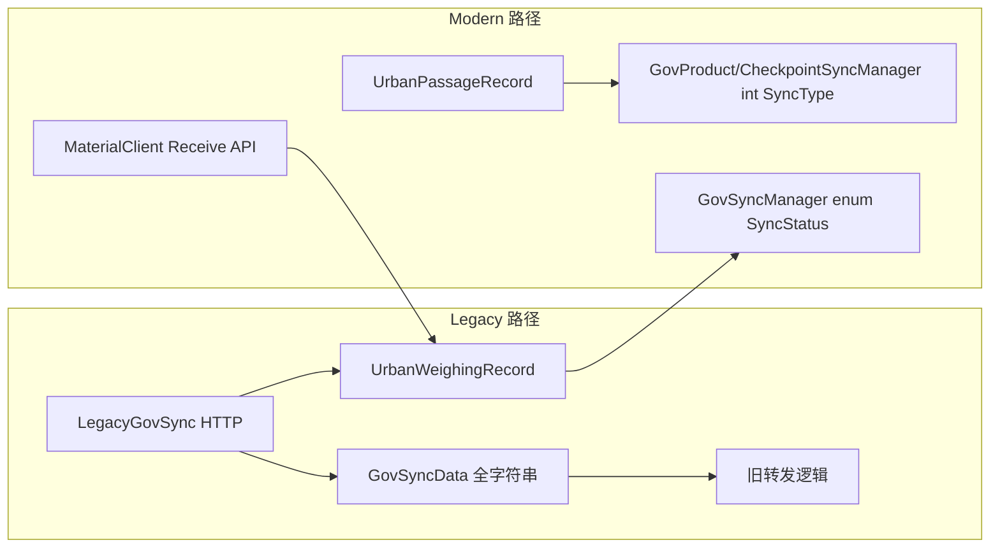

# 03 · 业务语义化缺口

## 1. 命名与概念映射混乱

### 1.1 接入码：`BuildLicenseNo` vs `AccessCode`

| 名称 | 使用处 | 语义 |
|------|--------|------|
| `AccessCode` | `GovProject` | 城管接入码（已重命名，注释明确） |
| `BuildLicenseNo` | `UrbanWeighingRecord`, `UrbanPassageRecord`, `GovSyncData` | 同一业务概念，legacy 名 |
| `FdBuildLicenseNo` | `GovProject` | BasePlatform 侧施工许可证号 |

接收 legacy 请求时，`LegacyGovSyncAppService` 将 `project.AccessCode` **写入** `BuildLicenseNo` 字段——存储名与权威语义源不一致。

**影响**：新人读 Entity 无法判断「接入码」应读哪个属性；OpenSpec / 接口文档需额外对照表。

### 1.2 项目标识类型分裂

```
GovProject.Id           → Guid（主键）
UrbanWeighingRecord.ProId → Guid?
UrbanPassageRecord.ProId  → Guid?
GovSyncData.ProId         → string?     ← 遗留
ClientOnlineStatus.ProId  → string       ← 非 Guid，max 64
ClientDeviceOnlineStatus.ProId → string
```

同一「项目」在不同表用 **Guid 与 string 两套标识**，Service 层需反复 `ToString()` / `Guid.Parse()` / `activeProjectIds.Contains(r.ProId.Value)`。

### 1.3 时间字段类型

| 字段 | 类型 | 问题 |
|------|------|------|
| `WeighingTime`, `CapturedAt` | `DateTime` | ✅ 正确 |
| `SnapTime`（GovSyncData） | `string?` | 需运行时 parse；与主实体不一致 |
| `GoodsWeight`（GovSyncData） | `string?` | 重量应为 `decimal`；主路径用 `TotalWeight decimal` |

## 2. 双轨数据模型：新 Entity vs 遗留 `GovSyncData`



`GovSyncData` 特征：

- 17 个属性中 16 个 nullable
- 车辆、重量、时间、项目 ID 全部为 `string?`
- `SourceData` 存整包 JSON 快照
- `SnapImages` 逗号分隔（已被 `AttachmentFile` 替代，但列仍存在）

这是 **典型的「传输 DTO 误当 Entity 持久化」** 反模式；与 `UrbanWeighingRecord` 形成冗余双写（Legacy 路径同时插入两者）。

## 3. 字符串枚举：丢失领域语言

### 3.1 称重 vs 通行：同一概念两种建模

| 概念 | UrbanWeighingRecord | UrbanPassageRecord |
|------|---------------------|-------------------|
| 站点类型 | `string? SiteType` | `UrbanSiteType UrbanSiteType` |
| 同步状态 | `SyncStatus? SyncType` | `int? SyncType` |

称重实体注释写「以 MaterialClient WeighingRecord 为蓝本」，通行实体已按 OpenSpec 引入 enum——**同一 Bounded Context 内建模标准不统一**。

### 3.2 设备状态：注释驱动型「枚举」

`ClientDeviceOnlineStatus` / `DeviceStatusLog`：

```csharp
public string DeviceType { get; set; } = string.Empty;  // e.g. "Scale", "Camera"
public string Status { get; set; } = string.Empty;      // e.g. "Online", "Offline"
```

注释给出示例值，但类型系统 **不约束** 合法取值；任意 typo 直接落库。

### 3.3 `ExtraProperties` 逃逸舱

`UrbanWeighingRecord` 实现 `IHasExtraProperties`：

- 结构化字段之外的数据进入 JSON 字典
- 无法在 Entity 层表达 invariant
- 查询、索引、同步映射无法覆盖 escape 数据

适合 **短期扩展**；长期积累会削弱「Entity 即领域模型」的目标。

## 4. 缺少领域行为（贫血模型倾向）

部分 Entity 已开始类型归属方法（符合 monospec `type-owned-methods` trait）：

| Entity | 方法 | 评价 |
|--------|------|------|
| `UrbanPassageRecord` | `FromCheckpointReceive`, `ApplyDuplicateReceive`, `ResetGovSync` | ✅ 工厂 + 状态重置 |
| `GovProject` | 仅构造函数 | 授权/同步开关无封装 |
| `UrbanWeighingRecord` | 无实例方法 | 状态变更全在 AppService |
| `GovSyncData` | 无 | 纯数据袋 |

`ResetGovSync` 仍写 `SyncType = 0` 而非 `SyncStatus.Pending`，说明 **行为方法与类型表达未同步演进**。

## 5. 可空性 vs 业务不变量冲突

以下不变量在 Service 层用 guard 弥补，Entity 类型未体现：

| 不变量 | 当前表达 | 理想表达 |
|--------|----------|----------|
| 新记录同步态为 Pending | 创建时赋 0 或 `SyncStatus.Pending` | `SyncStatus SyncType { get; private set; }` + 工厂 |
| 通行记录必有来源 | `PassageSource` non-nullable ✅ | — |
| 附件关联必有双方 ID | junction 表 non-nullable ✅ | — |
| 项目启用同步 | `EnableSync bool?` | `bool IsSyncEnabled` 默认 false |
| 称重 ClientRecordId 唯一 | DB 唯一索引 | ✅ 索引有，属性 non-nullable ✅ |

## 6. 与 MaterialClient 对齐差距（概念层）

依据 [`docs/2026-08-28-urban-passage-record/02-实体字段与接口映射.md`](../2026-08-28-urban-passage-record/02-实体字段与接口映射.md)：

- MaterialClient 已有 `UrbanInOutType` / `UrbanSiteType`（`XiaoshanUploadEnums.cs`）
- UrbanManagement 通行侧 **已对齐**
- 称重侧仍保留 `SiteType string?`，**未对齐**

Product  split 后（`docs/2026-08-28-standard-solidwaste-product-split/`），称重与通行应在 **同一 enum 词汇表** 下收敛，避免 Client/Server 各写各的 string。

## 7. 语义化成熟度评分（主观）

| Entity | 评分 | 说明 |
|--------|------|------|
| `AttachmentFile` | ⭐⭐⭐⭐ | 类型清晰、enum、必填明确 |
| `UrbanPassageRecord` | ⭐⭐⭐ | 业务 enum 好；SyncType 仍 int? |
| `UrbanWeighingRecord` | ⭐⭐ | 主实体但 string 字段多、Sync nullable |
| `GovProject` | ⭐⭐ | AccessCode 语义已修正；其余偏 nullable |
| `ClientOnlineStatus` | ⭐⭐ | 状态机字段合理；ProId 类型弱 |
| `GovSyncData` | ⭐ | 遗留弱类型，建议冻结或迁移 |
| `WorkSettingsEntity` | ⭐⭐⭐ | 小实体，nullable 合理（未跑过即为 null） |
