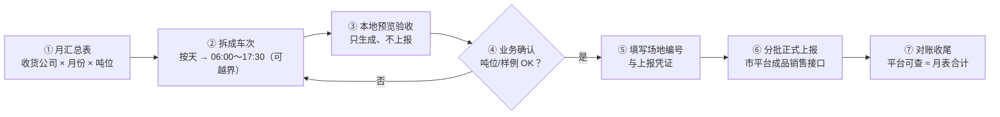
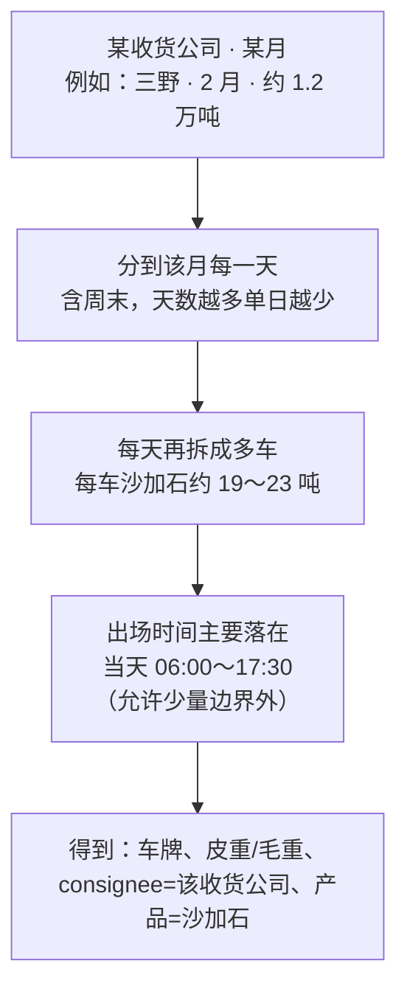
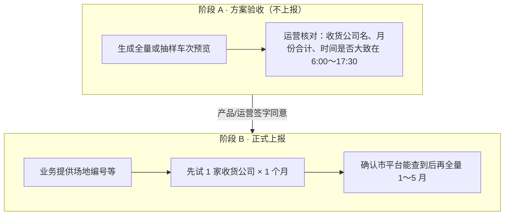
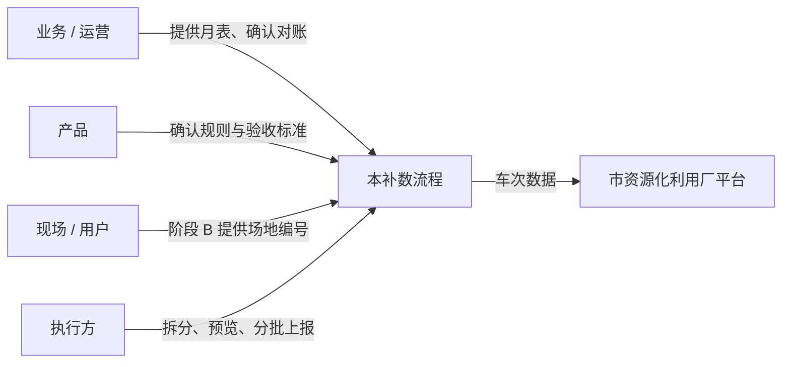

# 05 · 流程总览图（运营 / 产品）

> **读者**：运营、产品、业务对接人  
> **目的**：一眼看懂「月汇总吨位如何变成市平台上的一车车记录」，以及谁在什么节点确认。  
> **不涉及**：程序实现、接口字段表、鉴权细节（见 01–03）。

---

## 1. 一句话说明

把 **5 家收货公司 × 2026 年 1–5 月的沙加石月吨位表**，拆成约 **两万多条「成品销售车次」**，批量报到市资源化利用厂平台；**每月每家吨位合计与原表一致**。

---

## 2. 端到端主流程

| 步骤 | 做什么 | 谁参与 |
|------|--------|--------|
| ① | 确认月表数据无误（现有 5 家收货公司、1–5 月） | 业务提供 |
| ② | 系统按规则自动拆成「一车一条」 | 执行方 |
| ③ | 先产出预览结果，**不上真网** | 执行方 + 运营抽查 |
| ④ | 抽查几家收货公司、某月合计是否对得上 | **产品 / 运营拍板** |
| ⑤ | 提供市平台场地标识等正式上报所需信息 | **用户 / 现场** |
| ⑥ | 按批提交；可重跑（同一车次编号不会重复加账） | 执行方 |
| ⑦ | 对照月表总吨位做抽查闭环 | 运营 |

---

## 3. 「月吨位 → 车次」怎么拆（业务视角）

**业务约束（已确认）：**

| 项 | 约定 |
|----|------|
| 年份 | 2026 |
| 哪天可以出车 | 月内任意一天（含周末） |
| 几点出车 | 主窗口 **06:00～17:30**；**允许**少量落在边界外 |
| 产品名称 | 固定 **沙加石** |
| 收货公司 | 月表里的收货公司全名（`consignee`） |
| 一车多重 | 净重约 19～23 吨；皮重约 13～14.5 吨；毛重大约 33～37 吨 |
| 收货完成信息 | 本阶段**不上报**（地址、收货时间、收货照片等） |

**守恒承诺：**  
「腾满 × 1 月」拆出来的所有车次净重相加 = 表上该月吨位（允许 0.01 吨级四舍五入误差）。

---

## 4. 一车长什么样（给业务看的样例）

不必记字段英文名，理解即可：

| 业务含义 | 示例 |
|----------|------|
| 车次编号（幂等键） | 类似出厂单号，重传同一编号不重复记账 |
| 资源化厂场地 | 正式上报前由现场填写 |
| 车牌 | 模拟车牌 |
| 产品 | 沙加石 |
| 净重 / 皮重 / 毛重 | 落在上表吨位区间 |
| 出场时间 | 如 `2026-02-03 06:17:22` |
| 收货公司 | 如「杭州三野建材有限公司」 |
| 照片 | 统一用样例图（补数用途） |

---

## 5. 两阶段闸门（务必遵守）

| 阶段 | 可以做 | 不可以做 |
|------|--------|----------|
| A 验收 | 看预览、对吨位、改规则再生成 | 往市平台写数 |
| B 上报 | 真网上传、对账 | 未确认场地编号就全量开跑 |

---

## 6. 规模直觉（方便排期）

| 范围 | 大约车次数（按每车约 21 吨估） |
|------|--------------------------------|
| 一家收货公司 · 一个月 | 数千车 |
| 五家 · 一个月 | 约六千车 |
| **五家 · 1～5 月全表** | **约两万五千车** |
| 月表总吨位 | **约 51.8 万吨** |

上报会 **分多批** 提交（避免一次塞太多），中间可暂停、失败可续传。

---

## 7. 角色分工一览

---

## 8. 常见疑问（产品话术）

**Q：这是真实过磅数据吗？**  
A：不是。是按月汇总 **还原成车次形态** 的补数，用于平台侧有可查的销售车次；需在授权范围内使用。

**Q：会不会和已有真实车次冲突？**  
A：每车有独立车次编号；与现网出厂单号规则对齐，**同一编号重复提交不重复加账**。仍建议先小范围试跑观察。

**Q：出场时间是什么规则？**  
A：多数车次在 **06:00～17:30**；业务允许少量落在该窗口边界外（略早或略晚），不必全部挤在早高峰。

**Q：什么时候可以正式上报？**  
A：阶段 A 预览验收通过，**且**现场提供场地编号之后。

---

## 9. 相关文档（需要细节时再打开）

| 文档 | 适合谁 |
|------|--------|
| [00-调研总览](./00-调研总览.md) | 入口与范围 |
| [01](./01-数据源与目标接口.md)～[03](./03-字段Mock与提交策略.md) | 执行方 / 技术 |
| [04-开放问题与落地规模](./04-开放问题与落地规模.md) | 已锁定业务结论 Q1–Q8 |
