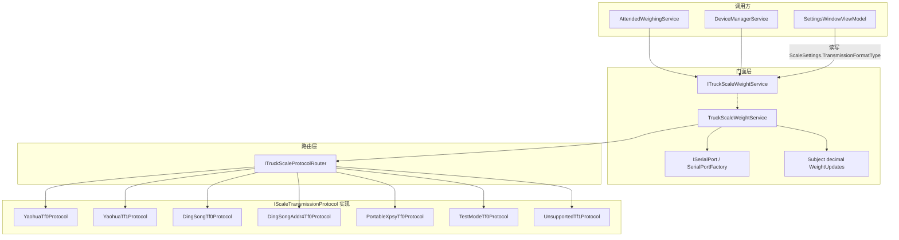
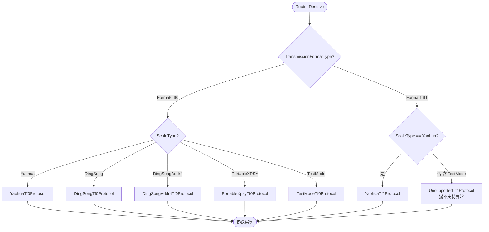
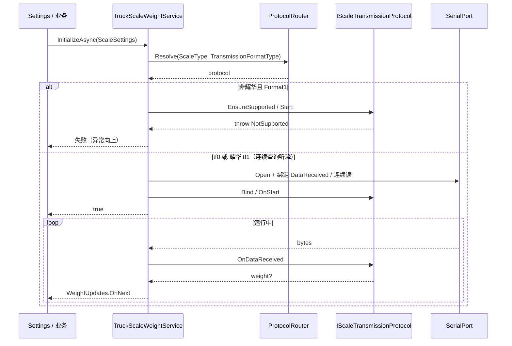

# 01 — 修改方案讨论

## 1. 问题陈述

当前生产路径只有一条「打开串口 → `DataReceived` → 按 ScaleType / ReceType 分支解析」的巨石实现。  
`CommunicationMethod`（字符串 TF0）在配置层存在，但**未成为协议选择的一等公民**，导致：

- 无法清晰表达「同一仪表、不同 tF」；
- 无法对「非耀华选 tf1」给出统一、可测试的「不支持」行为；
- Demo 已验证的耀华 tf0/tf1 知识无法安全下沉到生产服务。

## 2. 目标与非目标

### 目标

- 引入强类型 `TransmissionFormatType`。
- 每种 `ScaleType` 对 **tf0 / tf1** 都有明确代码入口（类型隔离或策略对象隔离）。
- 耀华：tf0（连续发送听流）+ tf1（**连续查询听流，不向设备发查询命令**）均可走真实实现。
- 其它设备：tf0 = 现有行为；tf1 = **明确不支持**。
- 保持 `ITruckScaleWeightService` 对外契约对称重业务尽量稳定（`WeightUpdates` / `InitializeAsync` 等），内部可替换。

### 非目标（本轮讨论建议砍掉或后置）

- 在生产 UI 一次做完毛重/皮重/净重记账（Demo 已覆盖对照；生产过磅公式另开 change）。
- 改 UrbanManagement / 上云报文。
- 为顶松 / XP-SY 发明未经验证的 tf1 帧格式。

## 3. 枚举草案

```csharp
namespace MaterialClient.Common.Entities.Enums;

/// <summary>
///     Instrument transmission format (耀华参数 tF 的上位机映射)。
/// </summary>
public enum TransmissionFormatType
{
    /// <summary>连续发送（tF=0）。</summary>
    [Description("(tF0)")]
    TransmissionFormatType0 = 0,

    /// <summary>Continuous query / listen (product tF1). Yaohua: no host query commands.</summary>
    [Description("(tF1)")]
    TransmissionFormatType1 = 1,
}
```

### 命名（已拍板）


| 项               | 约定                                                            |
| --------------- | ------------------------------------------------------------- |
| 类型名             | `TransmissionFormatType`（在 `TransmissionFormat` 后加 `Type` 后缀） |
| 成员              | `TransmissionFormatType0 = 0`、`TransmissionFormatType1 = 1`   |
| `[Description]` | `"(tF0)"`、`"(tF1)"`（UI / 下拉展示用）                               |
| 配置属性            | `ScaleSettings.TransmissionFormatType`                        |
| `using`         | `System.ComponentModel`（与 `ScaleType` 一致）                     |


调用处写 `TransmissionFormatType.TransmissionFormatType0`；设置页 ComboBox 绑定 Description 显示 `(tF0)` / `(tF1)`。

更多设备类型与 TF 方案（含 Type2/3 预留、柯力/Toledo 等候选）见 **[05-ScaleType与TF方案目录.md](05-ScaleType与TF方案目录.md)**。

## 4. 隔离模型（推荐）

### 4.1 策略矩阵（编译期齐全）

对每个 `ScaleType` 提供一对处理入口（不必 5×2=10 个公开类，但逻辑上必须齐全）：


| ScaleType     | tf0           | tf1                                        |
| ------------- | ------------- | ------------------------------------------ |
| Yaohua        | 现有连续发送听流（迁出） | **连续查询听流**（不发查询命令；**优先皮/毛/净，全无效降级旧稳定**；见 [06 §10.3.1](06-耀华tf1与连续模式是否足够.md)） |
| DingSong      | 现有 HEX 解析     | **NotSupported**                           |
| DingSongAddr4 | 现有 Addr4 解析   | **NotSupported**                           |
| PortableXPSY  | 现有 9 字节 ASCII | **NotSupported**                           |
| TestMode      | 模拟重量流         | **NotSupported**（与其它非耀华相同：UI 不可选 + 接口抛不支持） |


「为所有类型实现对应的 tf0 和 tf1 代码」在工程上落实为：

- **tf0**：各设备真实解析（从巨石迁出）。
- **tf1**：仅耀华真实实现（**连续查询，禁止写查询命令**）；**其余全部** `ScaleType`**（含 TestMode）** 走 `NotSupportedTransmissionHandler`。

这符合 `strategic-fallback`：**不得**用空列表 / 假成功布尔值糊弄。

### 4.2 结构草图（示意，非定稿 API）

更细的分层与时序见专页 **[04-结构与设计图.md](04-结构与设计图.md)**。下文为同页摘要。

#### 4.2.1 逻辑分层

```text
┌─────────────────────────────────────────────────────────────────┐
│ UI / 调用方                                                      │
│  SettingsWindow (ScaleType + TransmissionFormatType 选择项)          │
│  AttendedWeighingService / DeviceManager / SharedDeviceStatus…   │
└────────────────────────────┬────────────────────────────────────┘
                             │ 只依赖门面
                             ▼
┌─────────────────────────────────────────────────────────────────┐
│ ITruckScaleWeightService（门面，现有契约保持）                      │
│  WeightUpdates / IsOnline / InitializeAsync / Close / Restart…   │
│  持有：SerialPort、锁、Weight Subject、当前 ScaleSettings          │
└────────────────────────────┬────────────────────────────────────┘
                             │ Resolve(scaleType, format)
                             ▼
┌─────────────────────────────────────────────────────────────────┐
│ ITruckScaleProtocolRouter                                        │
│  输入：ScaleType × TransmissionFormatType                            │
│  输出：IScaleTransmissionProtocol                                │
└────────────────────────────┬────────────────────────────────────┘
                             │
        ┌────────────────────┼────────────────────┐
        ▼                    ▼                    ▼
┌───────────────┐  ┌─────────────────┐  ┌──────────────────────────┐
│ *Tf0Protocol  │  │ YaohuaTf1Protocol│  │ UnsupportedTf1Protocol   │
│ 各 ScaleType  │  │ 连续查询听流     │  │ 非耀华含 TestMode 共享    │
│ 真实帧解析    │  │ 不发查询命令     │  │ 调用即抛「不支持」        │
└───────────────┘  └─────────────────┘  └──────────────────────────┘
```

#### 4.2.2 组件关系（Mermaid）




#### 4.2.3 路由决策（ScaleType × TransmissionFormatType）




#### 4.2.4 Initialize / 收数时序（摘要）




#### 4.2.5 职责边界


| 组件                           | 负责                                                  | 不负责                              |
| ---------------------------- | --------------------------------------------------- | -------------------------------- |
| `ITruckScaleWeightService`   | 串口开闭、锁、Subject、对外 API、选协议                           | 具体帧字节解析                          |
| `ITruckScaleProtocolRouter`  | `(ScaleType, TransmissionFormatType) → 协议`          | I/O、UI                           |
| `IScaleTransmissionProtocol` | 帧解析 / Supports / 不支持则抛；生产 Type1 **不**写查询命令 | 持有长期 SerialPort 生命周期（建议由门面注入上下文） |
| Settings UI                  | ScaleType 下拉 + TransmissionFormatType 选择项；非耀华隐藏 tf1 | 直接 new 协议类                       |


- **门面**保留现有 `ITruckScaleWeightService`，避免立刻打碎调用方。
- **协议对象**只关心帧与重量；串口开闭、锁、Subject 由门面持有。
- DI：协议可用无状态类型 + 工厂（遵守 `minimal-di`：纯解析不硬注册 Transient）。
- 类型名均为示意；OpenSpec / 实现时可微调，但分层与矩阵不得缩水。

### 4.3 非耀华（含 TestMode）选 tf1 — 已拍板


| 层        | 行为                                                                                                                          |
| -------- | --------------------------------------------------------------------------------------------------------------------------- |
| **UI**   | `ScaleType != Yaohua` 时，通讯方式选择项**不出现 / 禁用** `TransmissionFormatType1`（`(tF1)`），用户无法选择                                       |
| **协议接口** | 非耀华 × tf1 仍解析到 `IScaleTransmissionProtocol`（共享 NotSupported 实现）；调用时**抛「不支持」异常**，元数据含 `ScaleType` + `TransmissionFormatType` |
| **禁止**   | 返回 false 却假装在线、返回 0 重量、空流冒充成功                                                                                               |


说明：UI 防误选；接口防改 JSON / 绕过 UI。`InitializeAsync` 遇到该组合应失败并向上抛出或包装同一「不支持」异常（与协议一致），不必再单开「只返回 false 不抛」路径。

首 Phase 迁出巨石时仍可用功能开关回退旧类（strategic-fallback Pattern A），与上表不冲突。

## 5. 配置迁移

**已拍板：停用旧字段，只用新枚举；默认 tf0；不使用旧字段值。**

```csharp
// 删除 CommunicationMethod
public TransmissionFormatType TransmissionFormatType { get; set; }
    = TransmissionFormatType.TransmissionFormatType0;
```


| 议题                              | 结论                                                                                                           |
| ------------------------------- | ------------------------------------------------------------------------------------------------------------ |
| 旧 JSON 中的 `CommunicationMethod` | 反序列化时忽略；**不**映射进枚举                                                                                           |
| 缺省 / 仅旧键                        | 得到默认 `TransmissionFormatType0`                                                                               |
| 设置页                             | **通讯方式 = ComboBox 选择项**，绑定 `TransmissionFormatType`，展示 `(tF0)`/`(tF1)`；删除 `ScaleCommunicationMethod` TextBox |
| 详文                              | [03-旧通讯方式与枚举兼容.md](03-旧通讯方式与枚举兼容.md)                                                                         |


## 6. 与 Demo / 文档的关系


| 资产                | 角色                                   |
| ----------------- | ------------------------------------ |
| Demo tf0 / tf1 窗口 | Demo tf1 为**指令应答**对照；**生产 Type1 不跟写指令模型**（见 [06 §10](06-耀华tf1与连续模式是否足够.md)） |
| `docs/Device/耀华…` | 手册经典 tF=1 ≠ 生产 Type1；生产以连续查询约定为准 |
| 本夹                | 重构范围与矩阵；不替代 OpenSpec                 |


## 7. 分阶段（贴合 Mode B + strategic-fallback）

基线分支：`dev-truck-scale-weight`。


| Phase | 内容                                       | 基线保护      |
| ----- | ---------------------------------------- | --------- |
| Δ1    | 引入枚举；Router + 各设备 **tf0** 迁出；默认功能开关可回退旧类 | Pattern A |
| Δ2    | 耀华 **tf1 连续查询**（不发查询命令）+ 皮毛净优先/稳定降级；设置页可选 tf1 | 仅耀华；勿拷 Demo 写指令；实时流保持 |
| Δ3    | 删除开关与旧巨石路径；测试补齐                          | Promote 前 |


若 Δ2 连续查询帧语义 / 地址过滤事实未齐：按 strategic-fallback **显式挂起** Yaohua tf1，不得假实现，也不得改回写指令轮询冒充。

## 8. 对调用方的影响


| 调用方                                                  | 预期                                                                     |
| ---------------------------------------------------- | ---------------------------------------------------------------------- |
| `AttendedWeighingService`                            | 仍依赖 `ITruckScaleWeightService`； ideally 无感                             |
| `DeviceManagerService` / `SharedDeviceStatusTracker` | 同上                                                                     |
| `SettingsWindowViewModel`                            | **删除** `ScaleCommunicationMethod`；通讯方式改为选择项绑定 `TransmissionFormatType` |
| 测试 `WeightScaleRxTests` 等                            | mock 接口不变；补 Router / 协议单测                                              |


## 9. 开放问题（Decision Needed）

1. ~~枚举命名~~ → **已定**：类型名 `TransmissionFormatType`；成员 `TransmissionFormatType0` / `TransmissionFormatType1`，Description `(tF0)` / `(tF1)`。更多方案见 [05](05-ScaleType与TF方案目录.md)。
2. ~~非耀华选 tf1~~ → **已定**：**UI 不让选** + **协议接口抛「不支持」异常**；**TestMode 同样不支持 tf1**（见 §4.3）。
3. `CommunicationMethod` → **已定**：停用旧字段；只用枚举，默认 tf0，不读旧值（见 [03](03-旧通讯方式与枚举兼容.md)）。
4. ~~TestMode 伪 tf1~~ → **已定**：**不支持**（与其它非耀华相同）。
5. 首个 OpenSpec change 名称是否 `refactor-truck-scale-transmission-format`，且写明 `dev-truck-scale-weight`？
6. Yaohua tf1 是否本轮就必须进生产，还是 Δ1 只做隔离 + tf0？

请在确认 5–6 后进入 `/opsx:propose`。