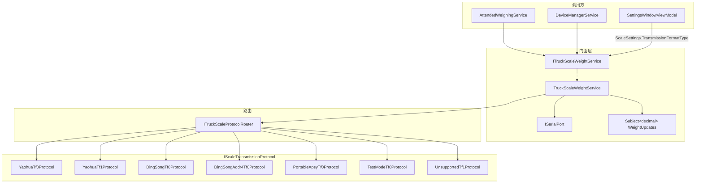
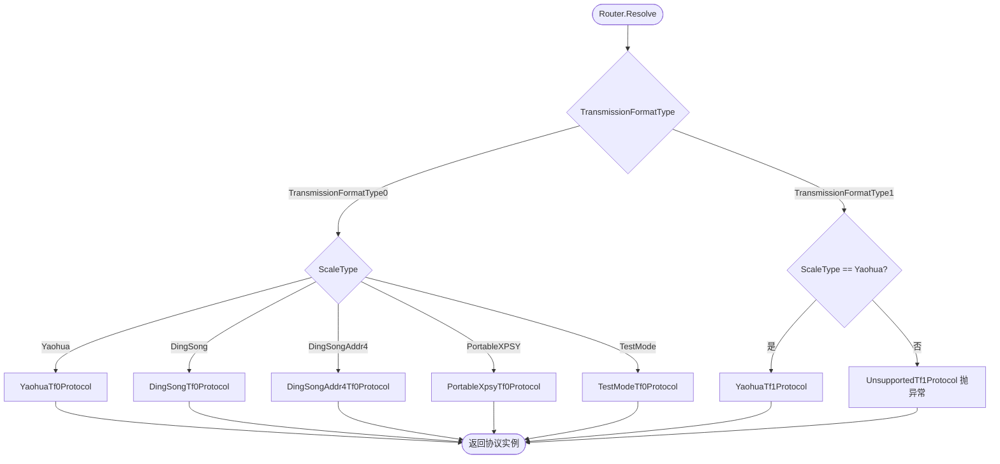
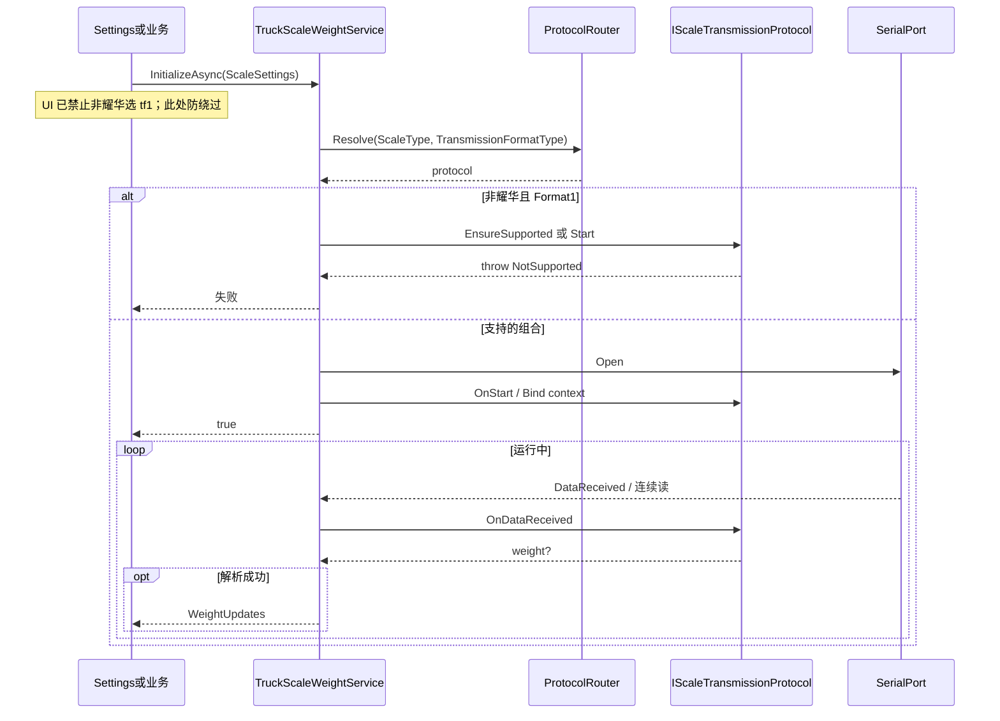
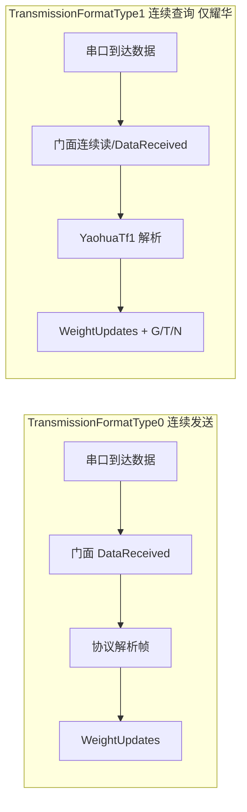
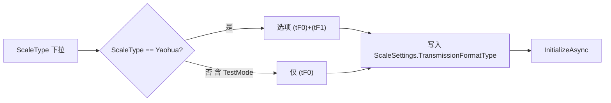

# 04 — 结构与设计图

配套 [01-修改方案讨论.md](01-修改方案讨论.md) §4。类型名为示意，非最终 C# 定稿。

## 1. 目标结构一览

```text
调用方 ──► ITruckScaleWeightService（门面）
                │
                ├─ SerialPort / 锁 / WeightUpdates Subject / ScaleSettings
                │
                └─ ITruckScaleProtocolRouter
                        │
                        └─ IScaleTransmissionProtocol
                               ├─ 各 ScaleType 的 Tf0 真实协议
                               ├─ Yaohua Tf1 真实协议
                               └─ UnsupportedTf1（非耀华含 TestMode，抛异常）
```

## 2. 逻辑分层（ASCII）

```text
┌─────────────────────────────────────────────────────────────────┐
│ UI / 调用方                                                      │
│  SettingsWindow：ScaleType + TransmissionFormatType（选择项）         │
│  AttendedWeighingService / DeviceManager / SharedDeviceStatus…   │
└────────────────────────────┬────────────────────────────────────┘
                             │ 只依赖门面
                             ▼
┌─────────────────────────────────────────────────────────────────┐
│ ITruckScaleWeightService                                         │
│  WeightUpdates / IsOnline / InitializeAsync / Close / Restart…   │
│  持有：ISerialPort、ReaderWriterLock、Subject、当前 ScaleSettings │
└────────────────────────────┬────────────────────────────────────┘
                             │ Resolve(scaleType, format)
                             ▼
┌─────────────────────────────────────────────────────────────────┐
│ ITruckScaleProtocolRouter                                        │
└────────────────────────────┬────────────────────────────────────┘
                             │
        ┌────────────────────┼────────────────────┐
        ▼                    ▼                    ▼
┌───────────────┐  ┌─────────────────┐  ┌──────────────────────────┐
│ *Tf0Protocol  │  │ YaohuaTf1Protocol│  │ UnsupportedTf1Protocol   │
│ 五类 ScaleType│  │ 仅耀华           │  │ 共享；调用抛不支持        │
└───────────────┘  └─────────────────┘  └──────────────────────────┘
```

## 3. 组件依赖（Mermaid）



## 4. 路由矩阵图



| ScaleType | Format0 | Format1 |
|-----------|---------|---------|
| Yaohua | YaohuaTf0Protocol | YaohuaTf1Protocol |
| DingSong | DingSongTf0Protocol | UnsupportedTf1Protocol |
| DingSongAddr4 | DingSongAddr4Tf0Protocol | UnsupportedTf1Protocol |
| PortableXPSY | PortableXpsyTf0Protocol | UnsupportedTf1Protocol |
| TestMode | TestModeTf0Protocol | UnsupportedTf1Protocol |

**不必** 5×2 个独立业务类；Format1 非耀华共用一个 Unsupported 实现即可，但 Router **必须**对每种组合有确定结果。

## 5. Initialize 与收数时序



### tf0 vs tf1 数据路径差异（生产耀华）



> 生产 Type1 **禁止**「定时写指令 → 读应答」路径（Demo/手册经典 tF=1）。见 [06 §10](06-耀华tf1与连续模式是否足够.md)。
> 重量优先用连续查询的皮/毛/净；全无效时降级旧稳定模式（仍有实时重量流）。

## 6. 建议的接口草图（仍非定稿）

```csharp
public interface IScaleTransmissionProtocol
{
    bool Supports(ScaleType scaleType, TransmissionFormatType format);

    /// <summary>不支持时 MUST throw（含元数据），禁止假成功。</summary>
    void EnsureSupported(ScaleType scaleType, TransmissionFormatType format);

    // Type0 / 生产耀华 Type1：均由门面在 DataReceived（或等价连续读）中喂字节
    void OnDataReceived(ScaleProtocolContext context, byte[] buffer, int count);

    // 可选扩展；生产耀华 Type1 MUST NOT 用此方法向设备写查询命令
    // 非耀华 Type1：EnsureSupported 失败
    Task PollAsync(ScaleProtocolContext context, CancellationToken cancellationToken);
}

public interface ITruckScaleProtocolRouter
{
    IScaleTransmissionProtocol Resolve(ScaleType scaleType, TransmissionFormatType format);
}
```

`ScaleProtocolContext`（示意）：只读当前 `ScaleSettings`、写重量回调；写串口委托**不得**用于生产耀华 Type1 查询——**避免协议类直接拥有 SerialPort 单例生命周期**。

## 7. UI 与配置流



## 8. 职责边界速查

| 组件 | 负责 | 不负责 |
|------|------|--------|
| 门面 `ITruckScaleWeightService` | 串口生命周期、锁、Subject、对外 API | 具体帧格式细节 |
| Router | 组合键解析到协议实例 | I/O、UI |
| 各 `*Tf0Protocol` | 迁出的现网解析 | 开串口 |
| `YaohuaTf1Protocol` | 连续查询听流（不发查询命令） | Demo 写指令模型；非耀华逻辑 |
| `UnsupportedTf1Protocol` | 抛不支持 | 任何“成功”返回 |
| Settings UI | 选择项；非耀华不可选 tf1 | new 协议类 |
