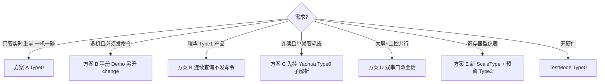

# 05 — ScaleType × TransmissionFormatType 方案目录

本文提供**更多设备类型与传输格式方案**对照；Phase 1 仍只落地现有 5 个 `ScaleType` + `TransmissionFormatType0/1`。候选项默认 **Out of Scope**，进枚举前须另开 change。

相关命名：枚举类型 **`TransmissionFormatType`**（`TransmissionFormat` + `Type` 后缀）。

## 1. TransmissionFormatType（权威草案）

```csharp
namespace MaterialClient.Common.Entities.Enums;

/// <summary>
///     Instrument transmission format type（耀华参数 tF 的上位机映射）。
/// </summary>
public enum TransmissionFormatType
{
    /// <summary>连续发送（tF=0）。</summary>
    [Description("(tF0)")]
    TransmissionFormatType0 = 0,

    /// <summary>连续查询听流（生产 tF1；耀华不向设备发查询命令）。</summary>
    [Description("(tF1)")]
    TransmissionFormatType1 = 1,

    // —— 以下为方案预留，Phase 1 不进生产枚举；需要时再启用 ——
    // [Description("(tF2)")] TransmissionFormatType2 = 2, // 拓展连续帧 / 多重量打包
    // [Description("(tF3)")] TransmissionFormatType3 = 3, // Modbus / RTU 类主从
}
```

| 成员 | Description | 语义 | Phase 1 |
|------|-------------|------|---------|
| `TransmissionFormatType0` | `(tF0)` | 连续发送：仪表主动推流，上位机只听 | **落地** |
| `TransmissionFormatType1` | `(tF1)` | 连续查询听流（生产耀华：**不**向设备发查询命令） | 真实现仅耀华；≠ Demo 指令轮询 |
| Type2（预留） | `(tF2)` | 拓展连续帧（单帧含毛/皮等，仍属“听”） | 方案；可先挂在 Yaohua Type0 子解析，不必立刻加枚举 |
| Type3（预留） | `(tF3)` | Modbus/RTU 或其它工业总线主从 | 方案；新品牌常见，与耀华 tF 不是同一物理参数 |

属性建议：

```csharp
public TransmissionFormatType TransmissionFormatType { get; set; }
    = TransmissionFormatType.TransmissionFormatType0;
```

调用：`TransmissionFormatType.TransmissionFormatType0`。

## 2. TF 方案谱系（不止 0/1）

| 方案 ID | 上位机角色 | 典型帧 | 适用场景 | 与现网关系 |
|---------|------------|--------|----------|------------|
| **A. Continuous / tF0** | 被动收 | 固定短帧循环 | 一机一磅、实时大屏 | 现网主流；`Type0` |
| **B. Continuous query / 生产 tF1** | 连续读串口解析 | 听流 + 可选地址过滤 | 耀华 Type1 产品形态 | **不发查询命令**；见 [06 §10](06-耀华tf1与连续模式是否足够.md) |
| **B'. Command / 手册·Demo tF1** | 主动问 | 写指令 → 读应答 | Demo / 经典仪表 tF=1 | **非**生产 Type1 |
| **C. Extended continuous** | 被动收 | 更长帧（毛+皮等同包） | 要仪表侧重量分量、仍想连续 | 属 Type0 **变体**或预留 Type2 |
| **D. Dual-port** | 双通道 | 口1 Continuous + 口2 Command | 大屏 + 工控同时要 | **部署方案**，不是第三枚举值；软件可开两个门面会话 |
| **E. Modbus/RTU** | 主站轮询 | 功能码 + 寄存器 | 柯力/部分进口仪表 | 预留 Type3；新 `ScaleType` 再绑 |
| **F. Simulate** | 无真实串口 | 定时假重量 | 联调 / 无仪表 | `ScaleType.TestMode` × Type0 |

### 方案选择决策树



## 3. 现有 ScaleType（Phase 1 必须齐全）

| ScaleType | Description | Type0 | Type1 | 帧/协议要点 |
|-----------|-------------|-------|-------|-------------|
| `Yaohua` | 耀华 | **真实现**（连续发送听流） | **真实现（连续查询听流；不发查询命令）** | 优先皮/毛/净，全无效降级旧稳定；见 [06 §10.3.1](06-耀华tf1与连续模式是否足够.md) |
| `DingSong` | 顶松 | **真实现**（HEX） | Unsupported 抛异常 | 无官方 tF1；UI 不可选 Type1 |
| `DingSongAddr4` | 顶松Addr4 | **真实现**（Addr4） | Unsupported | 同上 |
| `PortableXPSY` | 便携式XP-SY | **真实现**（9 字节 ASCII） | Unsupported | 同上 |
| `TestMode` | 测试模式 | **模拟流** | Unsupported | 与非耀华相同：UI 不可选 + 抛异常 |

完整矩阵图见 [04](04-结构与设计图.md)。

## 4. 候选 ScaleType（更多方案，未进枚举）

下列仅作**方案目录**；加入 `ScaleType` 前须有现场帧样例 + OpenSpec change。默认假设：新类型先做 Type0，Type1/Type3 另证。

| 候选名（示意） | 常见场景 | 建议首 TF | Type1/其它 | 备注 |
|----------------|----------|-----------|------------|------|
| `Keli` / 柯力 | 工地地磅常见 | Type0 连续或 Type3 Modbus | 视型号 | 勿用耀华指令集硬套 |
| `Toledo` / 梅特勒 | 进口仪表 | 型号专有连续/命令 | 常为专有协议 | 独立 `ScaleType` + 专协议类 |
| `Unipulse` | 日系指示器 | 连续 / 命令分型号 | — | 独立协议 |
| `Rongda` / 其它国产 | 杂牌 OEM | 先抓 Type0 样帧 | 默认 Unsupported Type1 | 有样帧再开 |
| `YaohuaDs3` / 子型号 | 耀华数字传感器口 | 可能仍映射 `Yaohua` | 共用 tF 或单独子类型 | 优先**不要**膨胀枚举；用配置区分型号 |
| `GenericContinuousAscii` | 未知但类 9 字节 ASCII | Type0 | Unsupported | 谨慎：易误解析 |

### 候选接入模板（工程约定）

```text
新 ScaleType = X
  ├─ 必做：X × TransmissionFormatType0 真协议（或明确 NotSupported 若无连续）
  ├─ 必做：X × TransmissionFormatType1 → UnsupportedTf1Protocol（除非有手册+样例）
  ├─ UI：非证明支持的 TF 选项不出现
  └─ Router：组合键必须有确定实现，禁止落回「隐式共用解析」
```

## 5. ScaleType × TF 扩展矩阵（Phase 1 + 方案预留）

| ScaleType \ TF | Type0 `(tF0)` | Type1 `(tF1)` | Type2 拓展连续（预留） | Type3 Modbus（预留） |
|----------------|---------------|---------------|------------------------|----------------------|
| Yaohua | ✅ Phase1 | ✅ Phase1 | ◎ 可挂 Type0 子解析 | ❌ 非耀华路径 |
| DingSong | ✅ Phase1 | ❌ Unsupported | — | ◎ 若现场是寄存器再开 |
| DingSongAddr4 | ✅ Phase1 | ❌ | — | — |
| PortableXPSY | ✅ Phase1 | ❌ | — | — |
| TestMode | ✅ 模拟 | ❌ | — | — |
| 候选 Keli 等 | ◎ 新 change | ❌ 默认 | — | ◎ 视型号 |

图例：✅ 本轮要落地 · ❌ 抛不支持 / UI 不可选 · ◎ 方案预留 · — 不规划

## 6. 部署级组合（非枚举值）

| 组合 | 配置形态 | 说明 |
|------|----------|------|
| 单口 Type0 | 一个 `ScaleSettings`，`Type0` | 默认推荐 |
| 单口 Type1 | 耀华 + `Type1` | 连续查询听流 + 皮毛净优先/稳定降级；`CommunicationParameter`（默认 A）；**不发查询命令** |
| 双口 A+B | 两套串口会话（或两实例） | 大屏 Continuous + 工控 Command；见方案 D |
| TestMode 联调 | `TestMode` + `Type0` | 无硬件 |

## 7. 与命名 / 配置的关系

| 项 | 约定 |
|----|------|
| 枚举类型名 | `TransmissionFormatType` |
| 成员 | `TransmissionFormatType0` / `TransmissionFormatType1` |
| 配置属性 | `ScaleSettings.TransmissionFormatType` |
| 旧 `CommunicationMethod` | 停用，见 [03](03-旧通讯方式与枚举兼容.md) |
| 预留 Type2/3 | **不要**提前写进生产枚举，除非 proposal 明确启用 |

## 8. 小结

- **更多 TF 方案**：A–F 谱系 + Type2/3 预留；Phase 1 只认 Type0/Type1。
- **更多 ScaleType**：现网 5 类齐全；柯力/Toledo 等仅目录模板，进枚举另开 change。
- **隔离不缩水**：任一已进枚举的 `ScaleType` 对每个已进枚举的 `TransmissionFormatType` 都有 Router 确定结果。
