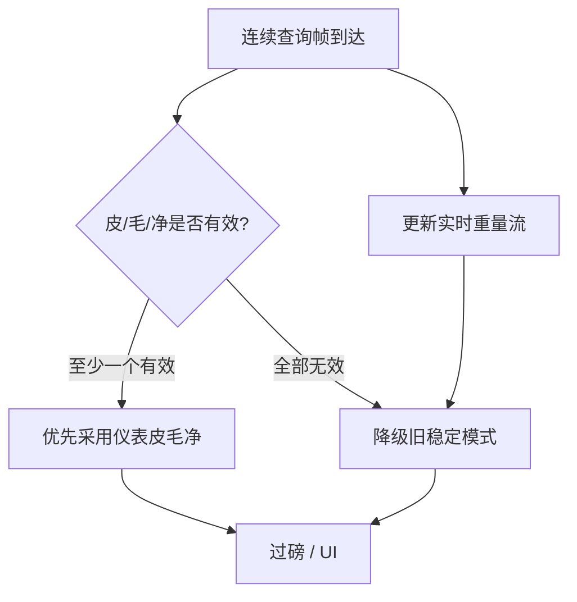

# 06 — 耀华是否「只用连续模式（tf0）就够」讨论

日期：2026-09-15  
状态：生产 Type1 形态**已拍板**（连续查询、不发查询命令）；Δ2 实现时机另定  
关联：Phase 1 已合入 `dev-truck-scale-weight`（枚举 + 目录隔离 + Type0；Type1 含耀华仍 Unsupported）

## 1. 问题

下一 Phase（Δ2）是否落地生产路径的 **耀华 `TransmissionFormatType1`**？  
生产约定已定：**连续查询听流**，**不**靠客户端向设备发查询命令（≠ Demo/手册「写指令应答」）。  
对照问题：现网是否仅 Type0 即可，Type1 只留枚举 + Demo 对照？

## 2. 两种模式在业务上差什么（生产约定）

> **已拍板（生产耀华 Type1）**：**连续查询模式** — 上位机**持续读串口 / 连续解析到达数据**，**不向仪表发送查询命令**。  
> 手册/Demo 里的「上位机写指令、仪表应答」属于 **经典仪表 tF=1 / Demo**，**不是**本产品生产 `TransmissionFormatType1` 的实现方式。详文见 **§10**。

| 维度 | 连续发送 tF0（Type0） | 连续查询 Type1（生产耀华） |
|------|----------------------|---------------------------|
| 谁主动推流 | 仪表持续广播 | 仍听串口到达数据（连续查询读流） |
| 上位机角色 | 只听、解析、稳定判定 | **连续查询读流**、解析；**禁止**向设备写查询/控制指令帧 |
| 是否写串口问数 | 否 | **否**（与 Demo `Build`+写端口轮询相反） |
| `CommunicationParameter` | 可忽略（重置默认仍可存 `A`） | 实现方可用于地址过滤等（默认 `A`）；**不是**发命令用的站号轮询 |
| 毛皮净 | 二次过磅 / 状态位 / 拓展帧 + 软件记账 | **优先**连续查询帧内皮/毛/净；全无效则降级旧稳定模式 |
| 与手册经典 tF=1 | — | Demo 可保留对照；生产路径不跟 Demo 写指令模型 |

权威依据（推荐连续听流做过磅）：`docs/Device/耀华地磅仪表_tF模式与全功能重量获取分析报告.md`。

## 3. MaterialClient 现网实际在用什么

| 事实 | 含义 |
|------|------|
| Phase 1 生产路径只有各 ScaleType 的 **Type0** | 耀华走 `YaohuaTf0Protocol` 连续帧 |
| 设置页本 Phase **不开放** `(tF1)` | 现场不会误切到未实现模式 |
| Demo 有 `YaohuaTf0` / `YaohuaTf1` 窗口 | 仅对照与验收知识，**不等于**生产必须双模式 |
| 有人值守 / Urban 工控 | 依赖 `WeightUpdates` 连续流 + 稳定窗口，与 **听流** 模型一致 |

结论：**当前产品闭环（实时重量 → 稳定 → 过磅记账）与连续模式同构**；并不依赖「问一句答一句」才能完成过磅。

## 4. 「只用连续模式」是否够用？

### 4.1 对 MaterialClient 主路径：**通常够用**

在以下假设成立时，**不必上生产 Yaohua tf1**：

1. **一机一磅**（或一串口只接一台耀华）。
2. 需要的是 **实时重量流** + 软件侧稳定判定 / 二次过磅（毛→皮→净）。
3. 不要求上位机通过串口对仪表做 **按地址轮询多机**、或强依赖仪表侧指令集完成去皮/清零（面板键或现有业务流程已够）。
4. 若需单帧毛皮：优先评估 **tF0 拓展帧**（仍是连续，属 Type0 子解析或预留 Type2），而不是先上 tF=1。

这与设备报告「方案一」一致，也与现网 Phase 1 实现一致。

### 4.2 什么时候连续模式不够、才值得做 tf1

任一现场需求出现时，再开 Phase / change 实现 `YaohuaTf1Protocol`：

| 触发条件 | 说明 |
|----------|------|
| 多台仪表挂同一总线 | 必须按 `Adr` 轮询，连续广播会互相干扰或无法区分 |
| 对接 PLC / 第三方只认问答 | 对方协议栈是 Master 轮询 |
| 合同/验收明确要求仪表 tF=1 | 合规或甲方仪表参数已锁死为 tF=1 |
| 必须用指令读特定寄存器式重量分量 | 且拓展帧 / 二次过磅都不可用 |

未出现上表时：**实现生产 tf1 = 纯成本与风险，无产品增量。**

## 5. 与枚举 / 架构的关系（不要误删 Type1）

即使决定「生产长期只用连续」：

| 项 | 建议 |
|----|------|
| `TransmissionFormatType1` 枚举 | **保留**（矩阵齐全；非耀华 / 未实现仍 Unsupported） |
| UI | 可继续 **不开放** Type1；或仅在有现场需求的版本对耀华开放 |
| `YaohuaTf1Protocol` 生产类 | **可无限期推迟**；Demo 保留即可 |
| Router | 维持 Phase 1：任意 Type1 → Unsupported（含耀华）直到真有实现 |
| 文档话术 | 从「下一 Phase 必做耀华 tf1」改为「**按需**；默认连续足够」 |

这不违反 `ScaleType × TransmissionFormatType` 隔离：入口在，真协议可空着（显式不支持，禁止假重量）。

## 6. 方案对比（决策用）

| 方案 | 内容 | 优点 | 代价 |
|------|------|------|------|
| **A. 默认连续即可（推荐）** | 生产只保障 Type0；耀华 tf1 不排期，除非触发 §4.2 | 省实现与回归；与现网/设备报告一致 | Demo tf1 与枚举「看起来有、生产没有」需文档说清 |
| B. 仍排期生产 tf1 | 下一 Phase 做 `YaohuaTf1Protocol` + 耀华可选 UI | 能力完整、Demo 可下沉 | L 档增量；无现场需求时浪费 |
| C. 取消 Type1 枚举 | 删成员，只留 Type0 | 表面简单 | **破坏**已合入矩阵与配置形状；不推荐 |

## 7. 建议结论（供拍板）

1. **对 MaterialClient 主过磅场景：耀华使用连续模式（tf0）就可以了。**  
2. **不要为了「对称完整」强行做生产 tf1**；等 §4.2 触发条件再 propose。  
3. **保留** `TransmissionFormatType1` + Unsupported 路径 + Demo；OpenSpec / 路线图把「耀华 tf1」标为 **On-demand / Out-of-Scope until needed**。  
4. 若毛皮净体验不足：优先挖 **Type0 拓展帧 / 状态位**（见设备报告方案二），而不是先上 tf1。

## 8. 开放问题

1. ~~问题：下一 Phase 是否做生产指令式 tf1~~ → **已定**：生产 Type1 = **连续查询、不发查询命令**（§2 / §10）；Demo 指令模式仅对照。
2. Demo tf1（写指令）是否继续维护为手册级对照，还是仅归档样例？
3. 拍板后是否同步 OpenSpec / `TransmissionFormatType` 注释与 UI 文案？

## 9. 通用通讯参数槽：不透明值，由实现方解析（已确认方向）

### 9.1 目标

挂在地磅配置上的是 **ScaleType 级通用通讯参数槽**（属性名不绑「地址」），对该类型下 **任意 `TransmissionFormatType`** 可见。

> 配置属性命名用 **通用名** `CommunicationParameter`（勿用 `CommunicationAddress` / `Adr`）。  
> 值在配置层为 **任意性（不透明）**；解析、校验、线缆映射一律由协议实现方负责。

### 9.2 命名与存储形状

仍在 **`ScaleSettings`**，与 SerialPort / BaudRate / TransmissionFormatType 同级。

```csharp
/// <summary>
///     Opaque communication parameter for the selected ScaleType.
///     Reset whenever TransmissionFormatType changes (see §9.3).
///     Semantics/parsing owned by protocol implementation.
/// </summary>
public string? CommunicationParameter { get; set; }
```

| 项 | 约定 |
|----|------|
| **属性名** | **`CommunicationParameter`** |
| 配置类型 | 不透明 `string?`（推荐） |
| 谁读 | `ScaleProtocolContext.Settings.CommunicationParameter` |
| 谁解析 | 协议 type-owned（配置层 / 门面不解析） |
| UI 文案 | 可按 ScaleType 显示「通讯地址」等，**属性名保持通用** |
| JSON | `"CommunicationParameter": "…"` |

### 9.3 切换 TF 时重置（已拍板）

**每次切换 `TransmissionFormatType` 时，必须重置 `CommunicationParameter`。**

| 项 | 约定 |
|----|------|
| 触发 | 设置页变更通讯方式（tf0 ↔ tf1 等） |
| 行为 | **丢弃旧值**，写入 **当前 ScaleType × 新 TF** 的默认值 |
| 原因 | 不同 TF 对槽位语义可能不同，避免串用误解析 |
| 落点 | Settings ViewModel（TF 变更时）优先重置；协议侧仍最终解析 |

```text
On TransmissionFormatType changed:
  CommunicationParameter := DefaultFor(ScaleType, newFormat)
```

（建议：切换 `ScaleType` 时同样重置为新类型 × 当前 TF 的默认；本拍板至少覆盖 **切 TF**。）

### 9.4 耀华默认：地址枚举，默认 A（已拍板）

对 **`ScaleType.Yaohua`**，实现方把 `CommunicationParameter` **解释为通讯地址**；UI / 默认按 **地址枚举** 投影。

| 项 | 约定 |
|----|------|
| 投影 | 地址枚举 **`A`…`Z`**（对齐 Demo / 仪表 Adr 1..26） |
| **默认** | **`A`** |
| 写入槽 | 切 TF 重置或缺省时：`CommunicationParameter = "A"` |
| 各 TF | 耀华下切到 **tf0 或 tf1** 重置后都回到 **`A`**；tf0 协议可忽略该值，槽内仍保留默认便于再切回 tf1 |
| 解析 | 实现方 `TryParse`；失败则抛错，禁止假成功 |

```text
Yaohua + 切 TF / 缺省 → CommunicationParameter := "A"
```

### 9.5 实现方职责（耀华）

```text
切 TF / 缺省 → CommunicationParameter := "A"

运行时（Type0 连续发送 / Type1 连续查询 — 均不向设备写查询命令）
  CommunicationParameter (opaque, 通常 "A".."Z")
        │
        ▼
Yaohua*Protocol.TryParse / OnDataReceived
        ├─ → 地址语义（过滤等，实现方定义）
        ├─ 失败 → 抛错
        └─ 只解析到达帧；禁止写查询指令出串口
```

### 9.6 能力矩阵（示意）

| ScaleType | 切 TF 重置 | 默认值 | UI |
|-----------|------------|--------|-----|
| Yaohua | **是** | 地址枚举 **`A`** | 地址枚举下拉 |
| DingSong / Addr4 / PortableXPSY | 是 | `null`（本阶段） | 不暴露 |
| TestMode | 是 | `null` | 不暴露 |
| 未来其它 | 是 | 由该类型定义 | 按类型 |

### 9.7 不做的事

| 不做 | 原因 |
|------|------|
| 属性名 `CommunicationAddress` / `Adr` | 非通用命名 |
| 切 TF **保留**旧参数 | 与已拍板冲突 |
| 耀华默认含糊（既说 1 又说 A） | 默认权威为枚举 **`A`** |
| 门面统一 Parse | 违背实现方解析 |
| 生产 Type1 用参数去 **组帧写串口查询** | 与 §10 连续查询、不发命令冲突 |

### 9.8 小结

1. 通用槽名 **`CommunicationParameter`**（不透明）。  
2. **每次切换 TF → 重置**为当前 ScaleType × 新 TF 的默认。  
3. **耀华**：按 **地址枚举** 理解，**默认 `A`**。

## 10. 生产耀华 Type1 = 连续查询（已拍板）

### 10.1 结论

**MaterialClient 生产路径上的耀华 `TransmissionFormatType1` 采用连续查询模式：**

- 上位机 **连续读取 / 查询串口到达数据并解析**；
- **不**依靠客户端 **向设备发送查询命令**（禁止 Demo 式写指令轮询）。

### 10.2 与 Demo / 手册的关系

| 来源 | 模型 | 本产品生产 |
|------|------|------------|
| 仪表手册经典 tF=1 | 上位机发命令，仪表应答 | **不采用**为生产 Type1 |
| Demo `YaohuaTf1Protocol.Build` + 写端口 | 指令应答轮询 | **仅对照**；勿拷进生产门面 |
| 生产 Type0 | 连续发送听流 | 保持 |
| **生产 Type1** | **连续查询听流**（不发查询命令） | **采用** |

### 10.3 实现约束

| 项 | 约定 |
|----|------|
| 数据入口 | `OnDataReceived` / 等价连续读串口；**不要**以 `PollAsync` 写查询帧为生产主路径 |
| 写串口 | 生产耀华 Type1 **禁止**为取重而发送查询/控制命令 |
| `CommunicationParameter` | 可用于实现方地址过滤等；**不是**发命令寻址 |
| 非耀华 × Type1 | 仍 Unsupported |
| 重量取值 | **优先**连续查询皮/毛/净；全无效 → **降级旧稳定模式**（实时流仍在） |


### 10.3.1 重量取值：皮毛净优先，稳定模式降级（已拍板）

连续查询模式下：

1. **仍持续收到实时重量**（`WeightUpdates` / 等价流），与 Type0 一样可驱动 UI 与在线判定。
2. **过磅记账优先采用连续查询解析出的皮重 / 毛重 / 净重**（仪表侧分量）。
3. 当皮重、毛重、净重 **均为无效值**（未给出 / 空 / 解析失败 / 协议约定的无效哨兵）时，**降级为现网旧稳定模式**：
   用实时重量流 + 软件稳定窗口完成过磅（毛→皮→净由业务侧二次过磅记账）。
4. 降级路径必须可用：连续查询听流本身保证实时重量不断，故 **旧稳定模式在 Type1 下仍能正常工作**，不是另一条串口会话。



| 层级 | 何时用 | 说明 |
|------|--------|------|
| L1 连续查询皮毛净 | 皮/毛/净中至少一值有效 | 产品优先路径 |
| L2 旧稳定模式 | 皮/毛/净全部无效 | 现网稳定窗口；依赖同一实时重量流 |
| 禁止 | — | 为取重向设备写查询命令 |

### 10.4 对先前「按需做指令 tf1」讨论的修正

§4–§7 中「多机总线必须按 Adr **问**」「写指令取分量」指的是 **经典仪表 tF=1**，**不再**作为本产品生产 Type1 的目标形态。  
若未来真要对接「必须发命令」的现场，应另开 change，**不要** silently 塞进当前 Type1。

---

**一句话**：生产耀华 Type1 = **连续查询、不发查询命令**；重量 **优先皮/毛/净，全无效降级旧稳定模式**（实时流仍可用）；`CommunicationParameter` 切 TF 重置，耀华默认 **A**。
