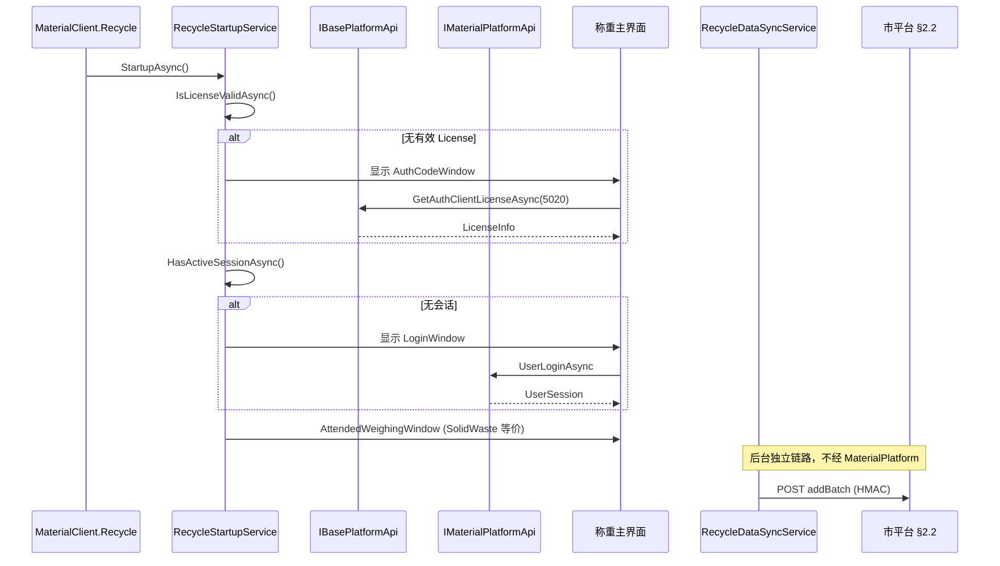
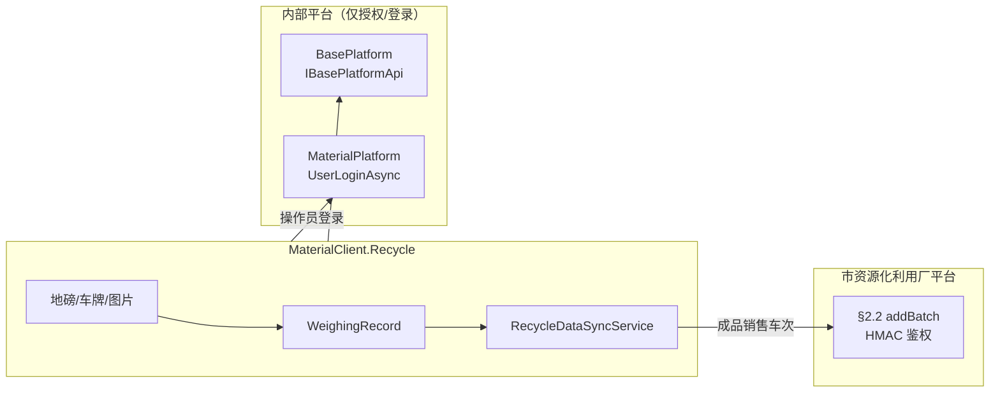

# OpenSpec 提案草稿：MaterialClient.Recycle 授权修正与资源化利用厂数据对接

> **状态**：草稿（Draft）  
> **建议变更名**：`fix-recycle-client-auth-and-resource-place-sync`  
> **关联归档变更**：[2026-07-09-materialclient-to-urbanmanagement-migration](../../openspec/changes/archive/2026-07-09-materialclient-to-urbanmanagement-migration/)  
> **接口文档**：[杭州市资源化利用厂数据接入接口 V1.0](./杭州市资源化利用厂数据接入接口V1.0.md)  
> **联调参考**：`_temp/resource-place-api-test/`（本地 HMAC 测试脚本，已 gitignore）

---

## Why

`MaterialClient.Recycle`（ProductCode=5020, WeighingMode=301）已在归档变更中完成脚手架与 §2.2 数据上报管线，但**授权启动流程实现错误**，与 SolidWaste（5010）的实际行为不一致：

| 环节 | SolidWaste（5010，MaterialClient 主程序） | Recycle（5020，当前实现） | 应有行为 |
|------|-------------------------------------------|---------------------------|----------|
| 授权码激活 | `AuthCodeWindow` → `ILicenseService.VerifyAuthorizationCodeAsync` → `IBasePlatformApi.GetAuthClientLicenseAsync` | ❌ 跳过 | ✅ 同 SolidWaste，ProductCode=5020 |
| 平台登录 | `LoginWindow` → `IAuthenticationService.LoginAsync` → `IMaterialPlatformApi.UserLoginAsync` | ❌ 跳过 | ✅ 仅登录，不上传业务数据 |
| 本地授权校验 | `IsLicenseValidAsync()` | ✅ 有，但无前置激活/登录 | ✅ 作为启动链一环 |
| 未授权 UX | 显示授权窗口，用户可输入授权码 | ❌ 仅 MessageBox 后退出 | ✅ 同 SolidWaste 交互 |
| 称重主界面 | `AttendedWeighingWindow` + SolidWaste 详情 VM | ❌ 占位窗口 | ✅ 复用 SolidWaste 称重 UI |
| 业务数据上报 | `SynchronizationOrderAsync`（MaterialPlatform） | — | ❌ **不走此链路** |
| 外部平台上报 | — | `IRecycleDataApi` → §2.2 `addBatch` | ✅ 唯一上报出口 |

Recycle 是**独立桌面客户端**（与 `MaterialClient.Urban` 并列），需使用 `IBasePlatformApi` 与 `IMaterialPlatformApi`，但后者**仅用于用户登录**，称重数据不上传 MaterialPlatform，而是直连杭州市资源化利用厂平台 §2.2 端点。

当前仅对接：

```
POST /dataCenter/resourcePlace/productTransportRecord/v1/addBatch
```

（成品销售车次数据批量新增，文档 §2.2）

---

## What Changes

### 1. 修正 Recycle 授权与启动流程（对齐 SolidWaste）

- 新增 `RecycleStartupService`（或等价启动协调器），复刻 MaterialClient 主程序 `StartupService` 的三段式流程：
  1. **授权码窗口**：调用 `VerifyAuthorizationCodeAsync(code, ProductCode.Recycle)`，经 `IBasePlatformApi` 激活
  2. **登录窗口**：调用 `IAuthenticationService.LoginAsync`，经 `IMaterialPlatformApi.UserLoginAsync` 建立会话
  3. **主窗口**：进入 SolidWaste 等价称重界面
- 修改 `MaterialClient.Recycle/App.axaml.cs`：移除「仅 `IsLicenseValidAsync` + MessageBox 退出」的简化逻辑，改为委托 `RecycleStartupService`
- 授权/登录 UI 优先复用 `MaterialClient.UI` 或迁移 `AuthCodeWindow` / `LoginWindow` 至共享层（与归档变更 task 7.3 阻塞项一致）
- `AuthCodeWindowViewModel` 在 Recycle 独立启动路径下固定 ProductCode=5020（无需 ComboBox 选择 Standard/SolidWaste）
- 保留非 JWT 授权模式（同 5010：`SendAuthLicense` / `DownloadAuth` / AccessCode + MachineCode）

### 2. 明确平台 API 使用边界

| API | 用途 | Recycle 是否使用 |
|-----|------|------------------|
| `IBasePlatformApi` | 授权码验证、License 下载 | ✅ |
| `IMaterialPlatformApi.UserLoginAsync` | 操作员登录 | ✅ |
| `IMaterialPlatformApi.SynchronizationOrderAsync` 等同步接口 | 运单/称重上报 MaterialPlatform | ❌ |
| `IRecycleDataApi`（§2.2 HMAC） | 成品销售车次上报市平台 | ✅ |

- 确认 `MaterialClientRecycleModule` 已注册 `AddMaterialClientRefitClients`（当前已有），**不**注册/调用 MaterialPlatform 同步 BackgroundWorker
- Recycle 后台仅保留 `RecyclePollingBackgroundService` → `RecycleDataSyncService`

### 3. 资源化利用厂 §2.2 数据对接（范围限定）

**本变更仅维护/完善 §2.2 单端点**，不扩展 §2.1/§2.3–§2.10。

对接规格（与 [接口文档 §2.2](./杭州市资源化利用厂数据接入接口V1.0.md#22-成品销售车次数据批量新增接口) 及 `_temp/resource-place-api-test` 联调脚本一致）：

| 项 | 要求 |
|----|------|
| 路径 | `/dataCenter/resourcePlace/productTransportRecord/v1/addBatch` |
| 方法 | `POST`，`Content-Type: application/json` |
| 请求体 | JSON **Array**（批量，当前实现按条提交数组亦可） |
| 鉴权 | HMAC-SHA256，4 个 `X-AKZTJG-*` Header（见文档附录） |
| 签名字符串 | `{METHOD}\n{sorted_query}\n{accessKey}\n{GMT_date}\n` |
| 重量单位 | **吨**（本地 kg ÷ 1000） |
| 图片 | Base64，**不带** Data URL 前缀；多图英文逗号分隔 |
| 成功判定 | 响应 `code == 200` |

必填字段映射（WeighingRecord → RecycleTransportRecord）：

- `dataNo`：UUID v4 或业务唯一号（生成后不变）
- `pointNumber`：`RecycleSync:PointNumber`（市平台资源化利用厂标识）
- `carNo`：车牌
- `productName`：`RecycleSync:ProductName`（或后续扩展为可配置/可选字段）
- `netWeight`：净重（吨）
- `outTime`：`yyyy-MM-dd HH:mm:ss`
- `outPhotos`：出场/抓拍附件 Base64

### 4. BasePlatform 侧 ProductCode 5020 注册（归档遗留）

- 在 BasePlatform 注册 ProductCode **5020**
- 授权管理 UI 对 5020 显示 AccessCode + MachineCode（同 5010 非 JWT 模式）
- 确认 `SendAuthLicense` Redis 载荷兼容 5020

### 5. 称重 UI 共享（归档 task 7.3）

- 将 SolidWaste 称重相关 Window/ViewModel 迁移至 `MaterialClient.UI`（或 Recycle 项目内引用主程序共享组件），使独立 Recycle 客户端具备与 5010 一致的前端能力
- `AttendedWeighingViewModel` 已有 `WeighingMode.Recycle` 分支复用 `SolidWasteWeighingDetailViewModel`，Recycle 主窗口应挂载完整称重流程而非占位 UI

---

## Capabilities

### New Capabilities

- `recycle-startup-auth-flow`：Recycle 独立客户端启动链（授权码 → BasePlatform 激活 → MaterialPlatform 登录 → 主界面），行为对齐 SolidWaste，ProductCode 固定 5020
- `recycle-platform-api-boundary`：明确 Recycle 对 `IBasePlatformApi` / `IMaterialPlatformApi` 的调用边界（登录可用，业务同步禁用）

### Modified Capabilities

- `recycle-abp-module`：启动初始化顺序调整——先完成授权/登录，再注册称重硬件与 `RecyclePollingBackgroundService`
- `recycle-data-sync`：与 §2.2 文档及联调脚本字段/单位/HMAC 规则对齐（已有实现需回归验证）
- `detail-viewmodel-hierarchy`：Recycle 独立客户端挂载完整 SolidWaste 称重 UI，而非占位窗口

### 不在本变更范围（Non-Goals）

- §2.1 渣土接收、§2.3 物料进场及其他资源化利用厂接口
- UrbanManagement 服务端改动
- MaterialPlatform `SynchronizationOrderAsync` 链路改动
- JWT 授权（5020 沿用 5010 非 JWT）
- 城管 Urban（5001）客户端行为变更

---

## Impact

### 变更地图

| 模块 | 文件/区域 | 操作 | 原因 |
|------|-----------|------|------|
| MaterialClient.Recycle | `App.axaml.cs` | 修改 | 接入完整启动流程 |
| MaterialClient.Recycle | `Services/RecycleStartupService.cs` | **新增** | 协调授权→登录→主窗 |
| MaterialClient.Recycle | `Views/`、`ViewModels/` | 修改/新增 | 挂载 Auth/Login/称重主界面 |
| MaterialClient.UI | 共享 Auth/Login/Attended 组件 | 修改/迁移 | 供 Recycle 独立项目复用 |
| MaterialClient.Common | `LicenseService` / `AuthenticationService` | 复用 | 无 API 变更，Recycle 传入 ProductCode.Recycle |
| MaterialClient.Recycle | `RecycleDataSyncService` 等 | 验证/微调 | §2.2 字段与 HMAC 对齐 |
| BasePlatform | ProductCode 5020、授权 UI | 修改 | 归档 task 8.x 遗留 |

### 客户端启动时序（目标态）



### 数据流边界



---

## 与归档变更的差异说明

归档变更 [2026-07-09-materialclient-to-urbanmanagement-migration](../../openspec/changes/archive/2026-07-09-materialclient-to-urbanmanagement-migration/) 已完成：

- [x] Common 枚举与 Settings 映射（5020 / 301）
- [x] Recycle 项目脚手架、ABP 模块、§2.2 Refit + HMAC Handler
- [x] `RecycleDataSyncService` / `RecycleWeightMapper` / 后台轮询

**未完成或实现偏差**（本提案重点）：

- [ ] **授权流程**：task 7.1 标记完成，但 `App.axaml.cs` 实际未实现 AuthCode + Login，与 SolidWaste 不符
- [ ] **称重主界面**：task 7.3 阻塞——仍为占位 `RecycleMainWindow`
- [ ] **BasePlatform 5020**：task 8.x 未做
- [ ] **联调验证**：task 9.x 未做

本提案视为对归档变更的**修正型 follow-up**，不重复已交付的 DTO/HMAC/同步管线设计。

---

## 风险与 Open Questions

| # | 风险/问题 | 等级 | 负责方 | 状态 |
|---|-----------|------|--------|------|
| 1 | HMAC accessKey / secretKey | 阻断 | 市平台 | 待提供 |
| 2 | pointNumber（厂标识） | 阻断 | 运营 | 待提供 |
| 3 | productName 映射规则 | 阻断 | 运营 | 待确认 |
| 4 | Base64 图片大小上限 | 中 | 联调 | 待确认 |
| 5 | SolidWaste UI 迁移至 UI 共享层的工作量 | 中 | 开发 | 待评估 |
| 6 | BasePlatform 5020 未注册导致授权码无法激活 | **阻断** | 开发/运维 | 待实施 |
| 7 | §2.2 接口网络可达性 | 中 | 运维 | 待确认 |

---

## 建议 tasks.md 大纲（正式 OpenSpec 化时可展开）

1. **Recycle 启动与授权**
   - 1.1 新增 `RecycleStartupService`（对齐 `StartupService` 三步流程）
   - 1.2 修改 `App.axaml.cs` 接入启动服务
   - 1.3 Recycle 路径下 AuthCode 固定 `ProductCode.Recycle`
   - 1.4 验证 `IBasePlatformApi` / `IMaterialPlatformApi` DI 与网络配置

2. **称重 UI**
   - 2.1 迁移或共享 Auth/Login/Attended 窗口至 Recycle 可引用程序集
   - 2.2 Recycle 主窗口替换占位 UI，挂载 SolidWaste 等价流程
   - 2.3 确认 `WeighingMode.Recycle` 下创建的记录进入 `RecycleDataSyncService` 扫描范围

3. **§2.2 上报回归**
   - 3.1 对照 `_temp/resource-place-api-test` 验证 HMAC 与 payload
   - 3.2 确认 kg→吨、时间格式、Base64 规则
   - 3.3 成功/失败/重试/放弃策略联调

4. **BasePlatform**
   - 4.1 注册 ProductCode 5020
   - 4.2 授权 UI 5020 同 5010（AccessCode + MachineCode）

5. **回归**
   - 5.1 5000 / 5010 / 5001 客户端不受影响
   - 5.2 Recycle 端到端：授权 → 登录 → 称重 → §2.2 上报

---

## 下一步

1. 评审本草稿，确认变更名与 Capabilities 划分  
2. 执行 `openspec new change fix-recycle-client-auth-and-resource-place-sync` 生成正式变更目录  
3. 将本草稿内容拆入 `proposal.md` / `design.md` / `specs/` / `tasks.md`  
4. 优先 unblock：BasePlatform 5020 注册 + Recycle 授权启动链修正
