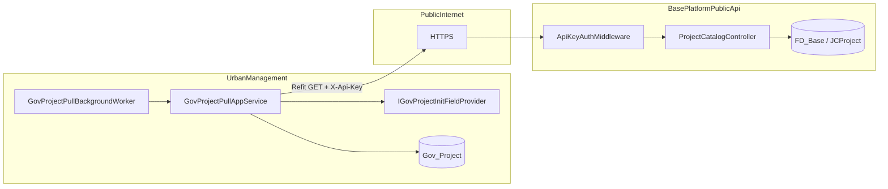
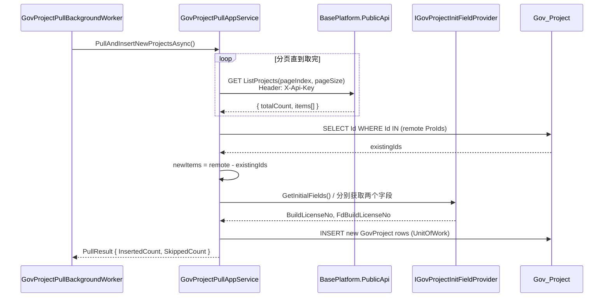

# 设计方案：UrbanManagement 定时从 BasePlatform.PublicApi 同步 GovProject

> 文档版本：2026-06-08  
> 涉及项目：`UrbanManagement`（消费方）、`FdSoft.BasePlatform.PublicApi`（数据源）  
> 数据规模：约 1500 条项目记录

---

## 1. 背景与目标

UrbanManagement 的 `GovProject` 表需要与 BasePlatform 主数据中的项目清单保持一致。当前项目信息分散在 BasePlatform 数据库（`JCProject` 表，字段含 `ProId`、`ProName`），UrbanManagement 侧需**定时拉取**并在本地**仅插入新增**记录。

### 1.1 目标

| 编号 | 目标 |
|------|------|
| G1 | UrbanManagement 定时从 BasePlatform.PublicApi 拉取 `ProId` + `ProName`（文档中 BasePlatform 侧字段为 `ProName`，与需求中的 ProdName 同义） |
| G2 | BasePlatform.PublicApi 可通过**公网 HTTPS** 被 UrbanManagement 访问 |
| G3 | 拉取过程具备**服务间授权**，拒绝未授权调用 |
| G4 | 同步策略为**仅插入新增** `GovProject`，不更新、不删除已有记录 |
| G5 | 通过可替换接口初始化 `BuildLicenseNo`、`FdBuildLicenseNo`；首版使用**固定常量**，标注 `// TODO` 待后续实现真实逻辑 |

### 1.2 非目标

- 不实现 `BuildLicenseNo` / `FdBuildLicenseNo` 的真实业务映射（首版常量占位）
- 不同步 BasePlatform 侧项目的删除/改名（UrbanManagement 已有数据保持不变）
- 不在 BasePlatform.PublicApi 暴露写操作
- 不改造 UrbanManagement 现有 `GovSyncBackgroundWorker`（称重记录上送政府平台）

---

## 2. 现状分析

### 2.1 BasePlatform.PublicApi

```
FdSoft.BasePlatform.PublicApi/
├── Controllers/
│   ├── BaseController.cs          # 路由前缀 Api/[controller]/[action]
│   ├── AuthClientLicenseController.cs
│   └── OssPolicyController.cs
├── Lib/
│   └── CacheManager.cs            # 已通过 ProId 查询 JCProject.ProName
└── Program.cs                     # 当前无统一认证中间件
```

- 路由约定：`/Api/{Controller}/{Action}`
- 已有 `CacheManager` 从 `FD_Base` 库读取 `JCProject`（`ProId`、`ProName` 等）
- `AuthClientLicenseController` 使用 `[AllowAnonymous]` + Redis 一次性授权码，**不适合**服务间批量拉取
- `Program.cs` 仅 `app.UseAuthorization()`，无 JWT / API Key 中间件

### 2.2 UrbanManagement

根据 `openspec/specs/entity-migration/spec.md`，`GovProject` 实体结构：

| 字段 | 类型 | 说明 |
|------|------|------|
| `Id` | `Guid` | 主键，**与 BasePlatform `ProId` 一一对应** |
| `ProName` | `string` | 项目名称 |
| `BuildLicenseNo` | `string?` | 施工许可证号 |
| `FdBuildLicenseNo` | `string?` | 对接码 |
| `AddTime` | `DateTime?` | 创建时间 |
| `SyncStatus` | `bool?` | 是否启用政府同步 |
| `LastSyncTime` | `DateTime?` | 末次同步时间 |
| `DeleteStatus` | `bool?` | 软删除标记 |

已有 `GovSyncBackgroundWorker`（ABP `AsyncPeriodicBackgroundWorkerBase`，5 秒轮询）可作为同类后台任务参考。

---

## 3. 总体架构



### 3.1 数据映射

| BasePlatform (`JCProject`) | UrbanManagement (`GovProject`) | 同步策略 |
|----------------------------|--------------------------------|----------|
| `ProId` (string/GUID) | `Id` (Guid) | 新增时写入 |
| `ProName` | `ProName` | 新增时写入 |
| — | `BuildLicenseNo` | 由 `IGovProjectInitFieldProvider` 初始化 |
| — | `FdBuildLicenseNo` | 由 `IGovProjectInitFieldProvider` 初始化 |
| — | `SyncStatus` | 默认 `false` |
| — | `DeleteStatus` | 默认 `false` |
| — | `AddTime` | `DateTime.Now` |

---

## 4. 授权方案（公网访问）

### 4.1 方案选择：静态 API Key + HTTPS

**选择**：UrbanManagement 在请求头携带 `X-Api-Key`，BasePlatform.PublicApi 通过中间件校验。

**理由**：

- 与现有 `JCApiUser.Secret` 密钥模式一致，团队熟悉
- 实现成本低，适合服务间定时拉取（非用户登录场景）
- 1500 条全量拉取无需 OAuth 令牌刷新链路
- 配合 HTTPS 可满足公网传输安全

**替代方案（不采用）**：

| 方案 | 不采用原因 |
|------|-----------|
| 复用 `AuthClientLicenseController` Redis 一次性码 | 不适合定时批量任务 |
| JWT + OAuth2 | 过度设计，无用户上下文 |
| mTLS 双向证书 | 运维成本高，首版不必要 |
| IP 白名单 alone | UrbanManagement 公网出口 IP 可能变化 |

### 4.2 BasePlatform.PublicApi 侧实现

#### 4.2.1 配置项（`appsettings.json`）

```json
{
  "ProjectCatalogSync": {
    "ApiKey": "<强随机密钥，部署时注入>",
    "Enabled": true,
    "AllowedIpRanges": []
  }
}
```

- `AllowedIpRanges` 可选，生产环境可追加 UrbanManagement 出口 IP 段作为纵深防御
- **禁止**将真实密钥提交到版本库；使用环境变量或密钥管理服务覆盖

#### 4.2.2 中间件 `ApiKeyAuthMiddleware`

```
请求进入
  → 路径以 /Api/ProjectCatalog/ 开头？
      否 → 放行（不影响现有 OssPolicy 等接口）
      是 → 读取 Header X-Api-Key
          → 与配置 ProjectCatalogSync:ApiKey 常量时间比较
          → 可选：校验 RemoteIpAddress ∈ AllowedIpRanges
          → 失败 → 401 { success: false, msg: "Unauthorized" }
          → 成功 → next()
```

#### 4.2.3 Controller 标记

新接口 Controller **不使用** `[AllowAnonymous]`，依赖中间件保护；或在 Action 上增加自定义 `[ProjectCatalogApiKey]` Filter（与中间件二选一，推荐中间件集中管理）。

### 4.3 UrbanManagement 侧配置

```json
{
  "BasePlatformSync": {
    "BaseUrl": "https://baseplatform.example.com",
    "ApiKey": "<与 PublicApi 一致的密钥>",
    "PullIntervalMinutes": 60,
    "PageSize": 500,
    "Enabled": true
  },
  "GovProjectInit": {
    "DefaultBuildLicenseNo": "PLACEHOLDER_BUILD_LICENSE",
    "DefaultFdBuildLicenseNo": "PLACEHOLDER_FD_BUILD_LICENSE"
  }
}
```

### 4.4 公网部署要求

| 项 | 要求 |
|----|------|
| 传输 | 必须 HTTPS（TLS 1.2+） |
| 密钥轮换 | 支持双密钥过渡期（可选 Phase 2） |
| 限流 | PublicApi 对 `/Api/ProjectCatalog/*` 配置每 IP 每分钟 ≤ 30 次（防扫描） |
| 日志 | 记录调用方 IP、成功/失败，**不记录**完整 ApiKey |

---

## 5. API 设计（BasePlatform.PublicApi）

### 5.1 新增 Controller

**文件**：`Controllers/ProjectCatalogController.cs`  
**路由**：`/Api/ProjectCatalog/ListProjects`

#### 5.1.1 请求

```
GET /Api/ProjectCatalog/ListProjects?pageIndex=1&pageSize=500
Headers:
  X-Api-Key: {apiKey}
```

| 参数 | 类型 | 必填 | 说明 |
|------|------|------|------|
| `pageIndex` | int | 否 | 默认 1 |
| `pageSize` | int | 否 | 默认 500，最大 1000 |

#### 5.1.2 响应

沿用现有 `ApiResultDto` / `BaseController.SUCCESS` 风格：

```json
{
  "success": true,
  "msg": "成功",
  "data": {
    "totalCount": 1523,
    "items": [
      {
        "proId": "3fa85f64-5717-4562-b3fc-2c963f66afa6",
        "proName": "示例工程项目"
      }
    ]
  }
}
```

#### 5.1.3 数据源查询

```sql
-- 逻辑等价（实际用 SqlSugar / DbHelper）
SELECT ProId, ProName
FROM JCProject
WHERE DeleteStatus = 0          -- 若表有此字段
  AND ProId IS NOT NULL
ORDER BY ProId
OFFSET @skip ROWS FETCH NEXT @pageSize ROWS ONLY
```

**过滤规则**：

- 排除 `ProId` 为空
- 排除已逻辑删除项目（字段名以 `JCProject` 实际模型为准）
- 不对 UrbanManagement 暴露 Secret、CorpCode 等敏感字段

#### 5.1.4 DTO（BasePlatform.Model）

```csharp
// FdSoft.BasePlatform.Model/Dto/BasePlatformPublicApi/ProjectCatalogItemDto.cs
public class ProjectCatalogItemDto
{
    public Guid ProId { get; set; }
    public string ProName { get; set; }
}

public class ProjectCatalogPageDto
{
    public int TotalCount { get; set; }
    public List<ProjectCatalogItemDto> Items { get; set; }
}
```

### 5.2 性能评估（1500 条）

| 场景 | 估算 |
|------|------|
| 单页 `pageSize=1500` | 1 次 HTTP，payload ≈ 120 KB（JSON） |
| 分页 `pageSize=500` | 3 次 HTTP，单次更稳 |
| DB 查询 | `ProId` 主键/索引，毫秒级 |
| 建议 | 默认 `pageSize=500`，Worker 循环拉取直至 `items.Count < pageSize` |

---

## 6. UrbanManagement 同步设计

### 6.1 组件清单

| 组件 | 职责 |
|------|------|
| `GovProjectPullBackgroundWorker` | ABP 定时 Worker，周期可配置（建议 60 分钟） |
| `IGovProjectPullAppService` | 编排拉取、去重、批量插入 |
| `IBasePlatformProjectHttpClient` | Refit 客户端，调用 PublicApi |
| `IGovProjectInitFieldProvider` | 初始化 `BuildLicenseNo` / `FdBuildLicenseNo` |
| `GovProjectPullOptions` | 配置绑定类 |

### 6.2 同步时序



### 6.3 仅插入新增逻辑

```csharp
// 伪代码 — GovProjectPullAppService
public async Task<GovProjectPullResult> PullAndInsertNewProjectsAsync(CancellationToken ct)
{
    var remoteProjects = await FetchAllPagesAsync(ct);

    var remoteIds = remoteProjects.Select(x => x.ProId).ToList();
    var existingIds = await _govProjectRepository
        .GetListAsync(x => remoteIds.Contains(x.Id), cancellationToken: ct);
    var existingIdSet = existingIds.Select(x => x.Id).ToHashSet();

    var toInsert = remoteProjects
        .Where(x => !existingIdSet.Contains(x.ProId))
        .ToList();

    if (toInsert.Count == 0)
        return GovProjectPullResult.Empty;

    var buildLicenseNo = _initFieldProvider.GetInitialBuildLicenseNo();
    var fdBuildLicenseNo = _initFieldProvider.GetInitialFdBuildLicenseNo();
    var now = _clock.Now;

    var entities = toInsert.Select(x => new GovProject
    {
        Id = x.ProId,
        ProName = x.ProName,
        BuildLicenseNo = buildLicenseNo,
        FdBuildLicenseNo = fdBuildLicenseNo,
        SyncStatus = false,
        DeleteStatus = false,
        AddTime = now
    }).ToList();

    await _govProjectRepository.InsertManyAsync(entities, autoSave: true, cancellationToken: ct);

    return new GovProjectPullResult(toInsert.Count, remoteProjects.Count - toInsert.Count);
}
```

**边界行为**：

| 场景 | 行为 |
|------|------|
| BasePlatform 某 `ProId` 已存在于 UrbanManagement | **跳过**，不更新 `ProName` |
| BasePlatform 项目改名 | UrbanManagement **保持旧名**（非目标范围） |
| BasePlatform 删除项目 | UrbanManagement **保留**（非目标范围） |
| 远程 `ProName` 为空 | 跳过该条并写 Warning 日志 |
| `ProId` 非法 GUID | 跳过并记 Error |
| API 401/5xx | Worker 记录失败，下次周期重试；不部分提交当前页以外的脏数据（整次 UoW） |

### 6.4 后台 Worker

```csharp
// GovProjectPullBackgroundWorker : AsyncPeriodicBackgroundWorkerBase
// Timer.Period = BasePlatformSync:PullIntervalMinutes * 60 * 1000
// 注册条件：BasePlatformSync:Enabled == true
```

与 `GovSyncBackgroundWorker` 独立运行，互不阻塞。

### 6.5 Refit 客户端

```csharp
public interface IBasePlatformProjectHttpClient
{
    [Get("/Api/ProjectCatalog/ListProjects")]
    Task<ApiResultDto<ProjectCatalogPageDto>> ListProjectsAsync(
        [Header("X-Api-Key")] string apiKey,
        [Query] int pageIndex,
        [Query] int pageSize,
        CancellationToken cancellationToken = default);
}
```

注册时：

- `BaseAddress` = `BasePlatformSync:BaseUrl`
- Polly：3 次指数退避（与 `IGovSyncHttpClient` 一致）
- `HttpClient` 超时 30s

---

## 7. BuildLicenseNo / FdBuildLicenseNo 初始化接口

### 7.1 接口定义（UrbanManagement.Core）

```csharp
/// <summary>
/// 为从 BasePlatform 同步的新 GovProject 提供初始对接字段。
/// 首版为固定常量；后续可替换为按 ProId/ProName 查表或调用外部服务。
/// </summary>
public interface IGovProjectInitFieldProvider
{
    string GetInitialBuildLicenseNo();
    string GetInitialFdBuildLicenseNo();
}
```

### 7.2 首版实现

```csharp
public class DefaultGovProjectInitFieldProvider : IGovProjectInitFieldProvider, ITransientDependency
{
    private readonly GovProjectInitOptions _options;

    public DefaultGovProjectInitFieldProvider(IOptions<GovProjectInitOptions> options)
    {
        _options = options.Value;
    }

    public string GetInitialBuildLicenseNo()
    {
        // TODO: 根据 ProId/ProName 或 BasePlatform 扩展字段生成真实施工许可证号
        return _options.DefaultBuildLicenseNo;
    }

    public string GetInitialFdBuildLicenseNo()
    {
        // TODO: 根据 ProId/ProName 或 BasePlatform 扩展字段生成真实对接码
        return _options.DefaultFdBuildLicenseNo;
    }
}
```

**常量默认值（可配置）**：

| 配置键 | 首版默认值 | 说明 |
|--------|-----------|------|
| `GovProjectInit:DefaultBuildLicenseNo` | `SYNC_PLACEHOLDER_BUILD_LICENSE` | 占位，运维可在 appsettings 覆盖 |
| `GovProjectInit:DefaultFdBuildLicenseNo` | `SYNC_PLACEHOLDER_FD_CODE` | 占位，运维可在 appsettings 覆盖 |

### 7.3 后续扩展点（不在首版实现）

- `IGovProjectInitFieldProvider` 替换为 `PerProjectGovProjectInitFieldProvider`，从 BasePlatform 新字段或第三方 API 解析
- 同步完成后触发管理端「待完善对接码」列表（UI 增强，独立变更）

---

## 8. 代码变更清单

### 8.1 BasePlatform.PublicApi

| 文件 | 变更类型 | 说明 |
|------|---------|------|
| `Controllers/ProjectCatalogController.cs` | 新增 | 分页返回 ProId/ProName |
| `Middleware/ApiKeyAuthMiddleware.cs` | 新增 | 校验 X-Api-Key |
| `Program.cs` | 修改 | 注册中间件、`ProjectCatalogSync` 配置 |
| `appsettings.json` | 修改 | 增加 `ProjectCatalogSync` 节（密钥用占位符） |
| `FdSoft.BasePlatform.Model/.../ProjectCatalogItemDto.cs` | 新增 | 响应 DTO |

### 8.2 UrbanManagement

| 文件 | 变更类型 | 说明 |
|------|---------|------|
| `Services/GovProjectPullAppService.cs` | 新增 | 拉取 + 仅插入逻辑 |
| `BackgroundWorkers/GovProjectPullBackgroundWorker.cs` | 新增 | 定时触发 |
| `HttpClients/IBasePlatformProjectHttpClient.cs` | 新增 | Refit 接口 |
| `Services/IGovProjectInitFieldProvider.cs` | 新增 | 初始化字段抽象 |
| `Services/DefaultGovProjectInitFieldProvider.cs` | 新增 | 固定常量 + TODO |
| `Options/BasePlatformSyncOptions.cs` | 新增 | 配置类 |
| `Options/GovProjectInitOptions.cs` | 新增 | 配置类 |
| `UrbanManagementCoreModule.cs`（或等价模块） | 修改 | 注册 Worker、HttpClient、Options |
| `appsettings.json` | 修改 | BaseUrl、ApiKey、周期、占位常量 |

---

## 9. 配置与部署

### 9.1 环境变量示例

**BasePlatform.PublicApi**

```
ProjectCatalogSync__ApiKey=<secret>
ProjectCatalogSync__Enabled=true
```

**UrbanManagement**

```
BasePlatformSync__BaseUrl=https://baseplatform.example.com
BasePlatformSync__ApiKey=<same-secret>
BasePlatformSync__PullIntervalMinutes=60
BasePlatformSync__Enabled=true
```

### 9.2 首次上线步骤

1. 部署 BasePlatform.PublicApi 到公网入口（HTTPS 终结于网关或 Kestrel）
2. 配置双方相同 `ApiKey`
3. UrbanManagement 设置 `BasePlatformSync:Enabled=true`
4. 观察首轮 Worker 日志：`InsertedCount` 应接近 1500（若本地为空库）
5. 第二轮 Worker：`InsertedCount=0`，`SkippedCount≈1500`

---

## 10. 可观测性与运维

| 项 | 说明 |
|----|------|
| 结构化日志 | 每次 Pull 记录 `InsertedCount`、`SkippedCount`、耗时、页数 |
| 失败告警 | 连续 3 次 Pull 失败可对接现有日志告警 |
| 手动触发 | 可选 Admin API `POST /api/app/gov-project/pull-now`（Phase 2） |
| 指标 | `gov_project_pull_inserted_total`、`gov_project_pull_duration_seconds`（可选） |

---

## 11. 测试计划

| 编号 | 场景 | 预期 |
|------|------|------|
| T1 | 无 ApiKey 调用 ListProjects | 401 |
| T2 | 错误 ApiKey | 401 |
| T3 | 正确 ApiKey，pageSize=500 | 返回分页数据，totalCount 正确 |
| T4 | UrbanManagement 空库首次 Pull | 插入全部新 ProId |
| T5 | 第二次 Pull | InsertedCount=0，无 UPDATE SQL |
| T6 | BasePlatform 新增 1 个项目 | 下次 Pull 仅插入 1 条 |
| T7 | 新记录 BuildLicenseNo / FdBuildLicenseNo | 等于配置的占位常量 |
| T8 | PublicApi 不可用 | Worker 记 Error，不 corrupt 本地数据 |
| T9 | 1500 条全量 | 总耗时 < 10s（内网/公网视网络而定） |

---

## 12. 风险与缓解

| 风险 | 缓解 |
|------|------|
| ApiKey 泄露 | HTTPS + 密钥轮换 + 可选 IP 限制 + 限流 |
| 占位对接码导致政府同步失败 | 新导入项目默认 `SyncStatus=false`，需人工启用前完善对接码 |
| ProName 不同步更新 | 文档明确非目标；后续可独立「增量更新名称」变更 |
| 双端 ProId 类型不一致 | DTO 统一 `Guid`，非法值跳过并日志 |
| 与现有 OssPolicy 安全模型不一致 | 新接口独立中间件，不影响旧接口 |

---

## 13. 实施任务拆分（建议）

1. **PublicApi**：DTO + `ProjectCatalogController` + 单元测试（Mock Db）
2. **PublicApi**：`ApiKeyAuthMiddleware` + 配置 + 集成测试
3. **UrbanManagement**：`IGovProjectInitFieldProvider` + Options
4. **UrbanManagement**：Refit Client + `GovProjectPullAppService`
5. **UrbanManagement**：`GovProjectPullBackgroundWorker` + 模块注册
6. **联调**：测试环境全量 1500 条验证 + 日志复核
7. **生产**：密钥注入、HTTPS、启用 Worker

---

## 14. 术语对照

| 需求表述 | 代码/库字段 |
|----------|------------|
| ProdName | `JCProject.ProName` → `GovProject.ProName` |
| ProId | `JCProject.ProId` → `GovProject.Id` |
| 仅插入新增 | `InsertManyAsync`，无 `UpdateAsync` |
| 固定常量初始化 | `IGovProjectInitFieldProvider` + `// TODO` |
