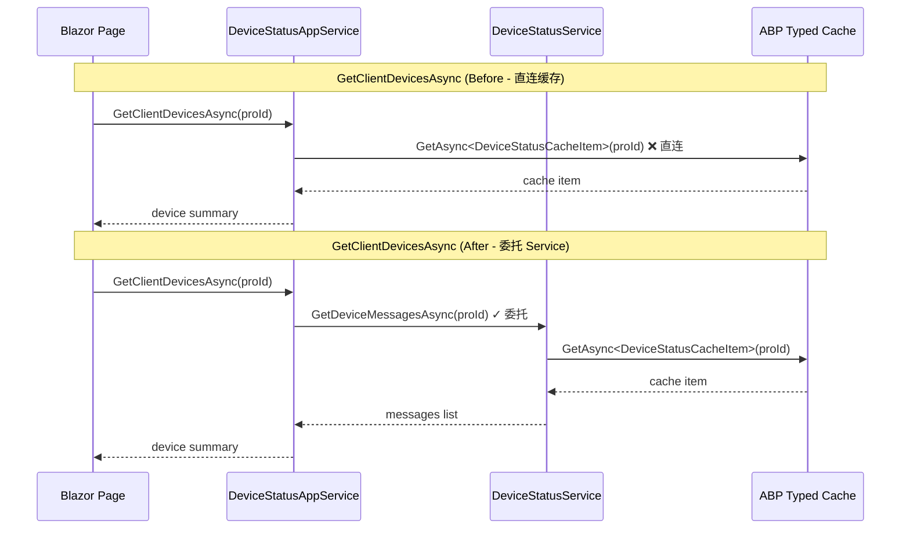

## Context

UrbanManagement 已完成 ABP Blazor 架构迁移（缓存类型化、Blazor Server 托管、SignalR 设备状态推送）。本次质量加固聚焦两个层面：缓存服务边界治理和目录结构规范化。变更仅涉及 UrbanManagement（Core + App 层）仓库，无外部依赖变更。

**数据流架构约束**：设备状态数据流为严格的客户端推送模型——MaterialClient 通过 SignalR `UploadStatus` 主动上报设备状态至 UrbanManagement，服务端仅缓存和消费已提交的数据，MUST NOT 反向轮询客户端获取设备信息。服务端的所有缓存读取操作均针对本地已存储的缓存数据，不涉及对客户端的任何主动请求。

## Goals / Non-Goals

### Goals
- 消除 `DeviceStatusAppService` 对 `IDistributedCache<T>` 的直接依赖，使缓存读写全部收敛到 `IDeviceStatusService`
- 拆分 `Models/` 为 `Cache/`、`Dtos/`、`Messages/` 子目录，按职责组织模型文件
- 恢复 `ConnectionRegistryCacheItem` 独立类型，消除 `ClientRegistryCacheItem` 的双重语义

### Non-Goals
- 不改变缓存过期策略或键前缀
- 不引入新的 NuGet 包或外部依赖
- 不重构 Blazor 页面 UI 组件
- 不做单元测试或文档编写
- 不拆分 Core 项目为 Domain/Application 分层（超出本阶段范围）
- 不涉及 MaterialClient 仓库的任何变更（设备状态由客户端推送，服务端仅消费已提交数据）
- 不引入服务端轮询客户端的反向数据流模式

## Decisions

### Decision 1: AppService 缓存访问通过 IDeviceStatusService 委托

**选择**: 在 `IDeviceStatusService` 接口新增 `GetDeviceMessagesAsync(proId)` 方法，`DeviceStatusAppService` 通过该方法获取缓存数据，移除 `IDistributedCache<DeviceStatusCacheItem>` 注入。

**替代方案**: 保持 AppService 直接注入类型化缓存（当前状态）。缺点是破坏服务边界——AppService 可以绕过 service 层的业务逻辑直接操作缓存。

**理由**: ABP 最佳实践中 AppService 应通过 domain/application service 获取数据，而非直接操作基础设施。这也让 service 层可以在不修改 AppService 的前提下调整缓存策略。

### Decision 2: Models/ 子目录划分方案

**选择**: 建立 `Cache/`、`Dtos/`、`Messages/` 三个平级子目录，所有文件保持 `UrbanManagement.Core.Models` 命名空间不变。

**替代方案 A**: 按子目录建立嵌套命名空间（如 `UrbanManagement.Core.Models.Cache`）。缺点是需要更新所有 using 语句，增加改动面。

**替代方案 B**: 保持扁平 Models/ 不拆分。缺点是不符合 ABP 项目惯例，CacheItem 与 DTO 混放降低可读性。

**理由**: 保持统一命名空间减少改动面，子目录提供物理文件组织。ABP 模板项目通常将 CacheItems 放在独立目录，DTO 按功能模块组织。

### Decision 3: 恢复 ConnectionRegistryCacheItem 独立类型

**选择**: 新建 `ConnectionRegistryCacheItem` 类（`[CacheName("ConnectionRegistry")]`），`DeviceStatusService` 中连接注册表相关操作改用此类型。

**替代方案**: 保持 `ClientRegistryCacheItem` 承载两个注册表（用不同缓存键）。缺点是语义模糊——同一个类型用不同 key 管理两个不同的注册表，未来维护者容易混淆。

**理由**: 类型即文档。两个独立类型让 IDE 自动补全和代码审查更容易发现错误。性能开销为零（ABP 缓存框架按 `[CacheName]` 区分缓存实例）。

### Decision 4: MaterialClient 不纳入本次变更

**选择**: 不在 MaterialClient 中新增设备状态查询 Refit 接口。

**理由**: 设备状态遵循客户端推送模型——MaterialClient 通过 SignalR 主动上报设备状态，服务端仅缓存并消费已提交的数据。服务端不需要（也 MUST NOT）反向查询客户端的设备信息。MaterialClient 的 WebHost（`MinimalWebHostService`）仅用于本地测试和调试，不作为业务通信通道。

## Risks / Trade-offs

- **[Risk] 缓存键变更导致已有缓存条目孤立** → `ConnectionRegistryCacheItem` 使用新的 `[CacheName("ConnectionRegistry")]` 后，之前 `ClientRegistryCacheItem` + `__connection_registry__` 键写入的缓存条目将无法被读取。**缓解**: 缓存本身是瞬态的（24-25h TTL），系统会在新条目写入后自动恢复。无需手动清理。
- **[Risk] Models/ 文件移动引发编译错误** → 大量文件需要更新命名空间和 using 语句。**缓解**: 保持 `UrbanManagement.Core.Models` 命名空间不变，仅物理目录重组，不涉及命名空间变更。
- **[Trade-off] IDeviceStatusService 接口新增方法** → 增加了接口面积，但换来的是 AppService 不再直连缓存。

## Migration Plan

1. **Phase 1 — Models/ 目录重组**: 创建子目录、移动文件、验证编译通过
2. **Phase 2 — ConnectionRegistryCacheItem 恢复**: 新建类型、更新 service、更新 module 配置
3. **Phase 3 — AppService 缓存边界**: 新增 service 接口方法、移除 AppService 缓存注入

各阶段独立可编译，无破坏性部署要求。无需回滚策略（本地开发环境）。

## Architecture

```
Component Hierarchy (Post-Hardening)

UrbanManagement.Core
├── Models/
│   ├── Cache/                          ← NEW subdirectory
│   │   ├── DeviceStatusCacheItem
│   │   ├── ClientRegistryCacheItem
│   │   ├── ClientConnectionCacheItem
│   │   └── ConnectionRegistryCacheItem ← NEW type
│   ├── Dtos/                           ← NEW subdirectory
│   │   ├── ClientConnectionDto
│   │   ├── ClientDeviceSummaryDto
│   │   ├── DeviceStatusQueryDto
│   │   └── ... (15+ DTO files)
│   └── Messages/                       ← NEW subdirectory
│       └── DeviceStatusMessage
├── Services/
│   ├── IDeviceStatusService            ← EXTENDED (new method)
│   ├── DeviceStatusService             ← UPDATED (ConnectionRegistryCacheItem)
│   └── DeviceStatusAppService          ← SIMPLIFIED (no cache injection)
└── Hubs/
    └── DeviceStatusHub                 ← namespace update only
```

## API Sequence: AppService → Service → Cache (Post-Hardening)



