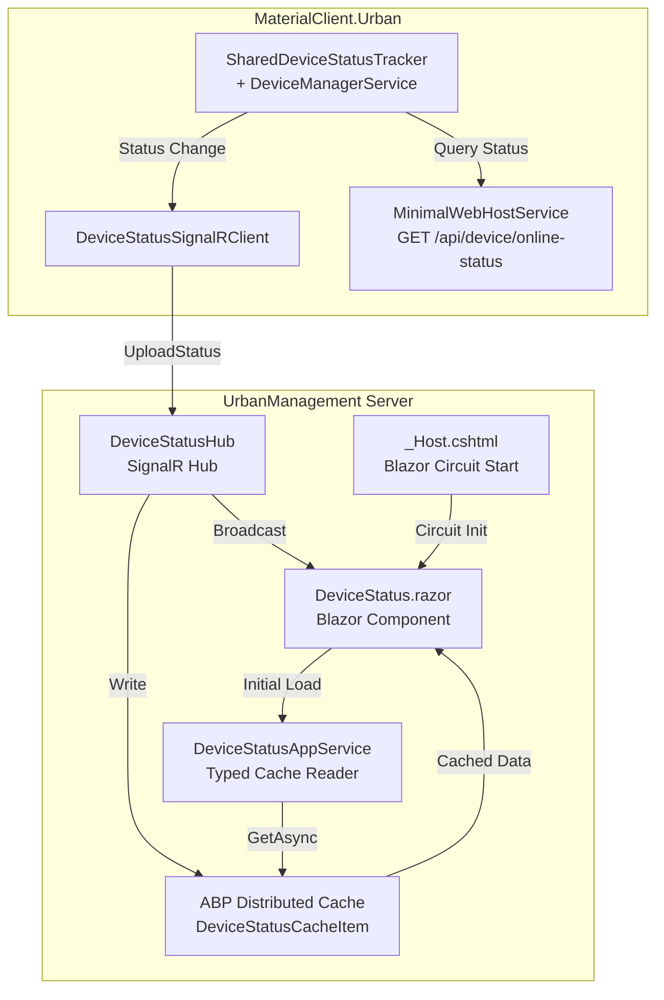
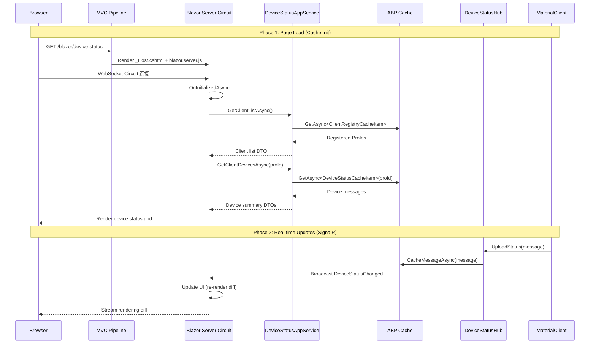

## Context

UrbanManagement 是一个基于 ABP 10.0.1 的 ASP.NET Core MVC 应用，使用 SQLite 作为数据库，通过 SignalR Hub 接收 MaterialClient 上报的设备状态数据，并将数据缓存到 ABP 分布式缓存中。当前 UI 层完全由 Razor Views + MVC Controller 组成。

MaterialClient.Urban 是一个 Avalonia 桌面应用，内置 MinimalWebHostService（端口 9961），已暴露 `/api/scale/weight` 和 `/api/lpr/test-plate` 端点，但尚无设备在线状态查询 API。

缓存代码重构（从原始 `IDistributedCache` 到类型化 `IDistributedCache<T>`）已全部完成，无需额外工作。

## Goals / Non-Goals

**Goals:**
- 在 UrbanManagement 中集成 Blazor Server rendering，使其与现有 MVC 路由共存
- 创建设备状态监控 Blazor 页面，实时展示客户端连接和设备在线状态
- 在 MaterialClient.Urban 的 MinimalWebHostService 中新增设备在线状态 HTTP API
- ABP 模块依赖链保持一致且最小化

**Non-Goals:**
- 不替换现有 MVC 页面（MVC 和 Blazor 共存）
- 不引入 Blazor WebAssembly（仅 Server-side rendering）
- 不引入 ABP 身份认证/授权模块
- 不引入 LeptonX 主题（使用基础 Blazor 样式）
- 缓存代码已重构完毕，不纳入本次实现

## Decisions

### Decision 1: Blazor Server 与 MVC 共存模式

**选择**: 在现有 MVC 应用中添加 Blazor Server endpoint，通过路由前缀 `/blazor` 隔离 Blazor 页面。

**替代方案**:
- (A) 完全迁移到 Blazor — 风险高，工作量大，MVC 页面需要全部重写
- (B) 独立 Blazor 项目 — 增加部署复杂度，SignalR Hub 需要共享

**理由**: Blazor Server 可以与 MVC 在同一 ASP.NET Core 应用中无缝共存，共享 DI 容器、SignalR Hub 和缓存基础设施。使用路由前缀隔离避免与现有 MVC 路由冲突。

### Decision 2: 使用 Volo.Abp.AspNetCore.Components.Server

**选择**: 引入 `Volo.Abp.AspNetCore.Components.Server` NuGet 包，通过 ABP 模块系统集成 Blazor Server。

**替代方案**:
- (A) 仅使用 `Microsoft.AspNetCore.Components` 原生 API — 需要手动配置 ABP DI 集成
- (B) 使用 `Volo.Abp.AspNetCore.Components.WebAssembly` — 不适用于 Server-side 场景

**理由**: `Volo.Abp.AspNetCore.Components.Server` 提供了 ABP 感知的 Blazor 集成（DI、日志、异常处理等），与现有 ABP 模块链一致。

### Decision 3: Blazor 模块定义方式

**选择**: 在 `UrbanManagementCoreModule` 中通过 `ConfigureServices` 注册 Blazor Server 服务，不创建独立的 Blazor 模块类。

**替代方案**:
- (A) 创建独立 `UrbanManagementBlazorModule` — 对于仅添加一个 Blazor endpoint 过度设计
- (B) 全部配置在 AppModule 中 — Core 层是缓存和服务定义的位置，Blazor 服务注册属于 Core 关注点

**理由**: Blazor Server 服务注册（`AddServerSideBlazor()`）本质上是服务配置，适合放在 CoreModule 中。ABP 的模块链已经从 AppModule → CoreModule → AbpEntityFrameworkCoreModule，添加包引用即可，无需额外的模块类。

### Decision 4: 设备状态页面使用 SignalR + 缓存双通道

**选择**: 页面初始加载从缓存读取状态，后续通过 SignalR 实时更新。

**替代方案**:
- (A) 仅轮询 REST API — 延迟高，用户体验差
- (B) 仅依赖 SignalR — 页面刷新丢失状态

**理由**: 缓存提供持久化的状态快照（即使 SignalR 断线也能恢复），SignalR 提供实时推送。双通道策略是设备监控场景的最佳实践。

### Decision 5: MaterialClient 设备状态 API 设计

**选择**: 在 MinimalWebHostService 中添加 `GET /api/device/online-status` 端点，返回当前各设备类型的在线状态。

**替代方案**:
- (A) 新建独立的 Web API 项目 — 过度设计
- (B) 通过 SignalR Hub 反向查询 — 非标准模式，UrbanManagement 已有缓存数据

**理由**: MinimalWebHostService 已有基础设施（端口、CORS、依赖注入），添加一个新 endpoint 成本最低。UrbanManagement Blazor 页面直接从自有缓存查询设备状态，此 API 主要供外部系统或调试使用。

## Risks / Trade-offs

| Risk | Mitigation |
|---|---|
| Blazor Server 依赖 WebSocket 连接，网络不稳定时断线 | SignalR 自动重连 + 缓存兜底，页面断线后从缓存恢复状态 |
| Blazor Server 内存占用（每个 circuit 占用服务端内存） | 当前用户量小，单机 SQLite 场景下可接受；后续可考虑 WASM |
| Volo.Abp.AspNetCore.Components.Server 可能与现有 AbpAspNetCoreMvcModule 版本冲突 | ABP 10.0.1 统一版本管理，通过 Directory.Packages.props 控制版本 |
| MaterialClient MinimalWebHostService 的设备状态数据可能有延迟 | 数据来源于本地 DeviceManagerService 实时状态，延迟可控 |

## Detailed Code Change Inventory

| File Path | Change Type | Change Description | Affected Module |
|---|---|---|---|
| repos/UrbanManagement/src/UrbanManagement.Core/UrbanManagement.Core.csproj | Modify | 添加 `Volo.Abp.AspNetCore.Components.Server` 包引用 | Core 编译 |
| repos/UrbanManagement/src/UrbanManagement.Core/UrbanManagementCoreModule.cs | Modify | 添加 `AddServerSideBlazor()` 服务注册 | Core 服务配置 |
| repos/UrbanManagement/src/UrbanManagement.App/UrbanManagement.App.csproj | Modify | 添加 `Volo.Abp.AspNetCore.Components.Server` 包引用（如需 App 层独立引用） | App 编译 |
| repos/UrbanManagement/src/UrbanManagement.App/UrbanManagementAppModule.cs | Modify | 在 `OnApplicationInitializationAsync` 中添加 Blazor endpoint 映射；添加 `_Imports.razor` 所需 using | App 路由配置 |
| repos/UrbanManagement/src/UrbanManagement.App/Pages/_Host.cshtml | New | Blazor Server 宿主页面（包含 `blazor.server.js` 脚本引用） | Blazor 宿主 |
| repos/UrbanManagement/src/UrbanManagement.App/Pages/_Imports.razor | New | Blazor 全局 using 指令 | Blazor 组件编译 |
| repos/UrbanManagement/src/UrbanManagement.App/Pages/App.razor | New | Blazor 根组件（Router + AuthorizeView） | Blazor 路由根 |
| repos/UrbanManagement/src/UrbanManagement.App/Pages/MainLayout.razor | New | Blazor 主布局组件 | Blazor 布局 |
| repos/UrbanManagement/src/UrbanManagement.App/Pages/DeviceStatus.razor | New | 设备状态监控页面（SignalR 实时 + 缓存初始化） | 业务 UI |
| repos/UrbanManagement/src/UrbanManagement.App/Pages/Error.razor | New | 错误处理页面（Blazor 标准模式） | 错误 UI |
| repos/MaterialClient/src/MaterialClient.Urban/Services/MinimalWebHostService.cs | Modify | 添加 `GET /api/device/online-status` endpoint | Urban HTTP API |

## Architecture

```
Module Dependency Chain (after change)
├── UrbanManagementAppModule
│   ├── [DependsOn]
│   │   ├── UrbanManagementCoreModule
│   │   ├── AbpAutofacModule
│   │   └── AbpAspNetCoreMvcModule
│   ├── ConfigureServices: MVC + SignalR + Blazor Server services
│   └── OnApplicationInitializationAsync: MVC routes + Blazor hub + SignalR hub
│
├── UrbanManagementCoreModule
│   ├── [DependsOn]
│   │   ├── AbpCachingModule
│   │   ├── AbpEntityFrameworkCoreModule
│   │   └── AbpEntityFrameworkCoreSqliteModule
│   ├── ConfigureServices: EF Core + Cache + Blazor Server DI
│   └── Services: DeviceStatusService, DeviceStatusAppService
│
└── Blazor Component Tree (in UrbanManagement.App)
    ├── App.razor (Router)
    │   ├── MainLayout.razor
    │   │   ├── DeviceStatus.razor (SignalR + Cache dual channel)
    │   │   └── [Future business pages...]
    │   └── Error.razor
    └── _Host.cshtml (Blazor Server rendering host)
```

## Data Flow



## API Sequence



## Open Questions

无 — 缓存重构已完成，ABP Blazor Server 集成路径清晰，MinimalWebHostService 基础设施就绪。
