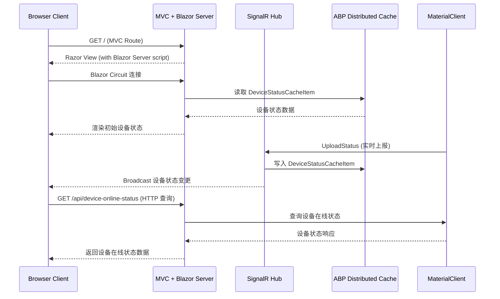

## Why

UrbanManagement 当前是纯 ASP.NET Core MVC 应用，所有 UI 通过 Razor Views + jQuery 渲染。随着设备状态监控、实时数据展示等需求增长，服务端 Blazor 能提供更流畅的交互体验和更好的组件复用。现在 UrbanManagement 已经具备 ABP 基础设施（模块、DI、缓存、SignalR），是引入 ABP Blazor Core 的最佳时机，可以在现有 ABP 架构上自然扩展。

## What Changes

- 在 UrbanManagement 中引入 ABP Blazor Core 依赖，将 Blazor Server 托管集成到现有 ASP.NET Core MVC 应用中
- 创建 ABP Blazor 模块（`UrbanManagementBlazorModule`），注册 Blazor 相关服务和组件
- 配置 Blazor Server 端点与现有 MVC 路由共存
- 建立 Blazor 基础页面结构（Layout、首页），为后续业务页面开发提供脚手架
- 重构现有缓存代码，将 `DeviceStatusAppService` 中残留的原始 `IDistributedCache` 调用替换为类型化缓存（对齐已完成的 `abp-typed-device-cache` 规范）
- 在 MaterialClient 中补充设备在线状态 HTTP API 接口，供 UrbanManagement Blazor 页面查询

## Capabilities

### New Capabilities
- `abp-blazor-server-hosting`: ABP Blazor Server 托管集成 — 在 UrbanManagement 中配置 Blazor Server rendering，包括模块定义、服务注册、端点路由和基础页面结构
- `blazor-device-status-page`: Blazor 设备状态页面 — 基于 Blazor 组件实现设备在线状态监控页面，消费 SignalR 实时数据和缓存 API

### Modified Capabilities

_无现有规范级别的行为变更。缓存代码重构的实现已由 `abp-typed-device-cache` 规范覆盖，本次仅完成该规范的剩余实现工作。_

## Impact

| Repository | Module | Impact |
|---|---|---|
| UrbanManagement | App 层 | 新增 Blazor Server 端点配置、Razor Components 页面、静态资源 |
| UrbanManagement | Core 层 | 引入 Volo.Abp.AspNetCore.Components 包、新增 Blazor 模块定义、缓存重构残余清理 |
| MaterialClient | Urban 模块 | 新增设备在线状态 HTTP API 端点供外部查询 |
| monospec (主仓库) | 配置 | 无变更（monospecs.yaml 已存在且配置完整） |

## Change Map

| File Path | Change Type | Change Reason | Impact Scope |
|---|---|---|---|
| UrbanManagement.Core.csproj | Modify | 添加 Blazor 相关 NuGet 包引用 | Core 项目编译依赖 |
| UrbanManagement.Core/UrbanManagementCoreModule.cs | Modify | 添加 Blazor 模块依赖声明 | ABP 模块链 |
| UrbanManagement.Core/Modules/UrbanManagementBlazorModule.cs | New | ABP Blazor 模块定义 | Blazor 服务注册 |
| UrbanManagement.App.csproj | Modify | 添加 Blazor Server 相关包引用 | App 项目编译依赖 |
| UrbanManagement.App/UrbanManagementAppModule.cs | Modify | 添加 Blazor 端点映射和路由配置 | Blazor 页面可访问 |
| UrbanManagement.App/Program.cs | Modify | 添加 Blazor Server 中间件（如需） | 请求管道 |
| UrbanManagement.App/Pages/*.razor | New | Blazor 基础页面和 Layout | UI 层 |
| UrbanManagement.App/Components/*.razor | New | 可复用 Blazor 组件（如设备状态卡片） | UI 层 |
| UrbanManagement.Core/Services/DeviceStatusAppService.cs | Modify | 清理残余原始 IDistributedCache 调用 | 缓存层一致性 |
| MaterialClient.Urban/Api/DeviceOnlineStatusApi.cs | New | 设备在线状态 HTTP API | 外部接口 |

## Interaction Flow

