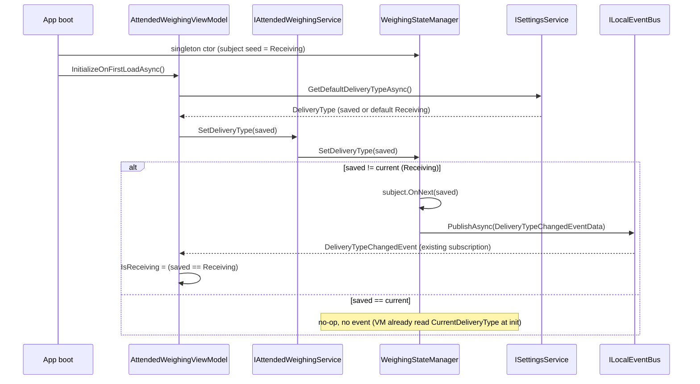
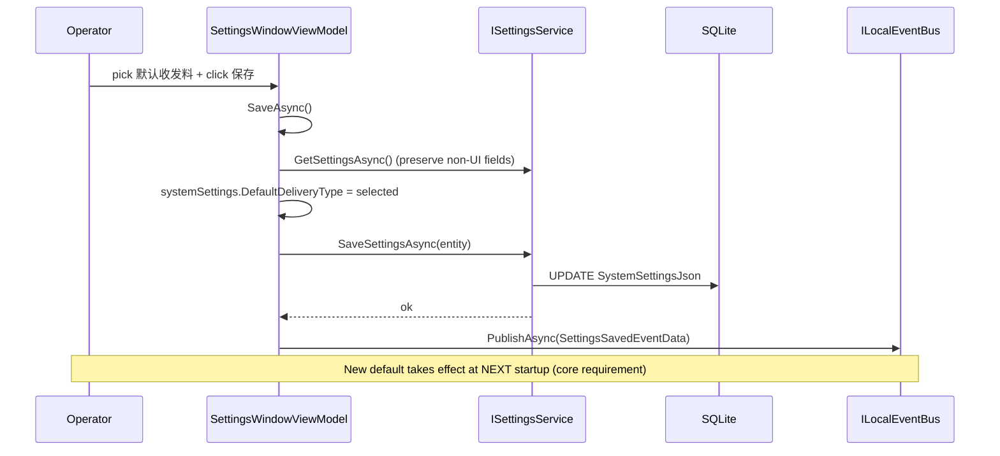

# Design — Default DeliveryType Setting

## Context & Goals

`DeliveryType` (`Receiving`=收料 / `Sending`=发料) decides which direction a weighing cycle matches against. The runtime current value lives in `WeighingStateManager._deliveryTypeSubject` (an ABP `ISingletonDependency`), whose field initializer hardcodes `Receiving`. Nothing reads a preference at boot, so the mode resets every launch.

Goals:
1. Persist an operator-chosen default `DeliveryType`.
2. Expose it as a control in the settings UI.
3. Apply it at attended-weighing startup.
4. Keep the change additive, migration-free, and consistent with the existing `DefaultWeighingMode` pattern.

Non-goals: live-applying the default mid weighing-cycle; consolidating pre-existing duplicated 收料/发料 display strings; changing the on-screen toggle behavior.

## Existing Landscape (from exploration)

| Concern | Today | Reuse for this change |
|---------|-------|----------------------|
| Persisted system prefs | `SystemSettings` (POCO) → `SettingsEntity.SystemSettingsJson` (JSON blob, SQLite) | Add one property — **no migration** |
| Settings read/write | `ISettingsService.GetSettingsAsync()` / `SaveSettingsAsync()`; precedent accessor `GetWeighingModeAsync()` | Reuse + add `GetDefaultDeliveryTypeAsync()` accessor |
| Settings UI | `SettingsWindow.axaml` + `SettingsWindowViewModel` (ReactiveUI `[Reactive]`, Load/Save pattern, 系统设置 pane) | Add one `[Reactive]` field + ComboBox |
| Runtime current mode | `WeighingStateManager` `BehaviorSubject<DeliveryType>` | Unchanged source of truth; mutated via existing `SetDeliveryType` |
| Mode-change propagation | `WeighingStateManager.SetDeliveryType` → `ILocalEventBus.PublishAsync(DeliveryTypeChangedEventData)` → `AttendedWeighingViewModel` subscription updates `IsReceiving` | Reuse as-is |
| Startup settings hook | `AttendedWeighingViewModel.InitializeOnFirstLoadAsync()` already reads `SystemSettings.DefaultWeighingMode` | Add the DeliveryType apply next to it |

## Component / Module Architecture

```
MaterialClient.Common                         [persistence + config + runtime state]
├── Configuration/SystemSettings.cs           ← +DefaultDeliveryType  (new persisted field)
├── Entities/SettingsEntity.cs                (unchanged: SystemSettingsJson blob already carries it)
├── Services/SettingsService.cs               ← +GetDefaultDeliveryTypeAsync()  (thin accessor)
└── Services/AttendedWeighing/
    ├── WeighingStateManager.cs                (unchanged singleton: BehaviorSubject seed stays Receiving)
    └── AttendedWeighingService.cs             (unchanged: SetDeliveryType / CurrentDeliveryType pass-through)

MaterialClient.UI                             [settings surface]
├── ViewModels/SettingsWindowViewModel.cs     ← +[Reactive] DefaultDeliveryType, +options, Load/Save wiring
└── Views/SettingsWindow.axaml                ← +DeliveryType ComboBox in 系统设置 pane

MaterialClient.AttendedWeighing               [startup apply]
└── ViewModels/AttendedWeighingViewModel.cs   ← InitializeOnFirstLoadAsync applies saved default

MaterialClient.Urban                          (untouched — does not reference DeliveryType)
```

Boundary rule: the *preference* lives in `SystemSettings` (Common); the *application* of that preference happens in the attended-weighing startup path. Urban is deliberately out of scope.

## Data Flow

```mermaid
flowchart TD
    subgraph Persist
      UI[SettingsWindowViewModel\nDefaultDeliveryType reactive prop] -->|SaveAsync| SS1[systemSettings.DefaultDeliveryType = value]
      SS1 --> ENT[SettingsEntity.SystemSettingsJson\nJSON serialize] --> DB[(SQLite)]
    end
    subgraph Boot
      START[App start] --> INIT[AttendedWeighingViewModel\nInitializeOnFirstLoadAsync]
      INIT --> GET[_settingsService.GetDefaultDeliveryTypeAsync]
      GET --> DESER[SettingsEntity.SystemSettings\nJSON deserialize]
      DESER --> APPLY[_attendedWeighingService.SetDeliveryType default]
      APPLY --> SMGR[WeighingStateManager\nBehaviorSubject update]
      SMGR -->|if changed| EVT[DeliveryTypeChangedEventData\nvia ILocalEventBus]
      EVT --> ISREC[AttendedWeighingViewModel.IsReceiving\nupdated via existing subscription]
    end
```



## Sequence — Startup Apply



## Sequence — Settings Save



## Detailed Code Change List

| # | File | Change | Detail |
|---|------|--------|--------|
| 1 | `src/MaterialClient.Common/Configuration/SystemSettings.cs` | Add property | `public DeliveryType DefaultDeliveryType { get; set; } = DeliveryType.Receiving;` with XML doc. Import `MaterialClient.Common.Entities.Enums`. |
| 2 | `src/MaterialClient.Common/Services/SettingsService.cs` | Add accessor | `Task<DeliveryType> GetDefaultDeliveryTypeAsync()` on interface + impl; returns `(await GetSettingsAsync()).SystemSettings.DefaultDeliveryType`. Mirrors `GetWeighingModeAsync`. |
| 3 | `src/MaterialClient.UI/ViewModels/SettingsWindowViewModel.cs` | Add reactive prop + options | `[Reactive] private DeliveryType _defaultDeliveryType = DeliveryType.Receiving;`; an options collection for 收料/发料 (single-source labels). |
| 4 | `src/MaterialClient.UI/ViewModels/SettingsWindowViewModel.cs` | Load wiring | In `LoadSettingsAsync`: `DefaultDeliveryType = settings.SystemSettings.DefaultDeliveryType;` |
| 5 | `src/MaterialClient.UI/ViewModels/SettingsWindowViewModel.cs` | Save wiring | In `SaveAsync`, after preserving `systemSettings`: `systemSettings.DefaultDeliveryType = DefaultDeliveryType;` (field is preserved anyway, but explicit for clarity + parity with sibling fields). |
| 6 | `src/MaterialClient.UI/Views/SettingsWindow.axaml` | Add control | `ComboBox` bound to `DefaultDeliveryType` with 收料/发料 options, placed in the 系统设置 pane. |
| 7 | `src/MaterialClient.AttendedWeighing/ViewModels/AttendedWeighingViewModel.cs` | Startup apply | In `InitializeOnFirstLoadAsync`, after reading settings: `var dt = await _settingsService.GetDefaultDeliveryTypeAsync(); _attendedWeighingService?.SetDeliveryType(dt);` (guard for enum validity, fallback Receiving). |
| 8 | `tests/...` | Tests | Persistence round-trip (`SystemSettings.DefaultDeliveryType` survives serialize/deserialize); `SettingsService.GetDefaultDeliveryTypeAsync` returns stored value and defaults to Receiving on empty store; startup-apply VM test asserts `SetDeliveryType` called with saved value. |

**No EF Core migration.** `SystemSettings` is JSON-serialized into the existing `SystemSettingsJson` column. A new property deserializes to its default when absent.

## Design Decisions & Alternatives

- **Where to persist — `SystemSettings` JSON blob (chosen) vs. new DB column.**
  The `DefaultWeighingMode` precedent is already a JSON field on `SystemSettings`; a new column would require a migration for zero behavioral gain. JSON wins. *No backward-compat concern* (change explicitly waives it), and JSON deserialization defaults missing values to `Receiving` anyway.
- **Where to apply at startup — `InitializeOnFirstLoadAsync` (chosen) vs. `WeighingStateManager` constructor.**
  The singleton ctor runs before DI/settings are usable and a field initializer cannot `await`. `InitializeOnFirstLoadAsync` already reads `SystemSettings` for `DefaultWeighingMode` — the natural, async, DI-resolved hook.
- **Accessor method — add `GetDefaultDeliveryTypeAsync()` (chosen) vs. inline `.SystemSettings.DefaultDeliveryType` at call sites.**
  Mirrors the existing `GetWeighingModeAsync()` accessor → consistent, testable, single read path.
- **Scope of application — attended-weighing startup only (chosen).**
  Urban does not reference `DeliveryType`; Recycle/SolidWaste/Standard share `WeighingStateManager`, so they inherit the apply for free.
- **Live-apply on save — out of scope.**
  Requirement is "boot respects the saved default." Mid-cycle live-apply adds state-machine complexity (don't switch during an active weighing cycle) and is deferred.

## Edge Cases & Risks

- **Stored enum value invalid / unknown.** `DeliveryType` is a 2-value enum and stable; still, guard the apply with a fallback to `Receiving` when deserialized value is not a defined enum member (`Enum.IsDefined`).
- **Save drops the field?** No — `SaveAsync` preserves existing `SystemSettings` and only overwrites known fields; the new field is explicitly set. Verified against the existing preserve-non-UI pattern (comment at `SettingsWindowViewModel` ~line 220).
- **`SetDeliveryType` no-op when saved == current.** Intentional and correct: VM already seeds `IsReceiving` from `CurrentDeliveryType`; no spurious event fires.
- **Thread/Dispose.** All event plumbing reuses the existing `DeliveryTypeChangedEventData` subscription with `DisposeWith(_disposables)`; no new lifecycle surface.

## Testing Strategy

- **Unit (Common):** `SystemSettings` round-trips `DefaultDeliveryType` through `JsonSerializer`; `SettingsService.GetDefaultDeliveryTypeAsync` returns persisted value, defaults to `Receiving` on empty store.
- **Unit (UI VM):** `SettingsWindowViewModel` Load populates `DefaultDeliveryType` from settings; Save writes it back (mocked `ISettingsService`).
- **Unit (attended weighing):** `InitializeOnFirstLoadAsync` calls `SetDeliveryType` with the saved value; with saved=Sending, the manager's current becomes Sending.
- **Manual:** toggle default to 发料, save, restart, confirm boot shows 发料; toggle back to 收料, restart, confirm 收料.
