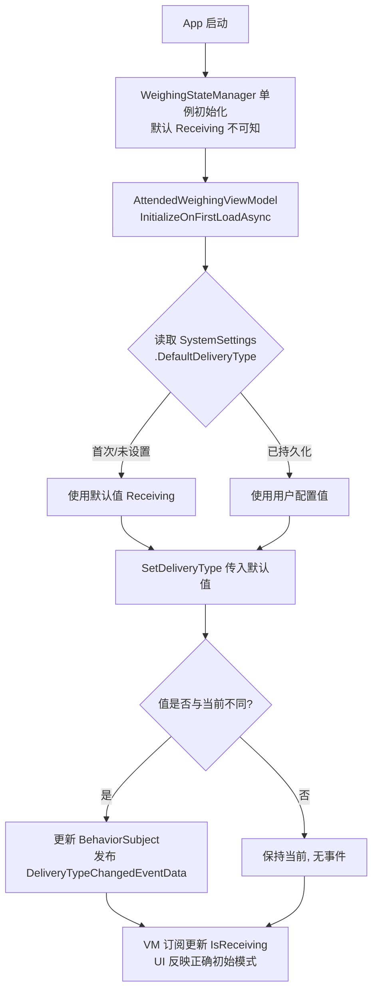
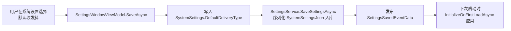

## Why

The MaterialClient weighing client always boots into `DeliveryType.Receiving`. The runtime source of truth — `WeighingStateManager._deliveryTypeSubject` — is a singleton field initializer hardcoded to `Receiving`, so every restart discards the operator's last-used mode. For sites that predominantly run 发料 (Sending), operators must manually re-toggle the mode after every launch, which is error-prone (an unnoticed wrong mode can mis-match a waybill against the wrong delivery direction).

This change makes the default delivery type a persisted, user-configurable preference — mirroring the existing `SystemSettings.DefaultWeighingMode` precedent.

## What Changes

- **New persisted setting** `SystemSettings.DefaultDeliveryType` (`DeliveryType`, default `Receiving`). Stored inside the existing `SystemSettingsJson` blob — **no EF Core migration, no schema change** (JSON-serialized, additive, backward-compatible by default).
- **New settings UI control**: a DeliveryType selector added to the 系统设置 (System Settings) pane of `SettingsWindow`, with options 收料 / 发料 sourced from one place (single-source-of-truth compliance).
- **Startup apply**: on first page load, read the saved default and call `IAttendedWeighingService.SetDeliveryType(...)` instead of leaving the singleton stuck on `Receiving`.
- **Default handling**: first run (no stored value) yields `Receiving`; subsequent runs honor the persisted choice.
- **Scope (assumption, non-interactive)**: the setting is global in `SystemSettings` but is *applied* only on the attended-weighing startup path (`AttendedWeighingViewModel.InitializeOnFirstLoadAsync`). The Urban module does not reference `DeliveryType`, so it is unaffected. This matches where `DeliveryType` is meaningful today (Standard / SolidWaste / Recycle attended flows).

No breaking changes. No new NuGet dependencies.

## Capabilities

### New Capabilities
- `default-delivery-type-setting`: Persist a default `DeliveryType` preference, expose it in the settings UI, and apply it at attended-weighing startup so the boot mode follows the operator's choice instead of a hardcoded `Receiving`.

### Modified Capabilities
<!-- None. This change adds a new setting and integrates with the existing settings-ui and system-configuration
     capabilities, but does not alter the spec-level requirements of either. -->

## Proposal UI Prototype

New control inserted into the 系统设置 pane, near the existing system toggles (auto-start, printer, LPR device, etc.):

```
┌─ 系统设置 ───────────────────────────────────────────────────┐
│                                                              │
│  开机自启        [ ]                                          │
│  打印功能        [ ]                                          │
│  ...                                                         │
│                                                              │
│  默认收发料:    ┌──────────────┐                             │
│                │ 收料 (Receiving) ▼ │   ← new ComboBox       │
│                └──────────────┘                             │
│                  options: 收料 (Receiving) / 发料 (Sending)  │
│                                                              │
│         [ 保存 ]   [ 取消 ]                                  │
└──────────────────────────────────────────────────────────────┘
```

On the weighing main view, the existing 收料/发料 toggle remains unchanged — the new setting only decides the *initial* state at boot:

```
┌─ 称重主界面 ─────────────────────────────────────────────────┐
│   [ 收料 ] [ 发料 ]   ← initial highlight now follows saved   │
│                       default instead of always 收料         │
└──────────────────────────────────────────────────────────────┘
```

## Interaction Flow



User-config path (settings window → persistence):



## Change Map (code change table)

| File | Change type | Why | Impact area |
|------|-------------|-----|-------------|
| `MaterialClient.Common/Configuration/SystemSettings.cs` | **Add field** | New `DefaultDeliveryType` property, default `Receiving` — the persisted preference | Configuration / persistence model |
| `MaterialClient.UI/ViewModels/SettingsWindowViewModel.cs` | **Modify** | Add `[Reactive]` selected-default field, options collection, and Load/Save wiring | Settings UI ViewModel |
| `MaterialClient.UI/Views/SettingsWindow.axaml` | **Modify** | Add DeliveryType `ComboBox` to the 系统设置 pane | Settings UI view |
| `MaterialClient.AttendedWeighing/ViewModels/AttendedWeighingViewModel.cs` | **Modify** | Apply saved default in `InitializeOnFirstLoadAsync` via `SetDeliveryType` | Attended-weighing startup |
| `tests/...` | **Add** | Unit tests for persistence round-trip + startup apply | Test layer |

**No EF Core migration** — `SystemSettings` is JSON-serialized into the existing `SystemSettingsJson` column, so a new property is additive.

## Impact

- **Affected code**: `MaterialClient.Common` (config model), `MaterialClient.UI` (settings VM + view), `MaterialClient.AttendedWeighing` (startup apply). No service/domain/repository signature changes beyond reusing existing `ISettingsService.GetSettingsAsync()` and `IAttendedWeighingService.SetDeliveryType()`.
- **Persistence**: SQLite via existing `SettingsEntity.SystemSettingsJson` blob. No schema migration; no DBA involvement.
- **Dependencies**: none added. Reuses ReactiveUI `[Reactive]`, ABP `ILocalEventBus` (`DeliveryTypeChangedEventData` already wired), and existing `ISettingsService`.
- **Cross-module**: Urban module untouched (does not reference `DeliveryType`). Recycle/SolidWaste/Standard attended flows benefit automatically because they share `WeighingStateManager`.
- **User experience**: operators at 发料-dominant sites no longer need to re-toggle after every launch; removes a class of "wrong initial mode" mistakes.
- **Out of scope**: consolidating the pre-existing duplicated 收料/发料 display strings scattered across `SolidWasteService`/`StandardModeService`/`StandardService`/`AttendedWeighingDetailViewModelBase` (noted as related tech debt, not part of this change); live-applying the default on settings-save mid-cycle (the new default takes effect at next startup — the stated requirement).
