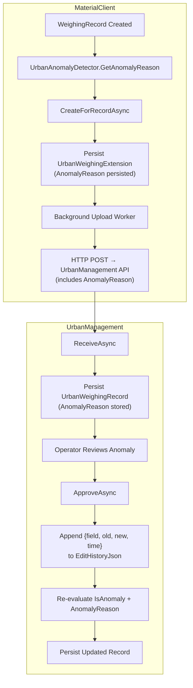
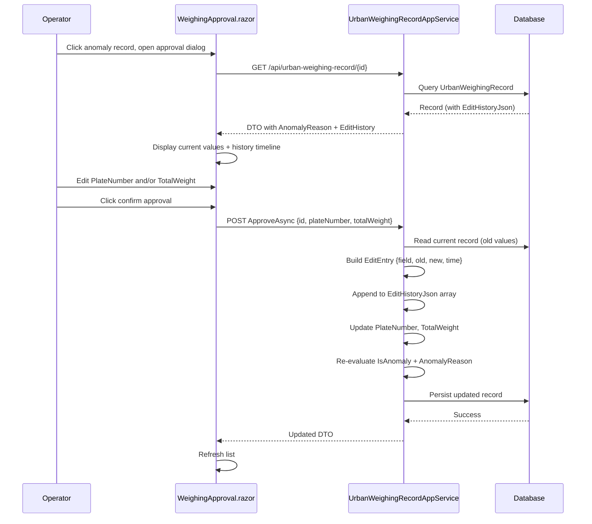

## Context

`UrbanWeighingExtension`（MaterialClient 侧）当前仅有 5 个字段：`WeighingRecordId`、`SyncStatus`、`RetryCount`、`LastErrorTime`、`IsAnomaly`。异常原因（AnomalyReason）通过 `UrbanAnomalyDetector.GetAnomalyReason()` 在列表查询时实时计算，未持久化。UrbanManagement 服务端的 `UrbanWeighingRecord` 实体没有 AnomalyReason 字段。审批流程（`ApproveAsync`）直接覆写 PlateNumber/TotalWeight，零修改记录。

MaterialClient 使用 SQLite（通过 EF Core），已有 JSON 列先例（`WeighingRecord.MaterialsJson`）。UrbanManagement 使用 SQL Server（ABP 框架）。两端通过 HTTP API 同步数据。

## Goals / Non-Goals

**Goals:**
- AnomalyReason 在记录创建时持久化到 `UrbanWeighingExtension`，无需实时重算
- 修改历史（车牌号、重量）以 JSON 数组存储在 `EditHistoryJson` 字段
- 审批流自动追加修改记录，包含字段名、旧值、新值、时间戳
- 双端数据模型保持同步（MaterialClient + UrbanManagement）
- UrbanManagement 列表和审批 UI 展示 AnomalyReason 和修改历史

**Non-Goals:**
- 不做修改历史的独立审计表（JSON 内嵌足够，避免额外表和 JOIN 复杂度）
- 不做修改历史的前端编辑或删除
- 不做 UrbanManagement 向 MaterialClient 的回传（单向同步：Client → Server）
- 不做 AnomalyReason 的手动编辑（仅由检测器自动生成）

## Decisions

### Decision 1: JSON 内嵌修改历史 vs 独立历史表

**选择**: JSON 字段 `EditHistoryJson`

**理由**:
- 修改频率极低（仅审批时触发），数据量小（每条记录最多几次修改）
- MaterialClient 使用 SQLite，独立表意味着 JOIN 查询和额外的迁移复杂度
- 已有 `MaterialsJson` 先例，团队熟悉此模式
- 无需对修改历史做复杂查询（仅按记录 ID 展示）

**替代方案**: 独立 `UrbanWeighingRecordHistory` 表 — 更规范化，但对当前场景过度设计。

### Decision 2: AnomalyReason 持久化时机

**选择**: 在 `UrbanWeighingExtensionService.CreateForRecordAsync` 中计算并持久化

**理由**:
- 创建时已有 `WeighingRecord` 实体和 `UrbanAnomalyDetectionConfig`，可直接调用 `GetAnomalyReason`
- 避免在列表查询时重复计算（当前实现每次查询都调用 `GetAnomalyReason`）
- 审批后重算时同步更新持久化值

### Decision 3: EditHistoryJson 数据结构

**选择**: JSON 数组，每个元素为修改记录对象

```json
[
  {
    "field": "PlateNumber",
    "oldValue": "京A12345",
    "newValue": "京B67890",
    "changedAt": "2026-06-11T10:30:00+08:00"
  }
]
```

**理由**:
- 简单、可读、无需额外解析逻辑
- `MaterialClient.Common` 中已有 `JsonSerializer` 的使用模式
- `[NotMapped]` 计算属性模式与 `Materials` 一致

### Decision 4: 双端字段同步策略

**选择**: MaterialClient 的 `UrbanWeighingExtension` 和 UrbanManagement 的 `UrbanWeighingRecord` 各自独立添加字段，通过上传 API payload 传递

**理由**:
- 两端实体结构本身不同（MaterialClient 是扩展实体，UrbanManagement 是完整记录实体）
- 已有的 `ReceiveAsync` DTO 模式支持新增可选字段
- 无需共享代码或 NuGet 包同步

### Decision 5: 审批流程中修改历史的写入位置

**选择**: MaterialClient 侧在 ViewModel/Service 层写入，UrbanManagement 侧在 `ApproveAsync` 中写入

**理由**:
- MaterialClient 是审批交互的发起端，用户在此修改数据
- UrbanManagement 也需要记录（服务端审批场景），保持双端一致
- `ReceiveAsync` 负责接收 MaterialClient 的修改历史并持久化到服务端

## Architecture

```
Component Architecture (Cross-Repo)

MaterialClient                              UrbanManagement
┌──────────────────────┐                    ┌──────────────────────────┐
│ UrbanWeighingExtension│                    │ UrbanWeighingRecord       │
│  ├─ WeighingRecordId  │──── Upload API ───▶│  ├─ AnomalyReason (NEW)  │
│  ├─ AnomalyReason(NEW)│                    │  ├─ EditHistoryJson(NEW)│
│  ├─ EditHistoryJson │                    │  ├─ PlateNumber            │
│  │   (NEW)            │                    │  ├─ TotalWeight            │
│  ├─ IsAnomaly         │                    │  └─ IsAnomaly             │
│  └─ SyncStatus        │                    ├──────────────────────────┤
├──────────────────────┤                    │ UrbanWeighingRecordService│
│ UrbanWeighingExtension│                    │  ├─ ReceiveAsync()        │
│   Service             │                    │  │   → persist AnomalyR.   │
│  ├─ CreateForRecord() │                    │  │   → persist EditHist. │
│  │   → calc + persist │                    │  ├─ ApproveAsync()        │
│  │     AnomalyReason  │                    │  │   → append edit hist  │
│  ├─ AppendEditEntry │                    │  └─ GetListAsync()        │
│  └─ GetPagedList()    │                    ├──────────────────────────┤
├──────────────────────┤                    │ UI (Blazor)               │
│ Approval ViewModel    │                    │  ├─ WeighingRecord.razor  │
│  ├─ Edit Plate/Weight │                    │  │   → show AnomalyReason  │
│  └─ Append history    │                    │  └─ WeighingApproval.razor│
└──────────────────────┘                    │      → show edit history│
                                           └──────────────────────────┘
```

## Data Flow



## API Sequence: Approval with History Tracking



## Detailed File Change Inventory

### MaterialClient

| File Path | Change Type | Description |
|---|---|---|
| `src/MaterialClient.Common/Entities/Urban/UrbanWeighingExtension.cs` | Add properties | 新增 `AnomalyReason` (string?)、`EditHistoryJson` (string?) 属性；新增 `[NotMapped]` 计算属性 `EditHistory` (List\<EditEntry\>) |
| `src/MaterialClient.Common/Entities/Urban/EditEntry.cs` | New file | 定义 `EditEntry` POCO: Field, OldValue, NewValue, ChangedAt |
| `src/MaterialClient.Common/EntityFrameworkCore/MaterialClientDbContext.cs` | Update config | OnModelCreating 中配置 AnomalyReason 为 max-length 32、EditHistoryJson 为 nullable text列 |
| `src/MaterialClient.Common/Migrations/` | New migration | 新增 AnomalyReason 和 EditHistoryJson 两列到 UrbanWeighingExtensions 表 |
| `src/MaterialClient.Common/Services/Urban/UrbanWeighingExtensionService.cs` | Modify methods | `CreateForRecordAsync` 中调用 `GetAnomalyReason` 并持久化；`GetPagedListItemsAsync` 改为从持久化字段读取 AnomalyReason；新增 `AppendEditEntryAsync` 方法 |
| `src/MaterialClient.Common/Services/Urban/IUrbanWeighingExtensionService.cs` | Add method | 接口新增 `AppendEditEntryAsync` |
| `src/MaterialClient.Common/Services/Urban/UrbanWeighingUploadService.cs` | Modify payload | 上传 DTO 包含 AnomalyReason 和 EditHistoryJson |
| `src/MaterialClient.Common/Dtos/Urban/UrbanWeighingListItemDto.cs` | No change | AnomalyReason 字段已存在，来源从实时计算改为持久化字段读取（服务层变更） |

### UrbanManagement

| File Path | Change Type | Description |
|---|---|---|
| `src/UrbanManagement.Core/Entities/UrbanWeighingRecord.cs` | Add properties | 新增 `AnomalyReason` (string?)、`EditHistoryJson` (string?) 属性 |
| `src/UrbanManagement.Core/Models/UrbanWeighingRecordOutputDto.cs` | Add properties | 新增 `AnomalyReason`、`EditHistoryJson` 到 DTO 和 `FromEntity` 映射 |
| `src/UrbanManagement.Core/Models/UrbanWeighingRecordReceiveInputDto.cs` | Add properties | 新增 `AnomalyReason`、`EditHistoryJson` 到接收 DTO |
| `src/UrbanManagement.Core/Services/UrbanWeighingRecordAppService.cs` | Modify methods | `ReceiveAsync` 接收并持久化新字段；`ApproveAsync` 追加修改历史、重算 AnomalyReason |
| `src/UrbanManagement.Core/EntityFrameworkCore/UrbanManagementDbContext.cs` | Update config | Fluent API 配置新字段 |
| `src/UrbanManagement.App/Pages/WeighingRecord.razor` | Modify UI | 列表新增 AnomalyReason 列 |
| `src/UrbanManagement.App/Pages/WeighingApproval.razor` | Modify UI | 审批弹窗新增修改历史展示区域 |

## Risks / Trade-offs

- **[JSON 字段不可查询]** → 修改历史无法通过 SQL WHERE 查询特定字段变更。可接受：修改历史仅在单条记录详情页展示，不需要跨记录搜索。
- **[JSON 体积增长]** → 极端情况下同一记录被反复修改可能产生大量历史条目。可接受：审批场景修改次数通常 1-3 次，且 JSON 条目体积极小（每条 < 200 bytes）。
- **[双端 AnomalyReason 不一致风险]** → MaterialClient 在创建时写入 AnomalyReason，UrbanManagement 在 ApproveAsync 时重算。如果配置阈值不同步可能导致差异。缓解：两端共用相同的默认阈值（UpperLimit: 30t, LowerLimit: 2t, Deviation: 10%），且 UrbanManagement 端使用服务端配置。
- **[SQLite 迁移限制]** → SQLite 不支持 DROP COLUMN，新增列不需要移除旧列，无风险。

## Open Questions

（无 — 设计决策已全部明确）
