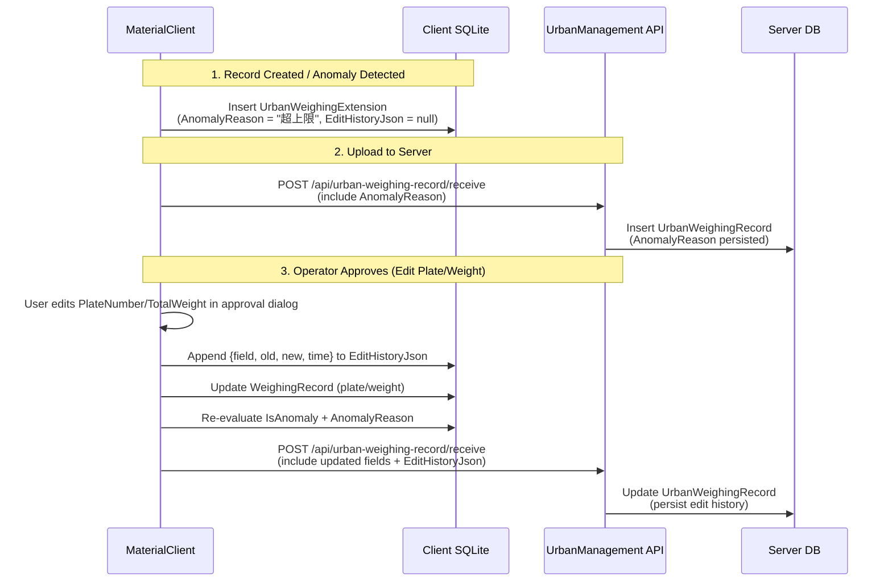

## Why

`UrbanWeighingExtension` 目前只有 `IsAnomaly` 布尔标志，缺少异常原因（AnomalyReason）的持久化存储——原因仅在 MaterialClient 列表查询时实时计算（`UrbanAnomalyDetector.GetAnomalyReason`），UrbanManagement 服务端完全没有此字段。同时审批流（`ApproveAsync`）直接覆写 `PlateNumber` 和 `TotalWeight`，不记录任何修改轨迹，无法回溯变更。

## What Changes

- 在 `UrbanWeighingExtension`（MaterialClient）新增 `AnomalyReason`（`string?`）字段，持久化异常原因
- 在 `UrbanWeighingExtension`（MaterialClient）新增 `EditHistoryJson`（`string?`）字段，以 JSON 数组存储车牌号和重量的修改历史
- 将上述两个字段同步到 UrbanManagement 的 `UrbanWeighingRecord` 实体和对应 DTO
- 审批流程中记录修改前后值，追加到 `EditHistoryJson`
- 新增 EF Core 迁移（MaterialClient 侧）
- UrbanManagement 服务端 `ReceiveAsync` 接收新字段、`ApproveAsync` 写入修改历史

## Interaction Flow

## Capabilities

### New Capabilities
- `anomaly-reason-persistence`: AnomalyReason 字段持久化到 UrbanWeighingExtension，双端（MaterialClient + UrbanManagement）数据模型同步
- `edit-history-tracking`: 车牌号和重量修改历史的 JSON 存储机制，审批流中自动记录变更轨迹，支持双端同步

### Modified Capabilities
- `urban-weighing-extension`: UrbanWeighingExtension 实体新增 AnomalyReason 和 EditHistoryJson 两个字段，修改现有 spec 中的实体结构要求
- `urban-weighing-approval-enhancements`: 审批流程扩展，在 UpdateWeighingRecordAsync 成功后追加修改历史记录

## Code Change Table

| File Path (MaterialClient) | Change Type | Change Reason |
|---|---|---|
| `MaterialClient.Common/Entities/Urban/UrbanWeighingExtension.cs` | Add fields | 新增 `AnomalyReason`、`EditHistoryJson` 属性 |
| `MaterialClient.Common/EntityFrameworkCore/MaterialClientDbContext.cs` | Update config | Fluent API 配置新字段 |
| `MaterialClient.Common/Migrations/` | New migration | EF Core 迁移新增列 |
| `MaterialClient.Common/Services/Urban/UrbanWeighingExtensionService.cs` | Modify | CreateForRecordAsync 持久化 AnomalyReason；新增修改历史追加方法 |
| `MaterialClient.Common/Dtos/Urban/UrbanWeighingListItemDto.cs` | Verify | 确认 AnomalyReason 从持久化字段读取（而非实时计算） |
| `MaterialClient.Common/Services/Urban/UrbanWeighingUploadService.cs` | Modify | 上传 payload 包含新字段 |

| File Path (UrbanManagement) | Change Type | Change Reason |
|---|---|---|
| `UrbanManagement.Core/Entities/UrbanWeighingRecord.cs` | Add fields | 新增 `AnomalyReason`、`EditHistoryJson` 属性 |
| `UrbanManagement.Core/Models/UrbanWeighingRecordOutputDto.cs` | Add fields | DTO 同步新增字段 |
| `UrbanManagement.Core/Models/UrbanWeighingRecordReceiveInputDto.cs` | Add fields | 接收 DTO 同步新增字段 |
| `UrbanManagement.Core/Services/UrbanWeighingRecordAppService.cs` | Modify | ReceiveAsync 接收并持久化新字段；ApproveAsync 追加修改历史 |
| `UrbanManagement.Core/EntityFrameworkCore/UrbanManagementDbContext.cs` | Update config | Fluent API 配置新字段 |
| `UrbanManagement.App/Pages/WeighingRecord.razor` | Modify | 列表显示 AnomalyReason |
| `UrbanManagement.App/Pages/WeighingApproval.razor` | Modify | 审批弹窗展示修改历史 |

## Impact

- MaterialClient: `UrbanWeighingExtension` 实体 + 迁移 + 服务层变更
- UrbanManagement: `UrbanWeighingRecord` 实体 + DTO + 服务层 + UI 展示变更
- 上传协议（MaterialClient → UrbanManagement）payload 新增两个可选字段
- 无向后兼容需求
