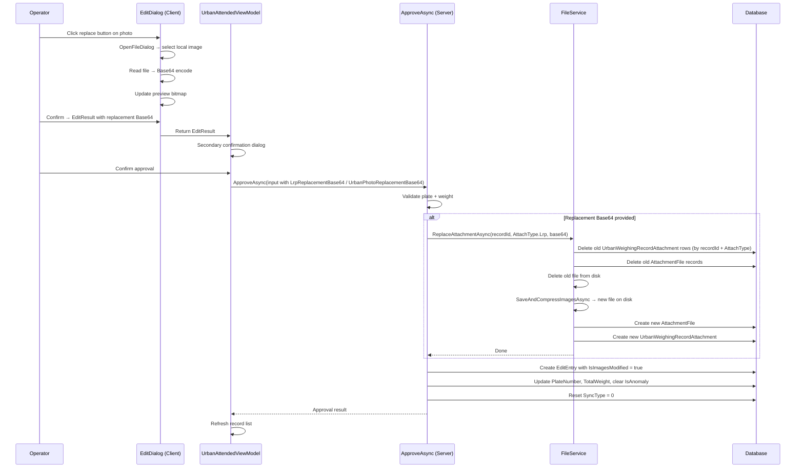

## Context

UrbanManagement 审批流程（`UrbanWeighingRecordAppService.ApproveAsync`）当前仅接受 `PlateNumber` 和 `TotalWeight` 修改，不涉及附件变更。`urbanmanagement-weighing-record-approval` 规范明确声明"Approval does not modify attachments"。MaterialClient.Urban 的审批编辑弹窗（`WeighingRecordEditDialog`）展示 Lrp 和 UrbanPhoto 预览图，但仅支持查看和点击放大，无替换操作。

`EditEntry` 模型中 `IsImagesModified` 字段已于早期版本预留（注释："预留字段，当前功能未实现"），`EditHistoryTimeline.razor` 中已有对应徽章渲染逻辑（显示"图片已修改"），但因从未赋 `true` 而不可见。

图片存储架构：`AttachmentFile` 实体通过 `UrbanWeighingRecordAttachment` 多对多关联到 `UrbanWeighingRecord`，`FileService` 负责磁盘读写与 JPEG 压缩。`AttachType` 枚举中 `Lrp = 5`、`UrbanPhoto = 6`。

两端技术栈：UrbanManagement 为 ABP Blazor Server + EF Core + LayUI；MaterialClient.Urban 为 Avalonia + ReactiveUI + ABP。

## Goals / Non-Goals

**Goals:**

- 客户端审批弹窗支持 Lrp / UrbanPhoto 图片替换（本地文件选择 → Base64 编码 → 实时预览）
- 服务端审批接口扩展接收替换图片，执行旧附件删除 + 新附件创建 + 关联更新
- 激活 `EditEntry.IsImagesModified` 预留字段，替换图片时标记为 `true`
- Lrp 为空时客户端与 Web 端均显示"抓拍异常"提示

**Non-Goals:**

- 不保留旧图片（替换即丢弃，无版本历史）
- 不修改政府同步流程（`GovSyncManager` 读取附件逻辑不变）
- 不修改非审批场景的附件上传（`UrbanAttachmentAppService.UploadAsync` 不变）
- 不新增独立的"图片管理"API 或 UI
- 不处理视频或非图片附件类型
- 不实现图片预览编辑（裁剪、标注等）

## Decisions

### D-01: 将图片替换嵌入 ApproveAsync 而非独立 API

**选择**: 在 `UrbanWeighingRecordApproveInputDto` 中新增可选的 `LrpReplacementBase64` 和 `UrbanPhotoReplacementBase64` 字段，由 `ApproveAsync` 在同一事务中完成图片替换和记录更新。

**替代方案**: 创建独立 `ReplaceAttachmentAsync(recordId, attachType, base64)` API，审批流程在 ApproveAsync 之前/之后调用。

**理由**:
- 图片替换仅在审批场景使用，无需通用化
- 单事务保证原子性——替换图片和更新记录要么同时成功要么同时失败
- 避免两步 API 调用带来的一致性风险
- 符合"审批流程内完成所有变更"的业务语义

**权衡**: ApproveAsync 职责略增，但图片替换逻辑简单（删除旧 → 写新 → 更新关联），不会导致方法过于复杂。

### D-02: 图片替换委托给 IFileService 新方法

**选择**: 在 `IFileService` 接口新增 `ReplaceAttachmentAsync(Guid recordId, AttachType attachType, string base64Image)` 方法，`FileService` 负责删除旧附件文件和关联、保存新图片并创建新附件和关联。

**替代方案**: 直接在 `ApproveAsync` 中操作仓储和文件系统。

**理由**:
- 文件 I/O 和附件管理是 `FileService` 的既有职责
- 保持 `AppService` 层专注业务编排
- `ReplaceAttachmentAsync` 可被单元测试独立验证

### D-03: 客户端通过 EditResult 传递替换图片

**选择**: 扩展 `WeighingRecordEditDialogViewModel.EditResult` record，新增 `LrpReplacementBase64?` 和 `UrbanPhotoReplacementBase64?` 字段。`UrbanAttendedWeighingViewModel` 在审批流程中将这些字段传递至服务调用。

**替代方案**: 在 ViewModel 中直接调用上传 API。

**理由**:
- 遵循现有审批流程模式——Dialog 返回 EditResult → ViewModel 执行后续操作
- 保持 Dialog ViewModel 无外部服务依赖（除已有的 AttachmentService）
- 替换图片数据随审批结果一起传递，流程清晰

### D-04: UrbanManagement Web 端暂不实现图片替换 UI

**选择**: 本次仅修改服务端 API 和客户端（MaterialClient.Urban）UI，UrbanManagement Web 端的 `WeighingApproval.razor` 审批弹窗仅增加 Lrp 空异常提示和 IsImagesModified 徽章展示，不增加图片替换交互。

**理由**:
- 变更描述以客户端为主要编辑仓库
- Web 端图片替换涉及文件上传 UI（Base64 / multipart），复杂度较高
- 服务端 API 已就绪，Web 端可后续独立添加

## Architecture

```
Component / Module Hierarchy
├── MaterialClient.Urban (Client - Avalonia)
│   ├── Views/Dialogs/WeighingRecordEditDialog.axaml
│   │   └── Photo preview area + replace button overlay + Lrp anomaly hint
│   ├── ViewModels/WeighingRecordEditDialogViewModel.cs
│   │   └── ReplaceLrpCommand, ReplaceUrbanPhotoCommand, file picker + Base64
│   └── ViewModels/UrbanAttendedWeighingViewModel.cs
│       └── ApproveRecordAsync passes replacement Base64 to server call
│
├── MaterialClient.UI (Shared)
│   └── (unchanged - ImageViewerWindow, converters)
│
├── MaterialClient.Common (Shared Domain)
│   └── (unchanged - AttachmentFile, AttachType, AttachmentService)
│
├── UrbanManagement.Core (Server Domain)
│   ├── Models/UrbanWeighingRecordDtos.cs
│   │   └── UrbanWeighingRecordApproveInputDto + LrpReplacementBase64, UrbanPhotoReplacementBase64
│   ├── Services/UrbanWeighingRecordAppService.cs
│   │   └── ApproveAsync: calls FileService.ReplaceAttachmentAsync, sets IsImagesModified
│   └── Services/FileService.cs
│       └── ReplaceAttachmentAsync: delete old file + junction, save new file + junction
│
└── UrbanManagement.App (Server Web)
    ├── Pages/WeighingApproval.razor
    │   └── Lrp empty → show "抓拍异常" in photo preview
    └── Pages/Components/WeighingPhotoPreview.razor
        └── Lrp empty → show anomaly hint text
```

## API Sequence



## Detailed Code Change Inventory

### UrbanManagement

| File | Change Type | Change Description | Affected Module |
|------|-------------|-------------------|-----------------|
| `Core/Models/UrbanWeighingRecordDtos.cs` | Modify | Add `LrpReplacementBase64?` and `UrbanPhotoReplacementBase64?` to `UrbanWeighingRecordApproveInputDto` | DTO Layer |
| `Core/Services/IFileService.cs` | Modify | Add `Task ReplaceAttachmentAsync(Guid recordId, AttachType attachType, string base64Image)` method signature | Service Interface |
| `Core/Services/FileService.cs` | Modify | Implement `ReplaceAttachmentAsync`: query existing attachments by recordId + attachType, delete junction rows + AttachmentFile entities + disk files, then call existing `SaveAndCompressImagesAsync` and create new junction rows | Service Implementation |
| `Core/Services/UrbanWeighingRecordAppService.cs` | Modify | In `ApproveAsync`: conditionally call `ReplaceAttachmentAsync` for non-null replacement fields, set `IsImagesModified = true` on the new `EditEntry` when any replacement occurred | AppService |
| `App/Pages/WeighingApproval.razor` | Modify | Pass replacement images from photo preview to approval call; display IsImagesModified badge | Web UI |
| `App/Pages/Components/WeighingPhotoPreview.razor` | Modify | Add "抓拍异常" text when Lrp is null/empty; add Lrp anomaly CSS styling | Web Component |

### MaterialClient

| File | Change Type | Change Description | Affected Module |
|------|-------------|-------------------|-----------------|
| `Urban/Views/Dialogs/WeighingRecordEditDialog.axaml` | Modify | Add replace button overlay on each photo section; add "抓拍异常" warning when Lrp is empty | Dialog View |
| `Urban/ViewModels/WeighingRecordEditDialogViewModel.cs` | Modify | Add `LrpReplacementBase64?` and `UrbanPhotoReplacementBase64?` properties; add `ReplaceLrpCommand` and `ReplaceUrbanPhotoCommand` (file picker + Base64 encode + update preview); extend `EditResult` with replacement fields | Dialog ViewModel |
| `Urban/ViewModels/UrbanAttendedWeighingViewModel.cs` | Modify | In `ApproveRecordAsync`: extract replacement Base64 from EditResult and pass to server call | Main ViewModel |

## Risks / Trade-offs

**[Risk] Base64 图片嵌入审批请求增加 payload 体积** → 单张 JPEG 压缩后通常 50-200KB，两张最多 ~400KB Base64 (~533KB)，在局域网场景下可接受。若未来有性能需求，可改用 multipart upload。

**[Risk] 删除旧文件失败（权限/锁定）导致替换中断** → `ReplaceAttachmentAsync` 应先完成新文件写入和关联创建，再删除旧文件和旧关联，确保失败时可重试。若旧文件删除失败，记录警告日志但不阻塞流程。

**[Risk] 并发审批竞争** → 同一记录不太可能被两个操作员同时审批（前端仅在异常列表显示，审批后记录变为正常不可再审批）。若需防护，可在 `ApproveAsync` 的 `IsAnomaly` 校验处拦截。

**[Trade-off] UrbanManagement Web 端暂不支持图片替换** → 服务端 API 已就绪，Web 端可在后续独立添加，不影响本次交付。
