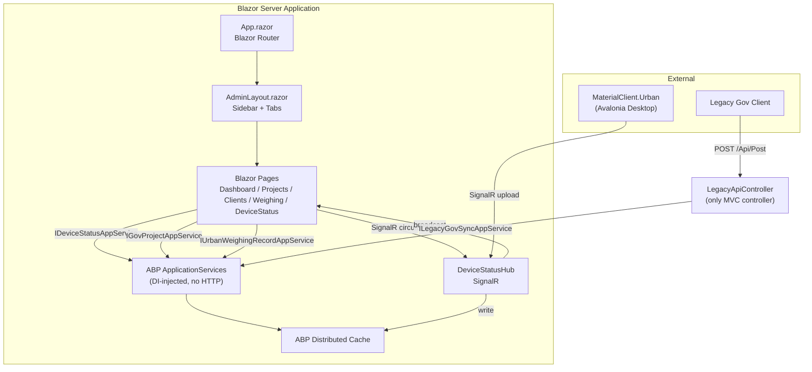
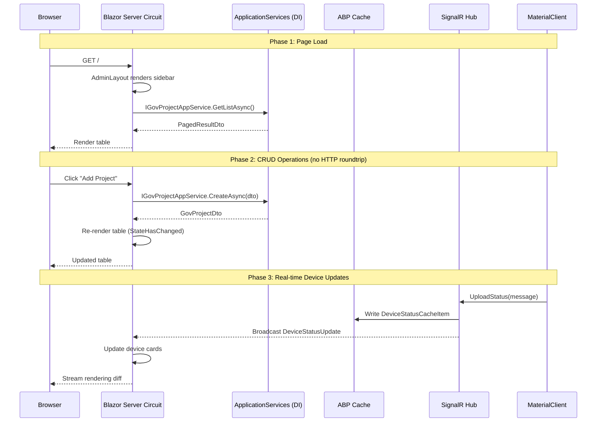

## Context

UrbanManagement is an ABP 10.0.1 / .NET 10 application using SQLite, SignalR, and Blazor Server for a device monitoring dashboard. The current architecture is a hybrid: 7 MVC controllers render 9 cshtml views using jQuery + Layui + Bootstrap (CDN-loaded), while a single Blazor page (`DeviceStatus.razor`) exists at `/blazor/device-status`. The Blazor Server infrastructure is fully configured and working — `Volo.Abp.AspNetCore.Components.Server` is in App.csproj, `AddServerSideBlazor()` is called in AppModule, `_Host.cshtml` / `App.razor` / `MainLayout.razor` / `Error.razor` all exist.

The existing MVC views use:
- **Home/Index.cshtml** — Layui admin shell (sidebar + iframe tabs, ~220 lines of JS for tab management, context menus, fullscreen toggle)
- **MainPage/Index.cshtml** — ECharts dashboard with static placeholder data
- **Project/Index.cshtml** — jQuery AJAX CRUD table calling `GovProjectApiController` (manually routed, duplicates `GovProjectAppService`)
- **Project/Add.cshtml** — Empty form, redirects to Index (legacy artifact)
- **ClientManagement/Index.cshtml** — Client connection list with SignalR real-time updates (~450 lines)
- **ClientManagement/Detail.cshtml** — Device status cards with SignalR per-client filtering (~400 lines)
- **UrbanWeighingRecord/Index.cshtml** — Layui data table with approval dialog (~315 lines)
- **Shared/_Layout.cshtml** — Bootstrap navbar (unused by Layui pages)

All API endpoints already exist as ABP ApplicationServices:
- `GovProjectAppService` → ABP auto-routes at `/api/app/gov-project/*`
- `DeviceStatusAppService` → ABP auto-routes at `/api/app/device-status/*`
- `UrbanWeighingRecordAppService` → ABP auto-routes at `/api/app/urban-weighing-record/*`

The `LegacyApiController` (`POST /Api/Post`) must remain as MVC since it serves an external government client integration.

## Goals / Non-Goals

**Goals:**
- Replace all MVC page controllers + cshtml views with Blazor Server components
- Delete `GovProjectApiController` — its functionality is fully covered by `GovProjectAppService` via ABP convention routes
- Unify the admin layout: one Blazor layout component replaces the Layui iframe-based admin shell
- Make Blazor the primary UI: `_Host.cshtml` handles `/` as default route (no `/blazor` prefix)
- Preserve `LegacyApiController` as the sole MVC controller for backward-compatible external API

**Non-Goals:**
- No MaterialClient changes (already communicates via SignalR + HTTP)
- No new API endpoints (all needed ApplicationServices exist)
- No authentication/authorization (per project constraints)
- No Blazor WebAssembly (Server only)
- No LeptonX or ABP UI themes (custom admin layout)
- No unit tests or documentation updates (per project instructions)

## Decisions

### Decision 1: Blazor replaces MVC as primary UI framework

**Choice**: Make `_Host.cshtml` the default route at `/`, remove the `/blazor` prefix isolation. All user-facing pages become Blazor components. Only `LegacyApiController` remains as an MVC API controller.

**Alternatives considered**:
- (A) Keep MVC + Blazor side-by-side — rejected: dual maintenance burden, no backward compat concern
- (B) Separate Blazor project — rejected: unnecessary deployment complexity for a single app

**Rationale**: The project has no backward compatibility requirement. The Blazor infrastructure is already working. Removing MVC views eliminates jQuery/Layui CDN dependencies and the fragile iframe tab navigation.

### Decision 2: Admin layout as a single Blazor component

**Choice**: Create `AdminLayout.razor` that replicates the current Layui admin shell structure (sidebar nav + tab bar + content area) using pure Blazor rendering instead of iframes + JavaScript.

**Alternatives considered**:
- (A) Keep the Layui tab system with JS interop — rejected: defeats the purpose of Blazor migration
- (B) Simple nav without tabs — rejected: users expect multi-tab content switching
- (C) Use a Blazor UI library (MudBlazor, Radzen) — rejected: overkill for this project's scope

**Rationale**: The current admin layout has: sidebar with 4 nav items, a tab bar for opened pages, and an iframe content area. In Blazor, tabs become `@body` rendering with a `NavigationManager`-driven active tab tracker. No iframes, no JS for tab management.

**Implementation pattern**: `AdminLayout.razor` implements `LayoutComponentBase` with:
- Left sidebar: static nav links using `<NavLink>` components
- Top tab bar: a `List<TabItem>` state tracking opened tabs with close buttons
- Content area: `@Body` for the active page
- The existing `admin.css` styles are preserved (just remove iframe-related rules)

### Decision 3: GovProjectApiController deletion

**Choice**: Delete `GovProjectApiController.cs` entirely. All its endpoints are already available via ABP convention routing from `GovProjectAppService`.

**Verification**:
| GovProjectApiController endpoint | GovProjectAppService method | ABP auto-route |
|---|---|---|
| `GET /api/app/gov-project/get-list` | `GetListAsync` | `GET /api/app/gov-project` |
| `GET /api/app/gov-project/get` | `GetAsync` (needs addition) | N/A |
| `POST /api/app/gov-project/create` | `CreateAsync` | `POST /api/app/gov-project` |
| `PUT /api/app/gov-project/update` | `UpdateAsync` | `PUT /api/app/gov-project` |
| `PUT /api/app/gov-project/set-sync-status` | `SetSyncStatusAsync` | `PUT /api/app/gov-project/set-sync-status` |
| `DELETE /api/app/gov-project/delete` | `DeleteAsync` | `DELETE /api/app/gov-project` |

**Note**: `GovProjectApiController.GetAsync(Guid id)` takes a query parameter. `GovProjectAppService` currently lacks this method — it needs to be added as `Task<GovProjectDto> GetAsync(Guid id)` so the Blazor edit dialog can fetch a single project.

### Decision 4: Service registration simplification

**Choice**: Change `AddControllersWithViews()` to `AddControllers()` in `UrbanManagementAppModule.ConfigureServices`. Remove Razor Pages runtime compilation registration. The module no longer needs view engine support.

**Rationale**: With only `LegacyApiController` remaining as an MVC controller, the view engine is unnecessary. `AddControllers()` registers only the MVC controller infrastructure (model binding, filters, formatters) without view-related services.

### Decision 5: ECharts via JS interop

**Choice**: The dashboard page uses ECharts via minimal JS interop — a `Dashboard.razor` component calls `IJSRuntime.InvokeVoidAsync` to initialize an ECharts instance.

**Alternatives considered**:
- (A) Blazor chart library (ChartJs.Blazor, LiveCharts) — rejected: ECharts is already in the project's CDN and has the exact charts needed
- (B) Server-side SVG rendering — rejected: limited chart types, no interactivity

**Rationale**: ECharts is already loaded via CDN and the current chart configuration is simple (one line chart). A thin JS interop wrapper keeps the chart working with minimal effort.

### Decision 6: Layui table replacement strategy

**Choice**: The weighing record page currently uses Layui's `table.render()` for server-side pagination. Replace with a pure Blazor table component that calls `IUrbanWeighingRecordAppService.GetListAsync()` directly (no HTTP call — same process, DI injection).

**Rationale**: Blazor Server components can inject ABP ApplicationServices directly. No AJAX needed. The Layui table's features (pagination, column sorting, toolbar) map to Blazor state management (`_currentPage`, `_items`, `_totalCount` fields).

## Risks / Trade-offs

| Risk | Impact | Mitigation |
|------|--------|------------|
| Removing Layui/Bootstrap CDN removes familiar UI patterns for existing users | Visual regression | `admin.css` is preserved; Blazor components replicate the same visual structure |
| Blazor Server circuit memory usage increases with more pages | Slightly higher per-session memory | Single-user admin tool (not public-facing); SQLite already constrains to single-instance |
| Tab state lost on Blazor circuit disconnect | User sees empty tabs after reconnect | Tab state is derived from URL (`NavigationManager.Uri`) — reopening restores the tab |
| `GovProjectAppService.GetAsync` doesn't exist yet | Edit dialog can't load single project | Add the missing method as part of this change |
| ECharts JS interop requires `IJSRuntime` lifecycle management | Potential JS dispose timing issues | Use `IAsyncDisposable` pattern, standard for Blazor JS interop |

## Architecture

```
Module Dependency Chain (after migration)
├── UrbanManagementAppModule
│   ├── [DependsOn]
│   │   ├── UrbanManagementCoreModule
│   │   ├── AbpAutofacModule
│   │   └── AbpAspNetCoreMvcModule
│   ├── ConfigureServices: AddControllers() + SignalR + Blazor Server
│   └── OnApplicationInitializationAsync: Blazor hub + SignalR hub + Legacy API routes
│
├── UrbanManagementCoreModule
│   ├── [DependsOn]
│   │   ├── AbpCachingModule
│   │   ├── AbpEntityFrameworkCoreModule
│   │   └── AbpEntityFrameworkCoreSqliteModule
│   └── Services: GovProjectAppService, DeviceStatusAppService, UrbanWeighingRecordAppService
│
└── Blazor Component Tree
    ├── App.razor (Router — all routes)
    │   ├── AdminLayout.razor (sidebar + tabs + @Body)
    │   │   ├── / → Dashboard.razor (ECharts + stats)
    │   │   ├── /projects → ProjectManagement.razor (CRUD table)
    │   │   ├── /weighing → WeighingRecord.razor (paginated table + approval)
    │   │   ├── /clients → ClientList.razor (SignalR live updates)
    │   │   ├── /clients/{proId} → ClientDetail.razor (device cards)
    │   │   └── /device-status → DeviceStatus.razor (existing, route updated)
    │   └── Error.razor
    └── _Host.cshtml (Blazor Server host — default route "/")
```

## Data Flow



## API Sequence



## Detailed Code Change Inventory

| File Path | Change Type | Change Description | Affected Module |
|-----------|-------------|-------------------|-----------------|
| `App/Controllers/HomeController.cs` | Delete | Replaced by Blazor `/` route to Dashboard | MVC Controllers |
| `App/Controllers/MainPageController.cs` | Delete | Replaced by Dashboard.razor | MVC Controllers |
| `App/Controllers/ProjectController.cs` | Delete | Replaced by ProjectManagement.razor | MVC Controllers |
| `App/Controllers/ClientManagementController.cs` | Delete | Replaced by ClientList.razor + ClientDetail.razor | MVC Controllers |
| `App/Controllers/UrbanWeighingRecordController.cs` | Delete | Replaced by WeighingRecord.razor | MVC Controllers |
| `App/Controllers/GovProjectApiController.cs` | Delete | Duplicate of GovProjectAppService | API Controllers |
| `App/Views/**/*` | Delete | All 9 cshtml views + _Layout + _ViewImports + _ViewStart | MVC Views |
| `App/Pages/AdminLayout.razor` | New | Admin layout with sidebar + tab management | Blazor Layout |
| `App/Pages/Dashboard.razor` | New | ECharts dashboard with stats cards | Blazor Page |
| `App/Pages/ProjectManagement.razor` | New | Project CRUD table page | Blazor Page |
| `App/Pages/ClientList.razor` | New | Client connection list with SignalR | Blazor Page |
| `App/Pages/ClientDetail.razor` | New | Device status cards per client | Blazor Page |
| `App/Pages/WeighingRecord.razor` | New | Paginated weighing record table + approval | Blazor Page |
| `App/Pages/MainLayout.razor` | Modify | Simplify to delegate to AdminLayout | Blazor Layout |
| `App/Pages/App.razor` | Modify | Update routes (remove `/blazor` prefix) | Blazor Root |
| `App/Pages/_Host.cshtml` | Modify | Default route at `/` instead of `/blazor` | Blazor Host |
| `App/Pages/DeviceStatus.razor` | Modify | Integrate into admin layout, update route | Blazor Page |
| `App/Pages/_Imports.razor` | Modify | Add new namespaces | Blazor Imports |
| `App/UrbanManagementAppModule.cs` | Modify | `AddControllersWithViews()` → `AddControllers()`, route changes | Module Config |
| `Core/Services/GovProjectAppService.cs` | Modify | Add `GetAsync(Guid id)` method | ApplicationService |
| `wwwroot/public/style/admin.css` | Modify | Remove iframe-related styles | Static CSS |
| `wwwroot/js/site.js` | Modify | Remove MVC-specific helper comments | Static JS |

## Migration Plan

1. **Phase 1 — Module restructure**: Change `AddControllersWithViews()` to `AddControllers()`, update `_Host.cshtml` route, remove `/blazor` prefix from all Blazor routes
2. **Phase 2 — Admin layout**: Create `AdminLayout.razor` with sidebar + tabs, update `MainLayout.razor` to use it
3. **Phase 3 — Page migration**: Create all 5 new Blazor pages (Dashboard, ProjectManagement, ClientList, ClientDetail, WeighingRecord)
4. **Phase 4 — Cleanup**: Delete all MVC controllers (except LegacyApiController), delete all cshtml views, delete `GovProjectApiController`
5. **Phase 5 — Polish**: Update `admin.css`, add `GetAsync` to `GovProjectAppService`, verify all routes

No rollback needed — this is a breaking change with no backward compatibility requirement.

## Open Questions

None — all ApplicationServices exist, Blazor infrastructure is working, no external dependencies to resolve.
