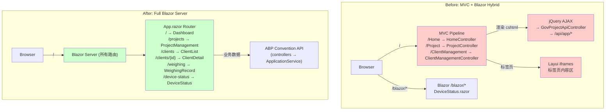

## Why

UrbanManagement 当前采用 MVC + Blazor 混合架构：7 个 MVC Controller 渲染 9 个 cshtml 视图（使用 jQuery/Layui/Bootstrap CDN），仅有 1 个 Blazor 页面（DeviceStatus.razor）通过路由前缀 `/blazor` 挂载。这导致两套 UI 技术栈并存、交互模式割裂（jQuery AJAX vs Blazor 组件状态）、维护成本翻倍。同时 `GovProjectApiController` 绕过 ABP ApplicationService 约定手动定义路由，与 `GovProjectAppService` 功能重复。趁项目尚无向后兼容负担，应一次性将所有 MVC 页面迁移至 Blazor Server 组件，统一技术栈。

## What Changes

- **BREAKING** 删除所有 MVC Controller（`HomeController`、`MainPageController`、`ProjectController`、`ClientManagementController`、`UrbanWeighingRecordController`）及其对应 cshtml 视图（9 个文件），将页面功能重写为 Blazor Server 组件
- **BREAKING** 删除 `GovProjectApiController`（手动路由的 REST 控制器），其所有 CRUD 操作由已有的 `GovProjectAppService`（ABP ApplicationService）通过 ABP 约定路由自动暴露
- 删除 MVC 基础设施文件：`_Layout.cshtml`、`_ViewImports.cshtml`、`_ViewStart.cshtml`、`Views/Shared/` 目录
- 保留 `LegacyApiController`（旧版政府客户端兼容端点 `POST /Api/Post`）作为唯一 MVC 控制器
- 新增 Blazor 页面组件替代 MVC 视图：主布局（Layui 风格侧边栏 + 标签页）、仪表盘、项目管理、客户端管理（列表 + 详情）、称重记录
- 将 Layui admin CSS 样式迁移为 Blazor 兼容形式（去 iframe、去 jQuery 依赖）
- `UrbanManagementAppModule` 移除 MVC 视图引擎配置（`AddControllersWithViews`→`AddControllers`），Blazor 成为主 UI 框架
- 端点路由调整：`_Host.cshtml` 成为默认路由入口，`/` 直接进入 Blazor 应用

## Capabilities

### New Capabilities

- `blazor-admin-layout`: Blazor 管理后台布局 — 侧边栏导航 + 标签页内容区，替代 Layui iframe 布局，包含主布局组件、导航菜单、标签页管理
- `blazor-project-management`: Blazor 项目管理页面 — 项目 CRUD 表格页面，使用 ABP 约定 API（`GovProjectAppService`），替代 ProjectController + Project/Index.cshtml
- `blazor-client-management`: Blazor 客户端管理页面 — 客户端连接列表 + 设备详情页，集成 SignalR 实时更新，替代 ClientManagementController + 两个 cshtml
- `blazor-weighing-record`: Blazor 称重记录页面 — 分页表格 + 审批弹窗，替代 UrbanWeighingRecordController + Layui 表格
- `blazor-dashboard`: Blazor 仪表盘页面 — 统计卡片 + ECharts 图表，替代 MainPageController + MainPage/Index.cshtml

### Modified Capabilities

- `abp-blazor-server-hosting`: 路由架构变更 — `_Host.cshtml` 成为默认入口（`/`），移除 `/blazor` 前缀隔离模式，Blazor 替代 MVC 成为主 UI
- `abp-project-init`: App 模块服务注册变更 — 从 `AddControllersWithViews()` 简化为 `AddControllers()`（仅保留 API 控制器），移除 MVC 视图引擎依赖

## Impact

### Code Change Map

| File Path | Change Type | Change Reason | Impact Scope |
|-----------|-------------|---------------|--------------|
| Controllers/HomeController.cs | Delete | 功能迁移至 Blazor 主页路由 | MVC 层移除 |
| Controllers/MainPageController.cs | Delete | 功能迁移至 Blazor Dashboard 组件 | MVC 层移除 |
| Controllers/ProjectController.cs | Delete | 功能迁移至 Blazor ProjectManagement 组件 | MVC 层移除 |
| Controllers/ClientManagementController.cs | Delete | 功能迁移至 Blazor ClientManagement 组件 | MVC 层移除 |
| Controllers/UrbanWeighingRecordController.cs | Delete | 功能迁移至 Blazor WeighingRecord 组件 | MVC 层移除 |
| Controllers/GovProjectApiController.cs | Delete | 与 GovProjectAppService 重复，ABP 约定路由已覆盖 | API 层简化 |
| Controllers/LegacyApiController.cs | Keep | 旧版兼容端点，无 Blazor 替代方案 | API 兼容 |
| Views/**/*.cshtml (9 files) | Delete | MVC 视图全部移除 | UI 层移除 |
| Pages/AdminLayout.razor | New | 管理后台主布局（侧边栏 + 标签页） | Blazor UI |
| Pages/Dashboard.razor | New | 仪表盘页面 | Blazor UI |
| Pages/ProjectManagement.razor | New | 项目管理 CRUD 页面 | Blazor UI |
| Pages/ClientList.razor | New | 客户端连接列表页面 | Blazor UI |
| Pages/ClientDetail.razor | New | 客户端设备详情页面 | Blazor UI |
| Pages/WeighingRecord.razor | New | 称重记录页面 | Blazor UI |
| Pages/MainLayout.razor | Modify | 简化为指向 AdminLayout 或合并 | Blazor 布局 |
| Pages/App.razor | Modify | 调整路由结构 | Blazor 路由 |
| Pages/_Host.cshtml | Modify | 成为默认路由入口（`/` 而非 `/blazor`） | Blazor 宿主 |
| Pages/DeviceStatus.razor | Modify | 整合进新布局，路由调整 | Blazor UI |
| UrbanManagementAppModule.cs | Modify | 移除 MVC 视图配置，调整路由 | 模块配置 |
| wwwroot/public/style/admin.css | Modify | 去除 iframe 相关样式 | 静态资源 |

### Interaction Flow



### UI Prototype: Admin Layout

```
┌──────────────────────────────────────────────────────────────┐
│ ◉ 萧山城管对接平台          [刷新] [全屏]          管理员 │
├──────────┬───────────────────────────────────────────────────┤
│          │ [首页] [项目管理] [称重记录] [客户端管理]    ×│
│ 项目管理 ├───┬───────────────────────────────────────────────┤
│ 称重记录 │   │                                               │
│ 客户端   │   │  (页面内容区 — @Body)                         │
│ 设备状态 │   │                                               │
│          │   │  ┌──────────────────────────────────────┐     │
│          │   │  │ 表格 / 卡片 / 图表                   │     │
│          │   │  │ (Blazor 组件渲染，无 iframe)          │     │
│          │   │  └──────────────────────────────────────┘     │
│          │   │                                               │
│          │   │  [< 1 2 3 ... >]  分页控件                    │
│          │   └───────────────────────────────────────────────┤
│          │                                                   │
│────────--│                                                   │
│ 凡东科技 │                                                   │
├──────────┴───────────────────────────────────────────────────┤
│ SignalR: ● 实时更新                          最后心跳: 刚刚  │
└──────────────────────────────────────────────────────────────┘
```
