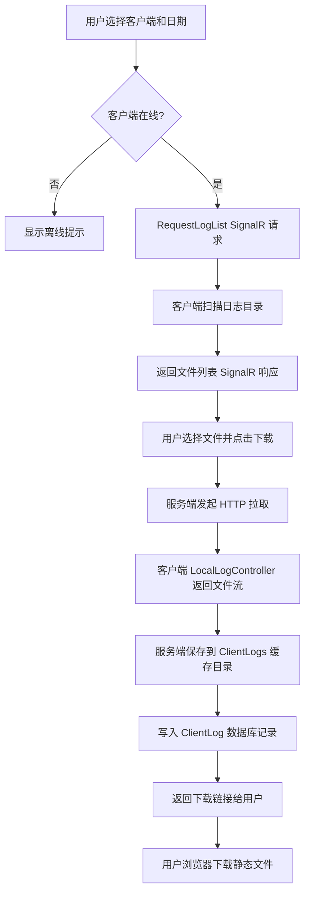
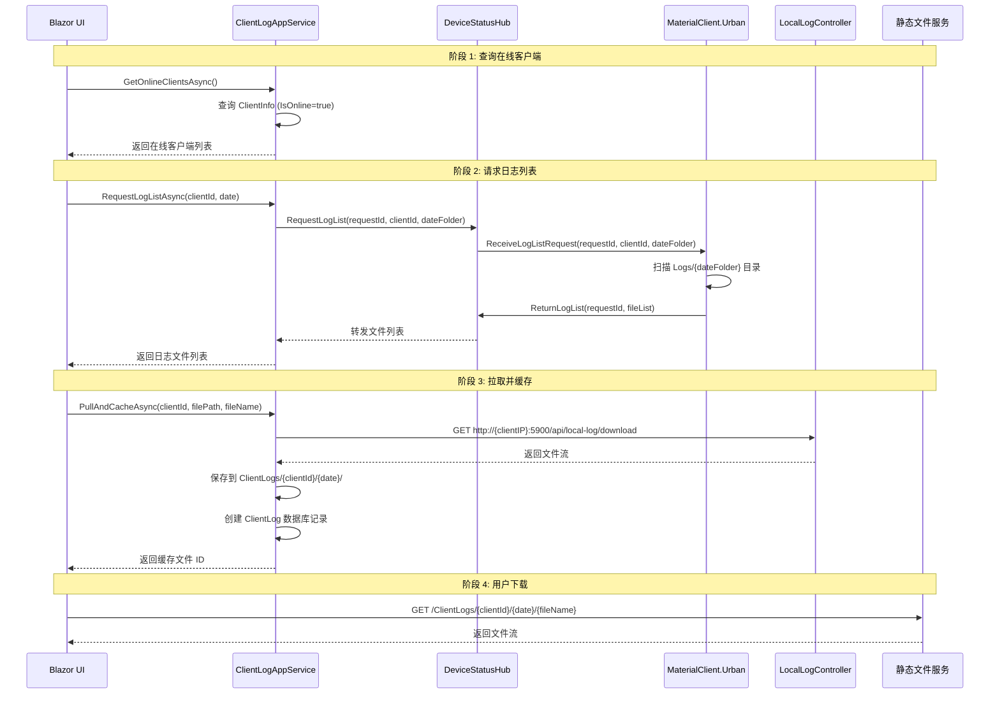

# Client Log Download Server Feature - Design

## Context

### Background

当前系统使用 MaterialClient.Urban 作为城管称重客户端，部署在现场工控机上。当出现故障时，运维人员需要远程获取客户端日志进行分析。现有的运维流程依赖现场人员手动导出日志或通过远程桌面访问，效率低下且存在安全风险。

### Current State

**现有基础设施**：
- **SignalR 连接**：MaterialClient.Urban 通过 `DeviceStatusHub` 与 UrbanManagement 保持长连接，用于上传设备状态和称重记录
- **附件上传模式**：已有 `UrbanAttachmentAppService` 处理图片附件上传，存储在 `{ContentRoot}/Uploads/{BuildLicenseNo}/`
- **日志配置**：MaterialClient 使用 Serilog 按天滚动日志，存储在 `{AppDirectory}/Logs/`，文件命名 `MaterialClient-.log`（自动添加日期后缀）

**技术栈**：
- 客户端：Avalonia UI + ABP Framework + SignalR Client
- 服务端：ABP Framework + Blazor Server + Entity Framework Core + SignalR Hub

### Constraints

**客户端约束**：
- 客户端运行在工控机，可能无法直接从外网访问
- 客户端是 Avalonia 桌面应用，不是 Web 服务
- 需要避免影响称重主界面性能

**服务端约束**：
- 服务端部署在内网服务器，需要主动拉取客户端日志
- 需要权限控制，防止日志泄露
- 缓存文件需要定期手动清理，避免磁盘空间耗尽

**集成约束**：
- 必须复用现有 `DeviceStatusHub`，避免新增 SignalR 端点
- 必须遵循 UrbanManagement 的 ABP 模式（AppService、DTO、Entity）
- 必须遵循 MaterialClient.Urban 的编码规范（ReactiveUI、AutoConstructor）

## Goals / Non-Goals

### Goals

1. **服务端按需拉取**：运维人员可通过 UrbanManagement Web UI 按需拉取指定客户端、指定日期的日志文件
2. **在线状态检测**：仅对 SignalR 在线的客户端提供拉取功能，避免无效请求
3. **静态文件缓存**：拉取的日志缓存在服务端 `ClientLogs/` 目录，支持重复下载
4. **批量下载**：支持打包多个日志文件为 ZIP 下载
5. **权限控制**：仅授权用户可访问日志拉取功能，记录操作审计
6. **日志标准化**：客户端日志按日期目录组织，单文件超过 50MB 自动切割

### Non-Goals

1. **实时日志流**：不提供实时日志流功能，仅支持文件下载
2. **自动清理**：不提供自动清理缓存功能，由运维人员手动删除
3. **日志搜索**：不在服务端实现日志内容搜索（可在后续版本增强）
4. **多客户端批量拉取**：不支持一次操作拉取多个客户端的日志（可在后续版本增强）

## Decisions

### Decision 1: 传输架构 - 服务端按需拉取而非客户端主动上传

**选择**：服务端按需拉取 + 静态文件缓存

**理由**：
- **按需节省带宽**：仅在运维人员需要时才传输，避免定期上传占用网络
- **复用现有 SignalR**：MaterialClient.Urban 已有 `DeviceStatusHub` 连接，扩展成本低
- **简化客户端逻辑**：客户端无需配置上传调度、重试逻辑

**替代方案**：客户端主动上传
- ❌ 需要定时任务调度
- ❌ 可能重复上传相同文件
- ❌ 占用客户端网络资源

### Decision 2: 客户端本地 HTTP API - 独立 Kestrel 监听

**选择**：在客户端启动独立的 Kestrel 进程，监听 `localhost:5900`

**理由**：
- **与 Avalonia UI 解耦**：不影响主界面性能
- **标准 HTTP 传输**：服务端可使用 `HttpClient` 流式下载
- **仅本地监听**：`localhost` 绑定避免外部访问风险

**替代方案**：通过 SignalR 传输文件内容
- ❌ SignalR 不适合传输大文件（>50MB）
- ❌ 需要分片传输和重组逻辑，复杂度高

**实施细节**：
```csharp
// MaterialClientUrbanModule.cs
public override void OnApplicationInitialization(ApplicationInitializationContext context)
{
    var configuration = context.ServiceProvider.GetConfiguration();
    var enableLocalApi = configuration.GetValue<bool>("LocalLogApi:Enabled", true);
    var localApiPort = configuration.GetValue<int>("LocalLogApi:Port", 5900);

    if (enableLocalApi)
    {
        // 启动本地 Kestrel（后台任务）
        Task.Run(async () =>
        {
            var builder = WebApplication.CreateBuilder();
            builder.Services.AddControllers();
            builder.Services.AddEndpointsApiExplorer();

            var app = builder.Build();
            app.MapControllers();
            app.Urls.Add($"http://localhost:{localApiPort}");

            await app.RunAsync();
        });
    }
}
```

### Decision 3: 日志缓存策略 - 静态文件存储而非数据库

**选择**：拉取的日志保存为服务端静态文件，数据库仅记录元数据

**理由**：
- **大文件不适合数据库**：日志文件可能 >50MB，BLOB 存储效率低
- **复用现有静态文件服务**：UrbanManagement 已有 `wwwroot/` 静态文件服务
- **简化下载逻辑**：直接返回文件流，无需从数据库读取

**替代方案**：存储到数据库 BLOB 字段
- ❌ 数据库膨胀，备份困难
- ❌ 下载性能差

**实施细节**：
- 缓存目录：`{ContentRoot}/ClientLogs/{ClientId}/{YYYY-MM-DD}/`
- 数据库 `ClientLog` 实体记录：文件名、路径、大小、拉取时间
- 下载接口：直接返回 `PhysicalFileResult` 或 `FileStreamResult`

### Decision 4: SignalR 扩展方式 - 复用 DeviceStatusHub

**选择**：扩展现有 `DeviceStatusHub`，新增日志相关方法

**理由**：
- **避免新增端点**：客户端只需维护一个 SignalR 连接
- **复用连接生命周期**：利用现有的 `OnConnectedAsync` / `OnDisconnectedAsync`
- **最小侵入性**：新增方法不影响现有设备状态上传功能

**新增方法**：
```csharp
// DeviceStatusHub.cs
public async Task RegisterLogCapability(string clientId, LogCapabilityInfo capability)
public async Task RequestLogList(string requestId, string clientId, string dateFolder)
public async Task ReturnLogList(string requestId, ClientLogListResultDto result)
```

### Decision 5: 日志目录结构 - 日期子目录 + 文件大小切割

**选择**：`Logs/{YYYY}/{MM}/{DD}/MaterialClient-.log`，启用 `rollOnFileSizeLimit: true`，`fileSizeLimitBytes: 50MB`

**理由**：
- **高效定位**：服务端可按日期路径精准拉取
- **控制单文件大小**：避免单文件过大导致传输超时
- **便于归档**：同期日志聚合，便于清理和迁移

**实施细节**：
```csharp
// MaterialClientModule.cs
var logFilePath = Path.Combine(logsDirectory, "{YYYY}/{MM}/{DD}/MaterialClient-.log");

var loggerConfig = new LoggerConfiguration()
    .WriteTo.File(
        logFilePath,
        rollingInterval: RollingInterval.Day,
        rollOnFileSizeLimit: true,
        fileSizeLimitBytes: 50 * 1024 * 1024,  // 50 MB
        retainedFileCountLimit: 30,
        outputTemplate: "{Timestamp:yyyy-MM-dd HH:mm:ss.fff zzz} [{Level:u3}] {Message:lj}{NewLine}{Exception}",
        encoding: Encoding.UTF8);
```

## 架构设计

### 组件架构图

```
┌─────────────────────────────────────────────────────────────────────────┐
│                           UrbanManagement                              │
│  ┌───────────────────────────────────────────────────────────────────┐ │
│  │                        Blazor UI Layer                            │ │
│  │  ┌─────────────────────────────────────────────────────────────┐ │ │
│  │  │         ClientLogManagement.razor                            │ │ │
│  │  │  - 客户端列表选择框                                          │ │ │
│  │  │  - 日期选择器                                                │ │ │
│  │  │  - 日志文件列表（checkbox 多选）                             │ │ │
│  │  │  - 已缓存日志列表（下载/删除操作）                           │ │ │
│  │  └─────────────────────────────────────────────────────────────┘ │ │
│  └───────────────────────────────────────────────────────────────────┘ │
│                                   │                                    │
│                                   ▼                                    │
│  ┌───────────────────────────────────────────────────────────────────┐ │
│  │                    Application Service Layer                        │ │
│  │  ┌─────────────────────────────────────────────────────────────┐ │ │
│  │  │         ClientLogAppService                                  │ │ │
│  │  │  - GetOnlineClientsAsync()                                  │ │ │
│  │  │  - RequestLogListAsync()                                     │ │ │
│  │  │  - PullAndCacheAsync()                                       │ │ │
│  │  │  - GetCachedLogsAsync()                                      │ │ │
│  │  │  - DownloadCachedAsync()                                     │ │ │
│  │  │  - DownloadBatchCachedAsync()                                │ │ │
│  │  │  - DeleteCachedAsync()                                       │ │ │
│  │  └─────────────────────────────────────────────────────────────┘ │ │
│  └───────────────────────────────────────────────────────────────────┘ │
│                                   │                                    │
│                                   ▼                                    │
│  ┌───────────────────────────────────────────────────────────────────┐ │
│  │                         Domain Layer                               │ │
│  │  ┌─────────────────────────────────────────────────────────────┐ │ │
│  │  │  Entities                                                    │ │ │
│  │  │  - ClientLog (Guid Id, string ClientId, string FileName,    │ │ │
│  │  │             string CachedFilePath, long FileSize, ...)       │ │ │
│  │  │  - ClientInfo (Guid Id, string ClientId, bool IsOnline, ...) │ │ │
│  │  │  - ClientLogPullHistory (Guid Id, string ClientId, ...)       │ │ │
│  │  └─────────────────────────────────────────────────────────────┘ │ │
│  └───────────────────────────────────────────────────────────────────┘ │
│                                   │                                    │
│                                   ▼                                    │
│  ┌───────────────────────────────────────────────────────────────────┐ │
│  │                    Infrastructure Layer                            │ │
│  │  ┌─────────────────────────────────────────────────────────────┐ │ │
│  │  │         DeviceStatusHub (SignalR)                            │ │ │
│  │  │  - RegisterLogCapability()                                  │ │ │
│  │  │  - RequestLogList()                                         │ │ │
│  │  │  - ReturnLogList()                                          │ │ │
│  │  └─────────────────────────────────────────────────────────────┘ │ │
│  │  ┌─────────────────────────────────────────────────────────────┐ │ │
│  │  │         HttpClient (to Client Local API)                     │ │ │
│  │  │  - GET http://{clientIP}:5900/api/local-log/download        │ │ │
│  │  └─────────────────────────────────────────────────────────────┘ │ │
│  │  ┌─────────────────────────────────────────────────────────────┐ │ │
│  │  │         Static File Service                                  │ │ │
│  │  │  - wwwroot/ClientLogs/{ClientId}/{Date}/                    │ │ │
│  │  └─────────────────────────────────────────────────────────────┘ │ │
│  └───────────────────────────────────────────────────────────────────┘ │
└─────────────────────────────────────────────────────────────────────────┘
                                    │
                                    │ SignalR (日志请求/响应)
                                    │ HTTP (文件拉取)
                                    ▼
┌─────────────────────────────────────────────────────────────────────────┐
│                      MaterialClient.Urban                               │
│  ┌───────────────────────────────────────────────────────────────────┐ │
│  │                      Application Layer                            │ │
│  │  ┌─────────────────────────────────────────────────────────────┐ │ │
│  │  │         ClientLogPullService                                │ │ │
│  │  │  - InitializeAsync() (SignalR 连接初始化)                  │ │ │
│  │  │  - HandleLogListRequestAsync() (处理日志列表请求)           │ │ │
│  │  └─────────────────────────────────────────────────────────────┘ │ │
│  │  ┌─────────────────────────────────────────────────────────────┐ │ │
│  │  │         LocalLogController (Kestrel)                         │ │ │
│  │  │  - GET /api/local-log/download (文件下载)                    │ │ │
│  │  │  - GET /api/local-log/list (调试列表)                       │ │ │
│  │  └─────────────────────────────────────────────────────────────┘ │ │
│  └───────────────────────────────────────────────────────────────────┘ │
│                                   │                                    │
│                                   ▼                                    │
│  ┌───────────────────────────────────────────────────────────────────┐ │
│  │                      File System                                 │ │
│  │  ┌─────────────────────────────────────────────────────────────┐ │ │
│  │  │  Logs/{YYYY}/{MM}/{DD}/                                     │ │ │
│  │  │  - MaterialClient-20250622.log                               │ │ │
│  │  │  - MaterialClient-20250622_001.log (切割后)                  │ │ │
│  │  └─────────────────────────────────────────────────────────────┘ │ │
│  └───────────────────────────────────────────────────────────────────┘ │
└─────────────────────────────────────────────────────────────────────────┘
```

### 数据流图



### API 时序图



### 详细代码变更清单

| 文件路径 | 变更类型 | 变更说明 | 新增代码行（估计） |
|---------|---------|---------|------------------|
| `repos/MaterialClient/src/MaterialClient/MaterialClientModule.cs` | 修改 | `ConfigureSerilog` 方法：更新日志路径为 `Logs/{YYYY}/{MM}/{DD}/MaterialClient-.log`，添加 `rollOnFileSizeLimit: true` 和 `fileSizeLimitBytes: 50MB` | ~10 行 |
| `repos/MaterialClient/src/MaterialClient/appsettings.json` | 修改 | 新增 `LocalLogApi` 和 `Log` 配置节 | ~15 行 |
| `repos/MaterialClient/src/MaterialClient.Urban/MaterialClientUrbanModule.cs` | 修改 | 同上，Urban 版本日志配置；`OnApplicationInitialization` 方法：启动本地 Kestrel 监听 | ~40 行 |
| `repos/MaterialClient/src/MaterialClient.Urban/appsettings.json` | 修改 | 新增 `LocalLogApi`、`Log`、`UrbanManagement:BaseUrl`、`Client:Id` 配置 | ~20 行 |
| `repos/MaterialClient/src/MaterialClient.Urban/Services/ClientLogPullService.cs` | 新增 | SignalR 日志拉取服务：`InitializeAsync`、`HandleLogListRequestAsync` 方法 | ~120 行 |
| `repos/MaterialClient/src/MaterialClient.Urban/Controllers/LocalLogController.cs` | 新增 | 本地日志 API 控制器：`DownloadLog`、`ListLogs` 方法 | ~80 行 |
| `repos/MaterialClient/src/MaterialClient.Urban/Models/LogCapabilityInfo.cs` | 新增 | 日志能力信息 DTO | ~15 行 |
| `repos/MaterialClient/src/MaterialClient.Urban/Models/LogFileDto.cs` | 新增 | 日志文件信息 DTO | ~15 行 |
| `repos/UrbanManagement/src/UrbanManagement.Core/Hubs/DeviceStatusHub.cs` | 修改 | 新增方法：`RegisterLogCapability`、`RequestLogList`、`ReturnLogList` | ~60 行 |
| `repos/UrbanManagement/src/UrbanManagement.Core/Entities/ClientLog.cs` | 新增 | 客户端日志缓存实体：`ClientId`、`FileName`、`CachedFilePath`、`FileSize` 等字段 | ~80 行 |
| `repos/UrbanManagement/src/UrbanManagement.Core/Entities/ClientInfo.cs` | 新增 | 客户端连接信息实体：`ClientId`、`IsOnline`、`SignalRConnectionId` 等字段 | ~60 行 |
| `repos/UrbanManagement/src/UrbanManagement.Core/Entities/ClientLogPullHistory.cs` | 新增 | 日志拉取审计实体：`ClientId`、`RequestDate`、`FilesJson`、`PulledByUserId` 等字段 | ~70 行 |
| `repos/UrbanManagement/src/UrbanManagement.Core/Models/ClientLogDto.cs` | 新增 | 客户端日志 DTO | ~40 行 |
| `repos/UrbanManagement/src/UrbanManagement.Core/Models/ClientInfoDto.cs` | 新增 | 客户端信息 DTO | ~30 行 |
| `repos/UrbanManagement/src/UrbanManagement.Core/Models/ClientLogListResultDto.cs` | 新增 | 日志列表结果 DTO | ~40 行 |
| `repos/UrbanManagement/src/UrbanManagement.Core/Services/ClientLogAppService.cs` | 新增 | 客户端日志应用服务：`GetOnlineClientsAsync`、`RequestLogListAsync`、`PullAndCacheAsync`、`GetCachedLogsAsync`、`DownloadCachedAsync`、`DownloadBatchCachedAsync`、`DeleteCachedAsync` 方法 | ~250 行 |
| `repos/UrbanManagement/src/UrbanManagement.Core/EntityFrameworkCore/UrbanManagementDbContext.cs` | 修改 | 新增 `DbSet<ClientLog>`、`DbSet<ClientInfo>`、`DbSet<ClientLogPullHistory>` | ~5 行 |
| `repos/UrbanManagement/src/UrbanManagement.Core/Permissions/UrbanManagementPermissions.cs` | 修改 | 新增 `ClientLogs`、`ClientLogsDownload`、`ClientLogsDelete`、`ClientLogsRequest` 权限常量 | ~10 行 |
| `repos/UrbanManagement/src/UrbanManagement.App/Pages/ClientLogManagement.razor` | 新增 | 日志管理 Blazor 页面：客户端选择、日期选择、文件列表、缓存管理 UI | ~300 行 |
| `repos/UrbanManagement/src/UrbanManagement.App/appsettings.json` | 修改 | 新增 `ClientLogPull` 配置节 | ~15 行 |
| `repos/UrbanManagement/src/UrbanManagement.App/Program.cs` 或 `UrbanManagementAppModule.cs` | 修改 | 配置静态文件中间件，映射 `ClientLogs/` 目录到 `wwwroot/ClientLogs/` | ~10 行 |

**总计**：约 25 个文件变更，~1300 行新增/修改代码

## Risks / Trade-offs

### Risk 1: 客户端离线无法拉取

**描述**：客户端断网或程序关闭时，服务端无法拉取日志

**缓解措施**：
- UI 中明确显示客户端在线/离线状态
- 仅对在线客户端启用"拉取"按钮
- 提供"最后拉取时间"提示，帮助用户判断

### Risk 2: 大文件拉取超时

**描述**：单个日志文件接近 50MB，在网络不稳定时可能超时

**缓解措施**：
- 服务端 `HttpClient` 配置 `Timeout` 为 5 分钟
- 支持断点续传（客户端 `LocalLogController` 返回 `Accept-Ranges: bytes`）
- UI 中显示文件大小，避免误操作

### Risk 3: 服务端磁盘空间占用

**描述**：频繁拉取日志导致服务端磁盘空间耗尽

**缓解措施**：
- 配置 `MaxZipSizeMB` 限制批量下载大小
- 提供"删除缓存"功能，运维人员定期清理
- 建议监控 `ClientLogs/` 目录大小

### Risk 4: 客户端端口冲突

**描述**：`localhost:5900` 端口被其他程序占用

**缓解措施**：
- 配置项 `LocalLogApi:Port` 可自定义
- 启动时检测端口占用，记录日志警告
- 考虑使用端口范围（5900-5910）自动选择

### Risk 5: 敏感信息泄露

**描述**：日志中可能包含敏感信息（用户凭证、业务数据）

**缓解措施**：
- 权限控制：仅 `UrbanManagement.ClientLogs` 权限用户可访问
- 审计日志：记录所有下载操作（用户、时间、IP、原因）
- 建议：生产环境启用 HTTPS

### Trade-off 1: 静态文件缓存 vs 数据库存储

**选择**：静态文件缓存

**优势**：
- 下载性能好（直接返回文件流）
- 数据库轻量（仅存储元数据）

**劣势**：
- 需要手动管理缓存文件
- 备份时需要单独处理 `ClientLogs/` 目录

**理由**：权衡后，性能和简洁性更优，手动清理成本可接受

### Trade-off 2: 复用 DeviceStatusHub vs 新增独立 LogHub

**选择**：复用 `DeviceStatusHub`

**优势**：
- 客户端只需维护一个 SignalR 连接
- 最小侵入性

**劣势**：
- Hub 职责增加（设备状态 + 日志拉取）

**理由**：日志拉取是偶发操作，不会显著影响现有设备状态上传性能

## Migration Plan

### 阶段 1: 客户端日志标准化（独立部署）

**步骤**：
1. 更新 MaterialClient 日志配置（日期目录 + 大小限制）
2. 更新 MaterialClient.Urban 日志配置
3. 更新 appsettings.json 配置
4. 验证日志文件生成到 `Logs/{YYYY}/{MM}/{DD}/` 目录
5. 验证单文件超过 50MB 时自动切割

**回滚策略**：
- 恢复原有 `ConfigureSerilog` 代码
- 删除 `appsettings.json` 中新增的 `Log` 配置节
- 旧日志文件保持原路径，不受影响

### 阶段 2: 客户端本地 API（独立部署）

**步骤**：
1. 实现 `LocalLogController`
2. 实现 `ClientLogPullService`
3. 更新 `MaterialClientUrbanModule` 启动 Kestrel
4. 更新 appsettings.json 配置
5. 测试 `curl http://localhost:5900/api/local-log/list`
6. 测试 `curl http://localhost:5900/api/local-log/download?filePath=2025/06/22/&fileName=MaterialClient-20250622.log`

**回滚策略**：
- 移除 `OnApplicationInitialization` 中的 Kestrel 启动代码
- 删除 `LocalLogController` 和 `ClientLogPullService` 文件
- 删除 `appsettings.json` 中新增的 `LocalLogApi` 配置节

### 阶段 3: 服务端日志拉取 API（独立部署）

**步骤**：
1. 扩展 `DeviceStatusHub`（新增日志方法）
2. 实现实体：`ClientLog`、`ClientInfo`、`ClientLogPullHistory`
3. 实现 `ClientLogAppService`
4. 配置 EF Core DbContext 和迁移
5. 配置权限 `UrbanManagementPermissions.ClientLogs`
6. 配置静态文件服务映射 `ClientLogs/` 目录
7. 单元测试：Mock SignalR 和 HttpClient

**回滚策略**：
- 删除新增的 Hub 方法
- 删除实体和 AppService
- 回滚 EF Core 迁移（`DropColumn` 或 `Remove-Migration`）
- 移除权限定义

### 阶段 4: Blazor 管理界面（独立部署）

**步骤**：
1. 实现 `ClientLogManagement.razor` 页面
2. 配置菜单导航
3. 配置权限检查
4. 集成测试：端到端拉取流程

**回滚策略**：
- 移除菜单项
- 删除 `ClientLogManagement.razor` 文件

### 部署顺序建议

1. **先部署客户端**（阶段 1 + 2），验证日志标准化和本地 API
2. **再部署服务端**（阶段 3），验证 SignalR 扩展和拉取功能
3. **最后部署 UI**（阶段 4），验证完整用户体验

### 回滚优先级

- 客户端故障：回滚到阶段 1（保留日志标准化，移除本地 API）
- 服务端故障：回滚到阶段 2（保留客户端，移除服务端功能）
- UI 故障：回滚到阶段 3（保留 API，移除管理界面）

## Open Questions

1. **客户端 IP 获取方式**：
   - 当前 `DeviceStatusHub` 通过 `Context.GetHttpContext()?.Connection.RemoteIpAddress` 获取客户端 IP
   - 如果客户端通过代理或 NAT 连接，可能获取到代理 IP 而非真实客户端 IP
   - **待解决**：确认 UrbanManagement 与 MaterialClient.Urban 的网络拓扑

2. **缓存文件命名规则**：
   - 当前设计：`{ClientId}/{YYYY-MM-DD}/{OriginalFileName}`
   - 多次拉取同一文件：覆盖还是保留版本？
   - **建议**：覆盖（文件内容相同），但更新 `ClientLog.PulledAt`

3. **SignalR 连接认证**：
   - 当前 `DeviceStatusHub` 使用 `[Authorize]` 属性
   - 客户端使用 JWT Token 连接
   - **待确认**：日志拉取是否需要额外权限声明（`scope: client-log:pull`）

4. **大文件批量下载限制**：
   - 当前设计 `MaxZipSizeMB: 500`
   - 超过限制时拒绝请求并返回错误
   - **待确认**：是否需要支持分批下载（>500MB 拆分为多个 ZIP）
