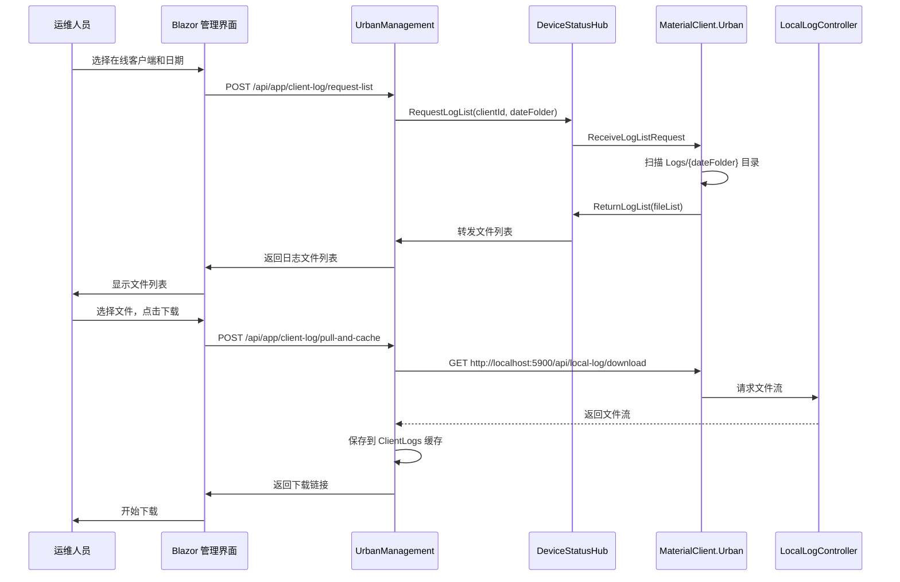

# Client Log Download Server Feature

## Why

当前系统缺乏服务端主动获取客户端日志的能力。运维人员在进行故障排查时，需要远程访问 MaterialClient 客户端或等待用户手动导出日志，效率低下且容易延误问题定位。实现服务端按需拉取客户端日志功能，可显著提升运维响应速度和系统可维护性。

## What Changes

### 客户端变更（MaterialClient / MaterialClient.Urban）

- **日志配置标准化**：启用日期目录结构（`Logs/{YYYY}/{MM}/{DD}/`）和文件大小限制（50MB 切割）
- **本地 HTTP API**：新增 `LocalLogController`，监听 `localhost:5900`，提供日志文件下载接口
- **SignalR 日志拉取服务**：新增 `ClientLogPullService`，注册日志拉取能力，响应服务端日志列表请求
- **配置项扩展**：新增 `LocalLogApi` 和 `Log` 配置节

### 服务端变更（UrbanManagement）

- **SignalR Hub 扩展**：扩展 `DeviceStatusHub`，新增日志相关方法（`RegisterLogCapability`、`RequestLogList`、`ReturnLogList`）
- **客户端日志服务**：新增 `ClientLogAppService`，提供日志列表查询、拉取缓存、下载、删除功能
- **实体和权限**：新增 `ClientLog`、`ClientInfo`、`ClientLogPullHistory` 实体；新增 `UrbanManagement.ClientLogs` 权限组
- **Blazor 管理界面**：新增客户端日志管理页面（客户端列表、日期浏览、文件选择、下载）

## Capabilities

### New Capabilities

- **client-log-standardization**: 客户端日志文件组织标准化，包括日期目录结构和文件大小限制
- **client-log-local-api**: 客户端本地 HTTP API，供服务端拉取日志文件
- **client-log-signalr-pull**: 客户端 SignalR 日志拉取服务，响应服务端请求
- **server-log-pull-api**: 服务端日志拉取 API，包括列表查询、文件拉取、缓存管理
- **client-log-management-ui**: 服务端 Blazor 日志管理界面

### Modified Capabilities

- **signalr-device-status-upload**: 扩展现有 `DeviceStatusHub`，新增日志相关方法（不影响现有设备状态上传功能）

## Impact

### 代码影响

| 文件路径 | 变更类型 | 变更说明 | 影响模块 |
|---------|---------|---------|---------|
| `repos/MaterialClient/src/MaterialClient/MaterialClientModule.cs` | 修改 | 更新 `ConfigureSerilog` 方法，启用日期目录和文件大小限制 | 日志配置 |
| `repos/MaterialClient/src/MaterialClient.Urban/MaterialClientUrbanModule.cs` | 修改 | 同上，Urban 版本日志配置 | 日志配置 |
| `repos/MaterialClient/src/MaterialClient.Urban/Services/ClientLogPullService.cs` | 新增 | SignalR 日志拉取服务 | SignalR 集成 |
| `repos/MaterialClient/src/MaterialClient.Urban/Controllers/LocalLogController.cs` | 新增 | 本地日志 API 控制器 | HTTP API |
| `repos/UrbanManagement/src/UrbanManagement.Core/Hubs/DeviceStatusHub.cs` | 修改 | 扩展 Hub，新增日志相关方法 | SignalR Hub |
| `repos/UrbanManagement/src/UrbanManagement.Core/Entities/ClientLog.cs` | 新增 | 客户端日志缓存实体 | 数据层 |
| `repos/UrbanManagement/src/UrbanManagement.Core/Entities/ClientInfo.cs` | 新增 | 客户端连接信息实体 | 数据层 |
| `repos/UrbanManagement/src/UrbanManagement.Core/Entities/ClientLogPullHistory.cs` | 新增 | 日志拉取审计实体 | 数据层 |
| `repos/UrbanManagement/src/UrbanManagement.Core/Services/ClientLogAppService.cs` | 新增 | 客户端日志应用服务 | 应用服务层 |
| `repos/UrbanManagement/src/UrbanManagement.App/Pages/ClientLogManagement.razor` | 新增 | 日志管理 Blazor 页面 | UI 层 |

### API 影响

**新增客户端本地 API**：
- `GET /api/local-log/download` - 下载本地日志文件
- `GET /api/local-log/list` - 获取日志文件列表（调试用）

**新增服务端 API**：
- `GET /api/app/client-log/online-clients` - 获取在线客户端列表
- `POST /api/app/client-log/request-list` - 请求客户端日志列表
- `POST /api/app/client-log/pull-and-cache` - 拉取并缓存日志文件
- `GET /api/app/client-log/cached-logs` - 获取已缓存日志列表
- `GET /api/app/client-log/download/{id}` - 下载已缓存日志
- `POST /api/app/client-log/download-batch` - 批量下载（ZIP）
- `DELETE /api/app/client-log/{id}` - 删除已缓存日志

**SignalR Hub 方法**：
- `RegisterLogCapability` - 客户端注册日志拉取能力
- `RequestLogList` - 服务端请求日志列表
- `ReturnLogList` - 客户端返回日志列表

### 依赖影响

**新增 NuGet 包**（MaterialClient）：
- 无（复用现有 SignalR 和 Kestrel）

**新增 NuGet 包**（UrbanManagement）：
- 无（复用现有 SignalR 和文件服务）

### 配置影响

**MaterialClient / MaterialClient.Urban** 新增配置：
```json
{
  "LocalLogApi": {
    "Enabled": true,
    "Port": 5900
  },
  "Log": {
    "Enabled": true,
    "Directory": "Logs",
    "FileSizeLimitMB": 50,
    "RetentionDays": 30,
    "UseDateFolders": true
  }
}
```

**UrbanManagement** 新增配置：
```json
{
  "ClientLogPull": {
    "Enabled": true,
    "MaxConcurrentPulls": 5,
    "PullTimeoutSeconds": 300,
    "MaxZipSizeMB": 500,
    "CacheBasePath": "ClientLogs/",
    "EnablePullHistory": true
  }
}
```

## 交互流程



## 界面原型

```
┌─────────────────────────────────────────────────────────────────────┐
│ 客户端日志管理                                              [×]      │
├─────────────────────────────────────────────────────────────────────┤
│                                                                      │
│  在线客户端                                                          │
│  ┌───────────────────────────────────────────────────────────────┐  │
│  │ ● material-client-001  (ProName: 测试站点A)    [刷新]         │  │
│  │ ● material-client-002  (ProName: 测试站点B)                  │  │
│  └───────────────────────────────────────────────────────────────┘  │
│                                                                      │
│  选择日期: [2025-06-22 📅]                                          │
│                                                                      │
│  日志文件列表                                                        │
│  ┌───────────────────────────────────────────────────────────────┐  │
│  │ ☐ MaterialClient-20250622.log       5.0 MB   2025-06-22 23:59 │  │
│  │ ☐ MaterialClient-20250622_001.log   50.0 MB  2025-06-22 18:30 │  │
│  │ ☐ MaterialClient-20250621.log       4.8 MB   2025-06-21 23:59 │  │
│  └───────────────────────────────────────────────────────────────┘  │
│                                                                      │
│  已缓存的日志                                                        │
│  ┌───────────────────────────────────────────────────────────────┐  │
│  │ material-client-001 / 2025-06-22 / MaterialClient-20250622.log │  │
│  │ [下载] [删除]                                                   │  │
│  └───────────────────────────────────────────────────────────────┘  │
│                                                                      │
│                          [拉取并缓存] [批量下载]                      │
└─────────────────────────────────────────────────────────────────────┘
```

## 架构概览

```
组件层次结构
├── 客户端（MaterialClient.Urban）
│   ├── 日志标准化模块
│   │   └── Serilog 配置（日期目录 + 大小限制）
│   ├── SignalR 日志拉取服务
│   │   └── ClientLogPullService
│   └── 本地 HTTP API
│       └── LocalLogController（localhost:5900）
│
└── 服务端（UrbanManagement）
    ├── SignalR Hub 扩展
    │   └── DeviceStatusHub（日志方法）
    ├── 客户端日志应用服务
    │   └── ClientLogAppService
    ├── 数据层
    │   ├── ClientLog（缓存实体）
    │   ├── ClientInfo（客户端信息）
    │   └── ClientLogPullHistory（审计）
    └── Blazor 管理界面
        └── ClientLogManagement.razor
```
