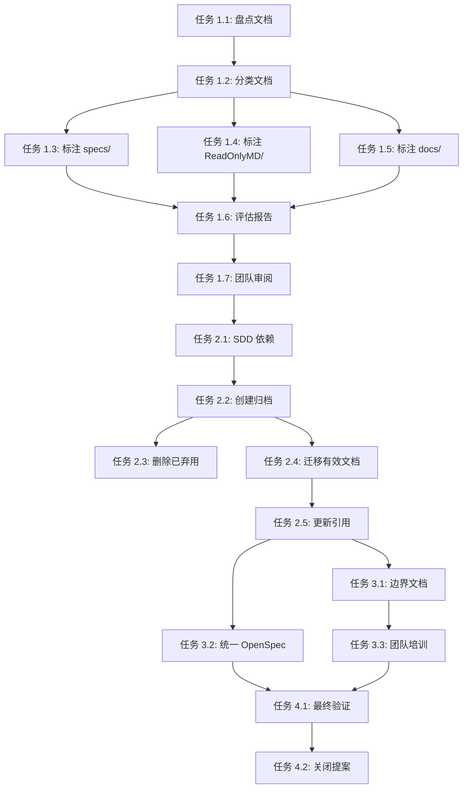

# 任务：MD 里程碑文档整理

**变更 ID：** `md-milestone-document-organization`
**总任务数**：15
**预估工期**：3–4 天

---

## 任务概览

本任务列表用于落实 MaterialClient 项目的三阶段文档重组计划。

---

## 阶段 1：文档有效性评估（7 项任务）

### 任务 1.1：盘点遗留文档

**状态**：待办
**优先级**：高
**预估**：2–3 小时

**描述**：
对遗留目录下的所有 Markdown 文档建立完整清单。

**步骤**：
1. 扫描 `specs/` 目录下所有 `.md` 文件
2. 扫描 `ReadOnlyMD/` 目录下所有 `.md` 文件
3. 扫描 `docs/` 目录下所有 `.md` 文件
4. 对每个文件记录：
   - 文件路径
   - 文件大小
   - 创建时间戳
   - 最后修改时间戳
   - 文档类型（规范、分析、报告等）
5. 生成清单报告：`document-inventory-[timestamp].csv`

**验收**：
- [ ] 已创建清单报告且列出所有遗留文档
- [ ] 文件数量与 `find specs ReadOnlyMD docs -type f -name "*.md" | wc -l` 一致

**产出**：`document-inventory-[timestamp].csv`

---

### 任务 1.2：按类型分类文档

**状态**：待办
**优先级**：高
**预估**：1–2 小时

**描述**：
根据类型和用途对清单中的每份文档进行分析与归类。

**类别**：
- **技术分析**：架构、设计分析、状态机文档
- **实施报告**：缺陷修复、功能实施报告
- **Agent 报告**：AI 生成的分析与优化报告
- **规范**：遗留功能规范
- **快速入门/配置**：安装与配置指南
- **研究**：调研与概念验证文档
- **其他**：未归类文档

**步骤**：
1. 审阅清单中的每份文档
2. 指定主要与次要类别
3. 用分类结果更新清单
4. 按类别生成汇总统计

**验收**：
- [ ] 所有文档已分类
- [ ] 类别分布已记录

**产出**：带类别列的更新后清单

---

### 任务 1.3：为 `specs/` 目录文档添加标注

**状态**：待办
**优先级**：中
**预估**：2–3 小时

**描述**：
为 `specs/` 目录下所有文档添加有效性元数据标注。

**步骤**：
1. 对 `specs/` 下每个 `.md` 文件添加元数据头：
```markdown
<!--
DOCUMENT_STATUS: [VALID/DEPRECATED/SUPERSEDED/ARCHIVED]
LAST_REVIEWED: [YYYY-MM-DD]
REVIEWER: [审阅人姓名]
NOTES: [简要状态说明]
-->
```
2. 根据以下因素评估文档状态：
   - 与当前代码库的相关性
   - 技术内容的准确性
   - 与 OpenSpec 规范的重复程度
3. 优先处理常被引用的规范（如 `001-attended-weighing`、`002-login-auth`）

**状态指南**：
- 若 OpenSpec 已有等效规范，标为 **SUPERSEDED**（已被取代）
- 若包含仍具参考价值的独特历史背景，标为 **VALID**（有效）
- 若技术内容过时或不准确，标为 **DEPRECATED**（弃用）
- 若仅为历史记录，标为 **ARCHIVED**（已归档）

**验收**：
- [ ] 所有 `specs/` 文件已标注
- [ ] 状态理由已在 NOTES 字段中说明

**产出**：已标注的 `specs/` 目录文件

---

### 任务 1.4：为 `ReadOnlyMD/` 目录文档添加标注

**状态**：待办
**优先级**：中
**预估**：1–2 小时

**描述**：
为 `ReadOnlyMD/` 目录下所有文档添加有效性元数据标注。

**关注点**：
- 状态机设计文档（如 `AttendedWeighingStatus状态机设计补充报告.md`）
- 技术分析报告（如 `Avalonia ComboBox绑定问题分析报告.md`）
- 实施说明与变通方案

**步骤**：
1. 审阅每份文档的当前相关性
2. 判断所述问题是否已解决或仍适用
3. 添加带合适状态的元数据标注
4. 与 OpenSpec 变更中已解决问题做交叉引用

**状态指南**：
- 若描述已修复缺陷或已实现功能，标为 **ARCHIVED**
- 若记录仍在使用的变通方案或待办问题，标为 **VALID**
- 若 OpenSpec 中有更新分析，标为 **SUPERSEDED**

**验收**：
- [ ] 所有 `ReadOnlyMD/` 文件已标注
- [ ] 问题解决状态已核实

**产出**：已标注的 `ReadOnlyMD/` 目录文件

---

### 任务 1.5：为 `docs/` 目录文档添加标注

**状态**：待办
**优先级**：中
**预估**：1–2 小时

**描述**：
为 `docs/` 目录下所有文档添加有效性元数据标注。

**关注点**：
- Agent 生成报告（如 `AttendedWeighingService-RxState-Optimization-Report.md`）
- 崩溃分析报告（如 `HikvisionOpenStream-Crash-Analysis-Report.md`）
- 现代文档与指南

**步骤**：
1. 评估每份报告与当前代码库的相关性
2. 检查建议是否已落实
3. 确认崩溃问题已解决
4. 添加带状态的元数据标注

**状态指南**：
- 若所有建议已实施，标为 **ARCHIVED**
- 若有待办事项或仍作参考，标为 **VALID**
- 若已被更新的 OpenSpec 变更提案取代，标为 **SUPERSEDED**

**验收**：
- [ ] 所有 `docs/` 文件已标注
- [ ] 建议的实施状态已核实

**产出**：已标注的 `docs/` 目录文件

---

### 任务 1.6：生成有效性评估报告

**状态**：待办
**优先级**：高
**预估**：1 小时

**描述**：
编写汇总文档有效性评估的综合报告。

**报告内容**：
1. **执行摘要**：
   - 审阅文档总数
   - 按状态分布（VALID/DEPRECATED/SUPERSEDED/ARCHIVED）
   - 按类别分布
   - 存储空间分析

2. **详细统计**：
   - 按目录与状态的文档数量
   - 按状态类别的文件大小
   - 最后修改日期分布

3. **建议**：
   - 建议删除的文件
   - 建议归档的文件
   - 建议迁移到 OpenSpec 的文件

**步骤**：
1. 汇总已标注文档数据
2. 计算统计并生成图表
3. 整理建议
4. 将报告保存为 `openspec/changes/md-milestone-document-organization/validity-assessment-report.md`

**验收**：
- [ ] 报告已生成且包含所有规定章节
- [ ] 统计与已标注文档数据一致
- [ ] 建议表述清晰

**产出**：`validity-assessment-report.md`

---

### 任务 1.7：团队审阅与状态定稿

**状态**：待办
**优先级**：高
**预估**：4–6 小时

**描述**：
开展团队审阅以确认文档状态标注。

**步骤**：
1. 与团队共享有效性评估报告
2. 与关键干系人安排审阅会议
3. 收集对文档状态的反馈
4. 按团队共识更新标注
5. 确定最终状态

**关键干系人**：
- 技术负责人：确认技术准确性
- 高级开发：确认实施状态
- 产品负责人：确认业务相关性

**验收**：
- [ ] 团队审阅会议已完成
- [ ] 反馈已纳入标注
- [ ] 状态决策已定稿

**产出**：定稿的文档状态标注

---

## 阶段 2：压缩与清理（5 项任务）

### 任务 2.1：分析 SDD 依赖

**状态**：待办
**优先级**：关键
**预估**：2–3 小时

**描述**：
评估系统设计文档（SDD）或现有系统是否依赖遗留文档。

**步骤**：
1. 在代码库中搜索文档引用：
   ```bash
   grep -r "specs/" --include="*.cs" --include="*.csproj" --include="*.md"
   grep -r "ReadOnlyMD/" --include="*.cs" --include="*.csproj" --include="*.md"
   grep -r "docs/" --include="*.cs" --include="*.csproj" --include="*.md"
   ```
2. 检查构建脚本与 CI/CD 流水线中的文档依赖
3. 审阅引用文档路径的代码注释
4. 与团队成员沟通隐性依赖

**验收**：
- [ ] 所有显式引用已记录
- [ ] 隐性依赖已识别
- [ ] 已编写依赖分析报告

**产出**：`dependency-analysis-report.md`

---

### 任务 2.2：创建归档包

**状态**：待办
**优先级**：高
**预估**：1–2 小时

**描述**：
将标为 ARCHIVED 或 DEPRECATED 的文档打包为带时间戳的归档。

**归档策略**：
1. 在项目根目录创建 `archive/` 目录
2. 创建归档包：`archive/legacy-docs-20260115.zip`
3. 包含所有标为以下状态的文件：
   - **ARCHIVED**：历史记录
   - **DEPRECATED**：无当前价值的过时文档
4. 在归档内生成清单文件：
   ```markdown
   # 遗留文档归档清单
   **归档日期**：2026-01-15
   **原因**：OpenSpec 工作流迁移
   **内容**：所含文件列表（含原路径与状态）
   ```

**步骤**：
1. 创建归档目录结构
2. 复制 ARCHIVED 与 DEPRECATED 文档并保留路径
3. 生成清单
4. 创建 ZIP 归档
5. 验证归档完整性

**验收**：
- [ ] 归档创建无错误
- [ ] 所有 ARCHIVED/DEPRECATED 文件已包含
- [ ] 清单准确完整
- [ ] 归档可成功解压

**产出**：`archive/legacy-docs-20260115.zip`

---

### 任务 2.3：删除已弃用文档

**状态**：待办
**优先级**：高
**预估**：1 小时

**描述**：
在创建归档后从源目录移除文档。

**前置条件**：
- 任务 2.1 已完成（无依赖）
- 任务 2.2 已完成（归档已成功创建）

**步骤**：
1. 验证归档完整性
2. 从 `specs/`、`ReadOnlyMD/`、`docs/` 中删除 DEPRECATED 文档
3. 从源目录删除 ARCHIVED 文档
4. 确认无残留失效引用

**安全措施**：
- 删除前创建 git 提交以便回滚
- 确认归档可访问且完整
- 在 git 提交信息中记录已删文件

**验收**：
- [ ] 删除前已验证归档
- [ ] 仅删除 DEPRECATED 与 ARCHIVED 文件
- [ ] 代码库中无失效文件引用
- [ ] 已创建 git 提交以便追溯

**产出**：已清理的源目录、git 提交

---

### 任务 2.4：将有效文档迁移至 OpenSpec

**状态**：待办
**优先级**：中
**预估**：2–3 小时

**描述**：
将标为 VALID 或 SUPERSEDED 的文档纳入 OpenSpec 结构。

**迁移策略**：
1. **SUPERSEDED 文档**：
   - 移至 `openspec/archive/legacy/`
   - 添加指向新 OpenSpec 文档的引用
   - 在原位置创建重定向占位

2. **VALID 文档**：
   - 评估是否应成为正式 OpenSpec 规范或变更提案
   - 若合适则转换为 OpenSpec 格式
   - 更新代码库中的引用

**步骤**：
1. 识别需迁移的文档
2. 对 SUPERSEDED：创建指向新 OpenSpec 文档的重定向占位
3. 对 VALID：确定在 OpenSpec 中的合适位置
4. 如需则转换格式（添加元数据、统一结构）
5. 更新所有代码引用
6. 验证迁移后文档可访问

**验收**：
- [ ] 所有 VALID/SUPERSEDED 文档已迁移
- [ ] 在需要处已创建重定向占位
- [ ] 引用已更新
- [ ] 文档在新位置可访问

**产出**：OpenSpec 结构中的已迁移文档

---

### 任务 2.5：更新文档引用

**状态**：待办
**优先级**：中
**预估**：1–2 小时

**描述**：
在代码库中更新所有对遗留文档路径的引用。

**步骤**：
1. 在以下位置搜索对 `specs/`、`ReadOnlyMD/`、`docs/` 的引用：
   - README 文件
   - 代码注释
   - Wiki/Confluence 页面
   - 构建脚本
   - 配置文件
2. 将引用更新为新的 OpenSpec 路径
3. 对已迁移文档添加弃用说明
4. 在迁移日志中记录引用变更

**验收**：
- [ ] 所有引用已更新
- [ ] 无失效文档链接
- [ ] 已创建迁移日志

**产出**：更新后的文档引用、迁移日志

---

## 阶段 3：边界定义（3 项任务）

### 任务 3.1：编写边界文档

**状态**：待办
**优先级**：高
**预估**：2 小时

**描述**：
编写清晰的「过去—现在」边界说明供团队参考。

**文档结构**：
```markdown
# 文档边界指南

## 时间边界
- **截止日期**：2026-01-15
- **定义**：采用 OpenSpec 工作流的日期
- **遗留**：此日期之前的所有文档
- **当前**：此日期之后的所有 OpenSpec 文档

## 流程边界
- **旧流程**：[描述]
- **新流程**：[描述]

## 目录边界
- **遗留位置**：specs/、ReadOnlyMD/、docs/
- **当前位置**：openspec/specs/、openspec/changes/、openspec/archive/

## 维护边界
- **遗留**：仅归档，不更新
- **当前**：主动维护

## 决策树
[用于判断新文档存放位置的流程图]
```

**步骤**：
1. 起草边界文档
2. 包含可视化决策树
3. 添加常见场景示例
4. 交技术负责人审阅
5. 发布到团队 Wiki 或 openspec/docs/

**验收**：
- [ ] 边界文档已创建
- [ ] 四类边界定义清晰
- [ ] 已包含决策树
- [ ] 已提供示例
- [ ] 已获团队批准

**产出**：`openspec/docs/documentation-boundary-guidelines.md`

---

### 任务 3.2：统一 OpenSpec 目录结构

**状态**：待办
**优先级**：中
**预估**：1–2 小时

**描述**：
确保迁移后 OpenSpec 目录结构清晰、一致。

**目标结构**：
```
openspec/
├── specs/           # 当前能力规范
├── changes/         # 进行中与已完成的变更提案
│   ├── md-milestone-document-organization/
│   └── archive/     # 已完成的变更
├── archive/         # 已归档的遗留文档
│   └── legacy/      # 迁移后的有效遗留文档
├── docs/            # OpenSpec 流程文档
│   └── documentation-boundary-guidelines.md
├── AGENTS.md        # Agent 指南
├── project.md       # 项目概览
└── PROPOSAL_DESIGN_GUIDELINES.md
```

**步骤**：
1. 确认目标结构中的目录均存在
2. 移除遗留位置中的空目录
3. 确保命名一致
4. 按需更新 `.gitignore`
5. 在关键目录创建说明用途的 README

**验收**：
- [ ] 实际结构符合目标
- [ ] 无遗留空目录
- [ ] 在适当处已创建 README
- [ ] Git 仓库整洁

**产出**：统一的 OpenSpec 目录结构

---

### 任务 3.3：团队培训与沟通

**状态**：待办
**优先级**：高
**预估**：2–3 小时

**描述**：
向团队传达变更并提供新文档工作流培训。

**沟通计划**：
1. **通知邮件**：
   - 文档重组概览
   - 时间线与影响
   - 边界指南链接

2. **团队培训会**（30–45 分钟）：
   - OpenSpec 工作流复习
   - 新文档边界
   - 如何创建新规范/提案
   - 问答环节

3. **快速参考卡**：
   - 一页说明文档存放位置
   - 决策树流程图
   - 问题联系人

**步骤**：
1. 起草通知邮件
2. 准备培训材料
3. 安排培训时间
4. 制作快速参考卡
5. 发送通知
6. 开展培训
7. 收集反馈

**验收**：
- [ ] 通知邮件已发送
- [ ] 培训已完成
- [ ] 快速参考卡已分发
- [ ] 团队疑问已解答
- [ ] 反馈已记录

**产出**：完成培训的团队、沟通材料

---

## 收尾任务（2 项）

### 任务 4.1：最终验证

**状态**：待办
**优先级**：关键
**预估**：1–2 小时

**描述**：
全面验证所有任务已成功完成。

**验证清单**：
1. **文档清单**：
   - [ ] 所有遗留文档已纳入
   - [ ] 所有文档已标注状态
   - [ ] 状态决策已定稿

2. **归档与清理**：
   - [ ] 归档包已创建并验证
   - [ ] 已弃用文档已移除
   - [ ] 有效文档已迁移至 OpenSpec
   - [ ] 无失效引用

3. **OpenSpec 结构**：
   - [ ] 目录结构清晰一致
   - [ ] 所有已迁移文档可访问
   - [ ] README 已就位

4. **文档**：
   - [ ] 边界指南已发布
   - [ ] 迁移日志完整
   - [ ] 团队沟通已完成

**步骤**：
1. 执行验证清单
2. 修复发现的问题
3. 生成最终验证报告
4. 获得技术负责人签字

**验收**：
- [ ] 清单项全部通过
- [ ] 已创建验证报告
- [ ] 已获得技术负责人签字

**产出**：`final-verification-report.md`

---

### 任务 4.2：关闭变更提案

**状态**：待办
**优先级**：高
**预估**：1 小时

**描述**：
完成变更提案并归档到已完成变更。

**步骤**：
1. 将提案状态更新为「已完成」
2. 添加完成日期与摘要
3. 移至 `openspec/changes/archive/`
4. 在 `openspec/changes/ARCHIVED_CHANGES.md` 中创建索引条目
5. 完成里程碑庆祝

**验收**：
- [ ] 提案已更新为完成状态
- [ ] 已移至归档目录
- [ ] 索引已更新
- [ ] 无遗留事项

**产出**：已归档的变更提案、更新后的索引

---

## 任务依赖



---

## 进度跟踪

**阶段 1 进度**：0/7 项已完成
**阶段 2 进度**：0/5 项已完成
**阶段 3 进度**：0/3 项已完成
**收尾进度**：0/2 项已完成

**总体进度**：0/15 项（0%）

---

## 备注

- 各阶段内无依赖的任务可并行执行
- 团队审阅（任务 1.7）是阶段 1 与阶段 2 之间的关键关卡
- 归档创建（任务 2.2）须在任意删除（任务 2.3）之前验证完成
- 团队培训（任务 3.3）应在所有技术工作完成后进行
- 预估已包含审阅与反馈迭代的缓冲时间
