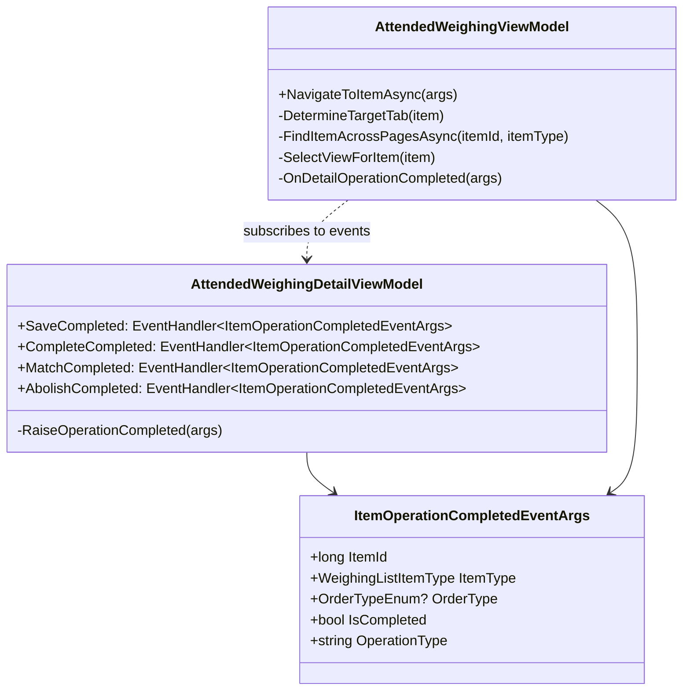
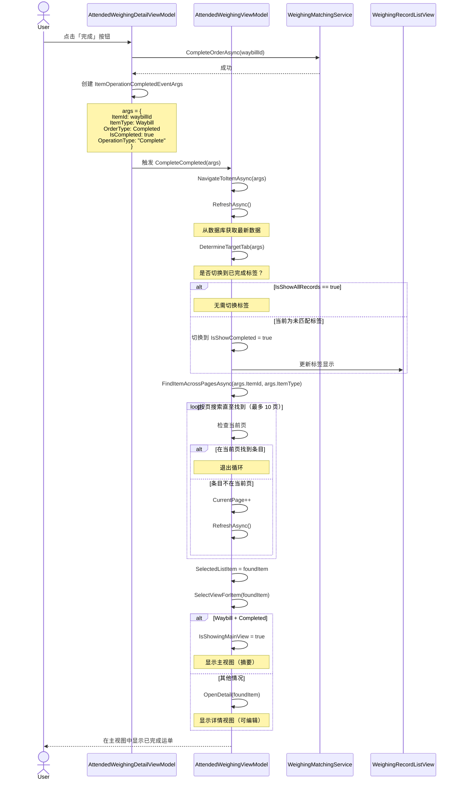
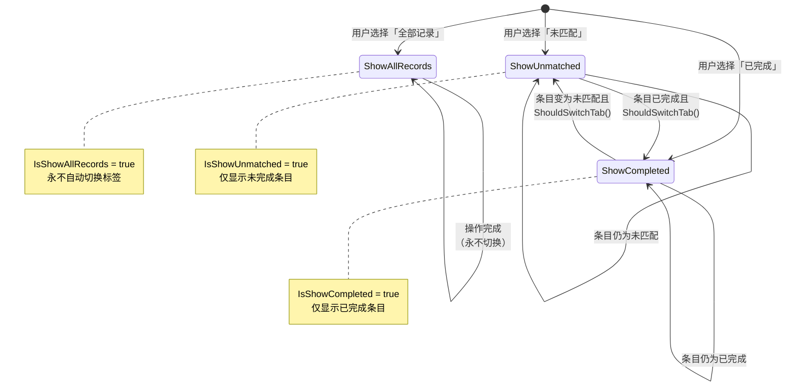

# 设计：称重条目导航与跟踪重构

## 背景

有人值守称重系统（`AttendedWeighingWindow`）允许操作员通过三栏布局管理称重记录与运单：
1. **左侧**：`WeighingRecordListView` - 带标签页（全部/未匹配/已完成）的分页列表
2. **中间**：在 `AttendedWeighingMainView`（摘要）与 `AttendedWeighingDetailView`（编辑）之间动态切换
3. **右侧**：拍照与相机预览

当操作员在 `AttendedWeighingDetailView` 中执行操作（保存、完成、匹配、作废）时，系统需要：
- 跟踪结果条目（其 ID 或类型可能已变更）
- 若条目在状态间移动，则切换到正确标签页
- 即使条目在不同页也能定位
- 显示合适视图（已完成运单用主视图，可编辑条目用详情视图）

**当前问题**：事件处理缺少上下文，导航逻辑分散在多个方法中且行为不一致。

## 目标 / 非目标

### 目标
- 所有操作后场景的统一导航逻辑
- 跨标签页与分页的可靠条目跟踪
- 尊重用户上下文（IsShowAllRecords）的智能标签切换
- 根据条目状态自动选择视图
- 保持现有事件驱动架构

### 非目标
- 改变 UI 布局或视觉设计
- 修改底层数据模型（WeighingListItemDto）
- 在导航改进之外增加新功能
- 改变分页机制本身

## 决策

### 决策 1：增强型事件参数

**选择**：创建包含完整操作上下文的富事件参数类

**理由**：
- 当前 `EventArgs.Empty` 不提供任何上下文
- 事件处理需要知道：哪个条目、什么操作、新状态是什么
- 允许用单一统一导航方法替代按操作拆分的逻辑

**考虑过的替代**：
- 每种操作保留独立事件类型 → 已拒绝：会重复导航逻辑
- 仅传递 ItemId → 已拒绝：处理方需重新查询类型/状态

**实现**：
```csharp
public class ItemOperationCompletedEventArgs : EventArgs
{
    public long ItemId { get; init; }
    public WeighingListItemType ItemType { get; init; }
    public OrderTypeEnum? OrderType { get; init; }
    public bool IsCompleted { get; init; }
    public string OperationType { get; init; } // "Save", "Complete", "Match", "Abolish"
}
```

### 决策 2：统一导航方法

**选择**：在 `NavigateToItemAsync` 中集中所有操作后导航

**理由**：
- 当前分散逻辑导致行为不一致
- 单一方法保证所有操作遵循相同规则
- 更易测试与维护
- 实现一致的标签切换与分页行为

**流程**：
```
NavigateToItemAsync(args)
  ↓
RefreshAsync() - 获取最新数据
  ↓
DetermineTargetTab(item) - 是否需要切换标签？
  ↓
如需则切换标签
  ↓
FindItemAcrossPagesAsync() - 定位到正确页
  ↓
SelectItem() - 更新 SelectedListItem
  ↓
SelectView() - 显示主视图或详情视图
```

**考虑过的替代**：
- 保留按操作拆分的多个方法 → 已拒绝：重复且不一致
- 使用导航服务 → 已拒绝：对本范围过重，增加复杂度

### 决策 3：标签切换规则

**选择**：尊重 `IsShowAllRecords` 标志，仅在必要时切换

**规则**：
1. 若 `IsShowAllRecords == true`：**永不切换标签**（所有条目可见）
2. 若条目变为已完成且 `IsShowUnmatched == true`：切换到 `IsShowCompleted`
3. 若条目变为未匹配且 `IsShowCompleted == true`：切换到 `IsShowUnmatched`
4. 否则：保持当前标签

**理由**：
- 用户选择的标签代表其工作上下文
- 「全部记录」明确表示「显示全部」——不要打断
- 仅当当前标签无法显示目标条目时才切换
- 减少令用户困惑的意外导航

**实现**：
```csharp
private bool ShouldSwitchTab(WeighingListItemDto targetItem)
{
    if (IsShowAllRecords) return false;
    
    bool itemIsCompleted = targetItem.OrderType == OrderTypeEnum.Completed;
    bool currentTabCanShowItem = 
        (IsShowCompleted && itemIsCompleted) ||
        (IsShowUnmatched && !itemIsCompleted);
        
    return !currentTabCanShowItem;
}
```

### 决策 4：分页导航策略

**选择**：「刷新并搜索」+ 渐进式翻页扫描

**理由**：
- 简单可靠：刷新得到最新数据后再搜索
- 与现有分页基础设施兼容
- 处理边界情况（条目被删、移到其他标签）

**算法**：
1. 刷新当前数据
2. 先在本页搜索（快速路径）
3. 若未找到，判断是否需要切换标签
4. 切换标签后跨页搜索（从第 1 页开始，最多 ±10 页）
5. 若仍未找到，回退到「选中第一项」行为

**考虑过的替代**：
- 按时间戳计算页码 → 已拒绝：在筛选/排序下不可靠
- 将所有页加载到内存 → 已拒绝：记录多时性能问题
- 服务端搜索 → 已拒绝：需后端改动（超出范围）

**性能**：同页 O(1)，跨页 O(n)（在页数限制下可接受）

### 决策 5：视图选择逻辑

**选择**：用 ItemType + OrderType 决定主视图与详情视图

**规则**：
- `Waybill` + `OrderType.Completed` → **主视图**（只读摘要）
- 其余 → **详情视图**（可编辑表单）

**理由**：
- 已完成运单为只读，主视图针对查看优化
- 未匹配记录与首磅运单需要编辑，用详情视图
- 与现有 UI 设计意图一致（主视图显示大图网格）

**与用户需求对齐**：
- CompleteAsync 后：条目变为 Waybill+Completed → 主视图 ✓
- Save/Match 后：条目仍可编辑 → 详情视图 ✓
- Abolish 后：选中下一项 → 详情视图（多数情况）✓

## 技术设计

### 类图



### 时序图：CompleteAsync 流程



### 状态机：标签导航



## 风险 / 权衡

### 风险 1：分页搜索性能
**风险**：跨多页搜索可能较慢  
**可能性**：低（典型使用 <100 条记录）  
**缓解**：
- 将搜索限制在当前页 ±10 页
- 从第 1 页开始以保证行为可预期
- 未找到时优雅回退

### 风险 2：异步导航中的竞态
**风险**：快速连续触发多次操作可能相互干扰  
**可能性**：中（用户快速点击按钮）  
**缓解**：
- 使用正确的 async/await 模式
- 确保在搜索前完成 RefreshAsync
- 事件处理按序执行（ReactiveUI MessageBus 保证）

### 风险 3：破坏现有工作流
**风险**：用户已适应当前（有问题的）行为  
**可能性**：低（当前行为明显有问题）  
**缓解**：
- 对所有操作路径做充分测试
- 确认所有事件处理仍正常工作
- 部署前进行用户验收测试

### 权衡：自动导航 vs 手动导航
**选择**：自动导航到目标条目  
**优点**：体验更好，减少手动查找  
**缺点**：可能让希望停留在其他条目的用户感到意外  
**理由**：当前行为是随机的（停留在错误条目），自动导航更可预期

## 迁移计划

无需迁移。此为代码重构，在不改变数据模型或 API 的前提下改进行为。

### 部署
1. 部署更新后的 ViewModel 与事件类
2. 无需数据库变更
3. 无需配置变更
4. 用户将立即看到改进后的行为

### 回滚
直接回滚代码即可。仅影响 UI 导航，无数据损坏风险。

## 待决问题

无——用户需求已通过交互式提问澄清。
