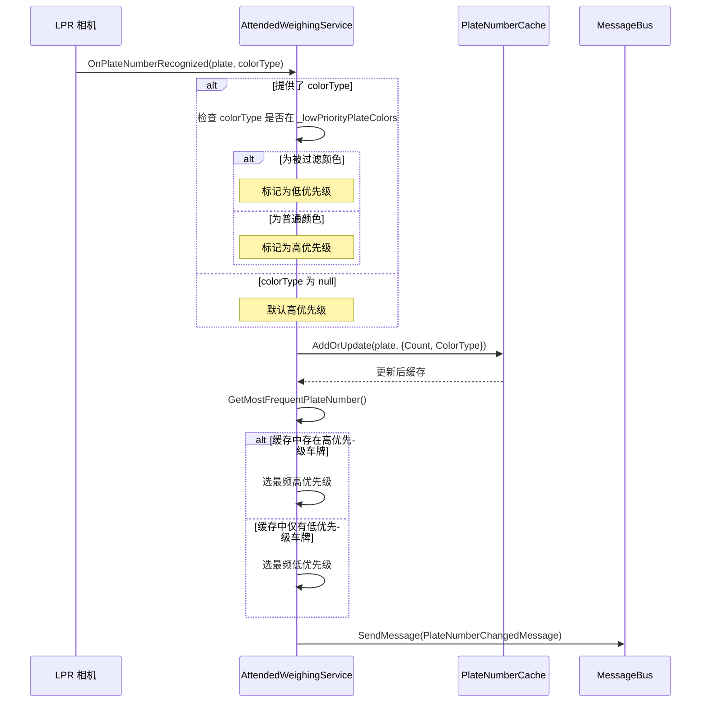

# 设计：车牌颜色优先级系统

## 背景

当前实现会完全过滤掉某些车牌颜色，导致在仅有被过滤颜色（如货车黄牌）时可用的车牌也无法使用。当需要称重仅能识别到被过滤颜色车牌的车辆时，会造成实际使用问题。

## 目标 / 非目标

**目标**：
- 在无其他可用车牌时，允许低优先级颜色车牌作为回退使用
- 防止低优先级车牌覆盖正常颜色车牌
- 将变量与配置重命名为体现优先级语义
- 保留现有缓存与频次统计行为

**非目标**：
- 改变配置格式（仍使用颜色类型值数组）
- 实现复杂优先级等级（仅两种：普通与低）
- 修改车牌号推荐系统
- 保持与旧配置键名的向后兼容

## 决策

### 决策 1：两级优先级

**决策**：仅实现两个优先级档位（高与低），而非灵活优先级体系。

**理由**：
- 当前需求只需「普通」与「被过滤」的区分
- 布尔逻辑更易理解和维护
- 性能好（无需复杂排序或优先级比较）

**考虑过的替代**：
- 多级优先级（0–10）：对当前需求增加不必要复杂度
- 加权评分：对二元决策过度设计

### 决策 2：变量重命名以体现优先级语义

**决策**：将 `_filteredPlateColors` 重命名为 `_lowPriorityPlateColors`，配置项 `FilteredPlateColors` 重命名为 `LowPriorityPlateColors`。

**理由**：
- 「Filtered」暗示拒绝，而新行为是基于优先级
- 「LowPriority」准确描述新语义
- 提高代码可读性与可维护性
- 让后续开发者意图清晰

**考虑过的替代**：
- 保留 `FilteredPlateColors`：易误导，暗示拒绝而非优先级
- 使用 `FallbackPlateColors`：不如「LowPriority」清晰
- 使用 `SecondaryPlateColors`：层级关系模糊

**破坏性变更**：
- 此为**破坏性**配置变更
- 现有部署必须更新配置文件
- 不提供自动迁移（需手动重命名）

### 决策 3：在缓存中存储颜色信息

**决策**：在 `PlateNumberCacheRecord` 中增加 `ColorType` 属性，用于存储每条缓存车牌的颜色。

**理由**：
- 无需外部查询即可判断优先级
- 内存开销小（每条缓存约 1 个可空枚举）
- 缓存的当时已有颜色信息
- 便于后续按颜色统计等能力

**考虑过的替代**：
- 仅存优先级布尔：丢失颜色信息，不利于调试
- 从外部服务查颜色：性能与可靠性差
- 用独立字典存颜色：内存与缓存一致性差

### 决策 4：优先级选择算法

**决策**：选择最频车牌时，先将缓存分为高优先级与低优先级集合，仅当高优先级非空时从高优先级中选择。

**算法**：
```csharp
var highPriorityPlates = _plateNumberCache
    .Where(kvp => !kvp.Value.IsLowPriority)
    .ToList();

if (highPriorityPlates.Any())
{
    return highPriorityPlates
        .OrderByDescending(kvp => kvp.Value.Count)
        .First().Key;
}
else
{
    return _plateNumberCache
        .OrderByDescending(kvp => kvp.Value.Count)
        .First().Key;
}
```

**理由**：
- 优先级边界清晰
- 高优先级中最频者始终胜出，与低优先级次数无关
- 低优先级即使被识别 100 次，1 次高优先级仍优先

**考虑过的替代**：
- 加权评分：高优先级次数×10、低优先级×1 → 更复杂、难推理
- 低优先级达到最小阈值才考虑 → 增加配置复杂度

### 决策 5：不兼容旧配置键名

**决策**：不支持旧配置键 `FilteredPlateColors`，必须迁移到 `LowPriorityPlateColors`。

**理由**：
- 与旧语义（拒绝 → 优先级）彻底切割
- 无兼容层代码更简单
- 强制显式确认行为变化
- 配置变更频率低（仅部署时）

**迁移**：
- 部署时需手动更新配置文件
- 在发布说明中增加迁移说明
- 可考虑在检测到旧键时输出启动警告（但不使用该键）

**考虑过的替代**：
- 同时支持两键并回退：增加复杂度、延缓迁移、语义混淆

## 技术设计

### 数据结构变更

**变更前**：
```csharp
public record PlateNumberCacheRecord
{
    public int Count { get; init; }
    public DateTime LastUpdateTime { get; init; }
}
```

**变更后**：
```csharp
public record PlateNumberCacheRecord
{
    public int Count { get; init; }
    public DateTime LastUpdateTime { get; init; }
    public LprAllInOneColorType? ColorType { get; init; }
    
    public bool IsLowPriority => ColorType.HasValue && 
        /* 与 _filteredPlateColors 比较 */;
}
```

**说明**：`IsLowPriority` 不能是简单属性，因为需要访问 `_lowPriorityPlateColors`。

**解决**：仅存储 `ColorType`，在 `GetMostFrequentPlateNumber()` 的选择阶段计算优先级。

### 缓存流程变更



### 边界情况

1. **混合缓存（高 + 低优先级）**
   - 行为：始终从高优先级集合中选择
   - 示例：缓存有 ["京A12345"（高，次数=1）、"京B99999"（低，次数=10）]
   - 结果：返回 "京A12345"（高优先级在次数更低时仍胜出）

2. **全部为低优先级**
   - 行为：选最频低优先级车牌
   - 示例：缓存中仅有黄牌（均为低优先级）
   - 结果：返回最频黄牌

3. **缺少颜色信息**
   - 行为：视为高优先级（保守默认）
   - 示例：旧代码调用 `OnPlateNumberRecognized("京A12345", null)`
   - 结果："京A12345" 按高优先级处理

4. **先来低优先级再來高优先级**
   - 行为：高优先级立即取代
   - 示例：["京B99999"（低，次数=5）] 后 "京A12345"（高，次数=1）到达
   - 结果：立即切换为 "京A12345"

5. **操作中缓存被清空**
   - 行为：与现有行为一致（状态切换时清空缓存）
   - 优先级逻辑仅影响选择，不影响清空

## 风险 / 权衡

### 风险：性能影响
- **风险**：对缓存做两次筛选（先高后低）可能拖慢选择
- **缓解**：缓存通常 <10 条，LINQ 开销可忽略
- **度量**：为 100 条缓存增加基准测试（最坏情况）

### 风险：破坏性配置变更
- **风险**：重命名配置键会破坏现有部署
- **缓解**：
  - 在发布说明中写清迁移步骤
  - 可考虑在检测到旧键时输出启动警告
  - 配置变更频率低（仅部署时）
- **接受**：为语义清晰接受破坏性变更

### 权衡：复杂度与灵活性
- **权衡**：两级简单但未来扩展空间有限
- **接受**：当前只需二元优先级，必要时可再重构

### 权衡：内存开销
- **权衡**：每条缓存记录增加 `ColorType` 约 4 字节
- **接受**：典型缓存 1–5 条，总开销 <50 字节

## 迁移计划

**需要配置迁移**：

**步骤 1：更新配置文件**
```json
// 旧（迁移前）
{
  "FilteredPlateColors": [2, 3]  // 黄、绿
}

// 新（迁移后）
{
  "LowPriorityPlateColors": [2, 3]  // 黄、绿
}
```

**步骤 2：部署顺序**
1. 更新配置文件（将 `FilteredPlateColors` 重命名为 `LowPriorityPlateColors`）
2. 部署代码更新
3. 重启应用（长驻服务）
4. 在日志中关注「已选低优先级车牌」类消息

**步骤 3：验证**
- 确认启动日志中配置加载正确
- 用低优先级颜色车牌验证回退行为
- 确认高优先级车牌优先

**回滚**：
- 回滚代码
- 回滚配置文件（改回 `FilteredPlateColors`）
- 重启应用
- 无需数据清理（缓存仅在内存）

**重要**：必须先更新配置再部署新代码，否则新配置不会生效。

## 待决问题

无——用户需求已明确。
