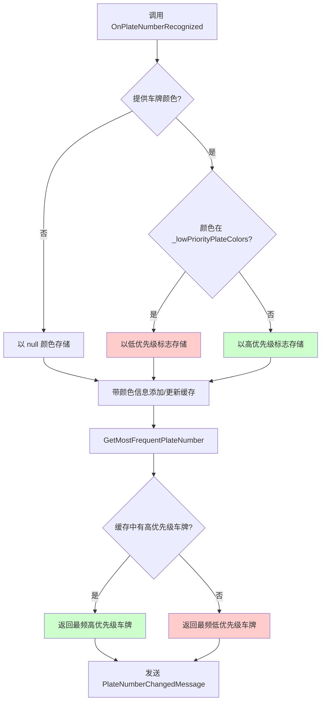

# 变更：将车牌颜色过滤改为基于优先级的匹配

## 背景与动机

当前车牌颜色过滤实现会直接拒绝某些颜色（由 `_filteredPlateColors` 配置）的车牌，导致这些车牌完全无法使用。实践中，这些被过滤的车牌应在没有更高优先级车牌时作为「回退」使用。当仅能识别到被过滤颜色车牌时，会导致合理的称重流程失败。

## 变更内容

- 将车牌颜色处理从**基于拒绝**（立即丢弃）改为**基于优先级**（最低优先级）
- **变量重命名**以更好体现优先级语义：
  - `_filteredPlateColors` → `_lowPriorityPlateColors`
  - 配置键 `FilteredPlateColors` → `LowPriorityPlateColors`
- 在 `PlateNumberCacheRecord` 中增加颜色信息，记录每条缓存车牌的颜色
- 修改 `GetMostFrequentPlateNumber()` 实现基于优先级的选择：
  - 不在 `_lowPriorityPlateColors` 中的车牌为**高优先级**
  - 在 `_lowPriorityPlateColors` 中的为**低优先级**（仅当缓存中无高优先级车牌时才可被选中）
  - 低优先级车牌不能覆盖已有高优先级车牌
- 更新 `OnPlateNumberRecognized()`，在写入缓存时同时保存颜色信息

## 代码流程变更

**优先级选择逻辑**：
1. **高优先级车牌**（绿色路径）：颜色不在 `_lowPriorityPlateColors` 中的车牌
2. **低优先级车牌**（红色路径）：颜色在 `_lowPriorityPlateColors` 中的车牌
3. 选择规则：
   - 若缓存中存在任意高优先级车牌 → 选其中最频者
   - 若缓存中仅有低优先级车牌 → 选其中最频者
   - 低优先级车牌一旦高优先级已缓存则不能「替换」高优先级

## 影响

- **涉及规范**：`attended-weighing`
- **涉及代码**：
  - `MaterialClient.Common/Services/AttendedWeighingService.cs`（约第 29–40、164、198–212、396–447、452–461 行）
  - `PlateNumberCacheRecord` 结构（增加 `ColorType` 属性）
  - `MaterialClient.Common/Configuration/PlateColorFilterConfig.cs`（属性重命名）
  - 使用 `FilteredPlateColors` 键的配置文件（appsettings.json）
- **破坏性变更**：**是**——配置键由 `FilteredPlateColors` 重命名为 `LowPriorityPlateColors`
- **迁移要求**：更新配置文件以使用新键名
- **需更新测试**：`AttendedWeighingServiceTests.cs` 中的车牌缓存相关测试
