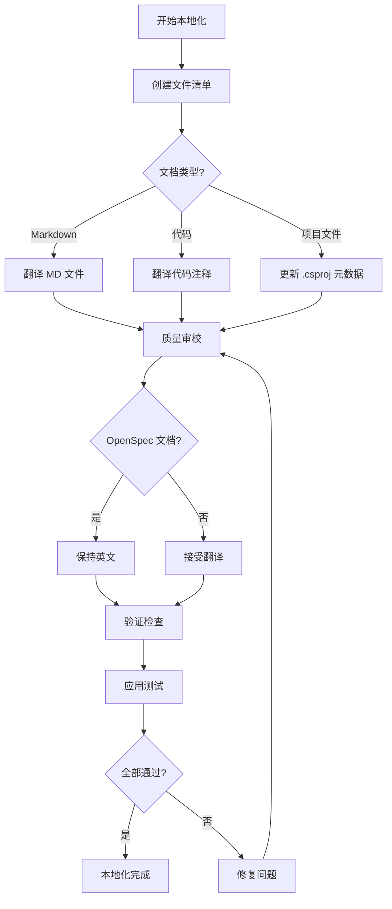
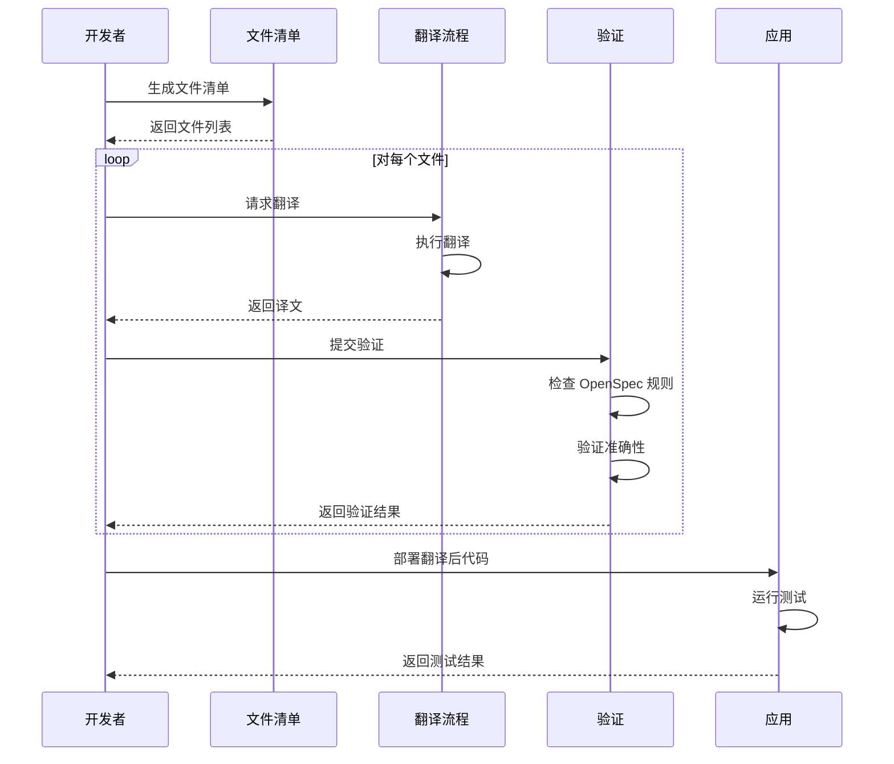

## Context

### Background

MaterialClient 是一个 Windows 桌面应用程序，用于卡车称重管理和物料跟踪。当前项目的语言设置不统一：
- 代码注释混合使用中英文
- Markdown 文档主要使用英文
- 项目描述使用英文
- 用户界面和文档存在语言不一致

### Current State

**Language Distribution Analysis**:
- **Code Comments**: 部分使用中文（如 `Program.cs`, `WeighingRecord.cs`），部分使用英文
- **Documentation**: `docs/` 和 `openspec/docs/` 目录主要使用英文
- **Project Metadata**: .csproj 文件中的描述使用英文
- **Runtime**: 程序已设置中文文化环境（`zh-CN`）

### Constraints

1. **OpenSpec Language Requirement**: `openspec/specs/**/spec.md`, `openspec/changes/**/proposal.md`, `tasks.md`, `design.md` 必须保持英文
2. **Code Integrity**: 代码内容本身（变量名、方法名、类名）必须保持英文
3. **Technical Terminology**: 技术性和专业术语保留英文备注（如 API、HTTP、REST、JSON、XML 等技术术语）
4. **Backward Compatibility**: 翻译不应影响现有功能
5. **Accuracy**: 翻译必须准确，不能改变原意

### Stakeholders

- **Chinese Users**: 主要用户群体，期望中文界面和文档
- **Development Team**: 需要理解翻译范围和方法
- **OpenSpec System**: 维持英文规范文档的完整性

---

## Goals / Non-Goals

**Goals:**
- 统一项目非代码内容为中文，提高中文用户的可读性
- 翻译所有 Markdown 文档（OpenSpec 规范文档除外）
- 翻译所有代码注释为中文
- 更新项目描述为中文
- 降低维护成本，消除双语维护需求

**Non-Goals:**
- 修改 OpenSpec 规范文档的语言要求
- 更改代码内容本身（变量名、方法名、类名保持英文）
- 修改程序功能行为
- 翻译第三方库或依赖项的文档

---

## 决策

### 决策 1：翻译范围 - 选择性 vs 全面

**选择**：选择性翻译，并明确排除标准

**理由**：
- **全面翻译**会包含 OpenSpec 规范，但违反 OpenSpec 系统不可协商的英文要求
- **选择性翻译**聚焦于面向用户和开发者的内容，同时遵守系统约束

**备选方案**：
- **备选 1 - 全面翻译**：翻译所有内容（含 OpenSpec 文档）
  - *优点*：语言完全统一
  - *缺点*：违反 OpenSpec 要求、破坏 OpenSpec 校验
- **备选 2 - 双语维护**：同时保留中英文版本
  - *优点*：不丢失信息
  - *缺点*：维护成本高、版本间可能不一致

**决策**：采用选择性翻译，对 OpenSpec 文档采用明确的排除标准

---

### 决策 2：翻译方式 - 人工 vs 自动化

**选择**：人工翻译并做质量控制

**理由**：
- **自动化翻译**更快但技术译文可能不准确
- **人工翻译**能保证准确性和贴合上下文的术语

**备选方案**：
- **备选 1 - 全自动**：所有内容用 AI 翻译
  - *优点*：快速、成本低
  - *缺点*：技术翻译可能不准、丢失细微含义
- **备选 2 - 混合**：先自动一稿再人工审校
  - *优点*：兼顾速度与质量
  - *缺点*：仍需大量人工审校

**决策**：为准确起见采用人工翻译，尤其对技术文档和代码注释

---

### 决策 3：项目描述更新 - .csproj vs 独立元数据文件

**选择**：直接更新 .csproj 文件

**理由**：
- **.csproj 更新**是 .NET 中项目元数据的标准位置
- **独立元数据文件**会增加复杂度且无明显收益

**备选方案**：
- **备选 1 - 独立元数据文件**：在单独配置文件中存项目描述
  - *优点*：集中管理、易更新
  - *缺点*：非标准做法、需额外构建配置
- **备选 2 - 运行时元数据**：从外部加载描述
  - *优点*：无需重新编译即可动态更新
  - *缺点*：增加运行时复杂度和外部依赖

**决策**：直接更新 .csproj，使用标准 .NET 项目元数据

---

### 决策 4：代码注释翻译 - 行内 vs 外部文档

**选择**：在代码文件中行内翻译

**理由**：
- **行内注释**对正在编写代码的开发者立即可见
- **外部文档**会迫使开发者查阅多处来源

**备选方案**：
- **备选 1 - 外部文档**：把所有注释移到单独文档
  - *优点*：集中、易维护
  - *缺点*：阅读代码时失去上下文
- **备选 2 - 双语注释**：同时保留中英文注释
  - *优点*：不丢失信息
  - *缺点*：文件变大、可能造成混淆

**决策**：在代码文件中直接翻译行内注释

---

## 风险与权衡

### 风险 1：翻译质量不一致

**风险**：不同译者或工具可能导致术语和风格不一致。

**缓解**：
- 建立常用技术术语的翻译词汇表
- 制定技术文档的风格指南
- 跨文档审校翻译一致性

---

### 风险 2：代码注释丢失上下文

**风险**：翻译后的注释可能丢失技术细微含义或上下文。

**缓解**：
- 优先保证技术准确而非字面翻译
- 结合周边代码审校注释
- 使用符合领域的技术术语

---

### 风险 3：破坏 OpenSpec 校验

**风险**：误译 OpenSpec 规范文档可能导致校验失败。

**缓解**：
- 明确文档化排除标准
- 增加自动化校验步骤，确保 OpenSpec 文档保持英文
- 提交前人工审校

---

### 风险 4：翻译遗漏

**风险**：部分文档或注释在翻译过程中被遗漏。

**缓解**：
- 系统化列出所有待翻译文件
- 按清单执行翻译
- 对关键文件中的英文注释做自动检测

---

### 权衡：翻译时间 vs 质量

**权衡**：加快翻译可能降低质量；充分的质量保证需要更多时间。

**缓解**：
- 优先处理关键文档和常用代码
- 分阶段翻译（高优先级先行）
- 将翻译视为持续过程而非一次性工作

---

## 迁移计划

### 阶段 1：准备
1. 建立待翻译文件清单
2. 建立翻译词汇表与风格指南
3. 配置 OpenSpec 文档的验证规则

### 阶段 2：文档翻译
1. 翻译 `docs/` 目录下的 Markdown 文件
2. 翻译根目录 Markdown 文件（排除 OpenSpec 指令）
3. 审校并验证译文

### 阶段 3：代码注释翻译
1. 翻译 MaterialClient 项目中的代码注释
2. 翻译 MaterialClient.Common 项目中的代码注释
3. 翻译 MaterialClient.Toolkit 项目中的代码注释
4. 验证代码功能未改变

### 阶段 4：项目元数据更新
1. 更新 MaterialClient.csproj 描述
2. 更新 MaterialClient.Common.csproj 描述
3. 更新 MaterialClient.Toolkit.csproj 描述

### 阶段 5：验证与审校
1. 验证 OpenSpec 文档保持英文
2. 验证译文准确
3. 测试应用功能
4. 审校是否有遗漏翻译

### 回滚策略

若翻译引发问题：
1. 按文件回滚以定位问题译文
2. 用 git 选择性回滚具体提交
3. 保留翻译清单以跟踪进度

---

## 待决问题

1. **是否建立翻译词汇表？** - 考虑为翻译中常用技术术语建立标准词汇表
2. **混合语言注释如何处理？** - 部分文件可能同时有中英文注释，需统一处理策略
3. **是否翻译测试代码注释？** - 测试文件常有技术注释，需决定是否优先翻译
4. **如何验证翻译质量？** - 需建立流程确保译文准确并保持技术完整性

---

## 详细代码变更清单

| 文件路径 | 变更类型 | 变更说明 | 影响模块 | 优先级 |
|-----------|-------------|-------------------|-----------------|-----------|
| `docs/SDD.md` | 翻译内容 | 将软件设计文档翻译为中文 | 文档 | 高 |
| `docs/existing-docs-inventory.md` | 翻译内容 | 将文档清单翻译为中文 | 文档 | 中 |
| `docs/sdd-*.md` | 翻译内容 | 将 SDD 相关文档翻译为中文 | 文档 | 高 |
| `MaterialClient/**/*.cs` | 更新注释 | 将英文注释翻译为中文 | MaterialClient | 高 |
| `MaterialClient.Common/**/*.cs` | 更新注释 | 将英文注释翻译为中文 | MaterialClient.Common | 高 |
| `MaterialClient.Toolkit/**/*.cs` | 更新注释 | 将英文注释翻译为中文 | MaterialClient.Toolkit | 中 |
| `MaterialClient/MaterialClient.csproj` | 更新元数据 | 将项目描述改为中文 | 项目元数据 | 高 |
| `MaterialClient.Common/MaterialClient.Common.csproj` | 更新元数据 | 将项目描述改为中文 | 项目元数据 | 高 |
| `MaterialClient.Toolkit/MaterialClient.Toolkit.csproj` | 更新元数据 | 将项目描述改为中文 | 项目元数据 | 高 |

---

## 组件架构

```
本地化工作流
├── 准备阶段
│   ├── 文件清单
│   ├── 词汇表创建
│   └── 验证规则配置
│
├── 文档阶段
│   ├── docs/ 目录翻译
│   ├── 根目录 MD 文件翻译
│   └── 质量审校
│
├── 代码阶段
│   ├── MaterialClient 注释
│   ├── MaterialClient.Common 注释
│   └── MaterialClient.Toolkit 注释
│
├── 元数据阶段
│   ├── .csproj 文件更新
│   └── 项目描述变更
│
└── 验证阶段
    ├── OpenSpec 文档验证
    ├── 翻译质量审校
    ├── 功能测试
    └── 最终审校
```

---

## 数据流图



---

## API 调用时序图


