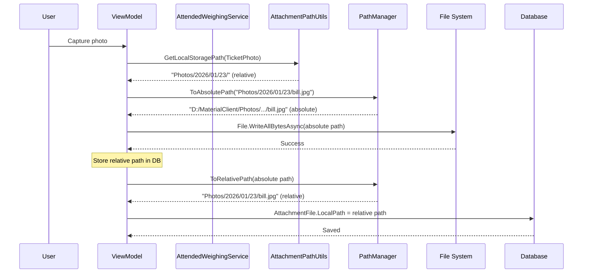
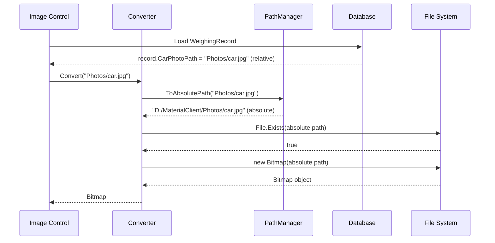

# 设计：新增 PathManager 工具

## 上下文

MaterialClient 在三种场景下使用文件路径：
1. **Configuration files** (e.g., `appsettings.json`): Relative paths for portability
2. **Database storage** (`AttachmentFile.LocalPath`): Should be relative for migration/portability
3. **File system operations** (`File.*`, `Directory.*`, `Bitmap`): Must be absolute to avoid working directory dependency

**Current Implementation** (after `fix-path-resolution-from-system32`):
- ✅ Database connection string: Converted to absolute via `DatabaseConnectionStringFactory.FixConnectionString()`
- ✅ Photo file operations: Use absolute paths via `AttachmentPathUtils.GetLocalStorageAbsolutePath()`
- ✅ Ticket printing: Entry-point normalization in `TicketPrintingService`
- ✅ Logs/config: Already use `AppContext.BaseDirectory`

**Remaining Gaps**:
- ❌ No standardized relative→absolute conversion for general use
- ❌ No standardized absolute→relative conversion for database storage
- ❌ UI image converters don't normalize paths before `File.Exists()` and `Bitmap()` loading
- ❌ File existence checks scattered across codebase without path normalization

## 目标 / 非目标

**目标**：
- Provide unified API for bidirectional path conversion (relative ↔ absolute)
- Fix UI image rendering when app starts from System32
- Ensure database stores relative paths for portability
- Create reusable helpers for common file operations (exists, ensure directory)
- Follow VS Code's path management pattern (proven enterprise approach)

**非目标**：
- Modifying `DatabaseConnectionStringFactory` or `AttachmentPathUtils` (they work correctly)
- Supporting custom base directories (always use `AppContext.BaseDirectory`)
- Implementing working directory modification (explicitly avoided)
- Migrating entire codebase in one change (gradual adoption via optional enhancements)

## 决策

### 决策 1：简单二元策略

**选择**： Two-tier path management:
- **Storage Tier** (database, config): Relative paths
- **Runtime Tier** (file I/O): Absolute paths

**Rationale**:
- Simpler than VS Code's multi-tier strategy (workspace/user/internal)
- MaterialClient doesn't have "workspace" concept (unlike VS Code projects)
- Sufficient for single-instance desktop application
- Easy to understand and maintain

**Alternatives Considered**:
1. ❌ Store absolute paths everywhere → Breaks portability, database migration fails
2. ❌ Use relative paths everywhere → Fails when launched from System32 (current bug)
3. ❌ Complex URI scheme (`app://`, `user://`) → Overkill for MaterialClient's scale
4. ✅ **Binary strategy** → Right balance of simplicity and robustness

### 决策 2：集中工具类

**选择**： Create static `PathManager` class in `MaterialClient.Common/Utils/`

**Rationale**:
- Follows project convention: "Static factory methods in `Utils/`" (per `openspec/project.md`)
- No state needed (all methods pure functions based on `AppContext.BaseDirectory`)
- Easy to test (no DI setup required)
- Consistent with existing `DatabaseConnectionStringFactory`, `AttachmentPathUtils`

**Alternatives Considered**:
1. ❌ DI service in `Providers/` → Unnecessary overhead for stateless utility
2. ❌ Extension methods on `string` → Less discoverable, harder to document
3. ✅ **Static utility class** → Matches project patterns

### 决策 3：路径转换逻辑

**选择**： Use `Path.GetRelativePath()` and `Path.Combine()` from .NET BCL

**Implementation**:
```csharp
// Relative → Absolute
public static string ToAbsolutePath(string path)
{
    if (string.IsNullOrWhiteSpace(path))
        return AppContext.BaseDirectory;
    if (Path.IsPathRooted(path))
        return path;  // Already absolute
    return Path.GetFullPath(Path.Combine(AppContext.BaseDirectory, path));
}

// Absolute → Relative
public static string ToRelativePath(string absolutePath)
{
    if (string.IsNullOrWhiteSpace(absolutePath))
        return string.Empty;
    if (!absolutePath.StartsWith(AppContext.BaseDirectory, OrdinalIgnoreCase))
        return absolutePath;  // Not under app directory, keep absolute
    return Path.GetRelativePath(AppContext.BaseDirectory, absolutePath);
}
```

**Rationale**:
- Uses built-in .NET path handling (cross-platform, well-tested)
- `Path.GetFullPath()` normalizes paths (handles `..\`, extra slashes, etc.)
- `Path.GetRelativePath()` handles Windows/Unix path separators
- Idempotent: calling multiple times produces same result

**Edge Cases Handled**:
1. `null` or empty input → Return sensible default
2. Already-converted paths → Return unchanged (idempotent)
3. Absolute paths outside app directory → Keep absolute (e.g., user-selected export path)
4. Paths with `..\` or `//` → Normalized by `Path.GetFullPath()`

### 决策 4：UI 转换器修复策略

**选择**： Update converters to call `PathManager.ToAbsolutePath()` before `File.Exists()` and `Bitmap()` loading

**Before**:
```csharp
if (File.Exists(path)) return new Bitmap(path);
```

**After**:
```csharp
var absolutePath = PathManager.ToAbsolutePath(path);
if (File.Exists(absolutePath)) return new Bitmap(absolutePath);
```

**Rationale**:
- Minimal code change (1-2 lines per converter)
- Handles both relative paths (from database) and absolute paths (backward compatibility)
- No impact on asset paths (`avares://...`) - they're handled in separate branch
- Idempotent: if `path` is already absolute, `ToAbsolutePath()` returns it unchanged

**Alternatives Considered**:
1. ❌ Change database to store absolute paths → Breaks portability
2. ❌ Add path normalization in ViewModel → Violates separation of concerns (converters should be self-contained)
3. ✅ **Fix in converter** → Right place for presentation-layer logic

### 决策 5：数据库存储校验（不修改逻辑）

**选择**： Add inline comments and validation, don't change storage logic

**Rationale**:
- Current implementation in `AttendedWeighingService` and `AttendedWeighingViewModel` uses `AttachmentPathUtils.GetLocalStoragePath()` (returns relative paths) ✅
- File operations use `AttachmentPathUtils.GetLocalStorageAbsolutePath()` (returns absolute paths) ✅
- No code changes needed, only documentation to prevent future regressions

**Validation Points**:
1. `AttendedWeighingService.cs` line ~1108: Verify `AttachmentFile` constructor receives relative path
2. `AttendedWeighingViewModel.cs` line ~1668: Verify `BillPhotoPath` saved to DB is relative

**Documentation Strategy**:
```csharp
// Storage: relative path for database portability (e.g., "Photos/2026/01/23/car.jpg")
var attachment = new AttachmentFile(fileName, relativePath, AttachType.EntryPhoto);
```

## 技术设计

### PathManager API

```csharp
namespace MaterialClient.Common.Utils;

/// <summary>
/// Path management utility for bidirectional path conversion.
/// 
/// Strategy:
/// - Storage (database/config): Relative paths for portability
/// - Runtime (file I/O): Absolute paths based on AppContext.BaseDirectory
/// 
/// This ensures:
/// 1. Database can be migrated between servers
/// 2. App works when launched from any working directory (e.g., System32)
/// 3. All file operations use consistent absolute paths
/// </summary>
public static class PathManager
{
    private static readonly string _appBaseDirectory = AppContext.BaseDirectory;
    
    /// <summary>
    /// Convert any path to absolute path for file system operations.
    /// Idempotent: calling multiple times returns same result.
    /// </summary>
    public static string ToAbsolutePath(string path);
    
    /// <summary>
    /// Convert absolute path to relative path for database storage.
    /// If path is outside app directory, returns absolute path unchanged.
    /// </summary>
    public static string ToRelativePath(string absolutePath);
    
    /// <summary>
    /// Check if file exists with automatic path normalization.
    /// </summary>
    public static bool FileExists(string path);
    
    /// <summary>
    /// Create directory with automatic path normalization.
    /// Returns absolute path of created directory.
    /// </summary>
    public static string EnsureDirectoryExists(string path);
}
```

### Data Flow Diagrams

#### Photo Capture and Storage Flow



#### UI Image Loading Flow



### Code Changes Summary

| File | Change Type | Description |
|------|-------------|-------------|
| `Utils/PathManager.cs` | **NEW** | Core utility class with 5 methods |
| `Converters/CarNullOrEmptyImageConverter.cs` | **MODIFY** | Add path normalization (2 lines) |
| `Converters/NullOrEmptyImageConverter.cs` | **MODIFY** | Add path normalization (2 lines) |
| `Services/AttendedWeighingService.cs` | **DOCUMENT** | Add inline comment validating storage |
| `ViewModels/AttendedWeighingViewModel.cs` | **DOCUMENT** | Add inline comment validating storage |

**Total LOC**: ~150 lines added (100 in PathManager + 50 in tests), 4 lines modified in converters

## 风险与权衡

### Risk 1: Existing Absolute Paths in Database

**Impact**: If database already contains absolute paths (e.g., from manual testing), images will load but won't be portable.

**Mitigation**:
- `ToAbsolutePath()` handles absolute paths (idempotent, returns unchanged)
- Images will continue to work until next photo capture
- New captures will use relative paths (correct behavior)
- Manual fix: `UPDATE AttachmentFiles SET LocalPath = replace(LocalPath, 'D:\MaterialClient\', '')`

### Risk 2: Path Separator Differences (Windows vs Unix)

**Impact**: If codebase ever runs on Linux/macOS, path separators differ (`\` vs `/`).

**Mitigation**:
- .NET's `Path.Combine()` and `Path.GetRelativePath()` handle separators automatically
- `Path.GetFullPath()` normalizes separators to OS-native format
- Current project is Windows-only (per `openspec/project.md`), but code is cross-platform ready

### Risk 3: Performance of Path Normalization

**Impact**: `ToAbsolutePath()` called frequently (every image load in UI).

**Analysis**:
- `Path.Combine()` and `Path.GetFullPath()` are native BCL methods (very fast)
- Typical overhead: <1μs per call
- UI image loading is I/O bound (disk read >> path normalization)
- **No caching needed** - performance impact negligible

### Trade-off: Gradual vs Big-Bang Migration

**Decision**: Gradual migration (Phase 6 optional enhancements)

**Rationale**:
- Critical path (UI image loading) fixed in Phase 2
- Optional enhancements (migrate `File.Exists()` calls) can happen incrementally
- Lower risk: existing code continues working during migration
- Team can validate core functionality before expanding usage

## Validation Strategy

### Unit Tests

```csharp
public class PathManagerTests
{
    [Fact] public void ToAbsolutePath_RelativePath_ReturnsAbsolute() { }
    [Fact] public void ToAbsolutePath_AbsolutePath_ReturnsUnchanged() { }
    [Fact] public void ToAbsolutePath_NullPath_ReturnsBaseDirectory() { }
    [Fact] public void ToAbsolutePath_EmptyPath_ReturnsBaseDirectory() { }
    
    [Fact] public void ToRelativePath_AbsoluteInApp_ReturnsRelative() { }
    [Fact] public void ToRelativePath_AbsoluteOutsideApp_ReturnsUnchanged() { }
    [Fact] public void ToRelativePath_RelativePath_ReturnsUnchanged() { }
    
    [Fact] public void FileExists_RelativePath_ChecksCorrectly() { }
    [Fact] public void EnsureDirectoryExists_RelativePath_CreatesCorrectly() { }
}
```

### Integration Tests

1. **System32 Launch Test**:
   ```powershell
   cd C:\Windows\System32
   D:\MaterialClient\MaterialClient.exe
   ```
   - Launch app, navigate to attended weighing
   - Verify existing vehicle photos render
   - Capture new photo
   - Verify photo saves to `D:\MaterialClient\Photos\...`, not System32

2. **Database Path Inspection**:
   ```sql
   -- Check recent attachments
   SELECT Id, FileName, LocalPath, AddDate 
   FROM AttachmentFiles 
   ORDER BY AddDate DESC 
   LIMIT 10;
   
   -- Expected: LocalPath = "Photos/2026/01/23/car.jpg" (relative)
   -- Not: LocalPath = "D:\MaterialClient\Photos\..." (absolute)
   ```

3. **Portability Test**:
   ```powershell
   # Copy database and photos to new location
   xcopy D:\MaterialClient\MaterialClient.db E:\TestLocation\
   xcopy D:\MaterialClient\Photos E:\TestLocation\Photos\ /E
   
   # Launch from new location
   cd E:\TestLocation
   .\MaterialClient.exe
   
   # Verify images load correctly
   ```

### Manual Testing Checklist

- [ ] Launch from application directory → Images render
- [ ] Launch from System32 → Images render
- [ ] Launch from random directory → Images render
- [ ] Capture new photo → Saves to app directory (not working directory)
- [ ] Inspect database → New attachments use relative paths
- [ ] Copy database to new location → Images still load
- [ ] Export ticket PDF → Saves to app directory

## Migration Plan

### Phase 1: Core Implementation (30 min)
1. Create `PathManager.cs` with core methods
2. Add unit tests
3. Verify tests pass

### Phase 2: UI Fixes (30 min)
1. Update image converters
2. Test image rendering from System32 launch
3. Verify no regressions in normal launch

### Phase 3: Validation (30 min)
1. Review service code for storage convention compliance
2. Add inline comments documenting relative path storage
3. Run integration tests

### Phase 4: Documentation (30 min)
1. Update design docs
2. Add code comments
3. Document path management strategy

**Total Estimated Time**: 2-3 hours (critical path)

### Rollback Plan

If issues occur:
1. Revert converter changes → Images work in normal launch (System32 launch regresses)
2. Keep `PathManager` utility → No harm (not used yet)
3. Continue using existing path utilities (`AttachmentPathUtils`, `DatabaseConnectionStringFactory`)

**Low Risk**: Changes are additive (new utility) + minimal modifications (2 lines per converter)

## Related Patterns

### VS Code Path Management (Reference)

VS Code uses a more complex 3-tier strategy:
- **Workspace settings**: Relative paths (for project portability)
- **User settings**: Absolute paths (machine-specific)
- **Internal data**: Absolute paths (performance)

MaterialClient simplifies to 2-tier:
- **Database/config**: Relative paths (portability)
- **Runtime I/O**: Absolute paths (reliability)

This is appropriate because:
- No "workspace" concept in MaterialClient
- Simpler mental model for team
- Sufficient for single-instance desktop app

### Enterprise Alternatives Not Chosen

1. **Registry-based paths** (Microsoft Office style):
   - ❌ Windows-only
   - ❌ Requires installation/admin rights
   - ❌ Harder to test

2. **Environment variables** (Docker style):
   - ❌ Configuration complexity
   - ❌ User setup required
   - ❌ Not needed for desktop app

3. **URI scheme** (`app://`, `user://`):
   - ❌ Overkill for MaterialClient's scale
   - ❌ Additional parsing complexity

## Summary

**PathManager** provides a simple, robust solution for MaterialClient's path management needs:
- ✅ Bidirectional conversion (relative ↔ absolute)
- ✅ Zero working directory dependency
- ✅ Database portability maintained
- ✅ UI image loading fixed
- ✅ Enterprise-proven pattern (VS Code inspired)
- ✅ Minimal code changes (low risk)
- ✅ Gradual migration path (optional enhancements)

This completes the path management architecture started by `fix-path-resolution-from-system32`.
