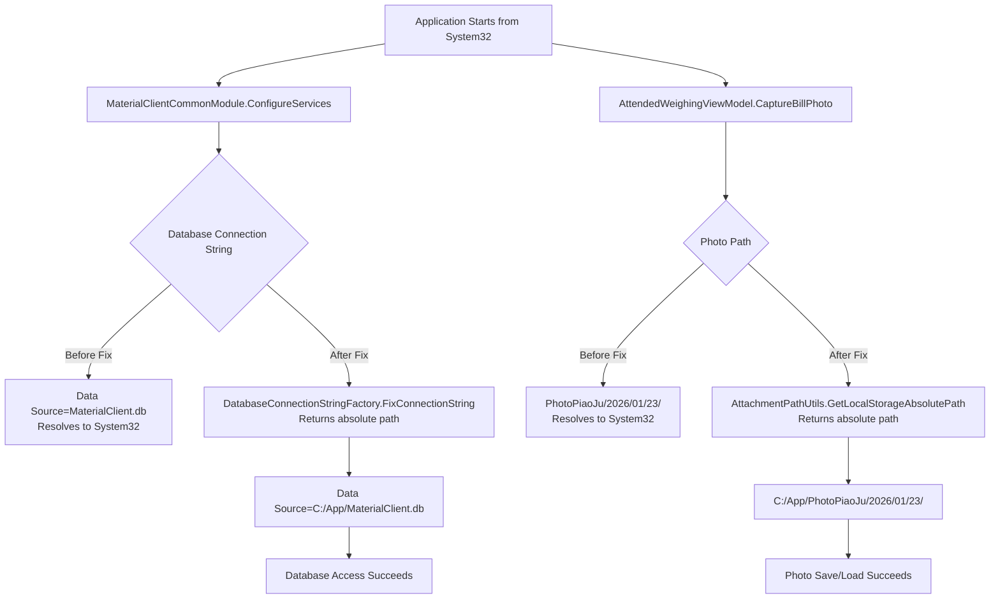
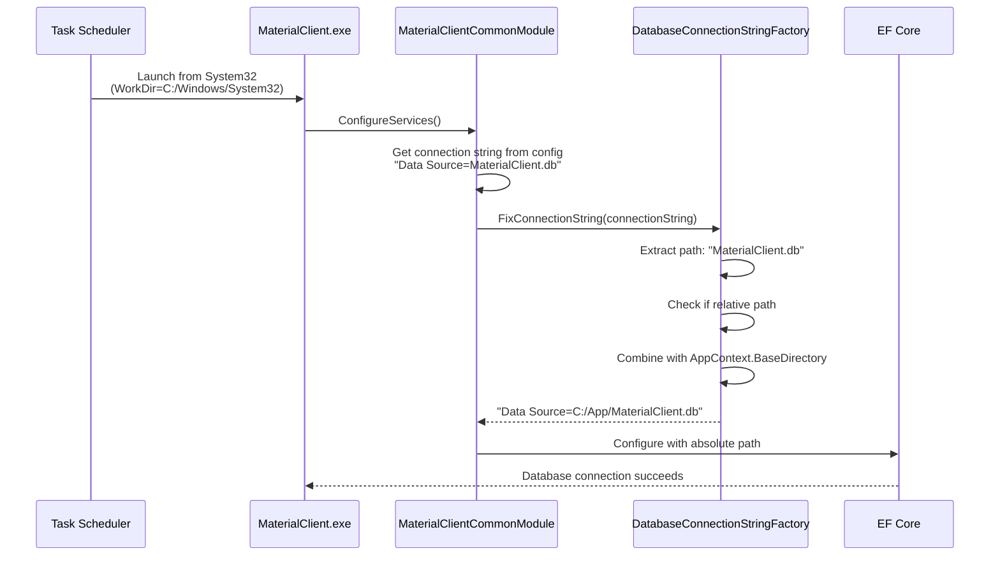
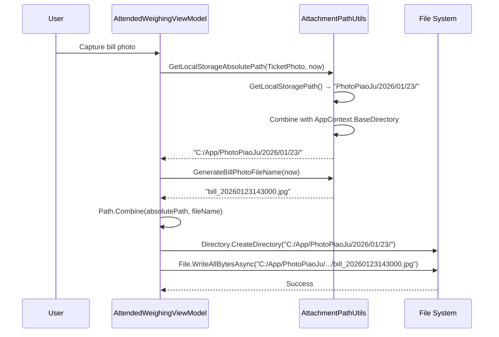

# 设计：修复从 System32 启动时的路径解析

## 背景

MaterialClient 对以下项使用相对路径：
1. SQLite 数据库：`"Data Source=MaterialClient.db"`
2. 附件存储：`"PhotoPiaoJu/{year}/{MM}/{dd}/"` 与 `"PhotoJianKong/{year}/{MM}/{dd}/"`

当 Windows 任务计划程序或注册表开机自启启动应用时，进程的工作目录为 `C:\Windows\System32`。这会导致相对路径解析错误：
- `MaterialClient.db` → `C:\Windows\System32\MaterialClient.db`
- `PhotoPiaoJu/...` → `C:\Windows\System32\PhotoPiaoJu/...`

**项目约定**：根据 `openspec/project.md`，与配置无关的逻辑（路径解析、资源创建）必须在 `MaterialClient.Common/Utils/`（静态）或 `MaterialClient.Common/Providers/`（DI）的工厂方法中实现，不得在业务代码或配置初始化代码中实现。

## 目标 / 非目标

**目标：**
- 在从任意工作目录启动时修复数据库与附件路径
- 基于应用程序可执行文件位置（`AppContext.BaseDirectory`）使用绝对路径
- 保持现有工厂方法模式（使用 `DatabaseConnectionStringFactory`，扩展 `AttachmentPathUtils`）
- 业务逻辑与 ViewModel 零代码改动

**非目标：**
- 修改全局工作目录（避免副作用）
- 修改附件存储结构或命名约定
- 修改数据库文件位置
- 支持自定义基目录（始终使用 `AppContext.BaseDirectory`）

## 决策

### 决策 1：沿用现有工厂方法模式

**选择**：数据库使用现有 `DatabaseConnectionStringFactory.FixConnectionString()`，附件扩展 `AttachmentPathUtils`。

**理由**：
- 符合既有项目约定（在 `Utils/` 中的静态工厂方法）
- `DatabaseConnectionStringFactory` 已实现所需模式
- 路径解析逻辑集中在工具类中
- 业务代码与 ViewModel 无需改动

**已考虑替代方案**：
1. ❌ 全局修改 `Environment.CurrentDirectory` → 对其他代码有副作用
2. ❌ 让所有调用方传入绝对路径 → 违反工厂方法模式
3. ❌ 在配置中存储路径 → 不适合与部署无关的路径解析

### 决策 2：附件路径解析策略

**选择**：新增 `GetLocalStorageAbsolutePath()` 方法，内部调用 `GetLocalStoragePath()` 并前置 `AppContext.BaseDirectory`。

**理由**：
- 对 `AttachmentPathUtils` 改动最小（仅新增一个方法）
- 保留现有相对路径方法供 OSS 使用
- 清晰区分：OSS 用相对路径，本地文件系统用绝对路径
- 与 `DatabaseConnectionStringFactory.FixConnectionString()` 模式一致

**实现**：
```csharp
public static string GetLocalStorageAbsolutePath(AttachType attachType, DateTime? date = null)
{
    var relativePath = GetLocalStoragePath(attachType, date);
    var appDirectory = AppContext.BaseDirectory;
    return Path.Combine(appDirectory, relativePath);
}
```

### 决策 3：数据库连接字符串修复位置

**选择**：在 `MaterialClientCommonModule.ConfigureServices()` 中、传入 EF Core 之前调用 `DatabaseConnectionStringFactory.FixConnectionString()`。

**理由**：
- 配置初始化的单一入口
- 在任何数据库访问之前执行
- 工厂方法已存在，但当前未在配置初始化中使用
- 代码改动最小（一行）

**实现**：
```csharp
// In MaterialClientCommonModule.ConfigureServices()
var connectionString = configuration.GetConnectionString("Default") 
                       ?? "Data Source=MaterialClient.db";
// FIX: Convert relative path to absolute path
connectionString = DatabaseConnectionStringFactory.FixConnectionString(connectionString);

services.Configure<AbpDbContextOptions>(options => { ... });
```

### 决策 4：票单打印服务路径解析

**选择**：在服务入口（`PrintToPdf`、`PrintImageToPdf`、`RenderTicketToImage`）进行路径解析，将相对路径转为绝对路径。

**理由**：
- 服务从调用方（ViewModel、其他服务）接收路径
- 无法控制调用方传入的是相对还是绝对路径
- 需防御性处理两种情况
- 在入口统一规范化路径（单一职责）

**实现**：
```csharp
// In TicketPrintingService.PrintToPdf()
public string PrintToPdf(WeighingTicketDto dto, string outputPdfPath)
{
    // FIX: Convert relative path to absolute path at entry point
    if (!Path.IsPathRooted(outputPdfPath))
    {
        outputPdfPath = Path.Combine(AppContext.BaseDirectory, outputPdfPath);
    }
    
    // Ensure output directory exists
    var outputDir = Path.GetDirectoryName(outputPdfPath);
    if (!string.IsNullOrEmpty(outputDir) && !Directory.Exists(outputDir))
    {
        Directory.CreateDirectory(outputDir);
    }
    // ... rest of implementation
}

// Same pattern for PrintImageToPdf() and RenderTicketToImage()
```

**为何在入口处理**：
1. 调用方无需修改（向后兼容）
2. 每个方法仅在一处做路径规范化
3. 服务保持防御式编程（同时接受相对与绝对路径）
4. 职责清晰（路径解析在服务内，不在调用方）

## 技术设计

### 代码流变更



### 时序图：启动时路径解析



### 时序图：拍照路径解析



## 风险 / 权衡

### 风险 1：已有使用绝对路径的数据库文件
**影响**：若用户曾在 `appsettings.json` 中手动配置绝对路径，`FixConnectionString()` 会保留原样（对绝对路径为无操作）。
**缓解**：工厂方法已正确处理该情况（检查 `Path.IsPathRooted()`）。

### 风险 2：已使用 AttachmentPathUtils 的代码
**影响**：现有代码调用 `GetLocalStoragePath()` 得到相对路径。
**缓解**：
- 保持 `GetLocalStoragePath()` 不变（用于 OSS 路径）
- 新代码对本地文件系统应使用 `GetLocalStorageAbsolutePath()`
- 在内部将 `GetBillPhotoFullPath()` 与 `GetMonitoringPhotoFullPath()` 改为使用绝对路径
- 这样所有现有调用方会自动获得正确路径

### 风险 3：测试环境差异
**影响**：测试可能在不同工作目录下运行。
**缓解**：基于 `AppContext.BaseDirectory` 的绝对路径在所有环境中行为一致。

## 迁移计划

### 部署步骤
1. 更新 `MaterialClientCommonModule.cs` 以修复数据库连接字符串
2. 更新 `AttachmentPathUtils.cs` 以返回绝对路径
3. 部署更新后的应用
4. 重启应用（下次启动时自动生效）

### 回滚
若出现问题：
1. 回退到前一版本
2. 从应用自身目录启动时应用仍可正常工作
3. 无需数据迁移（文件位置未变）

### 验证
- 检查日志中是否不再出现 `SQLite Error 14`
- 确认数据库迁移成功完成
- 确认拍照与加载正常
- 测试任务计划程序自启场景

## 间接受益的组件

以下组件将因路径解析修复而自动受益，无需改代码：

### 1. HikvisionService 摄像头拍照

**当前实现**（`MaterialClient.Common/Services/Hikvision/HikvisionService.cs:66-73`）：
```csharp
public bool CaptureJpeg(HikvisionDeviceConfig config, int channel, string saveFullPath, int quality = 90)
{
    // ...
    Directory.CreateDirectory(Path.GetDirectoryName(Path.GetFullPath(saveFullPath))!);
    // ...
}
```

**为何被修复**：
- `HikvisionService.CaptureJpeg()` 的 `saveFullPath` 由调用方传入
- 调用方使用 `AttachmentPathUtils.GetMonitoringPhotoFullPath()` 生成路径
- 修复后：`GetMonitoringPhotoFullPath()` 内部使用 `GetLocalStorageAbsolutePath()` → 返回绝对路径
- `Path.GetFullPath(absolutePath)` 为无操作（原样返回）
- 结果：照片保存到正确应用目录，而非 System32

**调用链**：
```
AttendedWeighingService
  → AttachmentPathUtils.GetMonitoringPhotoFullPath()
    → GetLocalStorageAbsolutePath() [NEW: returns absolute path]
  → HikvisionService.CaptureJpeg(absolutePath)
    → Path.GetFullPath(absolutePath) [no-op]
    → Directory.CreateDirectory(appDir/PhotoJianKong/...)
```

### 2. AttendedWeighingService 照片附件创建

**当前实现**（`MaterialClient.Common/Services/AttendedWeighingService.cs:1395`）：
```csharp
var attachmentFile = new AttachmentFile(fileName, photoPath, AttachType.UnmatchedEntryPhoto);
```

**为何被修复**：
- `photoPath` 来自摄像头服务，而摄像头服务使用 `AttachmentPathUtils`
- 修复后：所有路径为绝对路径
- 数据库存储绝对路径
- 从任意工作目录均可正确加载照片

### 3. AttendedWeighingViewModel 磅单拍照

**当前实现**（`MaterialClient/ViewModels/AttendedWeighingViewModel.cs:1668-1674`）：
```csharp
var photosDir = AttachmentPathUtils.GetLocalStoragePath(AttachType.TicketPhoto, now);
var fileName = AttachmentPathUtils.GenerateBillPhotoFileName(now);
if (!Directory.Exists(photosDir)) Directory.CreateDirectory(photosDir);
var filePath = Path.Combine(photosDir, fileName);
await File.WriteAllBytesAsync(filePath, frameData);
```

**为何被修复**：
- 实现中将 `GetLocalStoragePath()` 改为 `GetLocalStorageAbsolutePath()`
- 所有目录创建与文件写入将使用绝对路径
- 照片保存到应用目录，而非 System32

### 4. OssUploadService 文件上传

**当前实现**（`MaterialClient.Common/Services/OssUploadService.cs:56-60`）：
```csharp
if (!File.Exists(localPath))
{
    _logger?.LogWarning("本地文件不存在: {LocalPath}", localPath);
    return null;
}
```

**为何被修复**：
- `localPath` 来自数据库 `AttachmentFile.LocalPath`
- 修复后：数据库存的是绝对路径
- `File.Exists()` 将不受工作目录影响找到文件

### 5. ViewModel 中的照片展示

**涉及组件**：
- `AttendedWeighingViewModel`：展示车辆照与磅单照
- `ManualMatchEditWindowViewModel`：展示进出场照片
- `PhotoGridViewModel`：照片网格
- `ImageViewerViewModel`：全屏照片查看

**为何被修复**：
- 均从数据库读取 `AttachmentFile.LocalPath`
- 修复后：数据库存的是绝对路径
- 图片加载（Avalonia 的 `Bitmap.DecodeToWidth()`）使用绝对路径，不受工作目录影响

### 6. TicketPrintingService PDF/图片输出

**当前实现**（`MaterialClient.Common/Services/Hardware/TicketPrintingService.cs:142-149`）：
```csharp
public string PrintToPdf(WeighingTicketDto dto, string outputPdfPath)
{
    // Ensure output directory exists
    var outputDir = Path.GetDirectoryName(outputPdfPath);
    if (!string.IsNullOrEmpty(outputDir) && !Directory.Exists(outputDir))
    {
        Directory.CreateDirectory(outputDir);  // ⚠️ Relative paths create in System32
    }
    // ...
}
```

**为何需要修复**：
- 服务接受调用方传入的路径（可能为相对路径）
- 若调用方传入 `"Tickets/ticket_001.pdf"`，会在 System32 下创建
- 当前代码未做路径规范化

**修复方式**：
- 在方法入口做路径解析：若路径未根化则转为绝对路径
- 相对路径使用 `AppContext.BaseDirectory` 转换
- 适用于：`PrintToPdf()`、`PrintImageToPdf()`、`RenderTicketToImage()`

**实现**：
```csharp
public string PrintToPdf(WeighingTicketDto dto, string outputPdfPath)
{
    // NEW: Normalize path at entry point
    if (!Path.IsPathRooted(outputPdfPath))
    {
        outputPdfPath = Path.Combine(AppContext.BaseDirectory, outputPdfPath);
    }
    
    // Existing code continues with absolute path
    var outputDir = Path.GetDirectoryName(outputPdfPath);
    if (!string.IsNullOrEmpty(outputDir) && !Directory.Exists(outputDir))
    {
        Directory.CreateDirectory(outputDir);  // ✅ Creates in application directory
    }
    // ...
}
```

**所需代码改动**：✅ 直接修复（3 个方法，合计约 10 行）

## 修复影响汇总

| 组件 | 修复前问题 | 修复方式 | 所需代码改动 |
|-----------|------------------|----------------|----------------------|
| 数据库访问 | 相对路径 → System32 | `DatabaseConnectionStringFactory.FixConnectionString()` | 在 `MaterialClientCommonModule.cs` 中 1 行 |
| AttachmentPathUtils | 返回相对路径 | 新增 `GetLocalStorageAbsolutePath()` 并更新现有方法 | 新方法 + 更新现有方法 |
| **TicketPrintingService** | **接受相对路径** | **在入口规范化路径** | **✅ 3 个方法（约 10 行）** |
| HikvisionService | 接收相对路径 | 由调用方传入绝对路径 | ✅ 无（间接受益） |
| AttendedWeighingService | 存储相对路径 | 使用 `AttachmentPathUtils` 的绝对路径 | ✅ 无（间接受益） |
| ViewModel 拍照 | 创建相对路径 | 使用 `AttachmentPathUtils` 绝对路径 | ✅ 无（间接受益） |
| OssUploadService | File.Exists() 失败 | 从数据库读取绝对路径 | ✅ 无（间接受益） |
| 照片展示 ViewModel | 图片加载失败 | 从数据库读取绝对路径 | ✅ 无（间接受益） |

**直接代码改动合计**：修改 3 个文件，新增约 30 行  
**受益组件合计**：8+ 个（含间接受益）

## 范围外

以下组件存在类似路径问题，但**故意不**在本变更中修复：

### MaterialClientToolkit
**位置**：`MaterialClientToolkit/Program.cs`

**问题**：
```csharp
var configuration = new ConfigurationBuilder()
    .SetBasePath(Directory.GetCurrentDirectory())  // Uses working directory
    .AddJsonFile("appsettings.json", optional: true)
    .Build();
```

**排除原因**：
- MaterialClientToolkit 是用于数据迁移的独立命令行工具
- 通常由用户在其目录下手动运行，而非通过任务计划程序
- 用户会先进入工具目录再执行
- 优先级低：不涉及触发本问题的自启场景

**若将来需要**：可采用相同模式，使用 `AppContext.BaseDirectory`

## 待决问题

无——方案直接，且符合既有模式。
