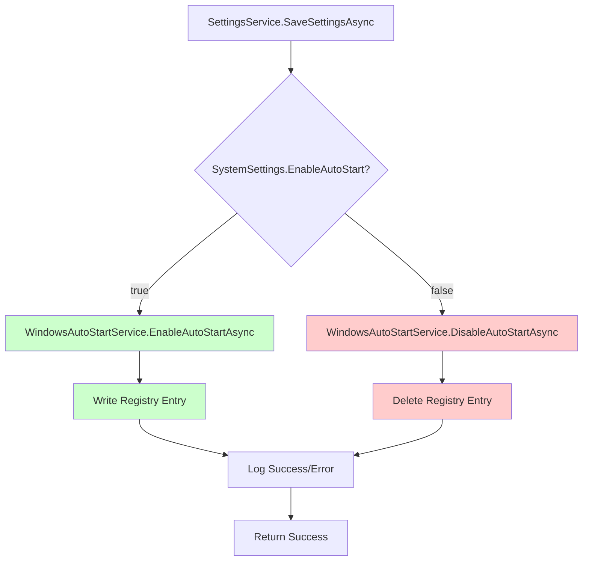
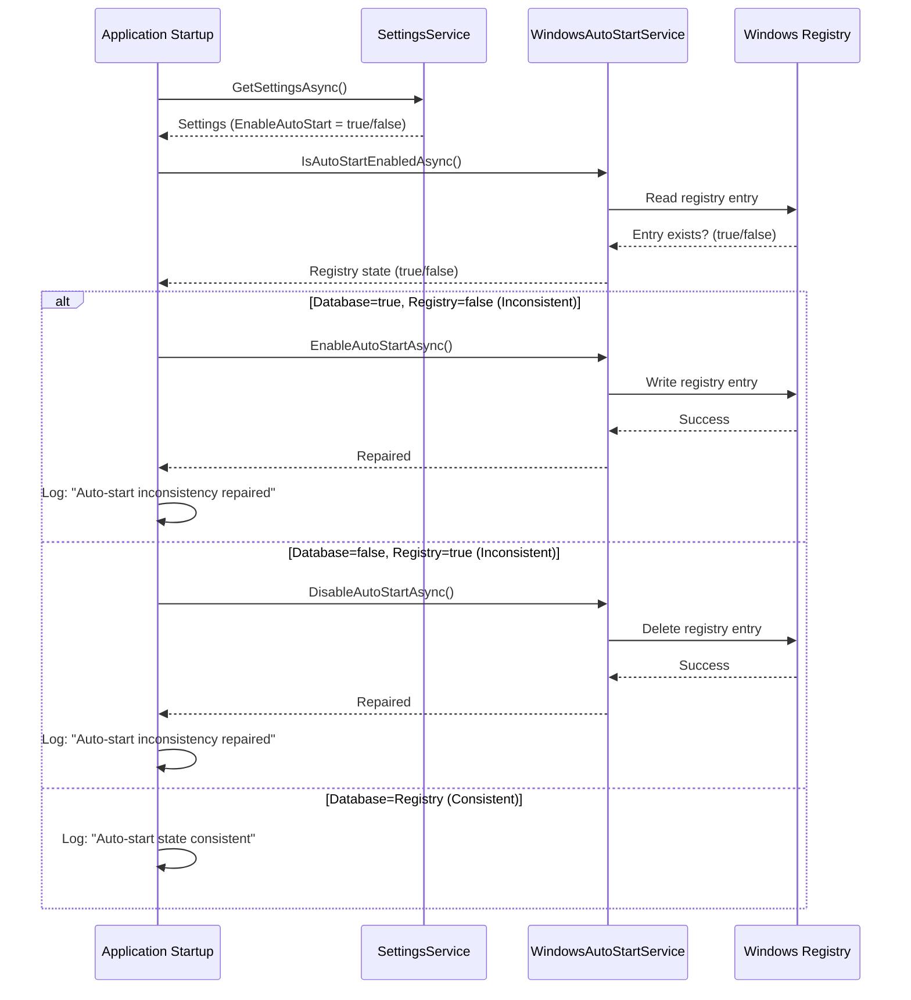
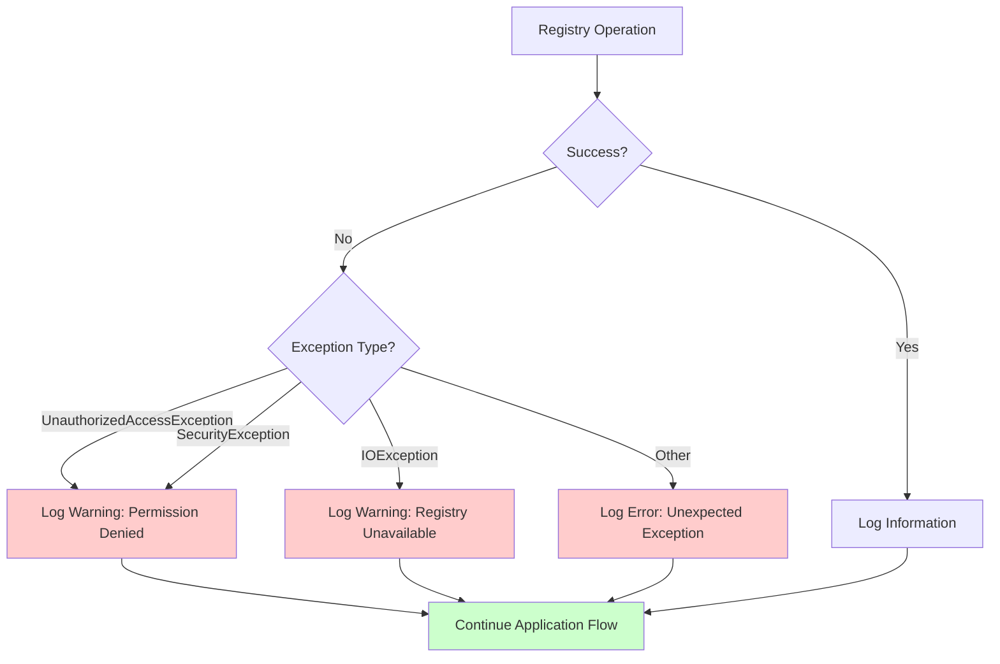

# 设计：Windows 开机自启实现

## 背景

应用界面上有开机自启的勾选项，且该设置会持久化到数据库，但实际用于启用/禁用自启的 Windows 注册表操作尚未实现，导致用户预期与实际行为不一致。

Windows 开机自启通常通过以下注册表项管理：
- `HKEY_CURRENT_USER\Software\Microsoft\Windows\CurrentVersion\Run`（用户级）
- 或 `HKEY_LOCAL_MACHINE\Software\Microsoft\Windows\CurrentVersion\Run`（系统级，需管理员权限）

因本桌面应用不一定始终以管理员运行，采用用户级注册表项。

## 目标 / 非目标

**目标：**
- 实现完整的开机自启功能，真正控制 Windows 行为
- 保证数据库设置与 Windows 注册表保持一致
- 在应用启动时自动修复不一致
- 妥善处理注册表权限错误
- 保持向后兼容（无破坏性变更）

**非目标：**
- 支持系统级自启（需管理员，且非必需）
- 支持以任务计划程序作为替代（注册表更简单且足够）
- 支持启动文件夹方式（注册表更可靠）
- 跨平台支持（按项目约束仅 Windows）
- 为其他用户配置自启（仅当前用户）

## 决策

### 决策 1：注册表位置

**决策**：使用 `HKEY_CURRENT_USER\Software\Microsoft\Windows\CurrentVersion\Run` 作为自启项。

**理由**：
- 无需管理员权限
- 按用户生效（每个用户控制自己的自启）
- Windows 用户级自启的标准位置
- 在各版本 Windows 上可靠

**已考虑替代**：
- `HKEY_LOCAL_MACHINE`：需管理员，影响所有用户
- 任务计划程序：更复杂，需 COM 互操作
- 启动文件夹：可靠性较差，可能被组策略禁用

### 决策 2：注册表值名称

**决策**：使用应用程序可执行文件名（如 "MaterialClient"）作为注册表值名。

**理由**：
- 简单且易识别
- 在注册表编辑器中容易辨认
- 每个应用唯一
- 符合常见 Windows 习惯

**已考虑替代**：
- GUID：过于晦涩，难以识别
- 完整路径：过长且不必要
- 自定义名称：不够标准

### 决策 3：注册表值数据

**决策**：存储可执行文件的完整路径（如 `C:\Program Files\MaterialClient\MaterialClient.exe`）。

**理由**：
- Windows 自启项要求完整路径
- 与当前工作目录无关即可运行
- 注册表自启的常见做法

**实现**：
```csharp
var executablePath = System.Reflection.Assembly.GetExecutingAssembly().Location;
// Or: Environment.ProcessPath (available in .NET 6+)
```

### 决策 4：双重同步机制

**决策**：在两个时点进行同步：
1. **主同步**：保存设置时（立即同步）
2. **兜底同步**：应用启动时（修复不一致）

**理由**：
- 主同步保证用户修改设置后立即一致
- 兜底同步修复可能发生的不一致（手动改注册表、迁移等）
- 提高对外部修改的抵抗力
- 对性能影响很小（启动时检查很快）

**已考虑替代**：
- 仅在保存时同步：注册表被手动修改后会长期不一致
- 仅在启动时同步：一致性滞后，用户看不到即时效果
- 两处都同步：兼顾一致性与开销

### 决策 5：错误处理策略

**决策**：捕获注册表异常、记录警告，但不阻断应用流程。

**理由**：
- 注册表可能因权限、损坏等失败
- 即使自启同步失败，应用仍应继续运行
- 日志便于排查
- 用户仍可正常使用应用

**实现**：
```csharp
try
{
    // Registry operation
}
catch (UnauthorizedAccessException ex)
{
    _logger.LogWarning(ex, "Registry permission denied for auto-start operation");
    // Continue without failing
}
catch (Exception ex)
{
    _logger.LogError(ex, "Unexpected error during auto-start operation");
    // Continue without failing
}
```

**已考虑替代**：
- 快速失败：影响过大，破坏用户体验
- 静默失败：不利于排查
- 重试机制：对这种少见失败过度设计

### 决策 6：服务接口设计

**决策**：定义 `IWindowsAutoStartService`，提供异步方法：
- `Task EnableAutoStartAsync()`
- `Task DisableAutoStartAsync()`
- `Task<bool> IsAutoStartEnabledAsync()`

**理由**：
- 异步风格与代码库其余部分一致
- 职责清晰
- 便于测试时 Mock
- 符合依赖注入用法

**已考虑替代**：
- 同步方法：与代码库风格不符
- 单方法加布尔参数：意图不够清晰
- 基于事件：对简单操作过于复杂

## 技术设计

### 服务实现

```csharp
public interface IWindowsAutoStartService
{
    Task EnableAutoStartAsync();
    Task DisableAutoStartAsync();
    Task<bool> IsAutoStartEnabledAsync();
}

public class WindowsAutoStartService : IWindowsAutoStartService
{
    private const string RegistryKeyPath = @"Software\Microsoft\Windows\CurrentVersion\Run";
    private readonly string _registryValueName;
    private readonly string _executablePath;
    private readonly ILogger<WindowsAutoStartService> _logger;

    public WindowsAutoStartService(ILogger<WindowsAutoStartService> logger)
    {
        _logger = logger;
        _registryValueName = "MaterialClient"; // Or from configuration
        _executablePath = Environment.ProcessPath ?? 
            System.Reflection.Assembly.GetExecutingAssembly().Location;
    }

    public async Task EnableAutoStartAsync()
    {
        await Task.Run(() =>
        {
            try
            {
                using var key = Registry.CurrentUser.OpenSubKey(RegistryKeyPath, true);
                key?.SetValue(_registryValueName, _executablePath);
                _logger.LogInformation("Auto-start enabled in registry");
            }
            catch (Exception ex)
            {
                _logger.LogWarning(ex, "Failed to enable auto-start in registry");
                // Don't throw - allow application to continue
            }
        });
    }

    public async Task DisableAutoStartAsync()
    {
        await Task.Run(() =>
        {
            try
            {
                using var key = Registry.CurrentUser.OpenSubKey(RegistryKeyPath, true);
                key?.DeleteValue(_registryValueName, throwOnMissingValue: false);
                _logger.LogInformation("Auto-start disabled in registry");
            }
            catch (Exception ex)
            {
                _logger.LogWarning(ex, "Failed to disable auto-start in registry");
                // Don't throw - allow application to continue
            }
        });
    }

    public async Task<bool> IsAutoStartEnabledAsync()
    {
        return await Task.Run(() =>
        {
            try
            {
                using var key = Registry.CurrentUser.OpenSubKey(RegistryKeyPath, false);
                var value = key?.GetValue(_registryValueName);
                return value != null && value.ToString() == _executablePath;
            }
            catch (Exception ex)
            {
                _logger.LogWarning(ex, "Failed to check auto-start status in registry");
                return false; // Conservative default
            }
        });
    }
}
```

### 与 SettingsService 的集成



### 启动时同步流程



### 错误处理流程



## 风险 / 权衡

### 风险：注册表权限错误

**风险**：用户可能对注册表无写权限（少见但可能）。

**缓解**：
- 使用 `HKEY_CURRENT_USER`（用户级，通常有写权限）
- 捕获 `UnauthorizedAccessException` 并记录警告
- 不阻断应用启动或设置保存
- 在文档中说明排查步骤

**接受**：概率低，可接受优雅降级。

### 风险：注册表损坏

**风险**：Windows 注册表可能损坏或不可用。

**缓解**：
- 捕获注册表相关所有异常
- 记录错误便于排查
- 应用继续正常运行
- 用户可自行修复注册表

**接受**：极少见，当前处理足够。

### 权衡：性能与一致性

**权衡**：启动时同步带来很小延迟（<10ms），但保证一致性。

**接受**：性能影响可忽略，一致性收益明显。

### 权衡：复杂度与健壮性

**权衡**：双重同步增加少量代码复杂度，但提高健壮性。

**接受**：复杂度有限，健壮性有价值。

## 迁移计划

**无需迁移**——此为新增功能，不改变现有行为。

**部署**：
1. 部署包含新 `WindowsAutoStartService` 的代码
2. 在 DI 容器中注册服务
3. 首次启动时沿用已有数据库设置
4. 根据数据库状态创建或删除注册表项

**回滚**：
- 回退代码变更
- 无需清理数据（注册表项可保留，不会造成问题）
- 数据库设置保持不变

## 待决问题

无——需求来自用户与代码库分析，已明确。
