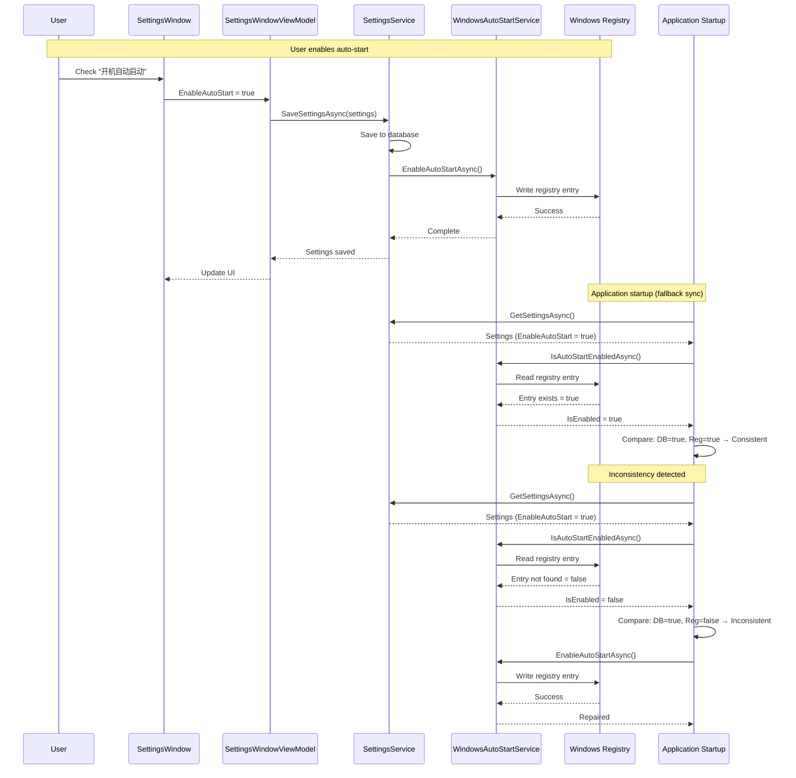

# 变更：实现 Windows 开机自启功能

**变更 ID**：`implement-windows-auto-start`
**状态**：草稿
**创建日期**：2026-01-23
**类型**：功能

---

## 原因

### 背景

当前应用在设置窗口中有“开机自动启动”勾选项，且 `EnableAutoStart` 设置会持久化到数据库，但实际的 Windows 开机自启并未实现。用户勾选该设置后，系统层面没有任何变化——应用不会被加入 Windows 启动注册表项。

### 问题

1. **功能不完整**：界面与数据模型已有，核心逻辑缺失。用户可切换设置，但对系统行为无影响。

2. **数据不一致风险**：若数据库里为“启用”而 Windows 注册表无对应项（或反之），应用状态会不一致。可能出现在：
   - 用户手动删除注册表项
   - 从其他机器迁移设置
   - 注册表权限导致无法写入
   - 卸载/重装应用

3. **与用户预期不符**：用户认为勾选即会控制开机自启，目前只是保存了一个从未被应用的偏好。

---

## 变更内容

### 概述

实现完整的 Windows 开机自启，并采用双重同步机制：
1. **主同步**：保存设置时写入/删除注册表
2. **兜底同步**：应用启动时检查并修复不一致

### 具体变更

1. **新增 `WindowsAutoStartService`**：
   - 负责管理开机自启相关的 Windows 注册表项
   - 方法：`EnableAutoStartAsync()`、`DisableAutoStartAsync()`、`IsAutoStartEnabledAsync()`
   - 注册表位置：`HKEY_CURRENT_USER\Software\Microsoft\Windows\CurrentVersion\Run`
   - 注册表值名称：应用名称（如 "MaterialClient"）

2. **与 `SettingsService` 集成**：
   - 保存设置后调用 `WindowsAutoStartService` 同步注册表
   - 保证数据库设置与 Windows 注册表始终一致

3. **增加启动时同步**：
   - 应用启动时比较数据库设置与注册表状态
   - 若不一致，按数据库设置修正注册表
   - 记录不一致日志便于排查

4. **错误处理**：
   - 妥善处理注册表权限错误
   - 注册表操作失败时记录警告
   - 注册表同步失败不阻止应用启动

---

## 代码流变更

---

## 影响

### 预期收益

- **功能完整**：开机自启按用户预期工作
- **数据一致**：数据库与 Windows 注册表保持同步
- **健壮性**：启动时自动修复不一致
- **用户信任**：设置真实控制系统行为

### 风险与缓解

| 风险 | 影响 | 缓解 |
|------|--------|------------|
| 注册表权限错误 | 高 | 捕获异常、记录警告、不阻断启动 |
| 注册表损坏 | 中 | 校验注册表操作并妥善处理 |
| 启动时状态不一致 | 中 | 启动时自动修复机制 |
| 性能影响 | 低 | 注册表操作很快（<10ms） |
| 跨平台兼容 | 不适用 | 按项目约束仅 Windows |

### 涉及规格

- **新能力**：`system-configuration` —— 系统配置管理（含开机自启）

### 涉及代码

- **新服务**：`MaterialClient.Common/Services/WindowsAutoStartService.cs`
- **修改**：`MaterialClient.Common/Services/SettingsService.cs`（保存后增加注册表同步）
- **修改**：`MaterialClient/App.axaml.cs` 或 `MaterialClient/Services/StartupService.cs`（增加启动时同步检查）
- **依赖**：`Microsoft.Win32.Registry`（.NET 内置库）

### 破坏性变更

无——此为新增功能。

---

## 成功标准

- [ ] `WindowsAutoStartService` 能在 Windows 注册表中启用/禁用开机自启
- [ ] 保存设置时同步注册表状态
- [ ] 应用启动时能检测并修复不一致
- [ ] 注册表权限错误被妥善处理
- [ ] 单元测试覆盖注册表操作（使用 Mock）
- [ ] 集成测试验证端到端流程
- [ ] 界面勾选正确反映实际系统状态

---

## 后续步骤

1. 评审并批准本提案
2. 实现 `WindowsAutoStartService`
3. 与 `SettingsService` 集成
4. 增加启动时同步
5. 编写测试
6. 在 Windows 上验证

---

## 参考

- `MaterialClient/Views/SettingsWindow.axaml`（第 397–398 行）—— 界面勾选
- `MaterialClient.Common/Configuration/SystemSettings.cs` —— EnableAutoStart 属性
- `MaterialClient.Common/Services/SettingsService.cs` —— 设置持久化
- `MaterialClient/App.axaml.cs` —— 应用启动流程
