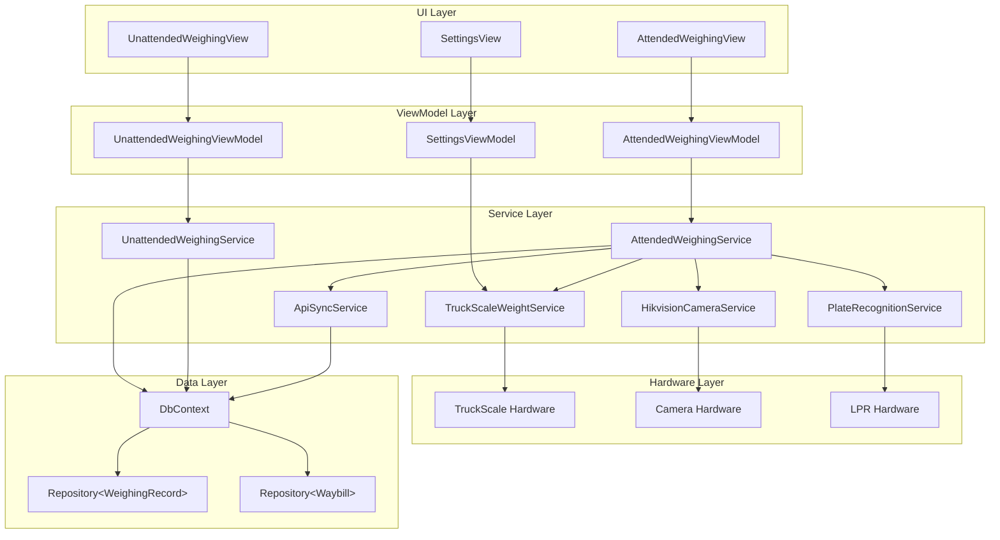
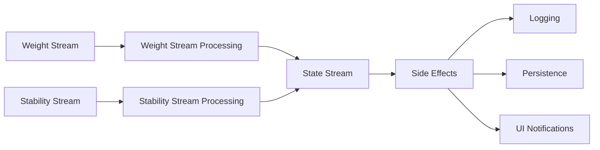
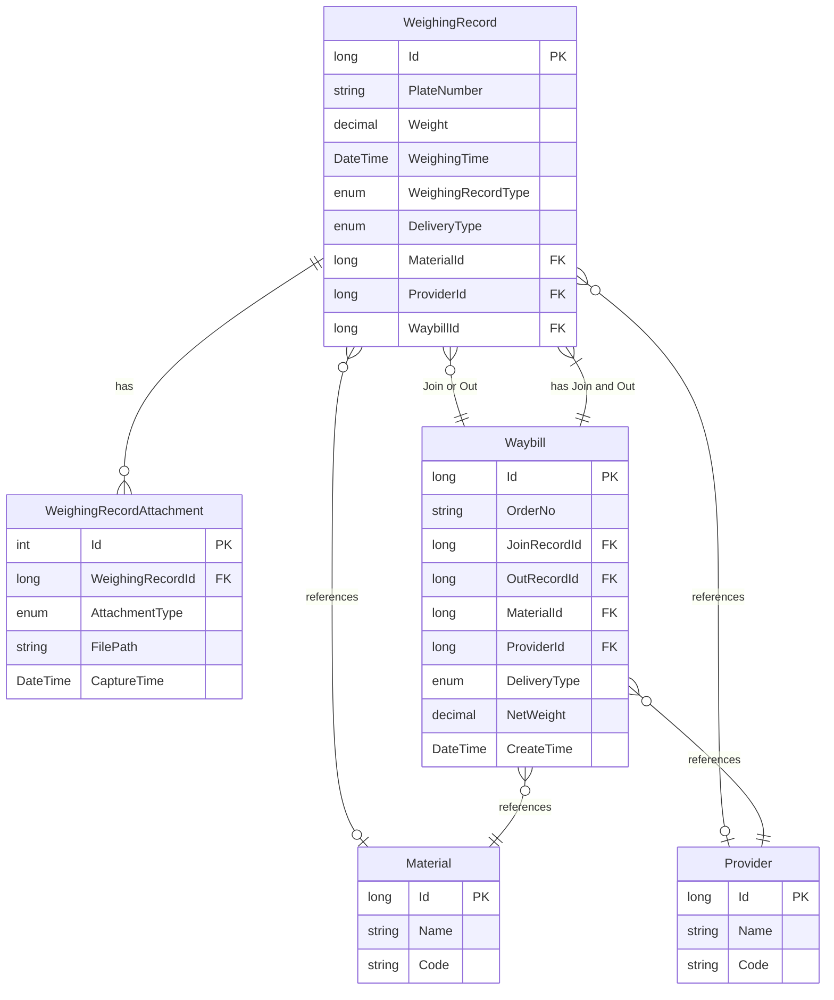
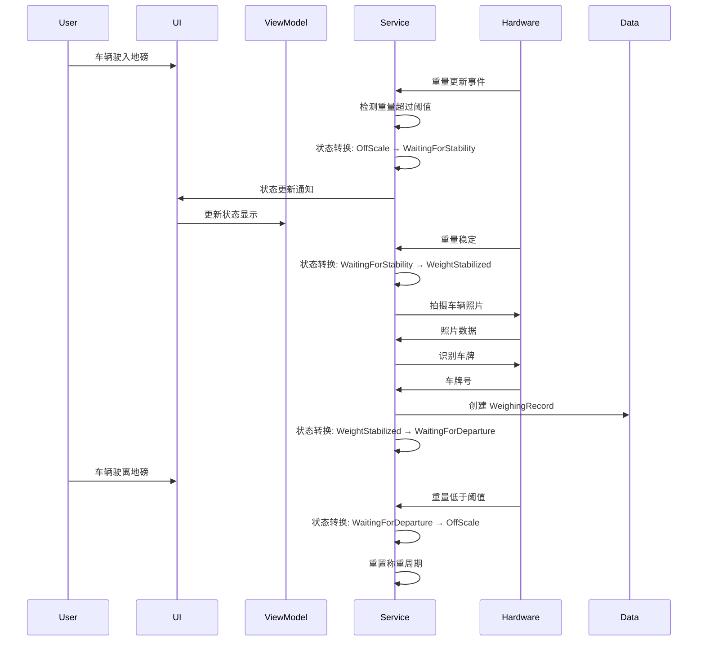
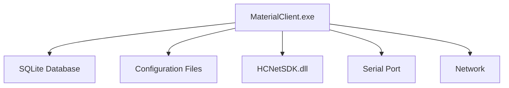
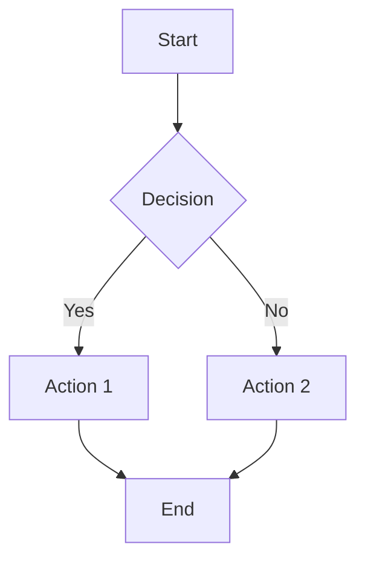

# Design Documentation: 更新软件设计文档 (SDD)

**Change ID**: `update-software-design-document`
**Created**: 2026-01-15
**Status**: Draft

---

## Overview

本文档详细说明如何为 MaterialClient 项目创建和更新软件设计文档(SDD)。SDD 的目标是提供一份全面、准确、易维护的系统架构和设计文档,支持新开发者理解系统、辅助 AI 开发、降低知识流失风险。

---

## 文档结构

### 主文档：`docs/SDD.md`

主要的 SDD 文档，包含所有核心章节，是系统架构和设计的概览性文档。

**结构**：
```markdown
# Software Design Document: MaterialClient

## 1. Introduction
- 1.1 System Overview
- 1.2 Technology Stack
- 1.3 Architecture Patterns
- 1.4 System Boundaries

## 2. Architecture
- 2.1 Component Diagram
- 2.2 Module Design
- 2.3 State Management Architecture
- 2.4 Data Flow Diagram

## 3. Data Model
- 3.1 Core Entities
- 3.2 Entity Relationships
- 3.3 Database Schema

## 4. Key Business Flows
- 4.1 Attended Weighing Flow
- 4.2 Automatic Matching Flow
- 4.3 Remote Sync Flow

## 5. Technical Decisions
- 5.1 Rx.NET Adoption
- 5.2 Hardware Abstraction Strategy
- 5.3 Memory Leak Prevention
- 5.4 Database Selection

## 6. Constraints and Risks
- 6.1 Platform Constraints
- 6.2 Hardware Constraints
- 6.3 Performance Constraints
- 6.4 Known Technical Debt

## 7. Development Guidelines
- 7.1 Coding Standards
- 7.2 Hardware Integration Best Practices
- 7.3 Rx Programming Guidelines
- 7.4 Testing Strategy

## 8. Deployment
- 8.1 Deployment Diagram
- 8.2 Installation Guide
- 8.3 Configuration Guide

## Appendix
- A. Glossary
- B. References
- C. Change History
```

### 支撑文档：`docs/sdd/`

可选的专题文档，用于深入探讨特定主题。

**建议的专题文档**：
- `docs/sdd/rxstate-pattern.md` - RxState 模式深入分析
- `docs/sdd/hardware-integration.md` - 硬件集成详细指南
- `docs/sdd/performance-optimization.md` - 性能优化指南
- `docs/sdd/error-handling.md` - 错误处理策略

### 分析文档：`docs/`

现有的分析和报告文档，作为 SDD 的参考和补充。

**现有文档**：
- `AttendedWeighingService-RxState-Optimization-Report.md`
- `AttendedWeighingService-Rx-Evaluation-Report.md`
- `Complete-Crash-Fix-Summary.md`
- `HikvisionOpenStream-Crash-Analysis-Report.md`
- `ReaderWriterLockSlim-Performance-Evaluation.md`

---

## SDD 内容规范

### 第 1 章：引言

#### 1.1 系统概述

**内容要点**:
- 系统定位: Windows 桌面应用程序,用于称重管理和数据同步
- 核心功能: 有人值守称重、无人值守称重、车牌识别、摄像头拍照、磅单自动匹配、远程平台同步
- 目标用户: 物料管理操作员
- 运行环境: Windows x64, 单用户桌面应用

#### 1.2 技术栈

**内容要点**:
- **编程语言**: C# 13
- **运行时**: .NET 10.0
- **UI 框架**: Avalonia UI 11.3.9
- **状态管理**: ReactiveUI (MVVM)
- **ORM**: Entity Framework Core 10.0.1
- **数据库**: SQLite
- **响应式编程**: System.Reactive (Rx.NET)
- **依赖注入**: Volo.Abp
- **硬件 SDK**: HCNetSDK (海康摄像头)

#### 1.3 架构模式

**内容要点**:
- **MVVM (Model-View-ViewModel)**: UI 层架构模式
- **RxState (State, Reducer, Action, Side-effect)**: 响应式状态管理
- **Repository**: 数据访问层抽象
- **Dependency Injection**: 依赖注入和控制反转

#### 1.4 系统边界

**内容要点**:
- 单用户应用,不支持多用户并发
- 本地数据存储,可选远程平台同步
- 硬件集成: 地磅、摄像头、车牌识别
- 网络依赖: 车牌识别 API、远程平台 API

---

### 第 2 章：架构

#### 2.1 组件图

**使用 Mermaid 绘制组件图**：



#### 2.2 模块设计

**核心服务模块**：

| 模块 | 职责 | 主要接口 | 依赖 |
|------|------|---------|------|
| `AttendedWeighingService` | 有人值守称重流程管理 | `IAttendedWeighingService` | `ITruckScaleWeightService`, `ICameraService`, `IPlateRecognitionService`, `IRepository<WeighingRecord>` |
| `UnattendedWeighingService` | 无人值守称重流程管理 | `IUnattendedWeighingService` | `ITruckScaleWeightService`, `ICameraService`, `IPlateRecognitionService`, `IRepository<WeighingRecord>` |
| `TruckScaleWeightService` | 地磅重量数据采集 | `ITruckScaleWeightService` | 串口通信组件 |
| `HikvisionCameraService` | 海康摄像头控制 | `ICameraService` | HCNetSDK |
| `PlateRecognitionService` | 车牌识别 | `IPlateRecognitionService` | LPR API |
| `ApiSyncService` | 远程平台同步 | `IApiSyncService` | HttpClient |

**状态管理**：
- 使用 RxState 模式管理服务状态
- 统一状态对象 (如 `WeighingServiceState`)
- 纯函数式状态转换 (Reducer)
- 副作用分离 (Side-effect)

#### 2.3 状态管理架构

**RxState 模式组件**：

1. **State (状态)**: 不可变的状态对象
   ```csharp
   public record WeighingServiceState
   {
       public AttendedWeighingStatus Status { get; init; }
       public decimal Weight { get; init; }
       public WeightStabilityInfo Stability { get; init; }
       public DeliveryType DeliveryType { get; init; }
       public long? LastCreatedWeighingRecordId { get; init; }
   }
   ```

2. **Action (动作)**: 状态转换的触发器
   ```csharp
   public abstract record StateAction;
   public record WeightUpdatedAction(decimal Weight) : StateAction;
   public record StabilityUpdatedAction(WeightStabilityInfo Stability) : StateAction;
   ```

3. **Reducer (状态转换器)**: 纯函数,根据当前状态和动作计算新状态
   ```csharp
   private static WeighingServiceState ReduceState(
       WeighingServiceState currentState,
       StateAction action)
   {
       return action switch
       {
           WeightUpdatedAction w => ReduceWeightUpdate(currentState, w),
           StabilityUpdatedAction s => ReduceStabilityUpdate(currentState, s),
           _ => currentState
       };
   }
   ```

4. **Side-effect（副作用）**：状态变化触发的操作
   - 日志记录
   - 数据持久化
   - UI 通知
   - 硬件控制

**数据流**：
```
Event Streams (Weight, Stability, Plate, ...)
    ↓
Actions (WeightUpdated, StabilityUpdated, ...)
    ↓
Reducer (State Transition)
    ↓
New State (WeighingServiceState)
    ↓
Side-effects (Logging, Persistence, Notifications)
```

#### 2.4 数据流图

**有人值守称重流程的 Rx 数据流**：



---

### 第 3 章：数据模型

#### 3.1 核心实体

**主要实体**：

1. **WeighingRecord (称重记录)**
   - `Id` (long): 主键
   - `PlateNumber` (string): 车牌号
   - `Weight` (decimal): 重量(吨)
   - `WeighingTime` (DateTime): 称重时间
   - `WeighingRecordType` (enum): 称重记录类型 (Join, Out, Unmatch)
   - `DeliveryType` (enum): 收发料类型 (Receiving, Shipping)
   - `MaterialId` (long?): 物料 ID (外键)
   - `ProviderId` (long?): 供应商 ID (外键)
   - `WaybillId` (long?): 运单 ID (外键)

2. **Waybill (运单)**
   - `Id` (long): 主键
   - `OrderNo` (string): 订单号 (Guid)
   - `JoinRecordId` (long): 进场记录 ID (外键)
   - `OutRecordId` (long): 出场记录 ID (外键)
   - `MaterialId` (long): 物料 ID (外键)
   - `ProviderId` (long): 供应商 ID (外键)
   - `DeliveryType` (enum): 收发料类型
   - `NetWeight` (decimal): 净重
   - `CreateTime` (DateTime): 创建时间

3. **Material (物料)**
   - `Id` (long): 主键
   - `Name` (string): 物料名称
   - `Code` (string): 物料编码

4. **Provider (供应商)**
   - `Id` (long): 主键
   - `Name` (string): 供应商名称
   - `Code` (string): 供应商编码

5. **WeighingRecordAttachment (称重记录附件)**
   - `Id` (int): 主键
   - `WeighingRecordId` (long): 称重记录 ID (外键)
   - `AttachmentType` (enum): 附件类型 (VehiclePhoto, TicketPhoto)
   - `FilePath` (string): 文件路径
   - `CaptureTime` (DateTime): 拍摄时间

#### 3.2 实体关系

**实体关系图**：



---

### 第 4 章：关键业务流程

#### 4.1 有人值守称重流程

**时序图**：



#### 4.2 自动匹配流程

**流程说明**：
1. 系统定时扫描未匹配的称重记录 (`WeighingRecordType == Unmatch`)
2. 根据匹配规则查找配对记录:
   - 规则 1: 车牌号相同,时间间隔在匹配时间窗口内
   - 规则 2: 收料类型时进场重量 > 出场重量,发料类型时进场重量 < 出场重量
3. 选择时间间隔最短的一对记录
4. 创建 `Waybill`,关联两个 `WeighingRecord`
5. 更新 `WeighingRecordType` 为 `Join` 和 `Out`

#### 4.3 远程同步流程

**流程说明**：
1. 系统定时扫描未同步的 `Waybill`
2. 调用远程平台 API,上传运单数据
3. 处理 API 响应,更新同步状态
4. 记录同步日志

---

### 第 5 章：技术决策

#### 5.1 采用 Rx.NET

**决策记录**：

| 方面 | 说明 |
|--------|-------------|
| **Context** | 需要管理复杂的异步状态和事件流 |
| **Options** | A: 传统事件驱动, B: Rx.NET, C: async/await + Task |
| **Decision** | 选择 Rx.NET |
| **Rationale** | - 统一的异步事件处理模型<br>- 强大的操作符<br>- 声明式编程风格<br>- 内置的线程调度和错误处理<br>- 与 ReactiveUI 的良好集成 |
| **Trade-offs** | - 学习曲线较陡<br>- 调试相对困难<br>- 内存泄漏风险 |
| **Mitigation** | - 制定 Rx 编程规范<br>- 强制 Subscription disposal 规范<br>- 提供单元测试和集成测试 |

#### 5.2 硬件抽象策略

**决策记录**：

| 方面 | 说明 |
|--------|-------------|
| **Context** | 需要集成多种硬件设备,需要统一的抽象接口 |
| **Options** | A: 直接调用硬件 SDK, B: 抽象接口 + Mock 实现, C: 插件化架构 |
| **Decision** | 选择 抽象接口 + Mock 实现 |
| **Rationale** | - 接口隔离,易于测试<br>- Mock 实现用于开发和测试<br>- 易于替换硬件实现<br>- 符合依赖倒置原则 |
| **Implementation** | - 定义硬件服务接口<br>- 提供真实实现 (基于硬件 SDK)<br>- 提供 Mock 实现 (用于测试)<br>- 使用依赖注入注册服务 |

#### 5.3 内存泄漏防护

**策略**：

| 策略 | 说明 |
|----------|-------------|
| **Subscription Disposal** | - 使用 `IDisposable` 管理订阅<br>- 在 `Dispose` 方法中释放所有订阅<br>- 使用 `CompositeDisposable` 管理多个订阅 |
| **RefCount** | - 使用 `Publish().RefCount()` 共享流<br>- 避免多次订阅导致多次执行 |
| **Buffer Limit** | - 使用 `Buffer(time, count)` 限制缓冲区大小<br>- 避免内存无限增长 |

#### 5.4 数据库选型

**决策记录**：

| 方面 | 说明 |
|--------|-------------|
| **Context** | 单用户桌面应用,需要本地数据存储 |
| **Options** | A: SQLite, B: SQL Server Express, C: 文件存储 (JSON/XML) |
| **Decision** | 选择 SQLite |
| **Rationale** | - 零配置,无需安装数据库服务器<br>- 单文件存储,易于备份和迁移<br>- 支持 SQL 和 ORM (EF Core)<br>- 性能良好,满足单用户需求<br>- 跨平台支持 |
| **Trade-offs** | - 并发写入性能有限<br>- 不支持多用户同时写入 |
| **Mitigation** | - 单用户应用,并发写入需求低<br>- 使用事务保证数据一致性 |

---

### 第 6 章：约束与风险

#### 6.1 平台约束

| 约束 | 说明 |
|------------|-------------|
| **Operating System** | Windows x64 only |
| **Runtime** | .NET 10.0 runtime |
| **Third-party Dependencies** | HCNetSDK (海康摄像头 SDK) |
| **Deployment** | 单机部署,无需服务器 |

#### 6.2 硬件约束

| 约束 | 说明 |
|------------|-------------|
| **Serial Port Exclusivity** | 串口设备只能被一个进程独占使用 |
| **Camera Bandwidth** | 同时支持的视频流数量有限 |
| **Network Dependency** | 车牌识别和远程同步需要网络连接 |
| **Scale Precision** | 重量测量精度受设备限制 |

#### 6.3 性能约束

| 约束 | 说明 |
|------------|-------------|
| **24/7 Operation** | 系统需要长时间稳定运行 |
| **High-frequency Stream** | 地磅重量更新频率高(每秒多次) |
| **Memory Usage** | 需要控制内存使用,避免泄漏 |
| **Response Time** | UI 响应时间 < 100ms |

#### 6.4 已知技术债务

| 项 | 优先级 | 说明 |
|------|----------|-------------|
| 内存泄漏风险 | High | 部分 Rx 订阅可能未正确释放 |
| 错误处理不完整 | Medium | 部分异步操作缺少错误处理 |
| 测试覆盖率低 | Medium | 缺少单元测试和集成测试 |
| 代码重复 | Low | 部分逻辑在多处重复 |
| 性能优化空间 | Low | 部分操作可以优化性能 |

---

### 第 7 章：开发指南

#### 7.1 编码规范

- 遵循 C# 编码规范
- 使用有意义的命名
- 保持方法简短 (< 50 行)
- 使用注释解释复杂逻辑
- 使用 XML 注释记录公共 API

#### 7.2 Hardware Integration Best Practices

- 使用抽象接口,不直接依赖硬件 SDK
- 提供 Mock 实现用于测试
- 处理硬件故障和异常
- 正确释放硬件资源
- 使用日志记录硬件操作

#### 7.3 Rx Programming Guidelines

**订阅生命周期管理**:
```csharp
private readonly CompositeDisposable _disposables = new();

_stream
    .Subscribe()
    .DisposeWith(_disposables);

public void Dispose()
{
    _disposables.Dispose();
}
```

**操作符使用规范**:
- 使用 `Publish().RefCount()` 共享流
- 使用 `Buffer(time, count)` 限制缓冲区大小
- 使用 `DistinctUntilChanged()` 去重

**线程调度**:
- 使用 `ObserveOn` 切换线程
- UI 更新使用 `RxApp.MainThreadScheduler`

**错误处理**:
- 使用 `Catch` 处理错误
- 使用 `Retry` 重试失败的操作

#### 7.4 测试策略

| 测试类型 | 目标 | 覆盖率 |
|-----------|--------|----------|
| **Unit Tests** | 纯函数 (Reducer) | 100% |
| **Integration Tests** | 服务交互, Rx 管道 | > 80% |
| **Memory Leak Tests** | 订阅释放 | 100% |
| **UI Tests** | ViewModels | > 60% |

---

### 第 8 章：部署

#### 8.1 部署图



#### 8.2 Installation Guide

1. 安装 .NET 10.0 runtime
2. 解压 MaterialClient.zip 到目标目录
3. 配置 `appsettings.json`
4. 运行 MaterialClient.exe

#### 8.3 Configuration Guide

**关键配置项**:
- 数据库连接字符串
- 硬件设备配置 (串口、摄像头)
- API 端点配置
- 日志级别

---

## 图表规范

### Mermaid 图表

所有架构图使用 Mermaid 格式，便于版本控制和协作编辑。

**支持的图表类型**：
- `graph` / `flowchart` — 流程图
- `sequenceDiagram` — 时序图
- `classDiagram` — 类图
- `erDiagram` — 实体关系图
- `stateDiagram-v2` — 状态图

**示例**：


---

## 维护策略

### 文档维护

| 活动 | 频率 | 触发条件 |
|----------|-----------|---------|
| **Regular Review** | Quarterly | 定期审查 |
| **Major Update** | As needed | 重大架构变更 |
| **Minor Update** | As needed | OpenSpec 提案触发 |
| **Version Control** | Continuous | 与代码库同步 |

### 变更管理

1. **文档变更流程**：
   - 识别需要更新的章节
   - 修订文档内容
   - 提交 Pull Request
   - 代码审查
   - 合并变更

2. **OpenSpec 集成**:
   - 在 OpenSpec workflow 中增加 SDD 更新检查项
   - 重大架构变更的提案应包含 SDD 更新任务

3. **维护责任**：
- 技术负责人负责 SDD 的整体维护
   - 模块负责人负责相关章节的更新
   - 所有开发者有责任报告文档过时问题

---

## 质量保证

### 评审检查清单

- [ ] 技术栈版本准确
- [ ] 模块职责与实际实现一致
- [ ] 架构图清晰准确
- [ ] 技术决策记录完整
- [ ] 约束和风险已识别
- [ ] 开发指南实用可行
- [ ] 示例代码正确
- [ ] 团队评审通过

### 验证标准

| 标准 | 如何验证 |
|-----------|-----------------|
| **Completeness** | 所有核心章节已完成 |
| **Accuracy** | 技术栈版本、模块职责与实际实现一致 |
| **Clarity** | 文档表述清晰,易于理解 |
| **Maintainability** | 使用 Mermaid 绘制图表,便于版本控制 |
| **Team Approval** | 团队评审通过 |

---

## 工具与资源

### 文档工具

- **Markdown**：文档格式
- **Mermaid**：图表绘制
- **Git**：版本控制
- **VS Code**：编辑器

### 参考

- [Reactive Extensions (Rx) 官方文档](https://github.com/dotnet/reactive)
- [Avalonia UI 文档](https://docs.avaloniaui.net/)
- [Entity Framework Core 文档](https://docs.microsoft.com/ef/core/)
- [Mermaid 文档](https://mermaid.js.org/)

---

## 后续步骤

1. **评审设计文档**：与团队评审本文档，确认 SDD 结构和内容
2. **开始实施**：按照 `tasks.md` 开始实施 SDD 更新
3. **定期审查**：定期审查 SDD，保持文档准确性和时效性

---

**文档版本**：1.0
**最后更新**：2026-01-15
**作者**：OpenSpec Workflow
