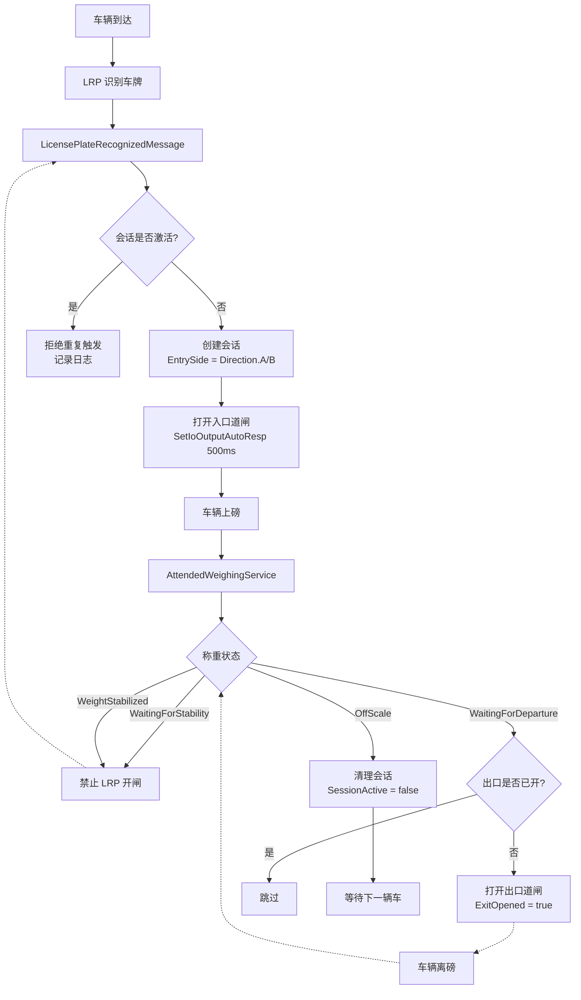
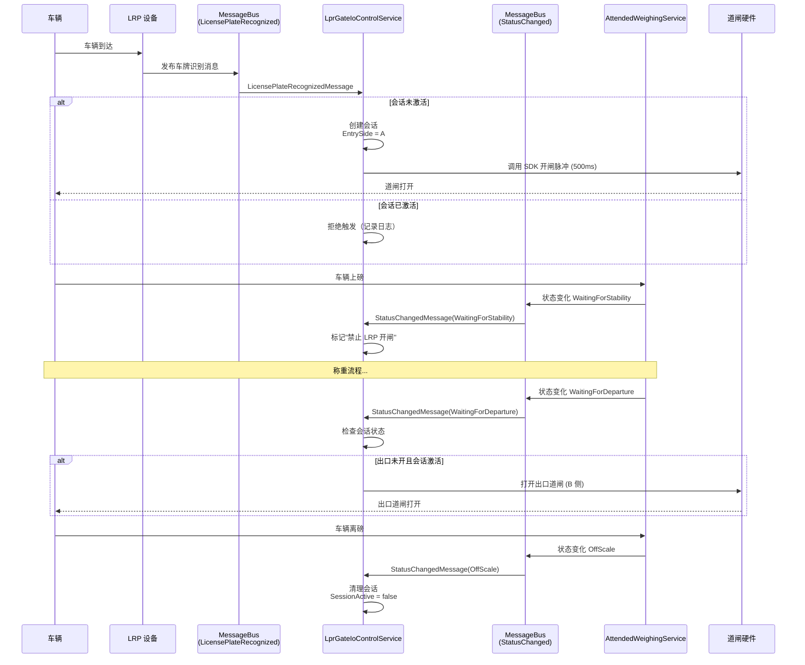

## Context

### 当前状态

**道闸 I/O 控制现状**（`LprGateIoControlService`，将重命名为 `GateIoControlService`）：
- 服务命名有歧义：`LprGateIoControlService` 暗示仅支持 LRP SDK 控制，但未来需要支持多种控制方式
- 仅订阅 `LicensePlateRecognizedMessage`，不感知称重状态
- 逻辑：识别到车牌 → 直接调用 `SetIoOutputAutoRespAsync(500ms)` → 开闸脉冲
- 无会话状态管理，无入口/出口区分
- 依赖 `LicensePlateDirection.In/Out` 枚举表示设备侧别
- 仅支持通过 Vzvision LRP SDK 控制道闸（单一控制方式）

**称重状态机现状**（`AttendedWeighingService`）：
- 四状态流转：`OffScale → WaitingForStability → WeightStabilized → WaitingForDeparture → OffScale`
- 通过 `MessageBus` 广播 `StatusChangedMessage`
- 状态转换由重量/稳定性驱动

**评估文档要求**（`docs/evaluation-vzvision-lpr-gate-io-function-assessment-2026-03-25.md`）：
- 采用方案 B：不改 `AttendedWeighingStatus`，在 `GateIoControlService` 内实现会话机制
- 道闸侧别统一为 `A/B`，Entry/Exit 为运行时会话角色
- 稳定/稳重阶段禁开闸，等待下磅阶段开出口闸
- 启动时校验 A/B 配置成对性
- **设计约束**（§12.2、§12.3）：道闸与 LPR 解耦，支持两种控制方式
  - 方式 1（当前实现）：经 LRP SDK 控制道闸
  - 方式 2（预留）：直接控制道闸 I/O（保留接口/设计，当前实现返回"不支持"）

### 约束条件

- **兼容性约束**：无道闸模式（`EnableGateIo = false`）必须继续工作
- **降级原则**：道闸失效不得阻断称重主流程（评估文档 §12.5）
- **可靠性约束**：允许人工遥控器干预，软件状态可与硬件不一致
- **配置迁移**：现有 `In/Out` 配置需迁移为 `A/B`

## Goals / Non-Goals

**Goals:**
1. 服务重命名：`LprGateIoControlService` → `GateIoControlService`，消除命名歧义
2. 实现道闸会话状态管理，支持入口侧锁定和出口开闸
3. 同步称重状态变化，确保 `OffScale` 时自动清理会话
4. 基于称重状态实现道闸开关门控逻辑
5. 统一道闸侧别枚举为 `A/B`，支持双向通行
6. 启动时校验 A/B 配置有效性，防止误动作
7. 设计双控制模式架构：支持 LRP SDK 和 COM 直接控制两种方式

**Non-Goals:**
1. 不扩展 `AttendedWeighingStatus` 枚举（评估文档方案 A 为可选增强）
2. 不实现 COM 直接控制道闸 I/O 的完整功能（仅预留接口设计，实现抛出"不支持"异常）
3. 不实现会话超时机制（评估文档 §9 为开放性问题，暂不纳入）
4. 不修改 UI 配置界面（由独立变更处理）

## Decisions

### 决策 1：服务重命名

**选择**：将 `LprGateIoControlService` 重命名为 `GateIoControlService`，同时更新接口 `ILprGateIoControlService` → `IGateIoControlService`。

```csharp
// 新接口和类名
public interface IGateIoControlService
{
    Task StartAsync();
    Task StopAsync();
}

public sealed class GateIoControlService : IGateIoControlService, ISingletonDependency
{
    // 实现...
}
```

**理由**：
- 消除命名歧义：`LprGateIoControlService` 暗示仅支持 LRP SDK 控制，但服务需要支持多种控制方式
- 与评估文档 §12.2 的"道闸与 LRP 解耦"设计约束一致
- 通用命名便于未来扩展（COM 控制、其他 SDK 控制）

**迁移影响**：
- 更新 `MaterialClientCommonModule.cs` 中的依赖注入注册
- 更新所有引用该服务的地方（如 `DeviceManagerService`）

### 决策 2：会话状态数据结构

**选择**：在 `GateIoControlService` 内部使用私有类 `GateIoSession` 管理会话状态。

```csharp
private sealed class GateIoSession
{
    public bool SessionActive { get; set; }
    public LicensePlateDirection EntrySide { get; set; }  // A 或 B
    public bool ExitOpened { get; set; }
    public DateTime SessionStartedAt { get; set; }
}
```

**理由**：
- 状态封装在服务内部，避免暴露给外部
- 简单字段类型，无序列化需求（运行时仅存在内存）
- 包含时间戳便于日志审计和故障排查

**替代方案**：使用独立的 `IGateIoSessionManager` 服务
- **不采用原因**：过度设计，当前仅单个服务使用此状态

### 决策 3：枚举迁移策略（`In/Out` → `A/B`）

**选择**：直接修改 `LicensePlateDirection` 枚举值，通过配置默认值处理迁移。

```csharp
// LicensePlateDirection.cs
public enum LicensePlateDirection
{
    /// <summary>
    /// 入口侧（物理侧别 A）
    /// </summary>
    [Description("入口")]
    A = 0,  // 原 In 改为 A

    /// <summary>
    /// 出口侧（物理侧别 B）
    /// </summary>
    [Description("出口")]
    B = 1   // 原 Out 改为 B
}
```

**理由**：
- 语义对齐：`A/B` 明确表示物理侧别，与 Entry/Exit（会话角色）区分
- 整数值兼容（`0` → `A`, `1` → `B`），现有配置序列化值无需修改
- 单一枚举简化配置 UI（避免双轨并行）
- **中文描述说明**：
  - `A` 枚举的中文描述为"入口"（物理位置）
  - `B` 枚举的中文描述为"出口"（物理位置）
  - 注意：这里的"入口/出口"指物理侧别位置，与会话运行时角色（Entry/Exit）区分

**迁移处理**：
- 反序列化时：`0` 默认为 `A`（入口），`1` 默认为 `B`（出口）
- 用户首次升级后，配置界面显示 A/B 选项，中文显示为"入口"/"出口"
- UI 层可使用 `Description` 特性获取中文描述用于显示

**替代方案**：新增 `GateSide` 枚举与 `LicensePlateDirection` 并行
- **不采用原因**：增加配置复杂度，UI 需同时展示两套枚举

### 决策 4：状态订阅与响应机制

**选择**：`GateIoControlService` 订阅 `StatusChangedMessage`，在 `OnStatusChanged()` 中实现状态转换逻辑。

```csharp
// StartAsync() 中添加
_statusSubscription = MessageBus.Current
    .Listen<StatusChangedMessage>()
    .Subscribe(msg => OnStatusChanged(msg.Status));
```

**状态转换逻辑**：
| `AttendedWeighingStatus` | 道闸行为 |
|-------------------------|---------|
| `OffScale` | 清理会话：`SessionActive = false`, `EntrySide = null`, `ExitOpened = false` |
| `WaitingForStability` | 禁止任何 LRP 触发开闸（`HandlePlateRecognizedAsync` 直接返回） |
| `WeightStabilized` | 禁止任何 LRP 触发开闸 |
| `WaitingForDeparture` | 若 `SessionActive && !ExitOpened`，打开出口道闸（另一侧）一次 |

**理由**：
- 复用现有 `MessageBus` 基础设施，无需新增事件类型
- 状态逻辑集中在一处，易于测试和维护
- 符合评估文档 §5 的会话语义

### 决策 5：配置校验时机

```csharp
public async Task StartAsync()
{
    await RefreshRuntimeConfigAsync();

    var validationResult = ValidateGateConfiguration();
    if (!validationResult.IsValid)
    {
        _logger?.LogWarning("道闸配置校验失败: {Reason}, 道闸功能将进入降级模式",
            validationResult.Reason);
        _gateIoEnabled = false;  // 禁用道闸功能
        // 继续启动，不抛异常
    }

    // ... 订阅 MessageBus
}
```

**校验规则**（评估文档 §12.4）：
- 从 `LicensePlateRecognitionConfigs` 中筛选 `EnableGateIo == true` 的配置
- 必须恰好有一对 `A/B`（`Direction.A` 和 `Direction.B` 各出现一次）
- 失败场景：零对、多对、不成对

**理由**：
- 启动时校验可尽早发现配置错误，防止运行时误动作
- 降级模式保证称重主流程不受影响（评估文档 §12.5）
- 用户可通过日志快速定位问题

**替代方案**：在 `SettingsSavedMessage` 时校验
- **不采用原因**：保存配置时校验会阻断用户操作，体验较差

### 决策 6：入口/出口侧计算

**选择**：基于首次触发 LRP 的 `Direction` 锁定入口侧，出口侧为另一侧（`A ↔ B`）。

```csharp
// HandlePlateRecognizedAsync() 中
if (_gateIoSession.SessionActive)
    return;  // 会话期间拒绝新的入口触发

// 会话未激活，创建新会话
_gateIoSession.SessionActive = true;
_gateIoSession.EntrySide = config.Direction;  // A 或 B
_gateIoSession.SessionStartedAt = DateTime.UtcNow;

// 打开入口道闸
await _vzvisionLprService.SetIoOutputAutoRespAsync(config, ioChannel, 500);
```

**理由**：
- 不依赖额外配置，动态适应车辆行驶方向
- 简单可靠：`exitSide = entrySide == A ? B : A`
- 符合评估文档 §7、§12.1 的语义（Entry/Exit 为运行时角色）

### 决策 7：双控制模式架构

**选择**：设计支持两种道闸 I/O 控制方式的接口，当前仅实现方式 1（LRP SDK 控制），方式 2（COM 直接控制）预留接口并抛出"不支持"异常。

```csharp
// 控制方式枚举
public enum GateIoControlMode
{
    LrpSdk = 1,      // 通过 LRP SDK 控制（当前实现，默认）
    DirectCom = 2    // 直接通过 COM 控制（预留，暂不支持）
}

// 控制接口设计
private async Task OpenGateAsync(LicensePlateRecognitionConfig config, uint ioChannel)
{
    switch (config.GateIoControlMode)
    {
        case GateIoControlMode.LrpSdk:
            await OpenGateViaLrpSdkAsync(config, ioChannel);
            break;
        case GateIoControlMode.DirectCom:
            await OpenGateViaComAsync(config, ioChannel);
            break;
        default:
            throw new NotSupportedException($"不支持的道闸控制方式: {config.GateIoControlMode}");
    }
}

private async Task OpenGateViaLrpSdkAsync(LicensePlateRecognitionConfig config, uint ioChannel)
{
    // 现有实现：通过 Vzvision LPR SDK 控制
    if (config.LprDeviceType != LprDeviceType.Vzvision)
    {
        _logger?.LogInformation("当前设备类型暂未支持道闸 I/O 功能: DeviceType={DeviceType}",
            config.LprDeviceType);
        return;
    }
    await _vzvisionLprService.SetIoOutputAutoRespAsync(config, ioChannel, 500);
}

private async Task OpenGateViaComAsync(LicensePlateRecognitionConfig config, uint ioChannel)
{
    // 预留接口：直接通过 COM 控制道闸
    // 当前实现：抛出"不支持"异常
    throw new NotSupportedException("直接通过 COM 控制道闸 I/O 功能暂不支持，请使用 LRP SDK 控制方式");
}
```

**理由**：
- 符合评估文档 §12.2、§12.3 的"道闸与 LRP 解耦"设计约束
- 预留 COM 控制接口，为未来扩展（如非 LRP 设备直接控制道闸）提供设计基础
- 当前系统默认使用 LRP SDK 控制方式，不影响现有功能
- 通过异常明确告知用户 COM 控制方式暂不支持

**配置层面**：
- 当前版本所有配置默认使用 `GateIoControlMode.LrpSdk`
- 未来版本可在 `LicensePlateRecognitionConfig` 中添加 `GateIoControlMode` 字段供用户选择

### 决策 8：错误处理与降级

**选择**：道闸控制失败仅记录日志，不抛异常或重试。

```csharp
try
{
    await _vzvisionLprService.SetIoOutputAutoRespAsync(config, ioChannel, 500);
}
catch (Exception ex)
{
    _logger?.LogError(ex, "道闸 I/O 控制失败: Device={Device}, IoChannel={IoChannel}",
        config.Name, config.IoChannel);
    // 不抛异常，不影响主流程
}
```

**降级场景**：
1. SDK 调用失败（网络异常、设备离线）
2. 配置校验失败（A/B 不成对）
3. `IoChannel` 解析失败

**理由**：
- 符合评估文档 §12.5 的降级原则
- 道闸作为"外围联动能力"，失效不应阻断核心业务
- 允许人工通过遥控器干预（日志记录即可）

## Risks / Trade-offs

### 风险 1：会话状态与实际硬件不一致

**场景**：用户通过遥控器手动开关道闸，导致软件推断的会话状态与硬件实际状态不一致。

**缓解措施**：
- 接受此不一致性（评估文档 §12.5 明确允许）
- 通过日志记录所有状态转换和道闸操作，便于故障排查
- UI 可显示"会话状态"供运维人员参考

**权衡**：保持软件状态简单 vs 追求硬件状态精确同步
- **选择**：接受不一致，优先保证称重主流程稳定

### 风险 2：枚举迁移导致配置兼容性问题

**场景**：用户升级后现有 `In/Out` 配置无法正确反序列化为 `A/B`。

**缓解措施**：
- 整数值兼容（`0` → `A`, `1` → `B`），JSON 序列化值无需修改
- 添加单元测试验证配置序列化/反序列化
- 升级说明中提示用户检查道闸配置

**权衡**：直接修改枚举 vs 双轨并行
- **选择**：直接修改，简化长期维护

### 风险 3：状态订阅延迟导致会话清理不及时

**场景**：`StatusChangedMessage` 发送与 `GateIoControlService` 接收之间存在延迟，导致会话清理滞后。

**缓解措施**：
- `MessageBus` 为内存总线，延迟通常可忽略（微秒级）
- 添加日志记录状态转换时间戳，便于排查问题
- 后续可考虑添加"超时清理机制"（评估文档 §9 为开放问题）

**权衡**：依赖 MessageBus 时序 vs 引入主动超时机制
- **选择**：先依赖 MessageBus，观察运行效果后再决定是否添加超时

### 风险 4：A/B 配置不成对导致道闸功能完全失效

**场景**：用户只配置了 A 侧（`Direction.A, EnableGateIo=true`），B 侧未启用，导致校验失败后道闸功能降级。

**缓解措施**：
- 校验失败时记录明确警告日志，说明期望"恰好一对 A/B"及当前配置问题
- UI 配置界面可添加"道闸配置向导"，引导用户成对配置
- 文档中强调 A/B 成对配置要求

**权衡**：严格校验 vs 容错处理（如单侧配置也支持）
- **选择**：严格校验，防止配置错误导致道闸误动作（评估文档 §12.4）

## 组件架构

```
组件层次结构
├── AttendedWeighingService (称重状态机)
│   └── MessageBus → StatusChangedMessage (状态变化广播)
│
├── GateIoControlService (道闸 I/O 控制服务，原 LprGateIoControlService)
│   ├── MessageBus 订阅
│   │   ├── LicensePlateRecognizedMessage (LPR 识别事件)
│   │   └── StatusChangedMessage (称重状态变化)
│   ├── GateIoSession (会话状态管理)
│   │   ├── SessionActive (会话激活标志)
│   │   ├── EntrySide (入口侧 A/B)
│   │   ├── ExitOpened (出口已开闸标志)
│   │   └── SessionStartedAt (会话开始时间)
│   ├── 配置校验器 (ValidateGateConfiguration)
│   └── 双控制模式接口
│       ├── OpenGateViaLrpSdk() - LRP SDK 控制（当前实现）
│       └── OpenGateViaCom() - COM 直接控制（预留，抛出异常）
│
└── LicensePlateRecognitionConfig (配置实体)
    ├── Direction: A/B (物理侧别)
    ├── EnableGateIo: bool (是否启用道闸)
    ├── IoChannel: string (I/O 通道号)
    └── GateIoControlMode: LrpSdk/DirectCom (控制方式，未来扩展)
```

## 数据流



## API 调用时序图



## 详细代码变更清单

| 文件路径 | 变更类型 | 变更说明 | 影响模块 |
|---------|---------|---------|---------|
| `MaterialClient.Common\Entities\Enums\LicensePlateDirection.cs` | MODIFIED | 枚举值从 `In/Out` 改为 `A/B` | 配置序列化、UI |
| `MaterialClient.Common\Entities\Enums\GateIoControlMode.cs` | ADDED | 新增枚举：`LrpSdk=1, DirectCom=2` | 控制方式 |
| `MaterialClient.Common\Services\GateIoControlService.cs` | RENAMED | 从 `LprGateIoControlService.cs` 重命名 | 服务主文件 |
| `MaterialClient.Common\Services\IGateIoControlService.cs` | RENAMED | 从 `ILprGateIoControlService.cs` 重命名 | 接口 |
| `MaterialClient.Common\Services\GateIoControlService.cs` | MODIFIED | 新增 `GateIoSession` 会话状态类 | 道闸控制 |
| `MaterialClient.Common\Services\GateIoControlService.cs` | MODIFIED | 新增 `_statusSubscription` 订阅 `StatusChangedMessage` | 状态同步 |
| `MaterialClient.Common\Services\GateIoControlService.cs` | MODIFIED | 新增 `OnStatusChanged()` 方法实现状态转换逻辑 | 状态门控 |
| `MaterialClient.Common\Services\GateIoControlService.cs` | MODIFIED | 修改 `HandlePlateRecognizedAsync()` 添加会话检查和入口侧锁定 | 会话管理 |
| `MaterialClient.Common\Services\GateIoControlService.cs` | MODIFIED | 新增 `ValidateGateConfiguration()` 方法实现 A/B 成对校验 | 配置校验 |
| `MaterialClient.Common\Services\GateIoControlService.cs` | MODIFIED | 新增 `ClearSession()` 方法清理会话状态 | 会话清理 |
| `MaterialClient.Common\Services\GateIoControlService.cs` | MODIFIED | 新增 `OpenGateAsync()` 统一控制接口 | 双控制模式 |
| `MaterialClient.Common\Services\GateIoControlService.cs` | MODIFIED | 新增 `OpenGateViaLrpSdk()` LRP SDK 控制方法 | 方式 1 |
| `MaterialClient.Common\Services\GateIoControlService.cs` | MODIFIED | 新增 `OpenGateViaCom()` COM 控制方法（预留，抛出异常） | 方式 2 |
| `MaterialClient.Common\Services\GateIoControlService.cs` | MODIFIED | 修改 `StartAsync()` 调用配置校验 | 启动流程 |
| `MaterialClient.Common\Services\GateIoControlService.cs` | MODIFIED | 修改 `StopAsync()` 释放 `_statusSubscription` | 资源清理 |
| `MaterialClient.Common\MaterialClientCommonModule.cs` | MODIFIED | 更新依赖注入注册：`ILprGateIoControlService` → `IGateIoControlService` | DI 容器 |
| `MaterialClient.Common\Services\DeviceManagerService.cs` | MODIFIED | 更新服务引用：`LprGateIoControlService` → `GateIoControlService` | 服务调用 |
| `MaterialClient\ViewModels\AddLprDialogViewModel.cs` | MODIFIED | UI 配置界面 Direction 选项从 In/Out 改为 A/B | 用户界面 |
| `MaterialClient\ViewModels\SettingsWindowViewModel.cs` | MODIFIED | 设置界面 Direction 选项从 In/Out 改为 A/B | 用户界面 |
