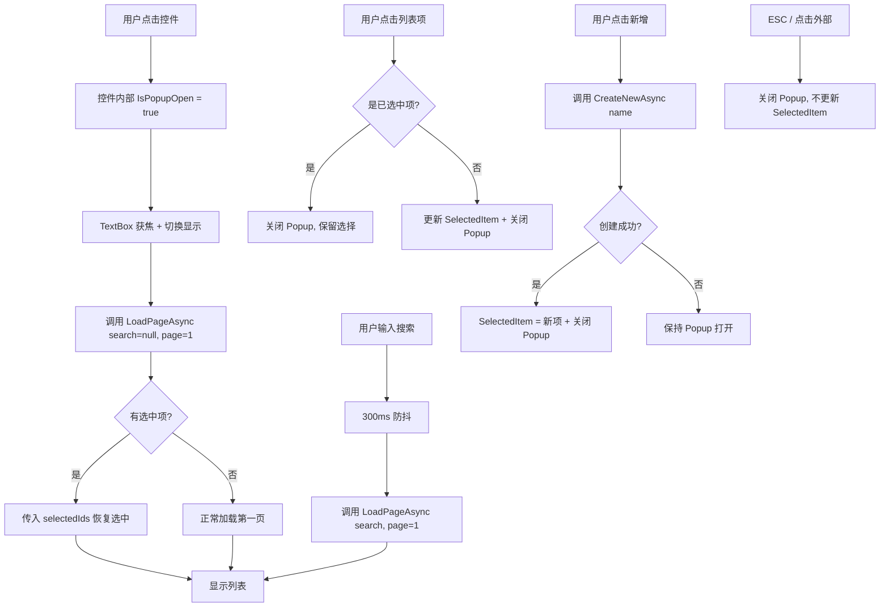

## Context

当前选择器由三部分拼装：`SearchableSelectionBox`（触发器，切换 TextBlock/TextBox）、独立的 `<Popup>` 声明（由父视图维护 IsOpen）、`GenericSelectionPopup`（弹窗内容，含 DataGrid + 分页）。父 ViewModel 需要为每个选择器维护 6 个额外属性（PopupViewModel + IsOpen），并通过复杂的 WhenAnyValue 组合订阅来同步状态。

已知交互缺陷：
1. SelectedItem 双重触发（打开时手动设一次 + RefreshAsync/SetItemsAsync 再设一次）导致弹窗"一闪就关"
2. 再次点击已选中项无法关闭弹窗（DataGrid SelectionChanged 不触发）
3. ClientSide/ServerSide 双模式增加了不必要的分支逻辑

现有设计文档 `docs/design-creatable-pageable-searchable-selection.md` 已提出 TemplatedControl 方案，但 TemplatedControl 在 Avalonia 中调试困难，且本项目团队更熟悉 UserControl 模式。

## Goals / Non-Goals

**Goals:**
- 将选择器从"三件套拼装"简化为"单个 UserControl"，内嵌 Popup
- 统一 SelectionItem DTO，移除泛型 GenericSelectionItem<T>
- 移除 ClientSide/ServerSide 双模式，统一为 LoadPageAsync 委托
- 修复已知的交互缺陷（双重触发、同项无法关闭）
- 父 ViewModel 使用量从 6 个属性 + 复杂订阅降低到 1 个 SelectedItem 绑定 + 2 个委托

**Non-Goals:**
- 不使用 TemplatedControl（调试复杂度高，团队不熟悉）
- 不修改后端 Services 层
- 不考虑向后兼容（直接替换）
- 不添加键盘导航（上下箭头选择等），保持与现有行为一致
- 不支持多选，仅保持单选

## Decisions

### Decision 1: UserControl 而非 TemplatedControl

**选择**: 使用 UserControl（含内嵌 Popup）而非 TemplatedControl

**理由**:
- TemplatedControl 需要在 generic.axaml 中定义模板，调试和修改 UI 需要理解模板绑定机制
- 本项目团队所有现有控件都是 UserControl 模式
- UserControl 可以在 AXAML 中直接看到 UI 结构，维护更直观
- 通过 StyledProperty 暴露外部接口，与 TemplatedControl 的使用方式一致

**替代方案**: TemplatedControl — 封装更彻底但调试成本高

### Decision 2: SelectionItem DTO + 静态工厂方法

**选择**: 定义 `SelectionItem`（`int Id`, `string Name`），通过静态工厂方法 `FromProvider`、`FromMaterial`、`FromStreet` 创建

**理由**:
- 统一类型消除了 GenericSelectionItem<T> 的泛型复杂性
- 控件只需绑定 `SelectionItem?`，无需关心底层实体类型
- 静态工厂方法比扩展方法更显式，且不需要修改实体类

**镇街特殊处理**: 镇街是 string 类型，没有 int Id。使用 `FromStreet(string name)` 创建，内部用 `name.GetStableHashCode()` 生成确定性 int Id（非 GetHashCode，确保跨进程稳定）

```csharp
public sealed class SelectionItem : IEquatable<SelectionItem>
{
    public int Id { get; }
    public string Name { get; }

    public static SelectionItem FromProvider(ProviderDto p) => new(p.Id, p.ProviderName);
    public static SelectionItem FromMaterial(Material m) => new(m.Id, m.Name ?? string.Empty);
    public static SelectionItem FromStreet(string name) => new(name.GetStableHashCode(), name);

    // Equality by Id only
}
```

### Decision 3: 统一分页接口，移除双模式

**选择**: 只提供 `LoadPageAsync` 委托，由调用方决定数据来源

**理由**:
- 镇街数据虽然来自内存配置，但可以通过委托包装为同样的分页接口
- 控件内部不再关心数据是客户端还是服务端，只调用委托
- 消除了 ClientSide/ServerSide 分支逻辑及其带来的状态管理复杂度

```csharp
// 控件暴露的委托属性
public Func<string?, int, int, IReadOnlyList<int>?, Task<PagedResultDto<SelectionItem>>>? LoadPageAsync { get; set; }
public Func<string, Task<SelectionItem>>? CreateNewAsync { get; set; }
```

### Decision 4: Popup 内嵌于 UserControl

**选择**: Popup 声明在 UserControl 的 AXAML 内部，由控件自己管理 IsOpen

**理由**:
- 消除父视图中的 Popup 声明和 IsXxxPopupOpen 绑定
- 控件内部管理打开/关闭逻辑，外部只需绑定 SelectedItem
- Popup 的 Placement="Bottom" PlacementTarget 绑定到控件自身的 Border

**组件架构**:

```
SearchableSelectionBox (UserControl)
├── Border (RootBorder, 触发区域)
│   ├── Grid
│   │   ├── TextBlock (DisplayTextBlock, 关闭时显示)
│   │   ├── TextBox (SearchTextBox, 打开时显示)
│   │   └── Path (下拉箭头)
├── Popup (内嵌)
│   └── Border (弹窗边框)
│       └── Grid (RowDefinitions="*,Auto,Auto")
│           ├── DataGrid (列表, Row 0)
│           │   └── 单列 "名称" 绑定 DisplayText
│           ├── StackPanel (无结果状态, Row 1)
│           │   └── "未找到匹配结果" + [新增] 按钮
│           ├── Button (有结果时新增, Row 1, 条件显示)
│           └── Ursa Pagination (分页, Row 2)
```

### Decision 5: 解决交互缺陷的策略

**SelectedItem 双重触发**: 控件内部使用 `_isInitializing` 标志。在打开 Popup、加载数据、恢复选中项期间设为 true，此时 SelectedItem 变化不通知外部。加载完成后设为 false，此后的 SelectedItem 变化才触发外部绑定更新。

**同项无法关闭**: 在 DataGrid 的 `PointerPressed` 或 `DoubleTapped` 事件中，无论 SelectedItem 是否变化都执行"确认选择并关闭"逻辑，而非依赖 SelectionChanged。

### Decision 6: 创建逻辑委托外部

**选择**: `CreateNewAsync` 委托由调用方提供，控件只传 Name

**理由**:
- 创建供应商需要 DeliveryType 上下文，创建逻辑各不相同
- 控件不应该持有业务上下文
- 委托方式最灵活，调用方完全控制创建流程（包括确认对话框）

## 数据流



## Risks / Trade-offs

| 风险 | 影响 | 缓解措施 |
|------|------|---------|
| 镇街 string→int Id 转换可能碰撞 | 低概率但可能导致选中错误项 | 使用确定性稳定哈希（非 GetHashCode），碰撞概率极低；镇街列表规模小（通常 <100 条） |
| 内嵌 Popup 的宽度定位可能不如外部 Popup 灵活 | Popup 宽度固定，可能不适配所有场景 | 提供 PopupWidth 属性支持自定义，默认 400px 与现有一致 |
| 移除 ClientSide 模式后，镇街数据通过委托包装可能有微小性能差异 | 首次加载调用委托内 List 过滤，实际开销可忽略 | 镇街数据量小，委托内直接做内存分页，无网络请求 |
| SelectionItem 丢失原始实体的额外字段（如 Material 的 Specifications） | 选择后无法直接从 SelectionItem 获取规格等信息 | 调用方通过 SelectionItem.Id 回查原始实体获取详细信息 |
