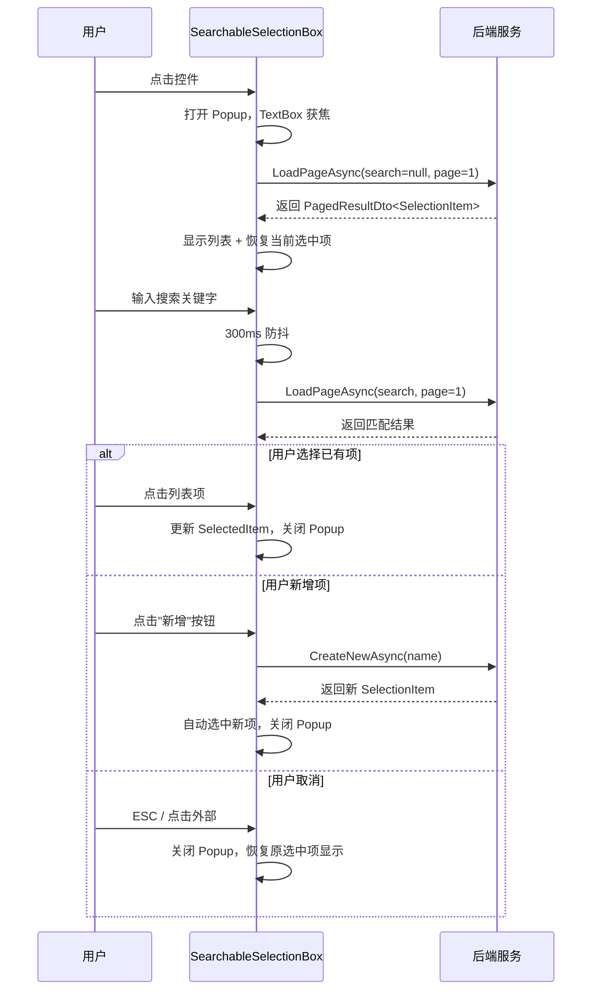

## Why

项目中 `SearchableSelectionBox` + `GenericSelectionPopup` 的拼装式选择器存在严重的职责混合和交互缺陷：组件混合了 ClientSide/ServerSide 双模式分页逻辑，父 ViewModel 需要为每个选择器维护大量样板状态（PopupViewModel、IsOpen、复杂 WhenAnyValue 订阅），且存在已确认的交互 Bug（SelectedItem 双重触发导致弹窗"一闪就关"、再次选择同一项无法关闭弹窗）。需要重构为单一自包含组件，简化使用方式并修复交互问题。

## What Changes

- **BREAKING** 移除 `SearchableSelectionBox`、`GenericSelectionPopup`、`GenericSelectionPopupViewModel<T>`、`MaterialsSelectionPopup`、`MaterialsSelectionPopupViewModel` 等现有组件
- **BREAKING** 移除 `GenericSelectionPagingMode`（ClientSide/ServerSide 双模式），统一为服务端分页接口
- 新建统一 DTO `SelectionItem`（`int Id` + `string Name`），并提供静态工厂方法（`FromProvider`、`FromMaterial`、`FromStreet` 等）
- 新建自包含选择器控件 `SearchableSelectionBox`（同名重建），将 Popup、DataGrid、分页、搜索、新增全部内置于一个 UserControl 中
- 重构 `AttendedWeighingDetailViewModel`：移除 3 个 PopupViewModel 属性、3 个 IsXxxPopupOpen 属性及其复杂订阅，改为简单的 `SelectionItem?` 绑定 + `LoadPageAsync`/`CreateNewAsync` 委托
- 更新 `SolidWasteModeFormView.axaml`：移除 3 个独立 Popup 声明，每个选择器缩减为单控件声明

## Capabilities

### New Capabilities
- `searchable-selection`: 统一的可搜索、可分页、可创建的选择器组件，基于 SelectionItem DTO，单一控件自包含 Popup，支持开箱即用的绑定式使用

### Modified Capabilities
- `generic-selection-popup`: **BREAKING** — 整体替换为新的 `searchable-selection` 能力；移除 ClientSide/ServerSide 双模式，移除 GenericSelectionItem<T> 泛型包装，改为统一的 SelectionItem DTO

## Impact

### 代码变更

| 文件路径 | 变更类型 | 变更原因 | 影响范围 |
|---------|---------|---------|---------|
| `MaterialClient/Views/Controls/SearchableSelectionBox.axaml` | 重写 | 合并为自包含控件（含内嵌 Popup） | SolidWasteModeFormView |
| `MaterialClient/Views/Controls/SearchableSelectionBox.axaml.cs` | 重写 | 控件逻辑从外部 Popup 管理改为内部控制 | SolidWasteModeFormView |
| `MaterialClient/Views/Controls/GenericSelectionPopup.axaml` | 删除 | 功能合并入 SearchableSelectionBox | — |
| `MaterialClient/Views/Controls/GenericSelectionPopup.axaml.cs` | 删除 | 功能合并入 SearchableSelectionBox | — |
| `MaterialClient/Views/Controls/MaterialsSelectionPopup.axaml` | 删除 | 功能合并入 SearchableSelectionBox | — |
| `MaterialClient/Views/Controls/MaterialsSelectionPopup.axaml.cs` | 删除 | 功能合并入 SearchableSelectionBox | — |
| `MaterialClient/ViewModels/GenericSelectionPopupViewModel.cs` | 删除 | 替换为控件内部逻辑 | — |
| `MaterialClient/ViewModels/MaterialsSelectionPopupViewModel.cs` | 删除 | 替换为控件内部逻辑 | — |
| `MaterialClient/Common/Models/SelectionItem.cs`（新建） | 新增 | 统一选择项 DTO | 全项目 |
| `MaterialClient/ViewModels/AttendedWeighingDetailViewModel.cs` | 重构 | 移除 6 个属性 + 3 段复杂订阅 | SolidWasteModeFormView |
| `MaterialClient/Views/Controls/SolidWasteModeFormView.axaml` | 重构 | 移除 3 个 Popup 声明，简化绑定 | — |

### 依赖关系

- 无需新增外部 NuGet 包
- 不涉及后端 Services 修改
- `SelectionItem` DTO 可被其他需要选择能力的页面复用

### UI 交互原型

```
关闭状态：
┌──────────────────────────────────┐
│ 请选择供应商                  ▼ │   ← TextBlock 显示选中项名称或占位符
└──────────────────────────────────┘

打开状态（点击后）：
┌──────────────────────────────────┐
│ 搜索关键字...                  ▼ │   ← TextBox 输入搜索
└──────────────────────────────────┘
┌──────────────────────────────────┐
│ 名称                             │
├──────────────────────────────────┤
│ 供应商 A                    ← 高亮│
│ 供应商 B                         │
│ 供应商 C                         │
│ 供应商 D                         │
├──────────────────────────────────┤
│           [新增]                  │   ← 搜索文本与结果不一致时显示
├──────────────────────────────────┤
│ 〈 1 2 3 〉                       │   ← Ursa Pagination
└──────────────────────────────────┘

无结果状态：
┌──────────────────────────────────┐
│ 供应商 XXX                       │
└──────────────────────────────────┘
┌──────────────────────────────────┐
│                                  │
│      未找到匹配结果              │
│         [新增]                   │
│                                  │
├──────────────────────────────────┤
│ 〈 1 〉                           │
└──────────────────────────────────┘
```

### 交互流程


