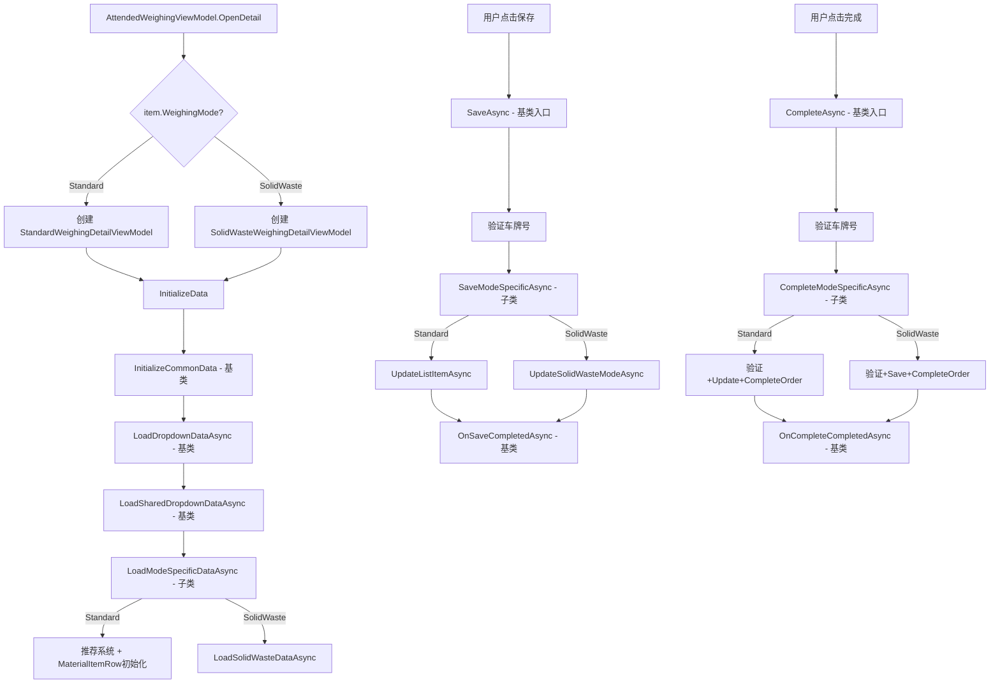
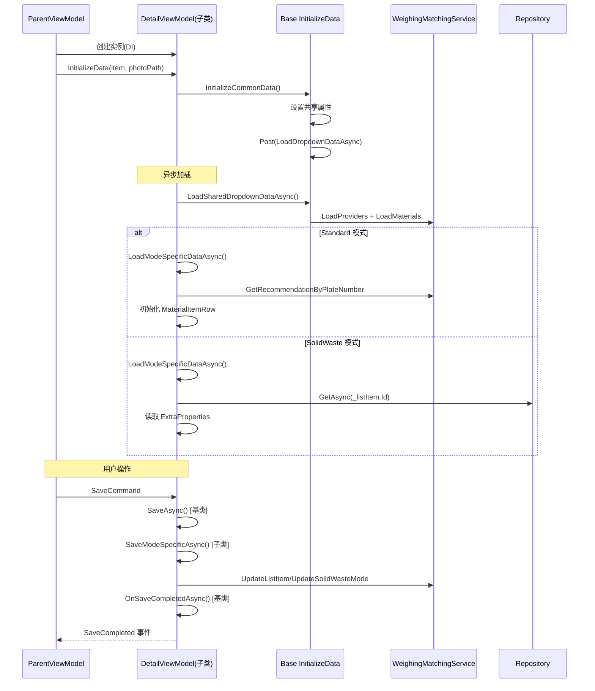

## Context

当前 `AttendedWeighingDetailViewModel`（1410行）是一个单体 ViewModel，通过 `IsSolidWasteMode` 布尔开关在同一类内分叉处理两套业务逻辑。View 层已完成模式分离（`StandardModeFormView` / `SolidWasteModeFormView`），但 ViewModel 层尚未跟进。

项目技术栈：
- Avalonia UI + ReactiveUI（`[Reactive]` 源码生成器）
- ABP Framework（`ITransientDependency` 自动 DI 注册）
- 构造函数中大量 `WhenAnyValue` 响应式订阅链
- `ReactiveUI.SourceGenerators` 生成 `[ReactiveCommand]` 方法

## Goals / Non-Goals

**Goals:**
- 将单体 ViewModel 拆为 1 个抽象基类 + 2 个子类，消除所有 `if (IsSolidWasteMode)` 分支
- 保持现有功能行为完全不变（纯重构）
- View 层 `x:DataType` 统一改为基类，保持编译时绑定检查
- `AttendedWeighingViewModel.OpenDetail` 根据模式创建对应子类

**Non-Goals:**
- 不改变任何业务逻辑
- 不新增单元测试（已声明排除）
- 不新增文档
- 不考虑向后兼容性（无需保留原类名）

## Decisions

### Decision 1: 继承层次结构

```
ViewModelBase (ReactiveObject)
└── AttendedWeighingDetailViewModelBase (abstract)
    ├── StandardWeighingDetailViewModel
    └── SolidWasteWeighingDetailViewModel
```

**Rationale**: C# 构造顺序天然保证基类构造先执行→子类追加。`WhenAnyValue` 链在子类构造中注册无碍。

**Alternative considered**: 组合模式（Strategy + 依赖注入）。但因 ReactiveUI 订阅链紧密绑定 `this`，组合模式会引入大量委托转发，增加复杂度。继承在此场景更自然。

### Decision 2: 抽象方法设计

基类定义以下抽象/可覆盖方法：

```csharp
// 必须实现
protected abstract Task SaveModeSpecificAsync();
protected abstract Task CompleteModeSpecificAsync();

// 可选覆盖
protected virtual Task LoadModeSpecificDataAsync() => Task.CompletedTask;
```

**Rationale**: `SaveAsync` 和 `CompleteAsync` 的前半段逻辑完全不同（验证规则、数据字段、服务调用），但尾部共享逻辑（BillPhoto、事件、通知）相同。模板方法模式是最佳选择。

### Decision 3: 共享尾部逻辑提取

```csharp
// AttendedWeighingDetailViewModelBase
protected async Task OnSaveCompletedAsync()
{
    // 1. BillPhoto 附件处理
    // 2. MessageBus 发送 SaveCompletedMessage
    // 3. 触发 SaveCompleted 事件
    // 4. 通知弹窗
}
```

**Rationale**: `SaveAsync`（L922-958）和 `CompleteAsync`（L1179-1206）的尾部逻辑几乎相同，提取后避免重复。

### Decision 4: InitializeData 拆分策略

```csharp
// 基类
public void InitializeData(WeighingListItemDto listItem, string? photoPath)
{
    InitializeCommonData(listItem, photoPath);
    Dispatcher.UIThread.Post(LoadDataSafelyAsync, DispatcherPriority.Background);
}

private async void LoadDataSafelyAsync()
{
    await LoadDropdownDataAsync();
}

private async Task LoadDropdownDataAsync()
{
    await LoadSharedDropdownDataAsync();  // LoadProviders + LoadMaterials
    await LoadModeSpecificDataAsync();     // 子类各自实现
}
```

**Rationale**: `LoadDropdownDataAsync` 中推荐系统逻辑（约90行）仅 Standard 模式使用，移至 `StandardWeighingDetailViewModel.LoadModeSpecificDataAsync()`。

### Decision 5: View 层 x:DataType 策略

所有 View 的 `x:DataType` 统一改为 `vm:AttendedWeighingDetailViewModelBase`。

**Rationale**: Avalonia 编译时绑定检查要求 `x:DataType` 与实际 DataContext 类型匹配。基类声明了所有共享属性和命令，子类独有属性通过 Avalonia 的运行时绑定自动解析。

### Decision 6: DI 注册策略

两个子类各自实现 `ITransientDependency`，ABP 自动注册。

`AttendedWeighingViewModel.OpenDetail` 中改为：
```csharp
DetailViewModel = item.WeighingMode == WeighingMode.SolidWaste
    ? _serviceProvider.GetRequiredService<SolidWasteWeighingDetailViewModel>()
    : _serviceProvider.GetRequiredService<StandardWeighingDetailViewModel>();
```

**Rationale**: 工厂逻辑简单明了，无需引入额外工厂类。

### Decision 7: SolidWaste 独有属性/委托归属

以下属性/委托完全归 `SolidWasteWeighingDetailViewModel`：
- `WeighingMode`, `IsSolidWasteMode` → 仅固废模式需要（标准模式隐含 Standard）
- `SolidWasteOrderNumber`, `Streets`, `SelectedStreet`, `SolidWasteTypes`, `SelectedSolidWasteType`
- `SolidWasteMaterials`, `SelectedSolidWasteMaterial`
- `SelectedProviderItem`, `SelectedMaterialItem`, `SelectedStreetItem`
- `ProviderLoadPageAsync`, `MaterialLoadPageAsync`, `StreetLoadPageAsync`
- `ProviderCreateNewAsync`, `MaterialCreateNewAsync`
- `ConfirmTextInteraction` → 基类（SolidWaste的CreateNew方法使用）

**注意**: `IsSolidWasteMode` 在 `AttendedWeighingDetailView.axaml` 中用于控制子视图切换。需要在基类中保留此属性（固废子类返回 true，标准子类返回 false），或改用类型判断。

**实际方案**: 基类保留 `abstract bool IsSolidWasteMode { get; }`，标准子类返回 `false`，固废子类返回 `true`。

## Risks / Trade-offs

| Risk | Impact | Mitigation |
|------|--------|------------|
| ReactiveUI 订阅链拆分后 `this.` 引用断裂 | 中 | C# 构造顺序保证基类先执行；每个子类的 `WhenAnyValue` 仅引用自身属性 |
| `x:DataType` 改为基类后，子类独有属性失去编译时检查 | 低 | Avalonia 运行时绑定仍能正常工作；SolidWasteModeFormView 中独有属性绑定仅需运行时匹配 |
| `MaterialItemRow` 在两模式中共用但初始化方式不同 | 低 | 基类持有 `MaterialItems` 和 `LoadMaterialUnitsForRowAsync`，两子类共享 |
| `LoadProvidersAsync` + `LoadMaterialsAsync` 两模式共用 | 低 | 保留在基类，两子类均可访问 |
| `AttendedWeighingDetailView.axaml.cs` 构造函数中 `GetService<AttendedWeighingDetailViewModel>()` | 中 | 改为不在 View 中获取 ViewModel，由父 ViewModel 直接设置 DataContext；或改为 `GetService<AttendedWeighingDetailViewModelBase>()` + 子类注册 |

## 组件架构

```
┌──────────────────────────────────────────────────────────┐
│ AttendedWeighingDetailViewModelBase (abstract)           │
│ ─────────────────────────────────────────────────────── │
│ 属性:                                                    │
│   AllWeight, TruckWeight, GoodsWeight, PlateNumber       │
│   Remark, JoinTime, OutTime, Operator                    │
│   WeighingRecordId, SelectedDeliveryType                 │
│   DeliveryTypeOptions, MaterialItems                     │
│   IsWeighingRecord, IsMatchButtonVisible                 │
│   IsCompleteButtonVisible, PlateNumberError              │
│   ProviderLabelText, DeliveryTypeTitleText               │
│   CompleteButtonText, DeliveryTypeDisplayText            │
│   IsSolidWasteMode (abstract)                            │
│                                                          │
│ 命令:                                                    │
│   AbolishAsync, Close, MatchAsync                        │
│                                                          │
│ 事件:                                                    │
│   SaveCompleted, AbolishCompleted, CloseRequested        │
│   MatchCompleted, CompleteCompleted, ManualMatchSave     │
│                                                          │
│ 方法:                                                    │
│   InitializeData(), ShowMessageBoxAsync()                │
│   GetParentWindow(), OnSaveCompletedAsync()              │
│   abstract SaveModeSpecificAsync()                       │
│   abstract CompleteModeSpecificAsync()                   │
│   virtual LoadModeSpecificDataAsync()                    │
│                                                          │
│ DI 字段:                                                 │
│   IServiceProvider, IMaterialService                     │
│   IProviderService, IRepository<WeighingRecord, long>    │
└──────────────────────────────────────────────────────────┘
          ▲                              ▲
          │                              │
┌─────────┴──────┐          ┌───────────┴──────────┐
│ Standard       │          │ SolidWaste            │
│ ───────────── │          │ ──────────────────── │
│ Providers      │          │ SolidWasteMaterials   │
│ SelectedProvider│         │ SelectedSolidWaste... │
│ Materials      │          │ SelectedProviderItem   │
│ SelectedProviderId│       │ SelectedMaterialItem   │
│ MaterialsSelection│       │ SelectedStreetItem     │
│ PopupViewModel │          │ SolidWasteOrderNumber  │
│                │          │ Streets, SolidWasteTypes│
│ 独有方法:      │          │ ProviderLoadPageAsync  │
│ LoadProviders  │          │ MaterialLoadPageAsync  │
│ LoadMaterials  │          │ StreetLoadPageAsync    │
│ 推荐系统逻辑   │          │ ProviderCreateNewAsync │
│ InitializeMaterials│      │ MaterialCreateNewAsync │
│ SelectionPopup │          │                       │
│                │          │ 独有方法:              │
│ 命令实现:      │          │ LoadSolidWasteData    │
│ SaveAsync      │          │ LoadConfigurationData │
│ CompleteAsync  │          │ LoadStreetsPage       │
│ AddMaterial    │          │ CreateNewProvider     │
│ SelectMaterial │          │ CreateNewMaterial     │
│ OpenMaterialSel│          │                       │
└────────────────┘          │ 命令实现:             │
                            │ SaveAsync             │
                            │ CompleteAsync         │
                            └───────────────────────┘
```

## 数据流



## API 调用序列



## 详细代码变更清单

| File | Change Type | Description | Module |
|------|-------------|-------------|--------|
| `ViewModels/AttendedWeighingDetailViewModel.cs` | 删除 | 替换为基类+两子类 | ViewModel |
| `ViewModels/AttendedWeighingDetailViewModelBase.cs` | 新建 | 抽象基类，~400行 | ViewModel |
| `ViewModels/StandardWeighingDetailViewModel.cs` | 新建 | 标准模式子类，~400行 | ViewModel |
| `ViewModels/SolidWasteWeighingDetailViewModel.cs` | 新建 | 固废模式子类，~500行 | ViewModel |
| `ViewModels/MaterialItemRow.cs` | 新建 | 从原文件提取，~180行 | ViewModel |
| `ViewModels/AttendedWeighingViewModel.cs` | 修改 | OpenDetail/OpenDetailAsync: 根据 WeighingMode 选择子类；DetailViewModel 属性类型改基类 | ViewModel |
| `Views/Controls/AttendedWeighingDetailView.axaml` | 修改 | x:DataType → vm:AttendedWeighingDetailViewModelBase | View |
| `Views/Controls/AttendedWeighingDetailView.axaml.cs` | 修改 | GetService 泛型参数改基类；WireInteractions 参数改基类 | View |
| `Views/Controls/StandardModeFormView.axaml` | 修改 | x:DataType → vm:AttendedWeighingDetailViewModelBase；L149 显式转换改基类 | View |
| `Views/Controls/SolidWasteModeFormView.axaml` | 修改 | x:DataType → vm:AttendedWeighingDetailViewModelBase | View |
