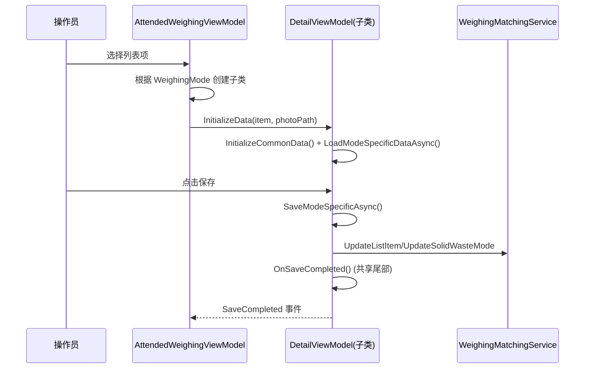

## Why

`AttendedWeighingDetailViewModel`（1410 行）以 `IsSolidWasteMode` 布尔开关在同一类内分叉处理标准模式和固废模式两套业务，违反单一职责原则。View 层已拆分为 `StandardModeFormView` / `SolidWasteModeFormView`，但 ViewModel 始终合一，导致 `if (IsSolidWasteMode)` 条件分支在构造函数、加载、保存、完成等 6+ 处出现，代码维护与测试困难。设计文档 `docs/evaluation-attended-weighing-detail-viewmodel-split.md` 已完成评估，建议执行拆分。

## What Changes

- **新建 `AttendedWeighingDetailViewModelBase`**：抽象基类，承载共享属性（重量、车牌、备注、时间、操作员）、共享命令（Abolish、Close、Match）、共享事件（6 个）、共享辅助方法（ShowMessageBox、GetParentWindow、OnSaveCompleted）
- **新建 `StandardWeighingDetailViewModel`**：继承基类，承载标准模式独有逻辑（Provider 下拉、MaterialItemRow DataGrid、材料选择弹窗、推荐系统、标准模式保存/完成）
- **新建 `SolidWasteWeighingDetailViewModel`**：继承基类，承载固废模式独有逻辑（SearchableSelectionBox 委托、街道/类型配置、ExtraProperties 读写、固废模式保存/完成）
- **删除原 `AttendedWeighingDetailViewModel.cs`**，替换为上述三个文件
- **移动 `MaterialItemRow`** 至独立文件
- **修改 `AttendedWeighingViewModel.OpenDetail`**：根据 `WeighingMode` 创建对应子类实例
- **修改所有 View 的 `x:DataType`**：从具体类改为基类
- **修改 `AttendedWeighingDetailView.axaml.cs`**：DI 获取改为基类类型

## Capabilities

### New Capabilities
- `detail-viewmodel-hierarchy`: ViewModel 继承层次结构——基类定义共享契约（抽象方法、共享属性/命令/事件），两个子类各自实现模式特有逻辑

### Modified Capabilities
<!-- 无既有 spec 需修改，纯内部重构，行为不变 -->

## Impact

| File | Change Type | Change Reason | Impact Scope |
|------|-------------|---------------|--------------|
| `ViewModels/AttendedWeighingDetailViewModel.cs` | **删除** | 拆分为基类+两子类 | 核心文件 |
| `ViewModels/AttendedWeighingDetailViewModelBase.cs` | 新建 | 共享逻辑抽象基类 | ViewModel 层 |
| `ViewModels/StandardWeighingDetailViewModel.cs` | 新建 | 标准模式 ViewModel | ViewModel 层 |
| `ViewModels/SolidWasteWeighingDetailViewModel.cs` | 新建 | 固废模式 ViewModel | ViewModel 层 |
| `ViewModels/MaterialItemRow.cs` | 新建 | 从原文件提取独立类 | ViewModel 层 |
| `ViewModels/AttendedWeighingViewModel.cs` | 修改 | OpenDetail 工厂逻辑 | 父 ViewModel |
| `Views/Controls/AttendedWeighingDetailView.axaml` | 修改 | x:DataType 改基类 | View 层 |
| `Views/Controls/AttendedWeighingDetailView.axaml.cs` | 修改 | GetService 泛型参数改基类 | View 层 |
| `Views/Controls/StandardModeFormView.axaml` | 修改 | x:DataType 改基类 | View 层 |
| `Views/Controls/SolidWasteModeFormView.axaml` | 修改 | x:DataType 改基类 | View 层 |
| DI 注册 | 无需修改 | ABP ITransientDependency 自动注册 | 基础设施 |

### 用户交互流程（不变）



### 组件架构

```
ViewModelBase
└── AttendedWeighingDetailViewModelBase (abstract)
    ├── 共享属性: AllWeight, TruckWeight, GoodsWeight, PlateNumber...
    ├── 共享命令: AbolishAsync, Close, MatchAsync
    ├── 共享事件: SaveCompleted, AbolishCompleted...
    ├── 抽象方法: SaveModeSpecificAsync(), CompleteModeSpecificAsync()
    │
    ├── StandardWeighingDetailViewModel
    │   ├── 独有: Providers, Materials, MaterialItems...
    │   ├── 独有: LoadProvidersAsync, LoadMaterialsAsync, 推荐系统
    │   └── 实现: SaveModeSpecificAsync(), CompleteModeSpecificAsync()
    │
    └── SolidWasteWeighingDetailViewModel
        ├── 独有: SolidWasteMaterials, SelectedProviderItem, Streets...
        ├── 独有: LoadSolidWasteDataAsync, 配置加载
        └── 实现: SaveModeSpecificAsync(), CompleteModeSpecificAsync()
```
