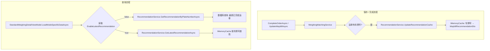
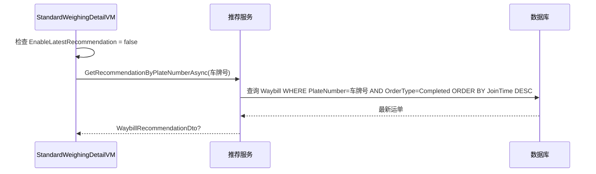
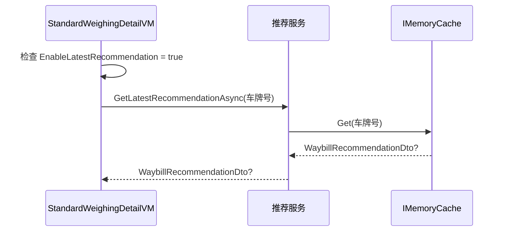
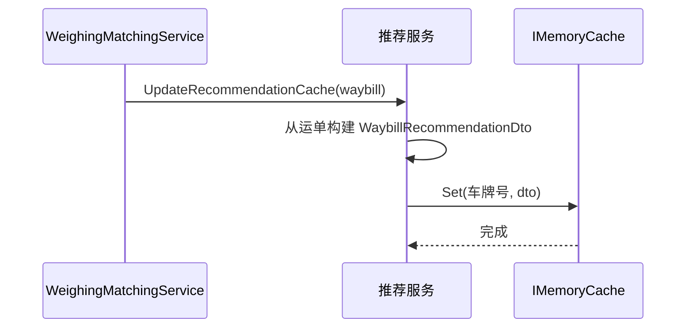

## 背景

`GetRecommendationByPlateNumberAsync` 位于 `WeighingMatchingService`（DomainService, ~1500 行），查询 `Waybill` 表获取某车牌号最近一条已完成单据，返回 `WaybillRecommendationDto`。仅 `StandardWeighingDetailViewModel.LoadModeSpecificDataAsync` 一处调用，使用 `ServiceProvider.GetRequiredService` 服务定位器模式。

`RecommendPlateNumberService` 已采用 `IMemoryCache` + `ReaderWriterLockSlim` + `ISingletonDependency` + LRU 淘汰模式（MaxCacheSize=200）。`CompleteOrderAsync` 已在完成时调用 `AddPlateNumberToCache`。

设置体系：`SystemSettings` → `SettingsService` → `SettingsWindowViewModel` 完整链路，所有布尔开关用 `[Reactive]` 属性绑定。

## 目标 / 非目标

**目标：**

- 将推荐查询逻辑提取为独立服务 `IRecommendationService` / `RecommendationService`
- 新增按车牌号索引的推荐数据缓存，在运单保存/完成时自动更新
- 在设置页面新增开关 `EnableLatestRecommendation`，控制数据来源
- 遵循现有缓存范式（`RecommendPlateNumberService` 风格）
- 改用构造注入替代服务定位器

**非目标：**

- 不修改 `WaybillRecommendationDto` 的字段结构
- 不修改推荐数据的应用逻辑（填充缺失字段的规则不变）
- 不引入分布式缓存
- 不改变 `RecommendPlateNumberService` 的现有行为
- 不支持 SolidWaste 模式的推荐（当前仅 Standard 模式调用）

## 设计决策

### D1：推荐缓存按车牌号索引 + LRU 淘汰

**选择**：`ConcurrentDictionary<string, RecommendationCacheEntry>` 封装在服务内部，上限 200 条，淘汰最旧 10 条。

**替代方案**：
- 全局单条缓存 → 无法按车牌区分，语义错误
- 无限制缓存 → 内存风险

**理由**：与 `RecommendPlateNumberService` 风格统一；`GetRecommendationByPlateNumberAsync` 本身按车牌查询，缓存也按车牌索引语义一致。

### D2：缓存更新时机为 `CompleteOrderAsync` + `UpdateWaybillAsync`

**选择**：两个保存入口均触发缓存更新。

**理由**：`UpdateWaybillAsync` 可修改 MaterialId/ProviderId/MaterialUnitId，用户手动修改后也应更新缓存。

### D3：复用 `WaybillRecommendationDto` 作为缓存值类型

**选择**：缓存直接存储 `WaybillRecommendationDto`，不新建 record。

**替代方案**：新建 `RecommendationCache` record → 增加类型冗余，字段完全一致。

**理由**：`WaybillRecommendationDto` 已是 record 且字段精确匹配，无需额外类型。

### D4：新增独立文件 `RecommendationService.cs`，接口与实现同文件

**选择**：遵循 AGENTS.md 约定（< 1000 行，接口在实现前）。

**路径**：`MaterialClient.Common/Services/RecommendationService.cs`

### D5：服务注册为 `ISingletonDependency`

**选择**：因内部持有 `IMemoryCache` 状态，需单例生命周期。

**理由**：与 `RecommendPlateNumberService` 一致；缓存状态需跨请求持久。

### D6：数据源切换逻辑位于 ViewModel

**选择**：`StandardWeighingDetailViewModel` 注入 `ISettingsService`，读取 `EnableLatestRecommendation`，决定调用 `GetRecommendationByPlateNumberAsync` 还是 `GetLatestRecommendationAsync`。

**替代方案**：在 Service 内部判断 → 服务需了解设置语义，职责混杂。

**理由**：设置是 UI 层关注点，ViewModel 根据设置选择策略更清晰。

### D7：`EnableLatestRecommendation` 放入 `SystemSettings`

**选择**：新增 `bool EnableLatestRecommendation { get; set; } = false`。

**理由**：与其他系统级开关（`EnableAutoStart`、`EnablePrinter`）风格一致。

## 组件架构

```
组件层次结构
├── RecommendationService (ISingletonDependency, [AutoConstructor])
│   ├── IRecommendationService
│   │   ├── GetRecommendationByPlateNumberAsync(plateNumber)  ← 数据库查询（原有逻辑）
│   │   └── GetLatestRecommendationAsync(plateNumber)          ← 缓存读取
│   ├── 内部: UpdateRecommendationCache(waybill)               ← 缓存写入
│   └── 内部: IMemoryCache + ReaderWriterLockSlim
│
├── WeighingMatchingService (修改)
│   ├── CompleteOrderAsync → 调用 RecommendationService.UpdateRecommendationCache
│   └── UpdateWaybillAsync → 调用 RecommendationService.UpdateRecommendationCache
│
├── StandardWeighingDetailViewModel (修改)
│   ├── 注入 IRecommendationService (替代 IWeighingMatchingService)
│   ├── 注入 ISettingsService
│   └── LoadModeSpecificDataAsync → 根据 EnableLatestRecommendation 选择数据源
│
├── SystemSettings (修改)
│   └── EnableLatestRecommendation: bool (默认 false)
│
└── SettingsWindowViewModel + SettingsWindow.axaml (修改)
    ├── 新增 [Reactive] EnableLatestRecommendation
    ├── SaveAsync → 保存到 SystemSettings
    └── LoadSettingsAsync → 从 SystemSettings 加载
```

## 数据流



## 时序图

### 数据库查询路径（默认）



### 缓存查询路径（已启用）



### 缓存更新流程



## 详细代码变更清单

| 文件路径 | 变更类型 | 变更说明 | 影响模块 |
|-----------|-------------|-------------|-----------------|
| `MaterialClient.Common/Services/RecommendationService.cs` | **新增** | `IRecommendationService` + `RecommendationService`，包含数据库查询、缓存读写、LRU 淘汰 | 服务层 |
| `MaterialClient.Common/Services/WeighingMatchingService.cs` | **修改** | 从接口和实现中移除 `GetRecommendationByPlateNumberAsync`；注入 `IRecommendationService`；在 `CompleteOrderAsync` 和 `UpdateWaybillAsync` 中调用 `UpdateRecommendationCache` | 服务层 |
| `MaterialClient.Common/Configuration/SystemSettings.cs` | **修改** | 新增 `bool EnableLatestRecommendation { get; set; } = false` | 配置 |
| `MaterialClient/ViewModels/StandardWeighingDetailViewModel.cs` | **修改** | 注入 `IRecommendationService` + `ISettingsService`；将 `ServiceProvider.GetRequiredService<IWeighingMatchingService>` 替换为基于设置的条件逻辑 | ViewModel |
| `MaterialClient/ViewModels/SettingsWindowViewModel.cs` | **修改** | 新增 `[Reactive] bool EnableLatestRecommendation`；在相应方法中加载/保存 | 设置 ViewModel |
| `MaterialClient/Views/SettingsWindow.axaml` | **修改** | 在系统设置区域新增 `EnableLatestRecommendation` 的 ToggleSwitch | 设置 UI |

## 风险 / 权衡

- **[缓存过期]** → 缓存仅在本进程生命周期内有效，应用重启后缓存为空，首次查询需回退数据库。可通过启动时初始化缓解（与 `RecommendPlateNumberService.InitializeCacheAsync` 同模式）。**缓解**：不做启动初始化，首次走数据库即可，用户体验无感知。
- **[UpdateWaybillAsync 频率]** → `UpdateWaybillAsync` 可能被频繁调用。**缓解**：缓存更新为内存操作（O(1)），无性能风险。
- **[线程安全]** → 多线程并发读写缓存。**缓解**：使用 `ReaderWriterLockSlim`，与 `RecommendPlateNumberService` 一致。

## 迁移方案

- 无数据库迁移（`SystemSettings` 为 JSON 序列化，新增字段默认 `false`）
- 无破坏性 API 变更（`IWeighingMatchingService` 移除方法，但仅 `StandardWeighingDetailViewModel` 调用）
- 部署顺序：先部署服务层，再部署 UI 层（但因同一进程，实际同时部署）

## 待解决问题

_无_ — 所有关键决策已确定。
