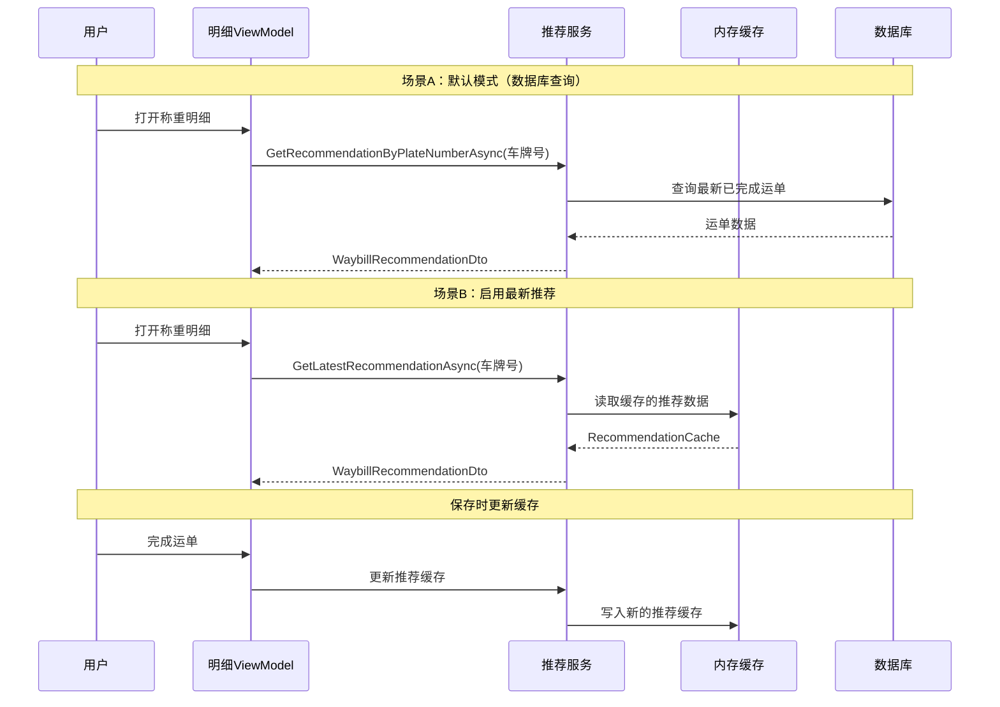

## Why

`GetRecommendationByPlateNumberAsync` 耦合在 `WeighingMatchingService`（~1500 行）中，职责混杂，不利于独立测试与维护。同时缺少基于保存数据的最新推荐缓存机制，用户无法选择推荐数据来源。

## What Changes

- 新增独立推荐服务接口 `IRecommendationService` 及实现 `RecommendationService`，从 `WeighingMatchingService` 提取 `GetRecommendationByPlateNumberAsync`
- 新增推荐数据缓存 record `RecommendationCache`（含 `MaterialId?`、`ProviderId?`、`MaterialUnitId?`），每次保存/完成运单时自动更新
- 新增缓存获取方法 `GetLatestRecommendationAsync(string plateNumber)`，从内存缓存读取最新推荐
- `SystemSettings` 新增 `EnableLatestRecommendation` 布尔属性（默认 `false`）
- `SettingsWindowViewModel` 与 `SettingsWindow.axaml` 新增开关项
- `StandardWeighingDetailViewModel.LoadModeSpecificDataAsync` 根据设置决定调用数据库查询或缓存

## Capabilities

### New Capabilities

- `recommendation-service`: 推荐服务接口与实现，包含基于车牌号的数据库推荐查询、基于缓存的最新推荐获取、缓存更新逻辑
- `recommendation-cache`: 推荐数据内存缓存机制，按车牌号索引，保存时自动更新，遵循现有 `RecommendPlateNumberService` 的缓存范式
- `recommendation-settings`: 设置页面中推荐数据源开关，允许用户选择启用最新推荐数据

### Modified Capabilities

_无_ — 无现有 spec 需求变更。`attended-weighing` 和 `detail-viewmodel-hierarchy` spec 的实现细节会受影响，但需求层面不变。

## Impact

### 代码变更表

| 文件路径 | 变更类型 | 变更原因 | 影响范围 |
|---------|---------|---------|---------|
| `MaterialClient.Common/Services/RecommendationService.cs` | 新增 | 推荐服务接口与实现 | 新文件 |
| `MaterialClient.Common/Services/WeighingMatchingService.cs` | 修改 | 移除 `GetRecommendationByPlateNumberAsync`，接口同步更新 | 服务层 |
| `MaterialClient.Common/Configuration/SystemSettings.cs` | 修改 | 新增 `EnableLatestRecommendation` 属性 | 配置层 |
| `MaterialClient.Common/Entities/Waybill.cs` | 无变更 | 缓存 record 为独立类型 | — |
| `MaterialClient.Common/Services/WeighingMatchingService.cs` `CompleteOrderAsync` | 修改 | 追加推荐缓存更新调用 | 保存流程 |
| `MaterialClient/ViewModels/StandardWeighingDetailViewModel.cs` | 修改 | 改为注入 `IRecommendationService`，根据设置选择数据源 | ViewModel |
| `MaterialClient/ViewModels/SettingsWindowViewModel.cs` | 修改 | 新增 `EnableLatestRecommendation` 绑定属性 | 设置 ViewModel |
| `MaterialClient/Views/SettingsWindow.axaml` | 修改 | 新增开关 UI | 设置页面 |

### 依赖

- `Microsoft.Extensions.Caching.Memory`（已引入）
- 无新外部依赖

### 用户交互流程



### 设置页面 UI 变更

```
┌─────────────────────────────────────────────────────┐
│  设置                                         [×] │
├─────────────────────────────────────────────────────┤
│  ...现有设置项...                                    │
│                                                     │
│  ── 推荐设置 ─────────────────────────────────────  │
│                                                     │
│  启用最新推荐数据             [  ○  ]               │
│                                                     │
│  （启用后使用最近保存的缓存数据，而非数据库查询）     │
│                                                     │
└─────────────────────────────────────────────────────┘
```
