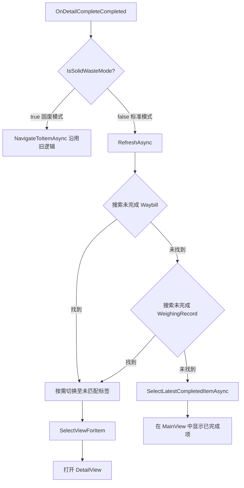
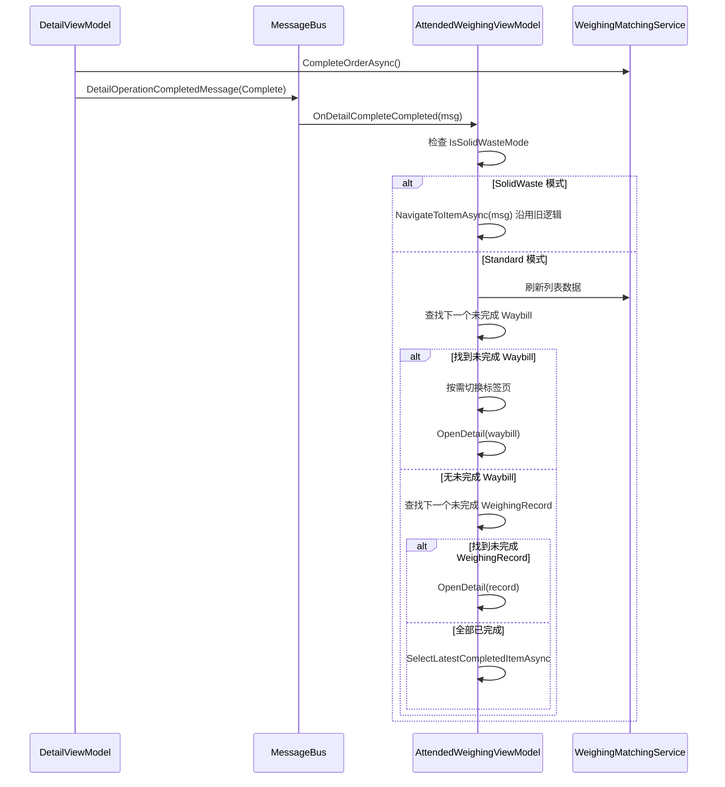

## Context

`AttendedWeighingViewModel` 管理有人值守称重列表及详情导航。当前 `OnDetailCompleteCompleted` 处理器委托 `NavigateToItemAsync`，导航至刚完成的条目（已变为只读运单），迫使用户手动寻找下一个未完成条目。**此变更仅对 `WeighingMode.Standard` 生效**，SolidWaste 模式沿用现有逻辑（`NavigateToItemAsync`）。

`DetailOperationCompletedMessage` 不包含 `WeighingMode` 信息，但 `AttendedWeighingViewModel` 持有 `IsSolidWasteMode` 属性（在初始化时从系统设置读取），可在 `OnDetailCompleteCompleted` 中通过 `IsSolidWasteMode` 判断当前模式并分支。

已有的 `SelectUnmatchedNextItemAsync` 方法实现了「查找下一个未完成 → 兜底已完成」逻辑，但仅用于 Abolish 和 Close 处理器，Complete 处理器未使用。

### 当前调用链

```
CompleteAsync (base)
  → CompleteModeSpecificAsync()         // 业务逻辑
  → MessageBus: DetailOperationCompletedMessage(OperationType=Complete)
      → OnDetailCompleteCompleted(msg)
          → NavigateToItemAsync(msg)    // 导航到刚完成的条目
```

### 已有可复用方法

| 方法 | 位置 | 用途 |
|--------|----------|------|
| `SelectUnmatchedNextItemAsync` | AttendedWeighingViewModel:1904 | 选择下一个未完成条目，兜底至已完成 |
| `NavigateToItemAsync` | AttendedWeighingViewModel:1636 | 按 ID 导航至指定条目 |
| `SelectLatestCompletedItemAsync` | AttendedWeighingViewModel:1824 | 选择最新已完成条目 |
| `SelectViewForItem` | AttendedWeighingViewModel:1804 | 选择 MainView 或 DetailView |

### 组件架构

```
AttendedWeighingViewModel
├── OnDetailCompleteCompleted(msg)        ← 修改：按 WeighingMode 分支
│   ├── IsSolidWasteMode=true             ← SolidWaste：沿用 NavigateToItemAsync（不变）
│   └── IsSolidWasteMode=false            ← Standard：新逻辑
│       └── SelectNextUnfinishedItemAsync()   ← 新增：基于优先级的选择
│           ├── 优先级 1：未完成 Waybill
│           ├── 优先级 2：未完成 WeighingRecord
│           └── 兜底：SelectLatestCompletedItemAsync()
├── OnDetailSaveCompleted(msg)            ← 不变
├── OnDetailAbolishCompleted(msg)         ← 不变
└── OnDetailMatchCompleted(msg)           ← 不变
```

## Goals / Non-Goals

**目标：**
- Standard 模式（`WeighingMode.Standard`）下完成收货/发料后，自动导航至下一个未完成条目
- SolidWaste 模式保持现有导航行为（`NavigateToItemAsync`）
- 保持现有标签页切换规则（尊重 `IsShowAllRecords`）
- 尽可能复用已有方法（`SelectViewForItem`、标签页切换逻辑）

**非目标：**
- 修改 Save/Match/Abolish 的导航行为
- 修改 SolidWaste 模式特有的行为（SolidWaste 沿用 `NavigateToItemAsync`）
- 新增 MessageBus 事件或接口
- 修改 `StandardWeighingDetailViewModel` 或 `AttendedWeighingDetailViewModelBase`

## Decisions

### 决策 1：新增私有方法 `SelectNextUnfinishedItemAsync`

**选择**：为完成操作导航创建独立方法，而非复用 `SelectUnmatchedNextItemAsync`。

**理由**：`SelectUnmatchedNextItemAsync`（第 1904 行）针对 Abolish/Close 场景有特定行为——在 DetailView 中复用 `DetailViewModel.InitializeData`，且兜底逻辑不同。Complete 场景需要：
1. 先刷新列表
2. 按优先级搜索刷新后的列表（Waybill 优先，其次 WeighingRecord）
3. 切换标签页以显示未完成条目
4. 通过 `SelectViewForItem` 正确选择视图

**备选方案**：
- 直接复用 `SelectUnmatchedNextItemAsync`：已排除。其兜底行为和 DetailView 复用逻辑不符合 Complete 处理器需求。
- 修改 `NavigateToItemAsync` 增加模式标志：已排除。会使所有操作共用的方法变得复杂。

### 决策 2：先搜索当前页，再跨页搜索

**选择**：先在当前页 `ListItems` 中搜索。若未找到未完成条目且当前标签页已过滤（非「全部」），切换到「全部」或「未匹配」标签页后重试。

**理由**：列表分页 `PageSize=6`。未完成条目最可能在当前页或第一页。遵循 `FindItemAcrossPagesAsync` 已有的跨页搜索模式。

### 决策 3：选择优先级排序

```
优先级 1：ItemType=Waybill && OrderType≠Completed
优先级 2：ItemType=WeighingRecord && OrderType≠Completed
兜底：   OrderType=Completed（通过 SelectLatestCompletedItemAsync）
```

**理由**：Waybill 代表已匹配的进出场记录对，更接近最终完成状态。完成一个运单意味着用户已验证匹配。导航至下一个未完成运单让用户可以无中断地继续验证流程。

### 数据流



### API 调用时序



## Risks / Trade-offs

| 风险 | 缓解措施 |
|------|----------|
| 跨页搜索在页数较多时可能较慢 | 限制最多搜索 10 页（遵循 `FindItemAcrossPagesAsync` 已有模式） |
| 标签页切换可能令用户困惑 | 仅在当前标签页无法显示未完成条目时才切换 |
| `SelectUnmatchedNextItemAsync` 将存在近似重复逻辑 | 可接受：两个方法服务于不同上下文，后续会进一步分化 |
| 兜底至已完成条目可能与新行为不一致 | 仅在所有条目均已完成时触发——属于预期行为 |

## Detailed Code Changes

| 文件路径 | 变更类型 | 变更说明 | 影响模块 |
|-----------|-------------|-------------|-----------------|
| `MaterialClient/ViewModels/AttendedWeighingViewModel.cs` :: `OnDetailCompleteCompleted` | 修改 | 增加 `IsSolidWasteMode` 分支判断：SolidWaste 沿用 `NavigateToItemAsync`，Standard 调用 `SelectNextUnfinishedItemAsync` | 完成处理器 |
| `MaterialClient/ViewModels/AttendedWeighingViewModel.cs` | 新增 | 新增私有方法 `SelectNextUnfinishedItemAsync` | Standard 模式导航逻辑 |
