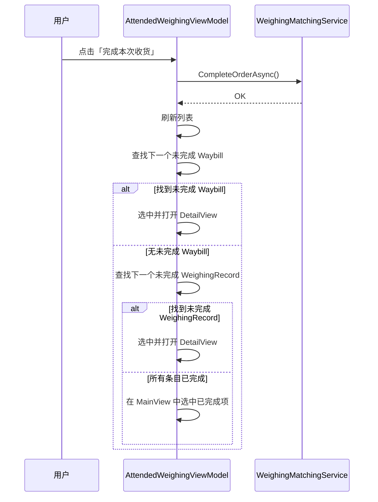

## Why

标准模式（`WeighingMode.Standard`）下完成收货/发料后，系统导航至刚完成的条目（只读 MainView），迫使用户手动寻找下一个未完成条目。选择优先级应优先指向下一个可操作条目，以保持连续工作流。此变更仅对 `WeighingMode.Standard` 生效，SolidWaste 模式沿用现有导航逻辑（导航至刚完成的条目）。

## What Changes

- 标准模式完成收货/发料后，系统将导航至下一个未完成条目，而非刚完成的条目。
- 选择优先级：未完成 Waybill → 未完成 WeighingRecord → 已完成条目（仅兜底）。
- 仅修改 `AttendedWeighingViewModel` 中的 `OnDetailCompleteCompleted` 处理器；其他操作处理器（Save、Match、Abolish）不受影响。

## Capabilities

### New Capabilities

_（无）_

### Modified Capabilities

- `attended-weighing`：「完成操作后的导航」需求从「选中新完成的条目」改为「按优先级选择下一个未完成条目」。此变更仅对 `WeighingMode.Standard` 生效，SolidWaste 模式保持现有行为。

## Impact

### Code Changes

| 文件路径 | 变更类型 | 变更原因 | 影响范围 |
|-----------|-------------|--------|--------------|
| `MaterialClient/ViewModels/AttendedWeighingViewModel.cs` | 修改 | `OnDetailCompleteCompleted` 导航逻辑 | 仅完成处理器 |
| `MaterialClient.Common.Tests/`（相关测试文件） | 新增/修改 | 新导航优先级的单元测试 | 测试覆盖率 |

### 用户交互流程

### 不受影响的范围

- 无 API/接口变更
- 无数据库 schema 变更
- Save/Match/Abolish 导航行为不变
- SolidWaste 模式不受影响，沿用现有导航逻辑（导航至刚完成的条目）
